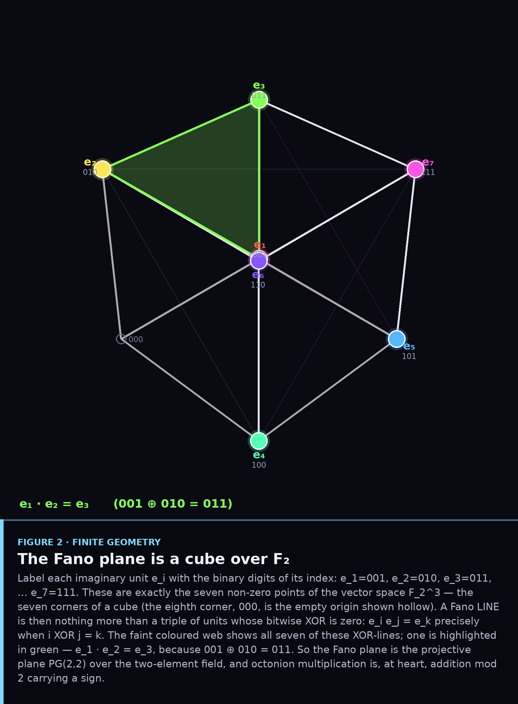
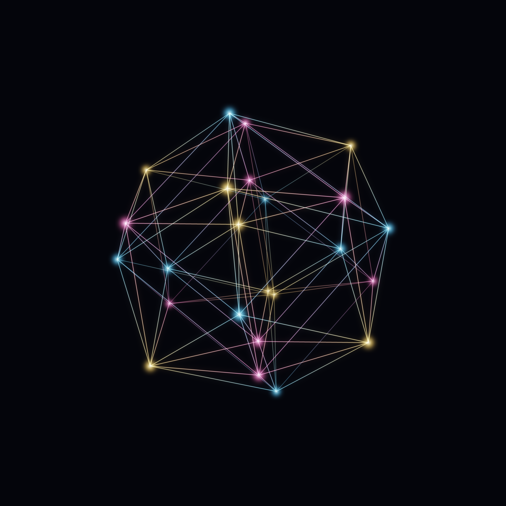
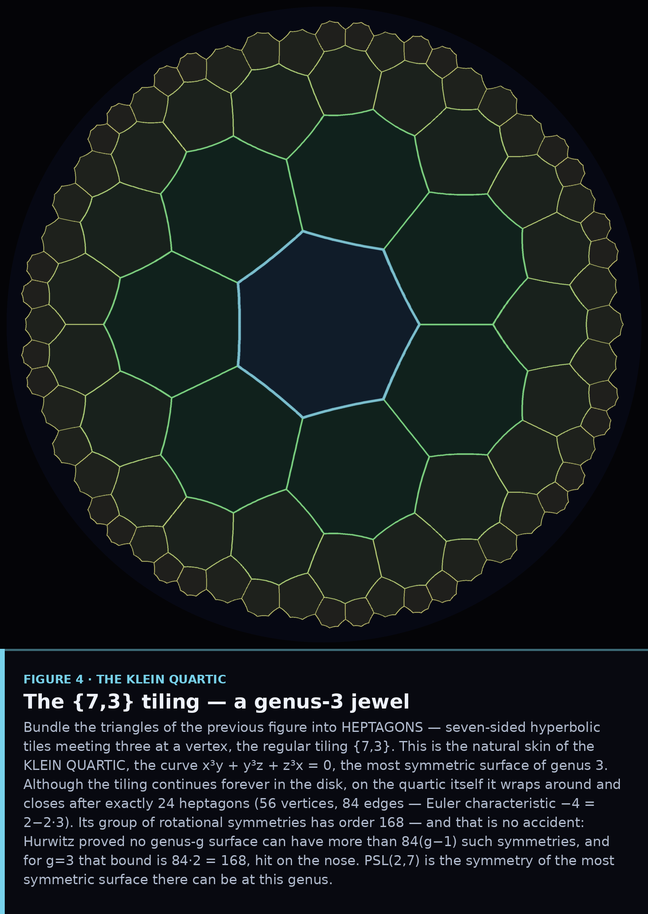
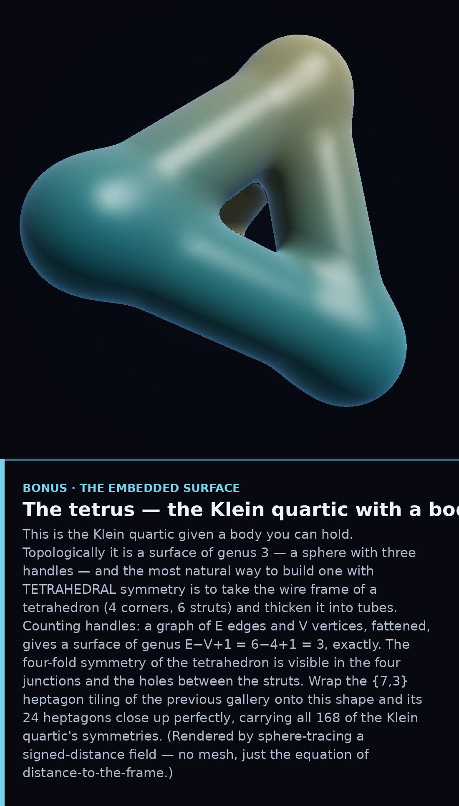
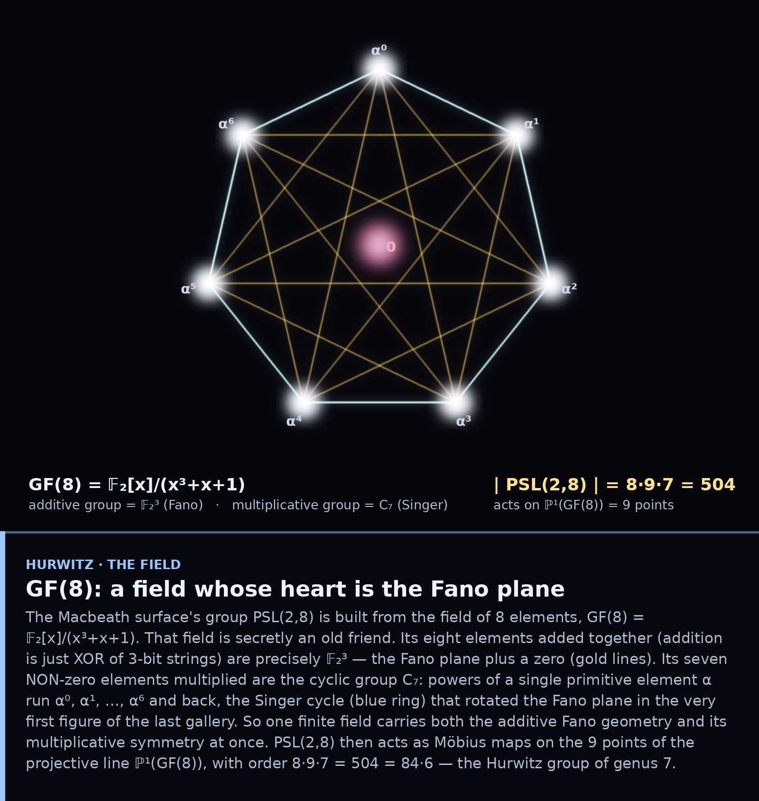
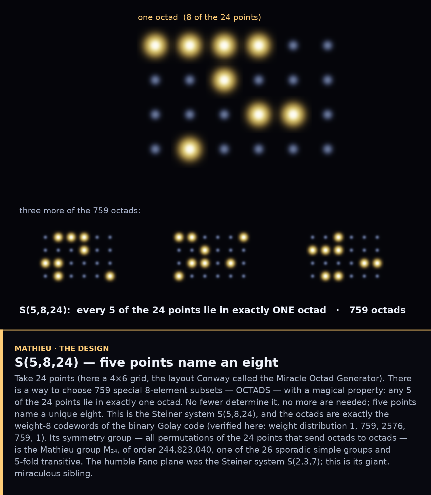
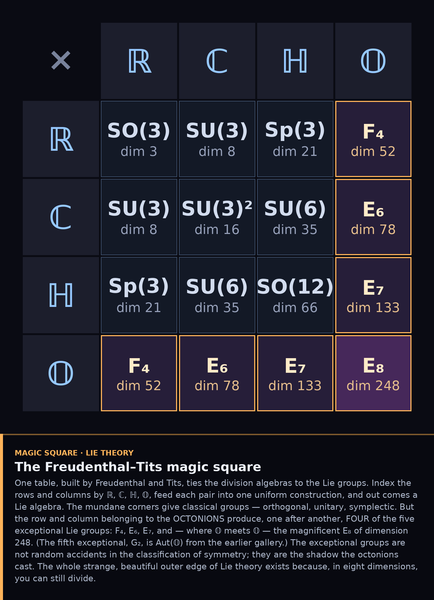
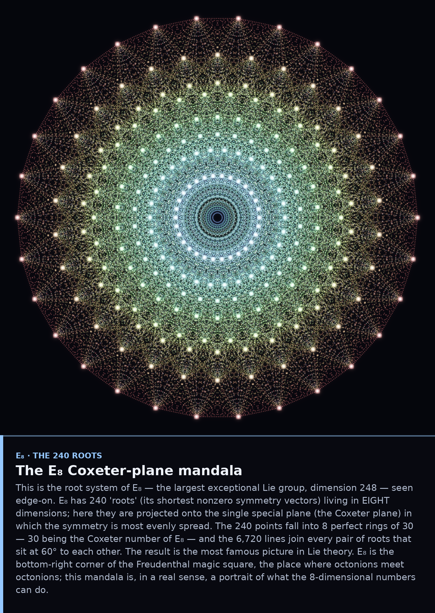
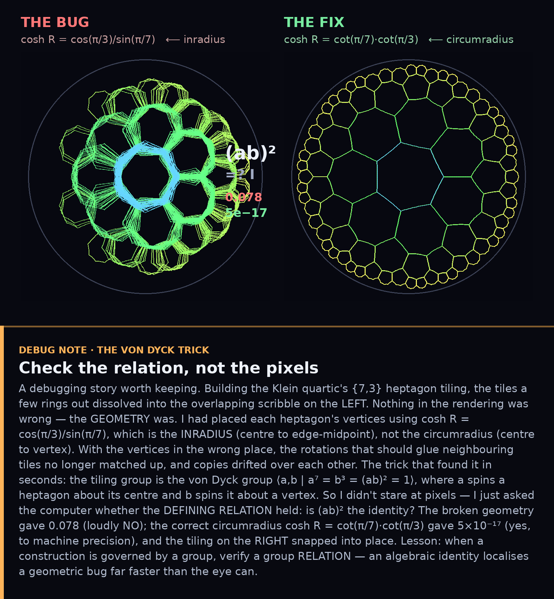

# From a Seven-Point Diagram to E₈

An illustrated journey through the Fano plane, the octonions, triality, and the
exceptional structures they generate. Every figure carries a written annotation
block; every claim was verified in code before it was drawn. Follow the galleries
in order, or dive into whichever picture pulls you in.

---

### ① `octonions/` — Seven Lenses on the Octonions
The 8-dimensional numbers and their multiplication table, the Fano plane, seen
through seven branches of mathematics.

### ② `triality/` — Spin(8), the 24-cell, and the only threefold symmetry
The outer automorphism that cyclically permutes vector and spinors, and its
geometric home, the 24-cell. *(Includes animations.)*

### ③ `psl168/` — The Order of 168: PSL(2,7) and the Klein Quartic
The Fano plane's symmetry group, from six angles — counting, the exceptional
isomorphism, the (2,3,7) kaleidoscope, the Klein quartic, the irreps, the Cayley
graph.

### ④ `klein_surface/` — The tetrus
The Klein quartic given a body: a genus-3 surface, sphere-traced from a
distance field.

### ⑤ `hurwitz/` — Beyond Klein: the Hurwitz chain
Why 168 was special (84(g−1)), the surfaces that come next, and GF(8) — a field
whose heart is the Fano plane.

### ⑥ `mathieu/` — The Mathieu groups and the Steiner systems
The Fano plane's giant sibling S(5,8,24), the Golay code, and M₂₄ — gateway to
the sporadic groups.

### ⑦ `magic_square/` — The Freudenthal magic square and the Cayley plane
Where the octonions finish the story: the five exceptional Lie groups, ending at
E₈.

### ⑧ `e8/` — The 240-Root Mandala
The root system of E₈ projected onto its Coxeter plane: 240 roots in 8 rings of
30, the most famous picture in Lie theory. *(Includes a spinning animation.)*

### ⊕ `debug_note/` — The von Dyck Trick
A sidebar on craft: how to catch a geometric bug by checking a group *relation*
instead of staring at pixels.

---

## The thread

> A multiplication table (§1) is a finite geometry, which is a graph; its
> symmetries are a simple group of order 168 (§3) that is also the most symmetric
> surface of genus 3 (§3–④); that surface is the first of an infinite chain (§5);
> the same combinatorial magic, scaled up, builds the Steiner system S(5,8,24)
> and the sporadic group M₂₄ (§6); and the octonions behind all of it cast their
> final shadow as the five exceptional Lie groups, up to E₈ (§7).

One fact underwrites the whole journey: in eight dimensions, you can still
divide. Everything exceptional in mathematics seems to gather around it.

*(The earlier procedural-art set in `art_uh5/` — including **The Triality
Engine**, the octonion-Fano emblem tripled by triality — is what started this
whole thread.)*
