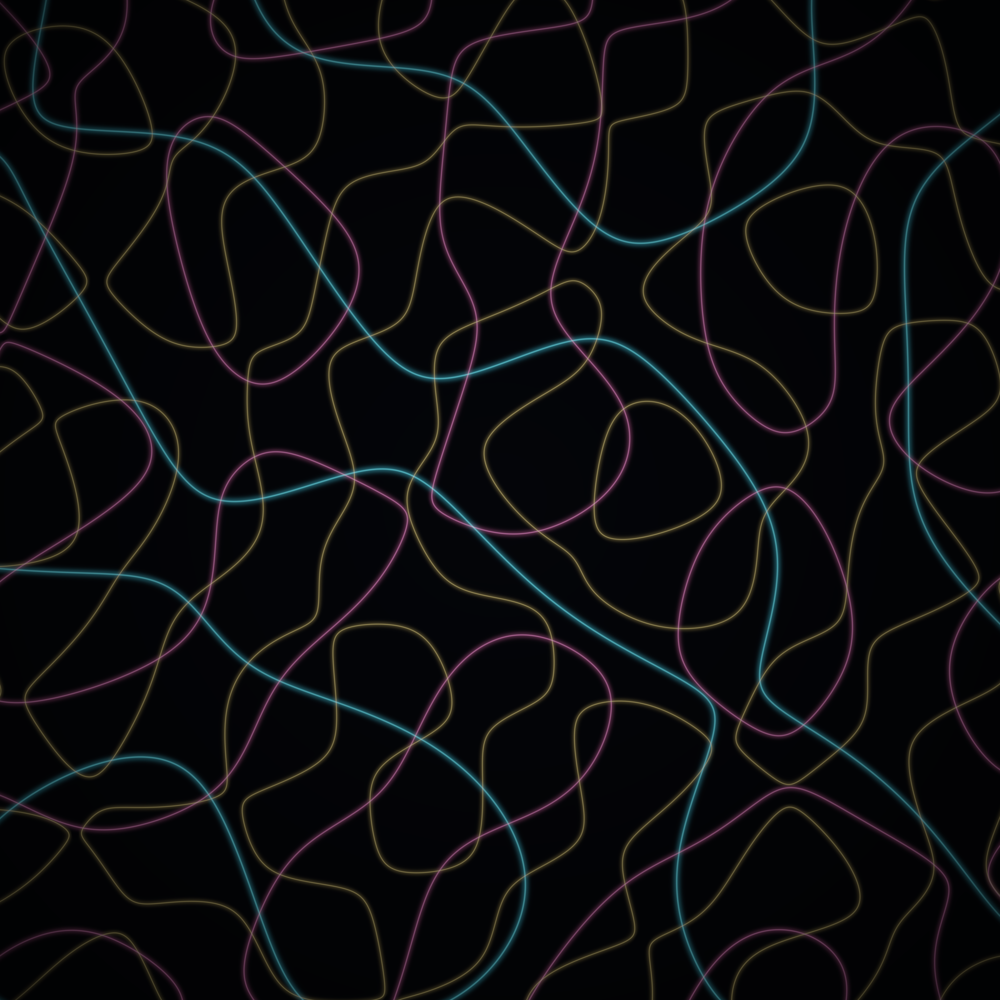
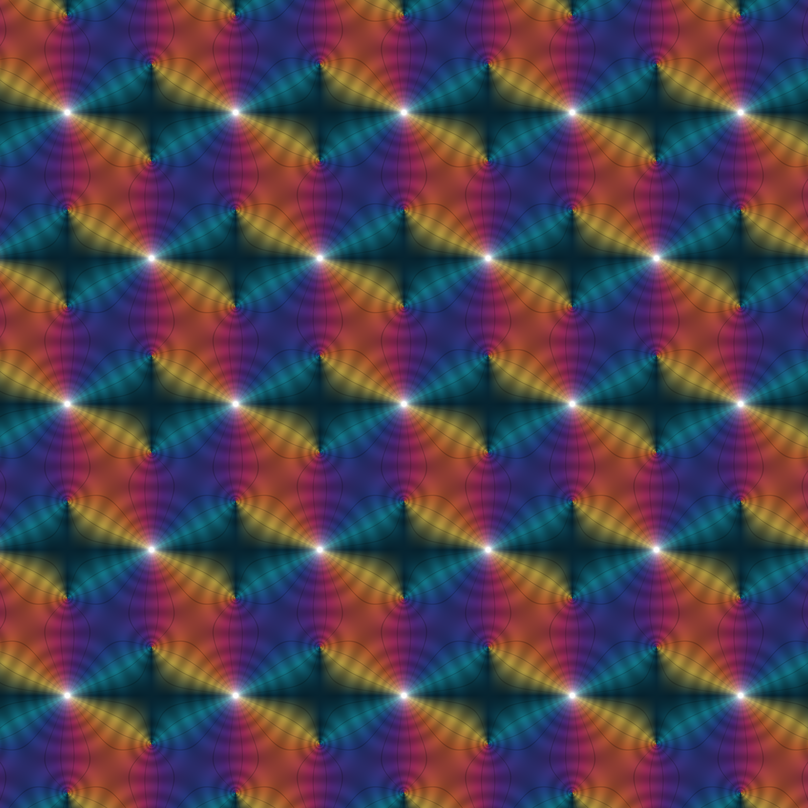
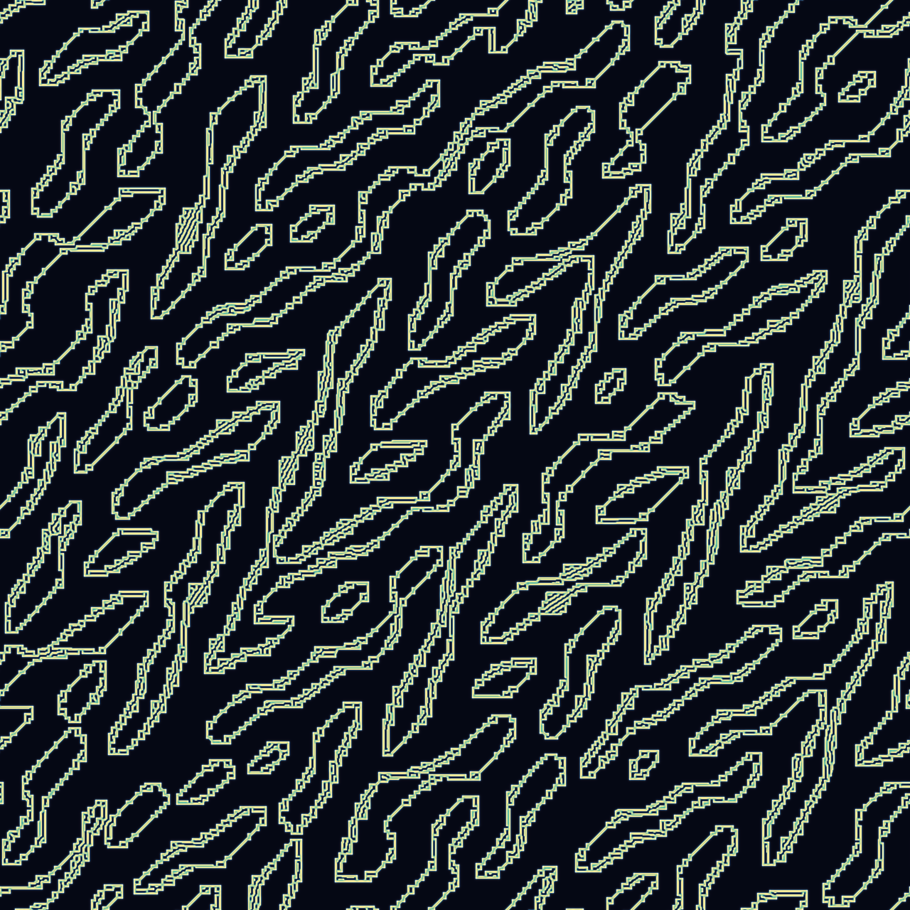

# Almost Everywhere — three procedural studies

Generative art seeded by a morning's reading of two front pages:
[philosophy.stackexchange.com](https://philosophy.stackexchange.com/) and
[mathoverflow.net](https://mathoverflow.net/). The questions people were
actually asking that day — *"Are we dead almost everywhere?"*, *"in a
deterministic world, what is freedom?"*, elliptic integrals, analytic
continuation, and Gödel on **both** front pages — became the seeds. See
[`INSPIRATION.md`](INSPIRATION.md) for the harvest and [`IDEAS.md`](IDEAS.md)
for all six ideas (three were built).

Every pixel is set procedurally in Python (numpy / scipy / Pillow). Scripts
are in [`art/`](art/), outputs in [`gallery/`](gallery/).

## The three pieces

### 1 · Almost Everywhere  — `art/piece1_almost_everywhere.py`


The **nodal set** of a sum of random plane waves — Berry's random-wave model,
the generic eigenfunction of quantum chaos. The field is one sign *almost
everywhere*; life is only the glowing curve where it crosses zero, a set of
measure zero clinging across the void. Three fields, three wavenumbers, three
hues. *(2048², seeded by "Are we dead almost everywhere?")*

### 3 · Doubly Periodic  — `art/piece3_doubly_periodic.py`  *(the 4096² centerpiece)*


Domain-coloring of the **Weierstrass ℘ function** on the hexagonal
(equianharmonic) lattice. Phase is hue, modulus is brightness; lattice poles
blaze white, the two zeros per cell sink to black, and the whole crystal
repeats in *two* independent directions at once. *(4096², seeded by elliptic
integrals / special functions.)*

### 5 · Deterministic Freedom  — `art/piece5_deterministic_freedom.py`


Gray–Scott reaction–diffusion under a fixed law, started from a fully
deterministic seed (the interference of incommensurate gratings — **not one
bit of randomness**). The frozen lattice melts into an organic, branching,
never-repeating labyrinth. *(2048² from a 1280² simulation, 10 000 steps,
seeded by "in a deterministic world, what is freedom?")*

## Also here
- [`STORY.md`](STORY.md) — a tweet-sized story about what the pieces mean.
- [`LESSONS.md`](LESSONS.md) — carry-forward notes on what I learned about
  generative art.

## Reproduce
```bash
pip install numpy scipy pillow
python3 art/piece1_almost_everywhere.py 2048 2 gallery/01_almost_everywhere.png
python3 art/piece3_doubly_periodic.py            # see __main__ for the 4096² call
python3 art/piece5_deterministic_freedom.py      # see __main__ for the final call
```
