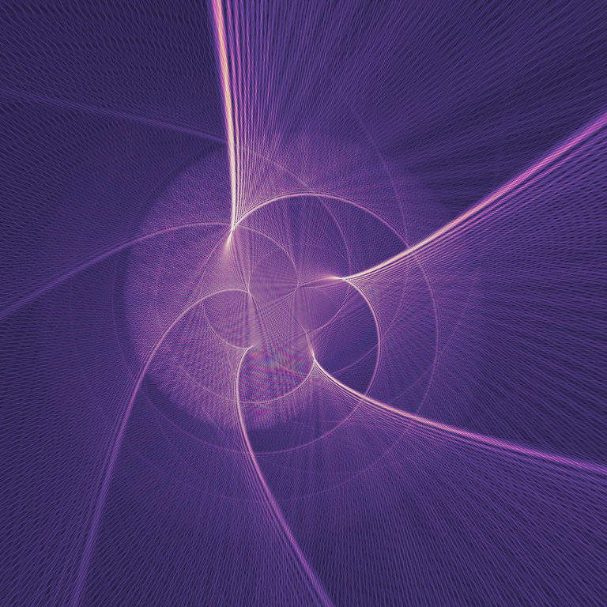

# Counting, Until Counting Shone

Procedural algorithmic art — every pixel is a deterministic function of
arithmetic, no external assets. Indirect inspiration was drawn from the front
pages of **MathOverflow** and **Philosophy Stack Exchange** (see `IDEAS.md` for
the six concepts and the motifs they came from).

## The pieces

| | piece | size | seed idea |
|---|---|---|---|
| 1 | **Almost Everywhere Dead** | 512² | "Are we dead almost everywhere?" — life on a measure-zero, dense set (rationals, Thomae brightness) |
| 2 | **Weyl's Field** | 512² | Weyl polynomial equidistribution `{r²·φ}` as two interfering tides |
| 3 | **Relation Without Relata** | 512² | a Voronoi web with the seeds erased — only the *between* remains |
| 5 | **Diffractive Geodesic** ★ FANCY | **4096²** | the half-wave propagator microlocalized along a diffractive geodesic — caustics |

Outputs live in `out/`. The 4096² showcase also has a `_preview.png`.



## Run it

```bash
pip install numpy Pillow
python3 pieces/01_almost_everywhere.py
python3 pieces/02_weyl_field.py
python3 pieces/03_relation_without_relata.py
python3 fancy/diffractive_geodesic.py   # solves the field (~4 min), caches it
python3 fancy/colorize_geodesic.py      # tune the palette in seconds
```

## More

- `IDEAS.md` — all six concepts (1, 2, 3, 5 executed; 4, 6 sketched).
- `STORY.md` — a little story about what these mean, and a note on what this
  taught me about generative art.
