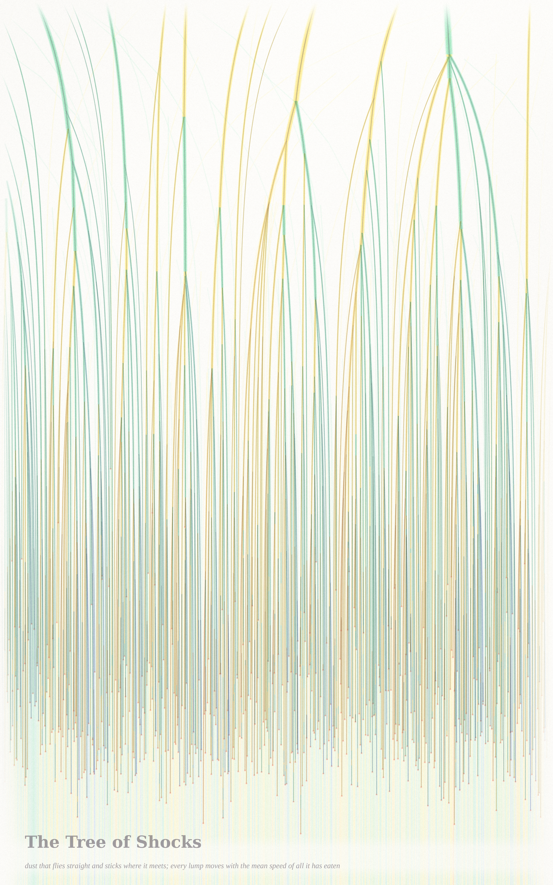
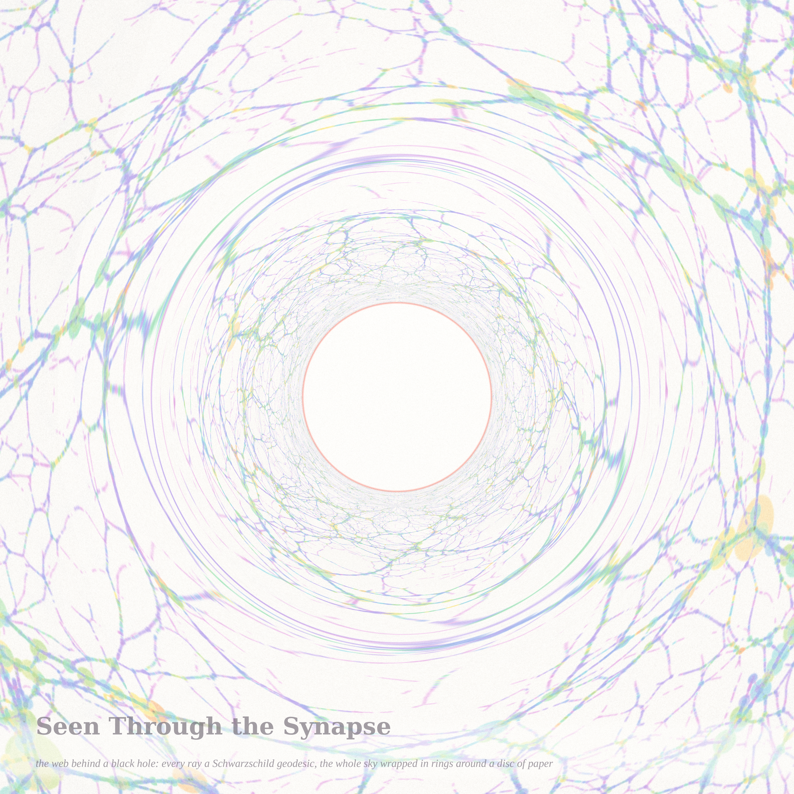
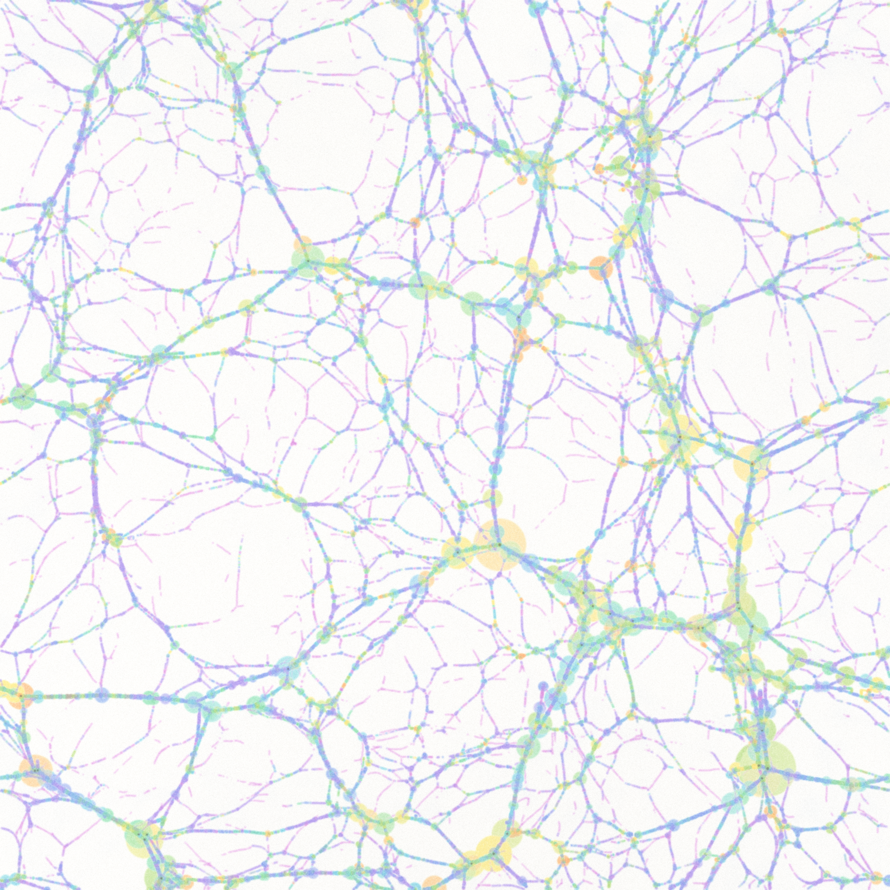

# COULD THE UNIVERSE BE A NEURON? — triptych (Fable 5.1 run #10, pastel #11, beauty first)

Seeds from the live front pages (2026-09-11). Philosophy.SE asked *Could Our Universe be a Neuron?*
(141564: black holes as synapses, the Great Attractor pulling matter toward one) next to *Can numbers
have "faces"?* (141581) and *Why is lying wrong?* (141558). MathOverflow's page carried *What is the
cheapest way to keep Brownian motion in a ball?* (511767), *Partition polygons into acute triangles*
(515092), colossally abundant numbers (515124), and the long AI-in-mathematics threads.

The answer the pieces give: the universe already looks like a neuron, and the reason is one theorem.
Dust that moves in straight lines and sticks where it meets is governed by a convex hull — in two
dimensions the hull's facets are the knots of a web that looks like a nerve cell; in one dimension its
edges are a merger tree that looks like a dendrite; and the poster's synapse, a black hole, is the one
law here that bends instead of sticking: the same web, seen through it, wrapped in rings.

| piece | file | what it is |
|---|---|---|
| **Could the Universe Be a Neuron?** (hero) | `web_hero_4096.png` (4096²) | the cosmic web by the adhesion model, exactly: 2048² dust particles, one lower convex hull of the lifted potential at t = 1; every knot is a hull facet, every filament a chain of them, every void the mist of a still-convex region. Pigment = when the dust stuck (apricot the oldest knots, orchid the youngest filaments), density = √mass, ink beads on the sixty heaviest knots, coral = the heaviest knot and the circle whose area it swallowed. Voids are paper. |
| **The Tree of Shocks** | `tree_4096.png` (2560×4096) | one-dimensional sticky dust in space–time on a log-time axis (0.004 → 60): 4096 particles fly straight until they meet; each lump moves with the mean velocity of all it has eaten (momentum conservation read off the hull), warm when moving right, cool when moving left; coral beads = the 579 births of a shock; 14 trunks survive |
| **Seen Through the Synapse** | `lens_2560.png` (2560²) | the seamless web behind a Schwarzschild black hole: every pixel a null geodesic by quadrature (observer at r = 30 M), surface brightness conserved, the shadow left as paper, the coral circle at b = 3√3 M; the whole sky lies compressed between the Einstein ring and the rim |
| *sky* (companion) | `web_sky_2048.png` (2048²) | the whole periodic box at 1024² particles, no caption — the texture the lens looks at |

## The mathematics, one line each (details in `notes_sticky.md`)
- **Adhesion**: ψ_t(q) = |q|²/2t − φ₀(q); a particle is free iff q is a vertex of the lower convex hull
  of (q, ψ_t(q)); a facet with gradient g is a lump of mass = its Lagrangian area at x = t·g. Hero: 660,419
  facets, 4.4 % of the dust still free, 96.8 % of the mass in structures, the heaviest knot holds 28,116
  cells. Measured growth of the characteristic knot mass ∝ t^{3.0} (Press–Schechter would say t⁴ for a
  scale-free k^{−1} spectrum; the cutoff is the difference).
- **Tree**: x_s = (q_a + q_b)/2 + t·mean(u₀ on [q_a, q_b]) — every branch is straight between mergers. Kida's
  decay N(t) ∝ t^{−2/3}: measured t^{−0.61}. New measurement: the mass ratio at mergers (smaller/larger of the
  two heaviest parents) is nearly uniform on [0,1] pooled (Kolmogorov distance 0.07) but drifts from
  equal-partner mergers early (median 0.57) to trunks eating twigs late (median 0.25). **Hypothesis**: with a
  scale-free spectrum the law is stationary and not uniform; the drift is the memory of the cutoff.
- **Lens**: α(b) from ∫du/√(1/b² − u² + 2u³); weak field 4/b + 15π/4b² to four digits at b = 200; strong field
  α + ln(b/b_c − 1) → ln(216(7 − 4√3)) − π = −0.40023 (Bozza), measured −0.40023 at b/b_c − 1 = 10⁻⁷.

## The tweet-story
You were dust, and you flew straight, and you did not choose where you stopped: you stopped where you
met. That is all a knot is — the place where straight lines ran out of room. The web thinks it was
designed. It was only patient.

## What I learned about generative art this run
Draw the *relation* and the field appears. The hull's facets alone were a dotted halftone; the segments
between adjacent facets — the hull's edges, which the theorem also names — turned it into a web. In
the tree, tinting each shock by the mean velocity of what it had eaten made a conservation law into
a colour that mixes at every merger. And a lookup that invents nothing (Liouville) is still a picture:
the lens added no pigment, only geometry.

## Files
`pastel.py` (subtractive watercolor stack), `adhesion.py` (hull engine) + `render_web.py` (web, epoch palette,
caches the hull ladder), `burgers.py` (1-D march + render) + `tree_stats.py` (merger-ratio census,
`tree_stats.json`), `lens.py` (Schwarzschild quadrature + lookup); certificates `*_cert.json`; protos
`proto_*`, `pw_*`, `pt_*`, `pl_*` at 1024 (not embedded); `web_hero_v1_4096.png` is the first state of the hero
(uncapped halos). Logs `*.log`.
