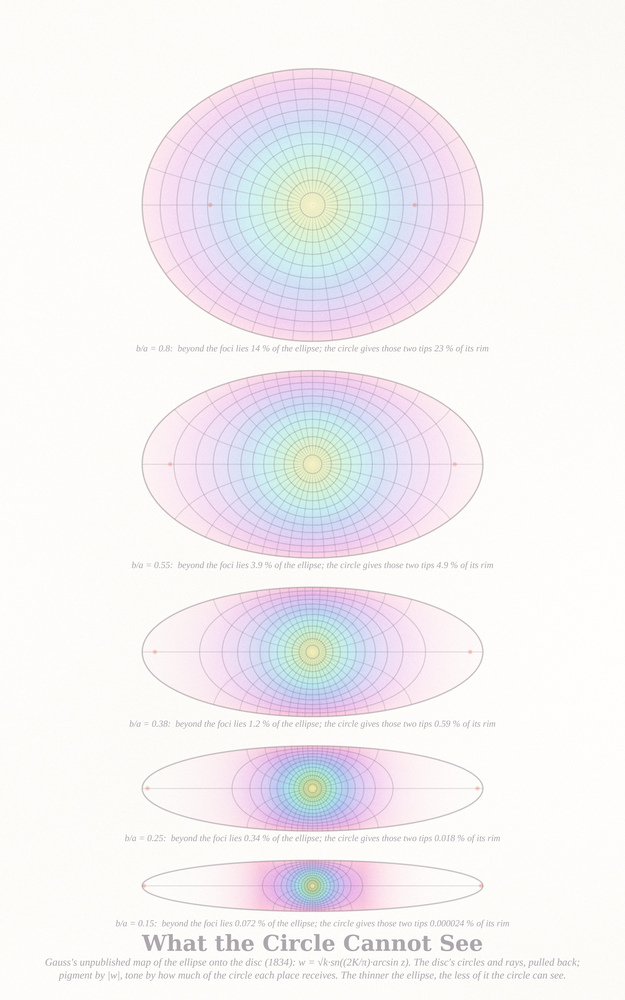
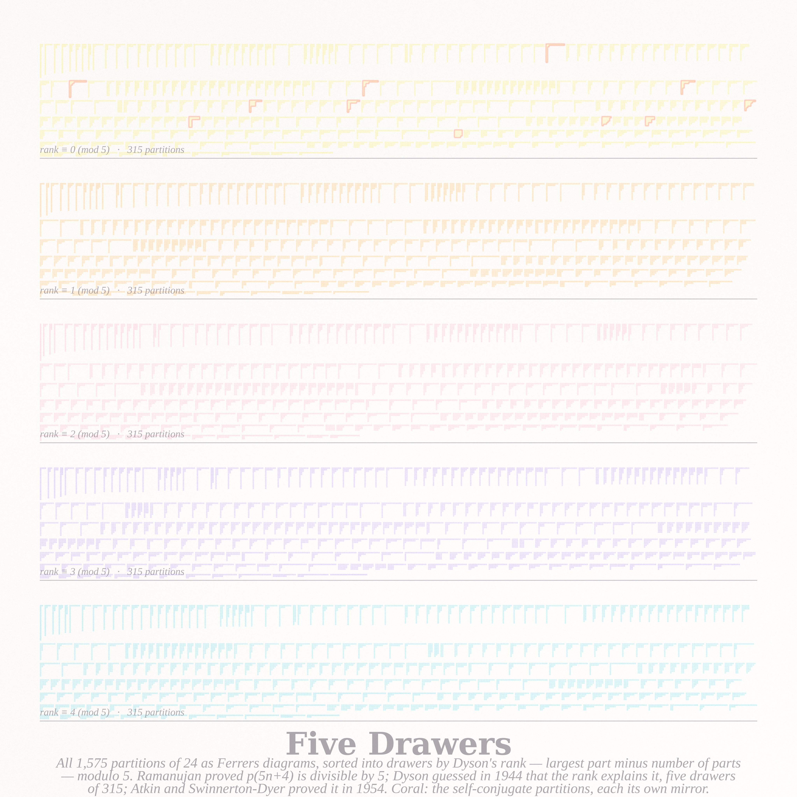
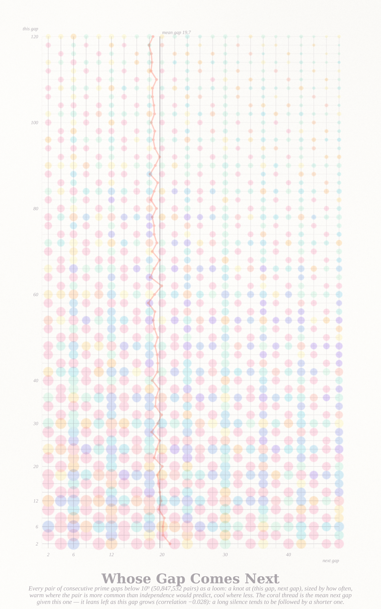

# WHAT WE INHERIT AND WHOM WE FORGET — three pictures (run of 2026-09-17, Fable 5.1 run #16, pastel #17)

Seeds from the live front pages (through the Stack Exchange API): Philosophy.SE **"Ramanujan and the Forgotten
Lives Behind What We Inherit. What We Inherit and Whom We Forget?"** (141788, the top question this morning: *how
far the consequences of one life can propagate* while the person disappears from view); MathOverflow
**"Ramanujan's series for 1/π and modular equation of degree 29"** (163859) and **"How to interpret Gauss's late
fragments on conformal mapping of the interior of an ellipse"** (328274) — two inheritances: a continued fraction a
clerk in Madras mailed to Cambridge in 1913, and a map Gauss wrote down in 1834, left unpublished, and Schwarz
found again in 1870. The mathematics of inheritance is genealogy, and the picture the series had never made is the
one Galton and Watson asked for in 1875: how surnames die.

| piece | file | what it is |
|---|---|---|
| **The Names That Reach Us** (hero, 4096²) | `names_4096.png` | A Wright–Fisher population of 1,000 with 1,000 founders' names, every generation a row (past at the top), every child drawn under its parent so that no lineage crosses and every name is one contiguous block — a theorem of the layout, not a choice. Pigment: the founder's name (nine pigments dealt at random along the top row, each with its own strength). The names die one by one — 643 left after one generation, 24 after a hundred, 3 after a thousand — until the present, at generation 1,392, carries a single founder. Sepia ink: the family tree of the present (only the fibres with living descendants, width by how many). Coral: the root at the top, and the last forgetting at the left edge. Time is a two-sided logarithm: the forgetting lives in the first hundred generations, the branching of the present's tree in the last hundred. |
| **A Fraction of a Fraction** (4096²) | `fraction_4096.png` | Ramanujan's continued fraction R(q) = q^{1/5}/(1 + q/(1 + q²/(1 + q³/…))) on the disc of q^{1/5}, where it is single-valued and five-fold: pigment by its argument, tone by its size (zeros and poles are paper), hairlines at |R| = φ^(k/2+1/4). The disc is drawn with a log-radial warp, one ring per decade of 1 − |q|, so the rim's hierarchy of cusps — every rational number a flame — has room. The five coral points are τ = i, where R = √((5+√5)/2) − φ, the value from the first letter to Hardy. |
| **What the Circle Cannot See** (2560 × 4096) | `ellipse_2560.png` | Gauss's map of the ellipse onto the disc, w = √k·sn((2K/π)·arcsin z), for five ellipses from b/a = 0.8 to a needle at 0.15. Inside each: the disc's circles and rays pulled back (ink), pigment by |w| from a lemon heart to a blush rim, tone by the conformal factor — how much of the circle each place receives. The tips beyond the foci (coral) hold 14 % of the round ellipse and get 23 % of its circle; they hold 0.07 % of the needle and get 0.000024 % of its circle. What a thin ellipse mostly is, the circle cannot see. |

## The six ideas (three built)
1. **The Names That Reach Us** — Wright–Fisher surnames as a planar forest, the coalescent tree of the present as ink. *Built (hero).*
2. **A Fraction of a Fraction** — the Rogers–Ramanujan continued fraction on its disc, log-radial warp. *Built.*
3. **What the Circle Cannot See** — Gauss's ellipse map and the crowding of harmonic measure. *Built.*
4. **Five Drawers** — all 1,575 partitions of 24 sorted by Dyson's rank mod 5 into five equal drawers (Ramanujan's p(5n+4) ≡ 0 mod 5, the explanation Dyson guessed in 1944 and did not live to see proved for the crank). A specimen mosaic of Ferrers diagrams.
5. **Whose Gap Comes Next** — MO 515297 asks whether a prime gap predicts the next; the (g_n, g_{n+1}) pair field as a loom, with the known negative lag-one correlation as the picture's lean.
6. **Two Halves, One Shape** — MO 515286: a sheet of convex polygons each cut into two congruent pieces by a polyline, the cut in coral, with the ones that cannot be cut left whole.

## Mathematics (`notes_inherit.md`; certificates in `cert_names.json`, `cert_gauss.json`, `cert_gauss_cr.json`)
- **Layout theorem**: sorting each generation by the rank of its parent makes every family a contiguous block in
  every later generation and every lineage line crossing-free — the picture is planar by induction, not by luck.
- **The clock of forgetting**: surviving names at generation t = Kingman's lineage count A_N(t/N) (Tavaré). Over 300
  runs at N = 1000: 19.9 names left at t = 100 (Tavaré 19.94), 4.32 at t = 500 (4.33), 2.34 at t = 1000 (2.37); mean
  fixation 1,975 generations vs 2N(1 − 1/N) = 1,998; the last two names share the page for 41 % of the run (mean and
  median), the last coalescence lasting 977 generations vs the theorem's N = 1000.
- **Rogers–Ramanujan**: the q-product on one tenth of the disc (five-fold symmetry and conjugation), 2,500 log-spaced
  radii to |w| = 0.9965; the special value R(e^{−2π/5}) = 0.284079043840412 reproduced to 2e-16.
- **Gauss's map**: complex sn by the addition formula; winding number of w around the boundary exactly 1 for every
  ellipse (one zero, degree one ⇒ bijective), Cauchy–Riemann residual ≤ 1e-8, |w| = 1 on the boundary to 1e-15. The
  rim share of the tips falls like exp(−πa/2b) while their area share falls like (b/a)³.

## Files
`pastel.py` (subtractive watercolour stack) · `wf.py` (the population + planar layout), `render_names.py`,
`census_names.py` · `rr.py` (the fraction on a polar grid), `render_rr.py` · `gauss.py` (the map + certificates),
`render_gauss.py` · `notes_inherit.md`. Records and protos live in `cache/` (not committed).

---

## Second trio (same day, on request: "please do the next 3")

| piece | file | what it is |
|---|---|---|
| **Five Drawers** (4096²) | `drawers_4096.png` | All 1,575 partitions of 24 as Ferrers diagrams, shelf-packed into five drawers by Dyson's rank (largest part minus number of parts) modulo 5 — exactly 315 in each, the fact Dyson guessed in 1944 to explain Ramanujan's p(5n+4) ≡ 0 (mod 5) and Atkin–Swinnerton-Dyer proved in 1954. One pigment per drawer; conjugation negates the rank, so the apricot and aqua drawers are mirrors of each other, as are blush and lavender, and the lemon drawer is its own mirror: its 11 self-conjugate partitions are outlined in coral. |
| **Whose Gap Comes Next** (2560 × 4096) | `gaps_2560.png` | Every pair of consecutive prime gaps below 10⁹ (50.8 million pairs) as a loom: a knot at (this gap, next gap) sized by how often the pair occurs, warm where it occurs more than independence predicts, cool where less (the Lemke Oliver–Soundararajan residue bias, a checkerboard in the knots). The coral thread is the mean next gap given this one, which leans left as this gap grows — the negative lag-one correlation, r = −0.028, that MO 515297 asks about. The poster's bound was checked for every integer x ≤ 10⁹: it holds, with slack ≥ 3. |
| **Two Halves, One Shape** (4096²) | `halves_4096.png` | All 1,211 convex polyominoes of area 10 — the polyomino version of MO 515286 raised in its comments. The 176 that can be cut into two congruent halves are filled (lavender: the halves are related by a half-turn; mint: by a mirror; apricot: by a slide or quarter-turn) with the cut in coral; the 1,035 that cannot are left whole as outlines. The inset shows the exceptions found by the exhaustive census: at area 12 one shape of 7,274, at area 14 six of 41,645, that can be halved into congruent pieces only if both pieces are non-convex. |

**Mathematics of the second trio** (`notes_inherit.md`, `cert_drawers.json`, `cert_gaps.json`, `cert_halves_10.json`, `cert_halves_12.json`):
five drawers of 315 verified; lag-one gap correlation −0.0275 at 10⁹ with E[next | this] falling from 21.3 to 18.3;
the MO 515297 bound holds for all integers to 10⁹ (min slack 3 at x = 9); the convex-polyomino halving census to
area 14 with the hypothesis that the halvable fraction halves with every two cells of area, and the first polyomino
instances of "congruent halves only if non-convex" (1 at area 12, 6 at area 14).

**What moved in the second trio.** The specimen-sheet register held for all three (drawers, loom, field of shapes),
which is right for companions built in an afternoon. The gap loom only stopped being a chart when the knots at small
gaps were allowed to grow into overlapping pools (size ∝ (log count)^1.3 of the column spacing) and the lean pigment
was weighted by its statistical significance — the confetti of insignificant leans at large gaps was the first
version's noise. The halving sheet became a picture once the cuttable shapes were mixed among the uncuttable in
size order instead of sorted to the top: the eye then reads the *rarity*, which is the theorem. And the census found
something the question's comment asked for: convex polyominoes whose congruent halves cannot both be convex.

## Tweet-sized story
You were one of a thousand names, and by the tenth generation half of you were gone. Nobody chose. The children simply picked their parents at random, and yours were not picked. But look at the one name that reaches the bottom of the page: it was no better than yours. It only had somewhere to stand.

## What I learned about generative art this run
- **Sort by the parent and the picture is planar for free.** A genealogy drawn with children under their parents
  (each generation sorted by parent rank) never crosses and keeps every family a contiguous block — a two-line theorem
  that replaced every layout algorithm I was about to try. When the object has an order, draw in that order.
- **Adjacent hues tell nothing; dealt pigments tell everything.** The first proto walked the rainbow along the founders,
  so neighbouring blocks were near-identical and a name's death was invisible; nine pigments dealt at random (collisions
  swapped away) with a strength of their own made every ending legible. Contrast between neighbours, not a hue map.
- **Two-sided log time** for a process whose story lives at both ends (forgetting at the start, branching of the present's
  tree at the end): y ∝ log(t + 1) − log(G − t + 30). The asymmetric constant (30) keeps the last generations from
  becoming a fan of hairlines. Third non-linear time axis in the series (log, √, now two-sided log).
- **Ink can be a second pigment.** The family tree of the present in warm-grey ink was a dark scribble across the hero;
  in sepia at two-thirds the weight it became a shadow inside the winner's block. The Fable rule "crisp ink" bends for a
  structure that covers a third of the page.
- **A log-radial warp is the disc's log-y strip.** The Rogers–Ramanujan fraction on the plain disc was a hue wheel with
  a thin fringe of detail; drawing display radius ∝ −log(1 − |w|) gave every decade of the rim the same ring and turned
  the fringe into a sunburst. Fade the pigment where the phase turns faster than a pixel (the aliasing guard) or the
  cusps go grey.
- **Use the symmetry to compute a tenth.** R(ζw) = ζR(w) and R(w̄) = conj R(w): one tenth of the disc, unfolded at
  paint time; term count by radius (40/(5(1 − r))), rows retiring as the product converges. Ten minutes instead of two hours.
- **A hairline at a level the function actually reaches is a plateau.** R(q) tends to exactly φ⁻¹ along the positive
  real ray and to φ along the ray at π/5, both levels of my φ^{k/2} contours, so the "hairlines" filled two whole wedges
  with grey; I blamed aliasing twice (guards, resolved masks) before reading the numbers. Put contour levels at half-steps
  from any value the object is known to take, and diagnose a grey region by printing the field, not by tightening filters.
- **The certificate that proves a conformal map is one number**: the winding number of the boundary image (= 1 ⇒ one
  zero ⇒ bijective) plus a Cauchy–Riemann residual — cheaper and more honest than comparing against another solver.
