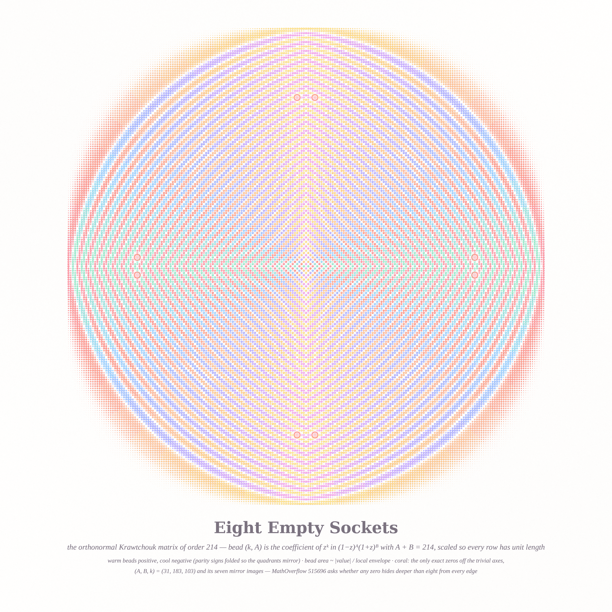
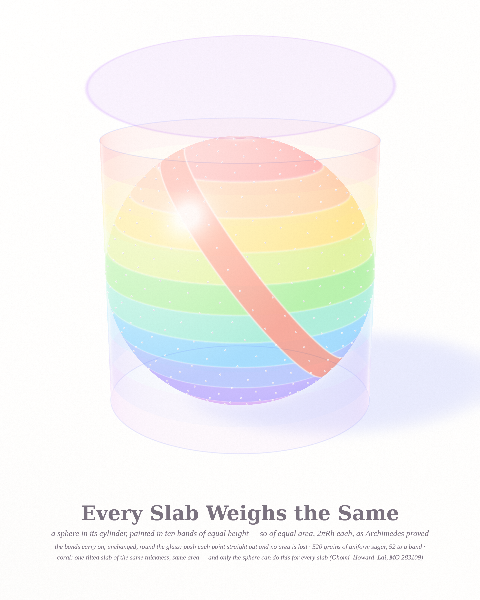
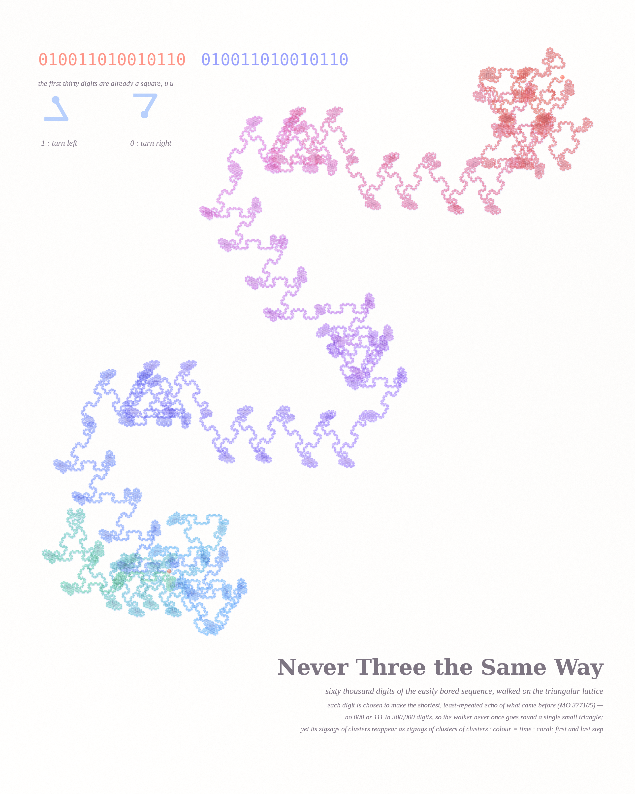

# WHERE THE LINE FALLS — pastel #27 (Opus 5.5, run 6, 2026-10-04)

A triptych about lines that land exactly: a sum that falls to zero only in eight places, a slab that weighs the
same wherever it is cut, and a walker that will not let three steps fall the same way.
Seeds: Philosophy.SE 142343 (*"Where should one draw the blurry line…?"*), MathOverflow 515696 (zeros of
₂F₁(−k,−A;−N;2)), 283109 (converse of Archimedes' hatbox), 377105 (the easily bored sequence).

| piece | size | what it is |
|---|---|---|
| **Eight Empty Sockets** (hero) | 4096² | the orthonormal Krawtchouk matrix of order 214 as 46,225 candy beads |
| **Every Slab Weighs the Same** | 2560×3200 | Archimedes' sphere in its glass hatbox, ten equal-area bands and one tilted coral slab |
| **Never Three the Same Way** | 2560×3200 | 60,000 digits of the easily bored sequence walked on the triangular lattice |

## Eight Empty Sockets

Bead (k, A) is the coefficient of zᵏ in (1−z)ᴬ(1+z)ᴮ with A + B = 214, scaled so that the matrix is orthogonal.
The integers come from an exact big-integer recurrence (`kfield.py`); floats blow up outside the disc.
Warm beads are positive and cool ones negative. The parity signs are folded so the four quadrants mirror,
and bead area is |value| divided by the local envelope. The fringes fill the inscribed circle, and outside it the
values die off exponentially, so the beads fade to dust. The coral sockets are the only exact zeros off the
trivial axes: (A,B,k) = (31,183,103) and its seven mirror images. That is the OP's second "sharpness" example. `render_beads.py`.

## Every Slab Weighs the Same

Ten bands of equal height, so of equal area 2πRh. The same bands continue on the glass cylinder, since pushing each
point straight out is Archimedes' area-preserving map. There are 520 grains of uniform (Fibonacci) sugar, exactly 52 to a band.
The coral band is a tilted slab of the same thickness, with the same area. Ghomi–Howard–Lai proved that only the sphere has this
property for every slab of one fixed thickness. `render_hatbox.py` is a numpy ray tracer: an opaque sphere, a thin glass shell, a hovering lid, and
jittered passes for anti-aliasing.

## Never Three the Same Way

Each digit is chosen to make the weakest echo of what came before: the lowest repetition exponent first,
then the shortest repeated block (`bored.c`, checked against the OP's first 22 terms, run to 300,000).
On the triangular lattice (1 = left 120°, 0 = right 120°), a 000 or 111 would be a lap round one small
triangle. It never happens in 300,000 digits. Colour shows time (coral → pink → lilac → periwinkle → sky → mint).
The legend in the top-left is the first thirty digits, which already form a square word u u.
`render_walk.py`.

## Mathematics (details in [`notes_math.md`](notes_math.md))
- **MO 515696**: exhaustive exact search to **N = A + B ≤ 9000** (the OP went to A ≤ 300, B ≤ 1000). There is no zero with
  min(A, N−2k) ≥ 9. The min-8 zeros are exactly two Pell chains.
  **Proposition:** for N − 2k = 8 and A odd, the coefficient vanishes ⇔ **(2k − 4A + 7)² − 2(2A+1)² = −17**.
  That is a Pell conic, so there are infinitely many zeros at depth 8, with A_{n+1} = 6A_n − A_{n−1} + 2 and B/A → 3+2√2.
  A duality turns the coefficient into a ⌊d/2⌋-term sum, so for each d = N − 2k the zeros are the integer points of
  a curve. Factoring these curves for d ≤ 18: conics occur only for d ≤ 8, and from d = 9 on every component has degree ≥ 4.
  **Conjecture:** this holds for all d. Then 9 is where the last conic dies, which would explain the OP's threshold.
- **MO 377105**: no 000/111 in 300,000 digits, the density of 0s → ½, a cube is never forced, the prefix is a square
  only at lengths 30 and 2116, and the square periods are hierarchical. **Hypothesis:** the sequence is morphic. Its walk
  is visibly self-similar.
- **MO 283109** (answered): first-order rigidity. A radial harmonic perturbation Y_n keeps every fixed-h slab
  area constant only for n ≤ 1.

## A tweet-sized story
> A sphere was told: wherever they cut you, cut you evenly. It agreed, and became the only shape that could.
> Beside it, 46,225 beads tried to cancel one another and managed it in just eight sockets.
> And a walker, bored of every echo, never once turned the same way three times, yet kept drawing its own outline, larger.

## What I learned about generative art (this run)
- **Pick the sampling to fit the eye.** One-pixel-per-coefficient was honest, but it washed out to grey at viewing size. One *bead*
  per coefficient at N≈200 carried the same matrix, and its moiré became visible pattern instead of aliasing.
- **Normalise by the local envelope, then let the global envelope fade the edge.** The beads read evenly
  inside the disc, and the evanescent zone turns to dust on its own.
- **Avoid complementary neighbours on a time gradient.** Peach→mint along a thin line went olive; going
  coral→pink→lilac→periwinkle→sky→mint stays clean.
- **A legend can be typeset.** A thirty-step walk drawn large retraced itself into a tangle; the same thirty digits
  typeset as u u (coral, then periwinkle) said it at once.
