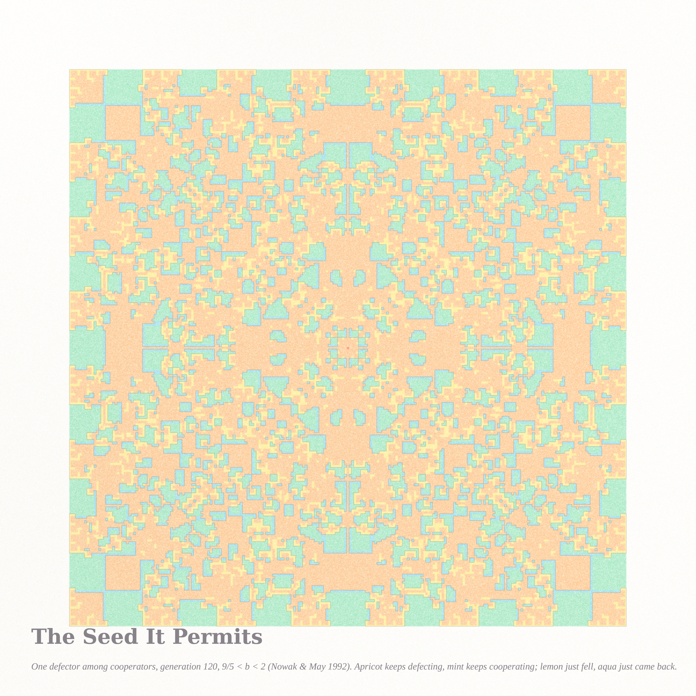
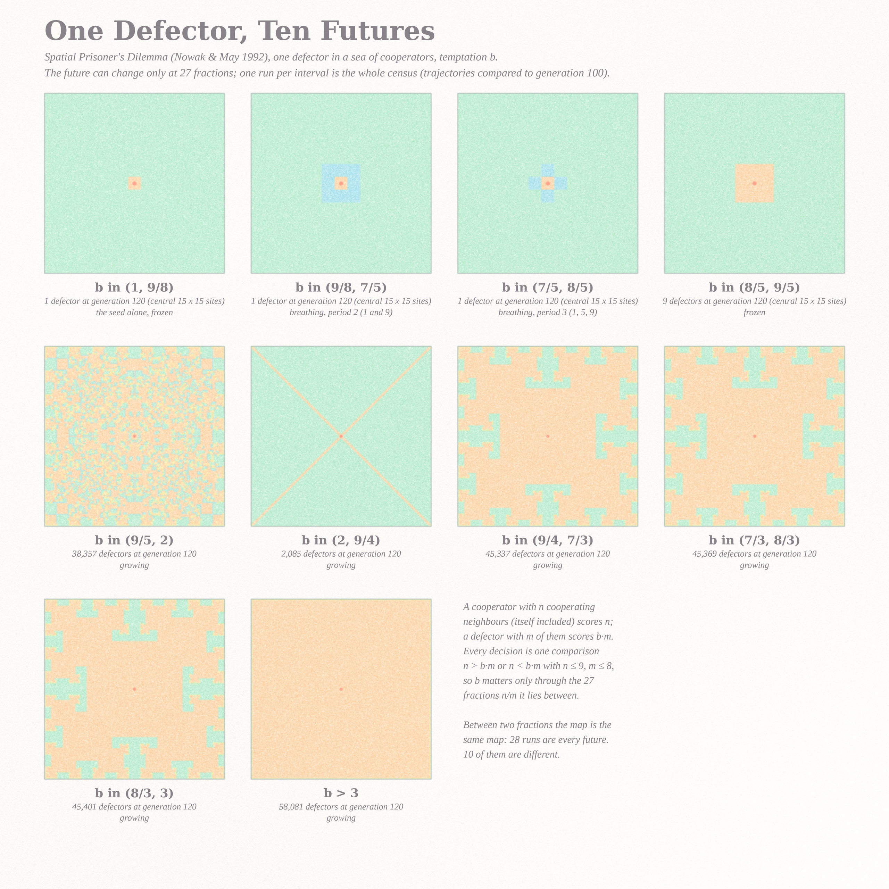

# WHAT FREEDOM PERMITS — triptych (Fable 5.1 run #7, pastel #8, beauty first)

Seeds from the live front pages (2026-09-08): Philosophy.SE asked *Is happiness a trap?* (141471) and
*Can freedom contain the possibility of its own destruction?* (141470); MathOverflow's front page was
a wall of questions about AI and proofs (*Posting AI proofs*, *certifying a proof without publishing
it*). Two exact models answer the two philosophy questions with pictures: a billiard whose happiest
orbits are exactly the trapped ones, and a lattice of cooperators that permits one defector. The MO
mood went into the working method instead: every number on these sheets is a certificate the code
checked, and the two notes end with a hypothesis each rather than a claim.

| piece | file | what it is |
|---|---|---|
| **Is Happiness a Trap?** (hero) | `mush_hero2_4096.png` (4096²) | Bunimovich's mushroom billiard in string art: 16 trapped orbits (caustic radius ρ ≥ r, cool pigments by ρ), 8 sticky free orbits launched with ρ just under r (warm, blush closest to r), coral = the theorem's circle ρ = r and the mouth corners |
| **The Seed It Permits** | `kal_2560.png` (2560²) | Nowak–May spatial Prisoner's Dilemma, one defector, generation 120, 9/5 < b < 2: apricot keeps defecting, mint keeps cooperating, lemon just fell, aqua just came back; coral seed |
| **One Defector, Ten Futures** | `futures_2560.png` (2560²) | the complete census: b matters only through 27 fractions n/m, one run per interval is every future; ten are different, drawn once each |

## The mathematics, one line each (details in the notes)
- **Trap theorem** (`notes_mushroom.md`): an orbit's caustic radius ρ = |p × v| is invariant under bounces off the arc and off the flat wall (the wall bounce is the unfolding to the disc); its chords cross y = 0 at |x| ≥ ρ, so ρ ≥ r never finds the mouth. Certificate: all trapped orbits stayed for 600 chords, ρ drift < 3·10⁻¹⁴.
- **Stickiness** (`survival.py`, `survival.json`): 86.3 M cap-sojourns of free orbits; survival P(τ > t) ≈ C·t⁻² over 20 < t < 1000 for r/R = 1/2 — steeper than the 1/t of folklore and than the 3/2 a flux heuristic gives; r/R = 1/2 = cos(π/3) puts the theorem's circle exactly on the period-3 triangle's caustic. The control at r/R = 0.45 (83 M sojourns) decays a full power faster (slopes −2.6 to −3.4, longest sojourn 1,627 vs 12,920): the trap's edge is stickiest on a periodic caustic. Hypothesis in the notes.
- **Finiteness of futures** (`notes_futures.md`): every decision is a comparison n vs b·m with n ≤ 9, m ≤ 8, so the future of one defector changes only at 27 fractions: 28 open intervals, 28 runs, ten distinct trajectories (a fixed seed, a period-2 breath 9↔1, a **period-3 breath 9→5→1**, a frozen 3×3, the kaleidoscope, a diagonal cross growing 17.6 sites per generation, three island futures, and total defection). Thresholds 9/5 and 2 of the 1992 paper fall out of the list.

## Files
`pastel.py` (subtractive watercolor stack), `mushroom.py` + `rast.c` (billiard + C rasteriser), `render_mush.py`,
`nowak.py`, `render_nowak.py`, `census_futures.py`, `render_futures.py`, `survival.py`; certificates `*_cert.json`,
`survival*.json`, `futures_T*.json`; protos `proto_*`/`pm_*`/`pk_*` at 1024 (not embedded).

## Tweet-sized story
You circled the cap for six hundred bounces and called it home. The coral line is the only thing
that knows: your circle is a hair too small. You will fall through the floor you never touched, and
everyone who watched will say you looked so happy up there.

## What I learned about generative art this run
An ergodic average is flat by definition: 500 orbits gave a colour wash, 16 gave string art. When a
density field looks like nothing, draw fewer things for longer. And a line's mass must not scale with
the canvas — the resolution buys crispness, not weight; scale the *count* of threads instead.
