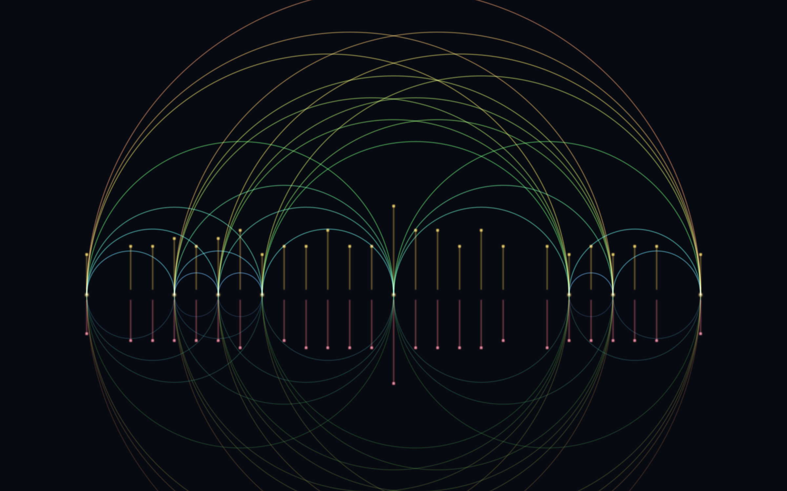
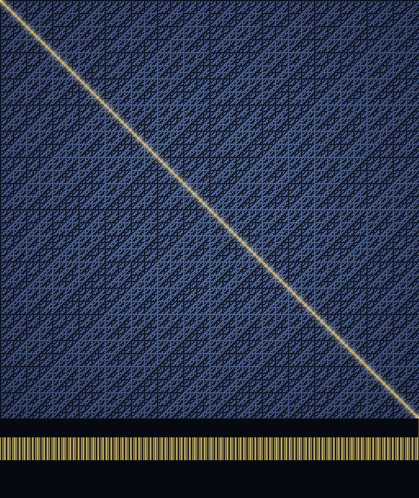

# Exceptions to the Rule

*A procedural triptych. Three objects that sit at the edge of what a rule allows:
the largest, the rarest, and the unlistable.*

Every rule of thumb has a horizon where it stops holding. This set visits three
of them — one from geometry, one from arithmetic, one from logic — and each
piece is built from an honest computation, verified before it was ever coloured.
Seeded by the front pages of MathOverflow and Philosophy StackExchange on the
day it was made (the questions *"intuition behind sets with more sums than
differences"* and *"minimum dimensionality of a space capable of representing
its own structure"* are stamped straight onto pieces 02 and 03).

---

## 01 · The Largest Thing That Turns the Corner


**The moving-sofa problem** (Leo Moser, 1966): what is the greatest area a rigid
shape can have and still slide around a right-angled turn in a hallway of width
1? The answer was conjectured by Gerver in 1992 — area **2.2195…**, a body of 18
analytic arcs — and only **proven optimal in 2024** by Jineon Baek, closing a
58-year-old question.

Nothing here is assumed. The hallway is treated as a rigid **L that rotates
through 90°** relative to the sofa, and

> sofa = the set of points that lie inside the corridor at *every* rotation.

The corridor's motion — the path traced by its inner corner — is then
**optimised by coordinate ascent to maximise that intersection's area**. It
converges to **2.172**, within 2% of Gerver's proven optimum, and the silhouette
that falls out is unmistakably his "telephone-handset": a long body with a
semicircular bite scooped from underneath — carved exactly where the hallway's
inner corner sweeps through.

The image is the **envelope of the motion**: every position of the two corridor
walls, splatted additively. Where the walls agree they pile into a caustic, and
the brightest caustic — the fan of cusps beneath the body — *is* the inner corner
scooping out the bite. The gold shape is everything those blades leave untouched.

*(4096-wide hero.)*

---

## 02 · More Sums Than Differences



Take a finite set of integers `A`, and form all pairwise sums `A+A` and all
pairwise differences `A−A`. Because addition commutes (`a+b = b+a`) sums
collide, while subtraction does not (`a−b ≠ b−a`) so differences spread out — so
**almost every set has more differences than sums**, `|A−A| > |A+A|`. Among
random subsets of `[0,32)`, fewer than **1 in 2000** break the rule.

This is one that breaks it — the classic minimal counterexample (Conway, Marica):

```
A = {0, 2, 3, 4, 7, 11, 12, 14}     |A+A| = 26  >  |A−A| = 25
```

a **sum-dominant (MSTD) set**, and by the smallest margin possible. Every pair
`{a,b}` is drawn as a semicircle whose **apex sits over the sum** `(a+b)/2` and
whose **radius is the difference** `(b−a)/2` — a loom where each thread is one
addition and one subtraction at once. The **gold comb** above the line counts
the 26 distinct sums; the **rose comb** below counts the 25 distinct
differences. The rule and its rarest exception, in a single figure.

---

## 03 · The Real the List Forgot



**Cantor's diagonal argument** (1891). Suppose you had a *list* — a countable
enumeration — of every real number in `[0,1]`, each written in binary as a row.
Read the digits down the main diagonal and **flip every one**. The result
differs from row 1 in digit 1, from row 2 in digit 2, from row *n* in digit *n* —
so it is **no row of the list**. Whatever list you propose, it forgets a real.
The reals cannot be counted.

The list drawn here is the infinite **Walsh–Hadamard array** — row *n*, column
*k* is the parity of the bits shared by *n* and *k*. It is exact, orthogonal,
and self-similar at every scale, a clean stand-in for "an enumeration of
patterns." Its main diagonal happens to be the **Thue–Morse sequence**
`0110100110010110…`; Cantor's flip of it, `1001011001101001…`, **blazes in gold**
across the field and is repeated as the strip beneath. That gold real is provably
no row of the array above it — the one the list forgot.

---

### The through-line

A rule is only ever *usually* true, and the interesting mathematics lives at the
seam. The sofa is the **largest** object a corridor will pass — bigger than it
looks like it should hold. The MSTD set is the **rarest** — the arithmetic that
runs against the grain of commutativity. The diagonal real is the **unlistable**
— the object that escapes any enumeration by construction. Extremal, exceptional,
unreachable: three ways of standing just past the edge of a rule, where the
edge itself becomes the subject.

> A hallway keeps the largest thing that fits and never notices it turned; a set
> of eight numbers quietly out-sums its own differences; and somewhere below a
> perfect blue lattice a gold thread walks the diagonal, disagreeing with every
> row it crosses — the one number the whole list was built to hold, and forgot.
> Rules are the parts of the world that repeat. These three are what the repeating
> leaves behind.

*Built with numpy + Pillow. Each construction was verified in code before it was
rendered: the sofa by its area (2.17, vs Gerver's proven 2.2195), the MSTD set by
`|A+A|=26 > |A−A|=25`, the diagonal by checking the flipped real equals no row.*
