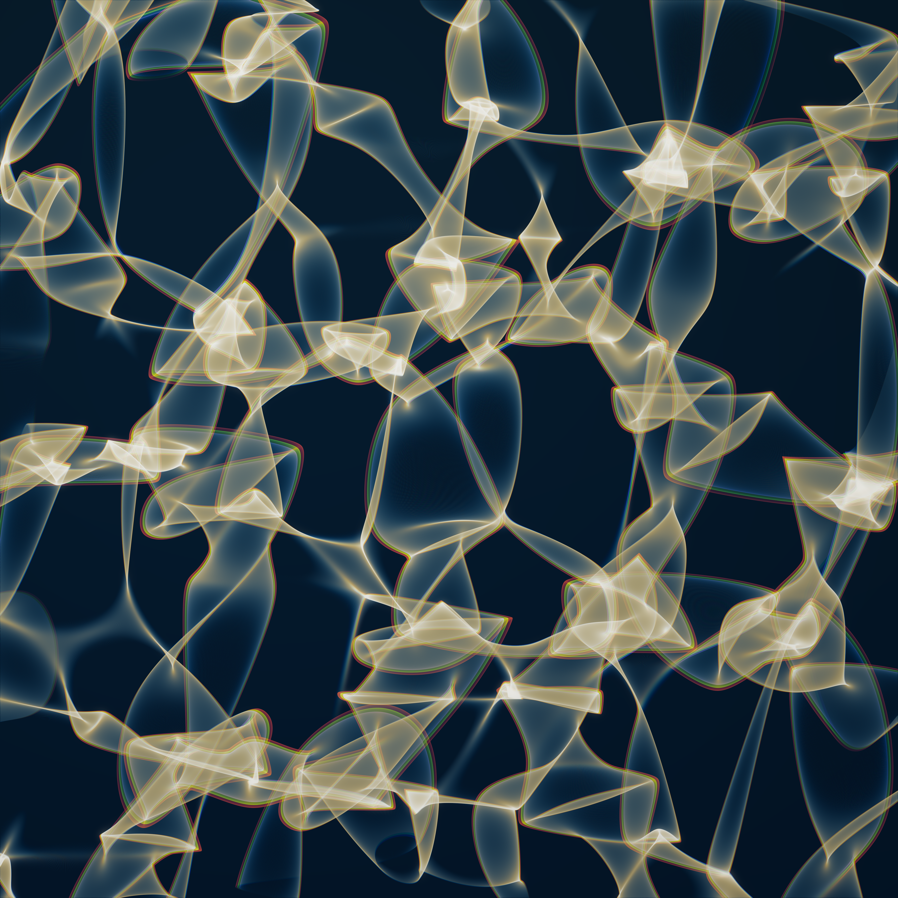
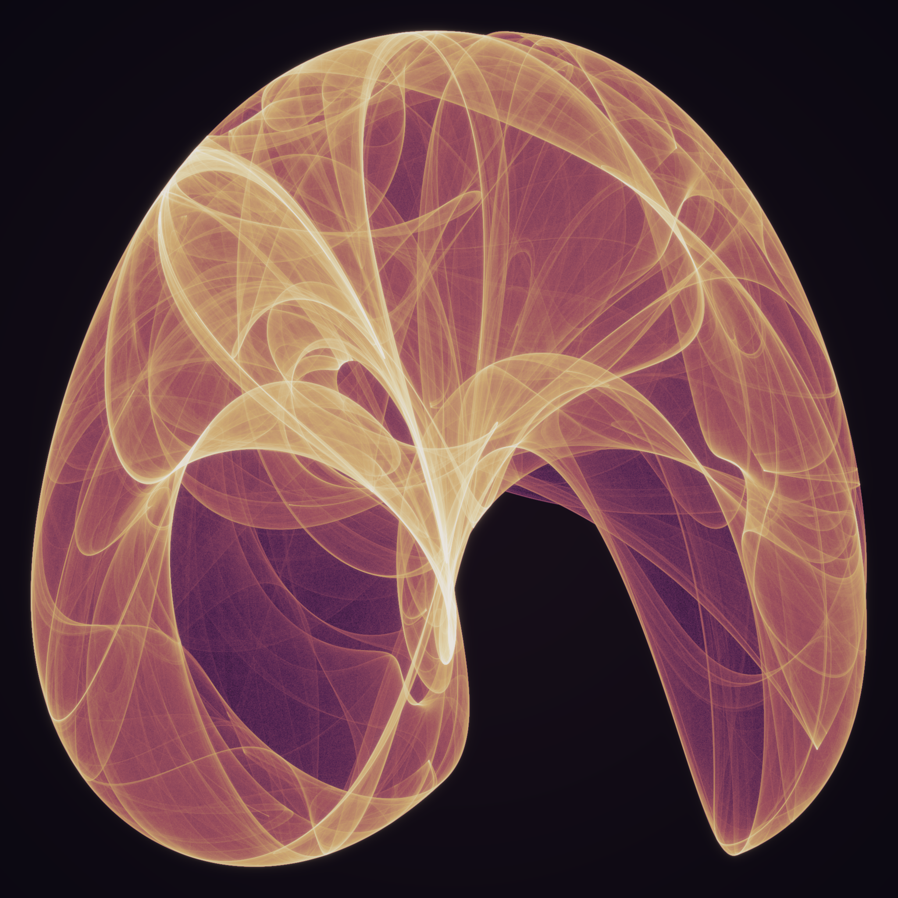
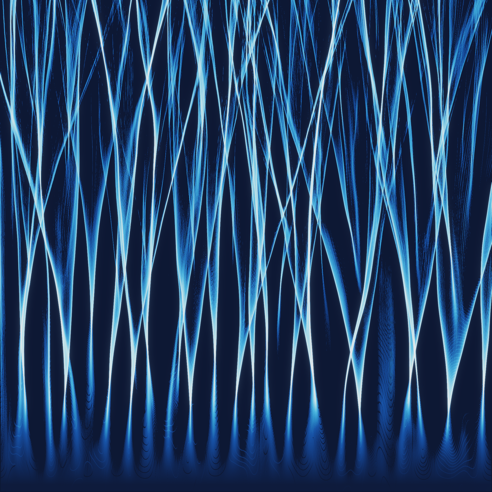

# Caustics — The Fold, Three Ways

*A procedural triptych. One idea — the way a smooth flow, pushed a little, stops
spreading and instead **piles up onto bright curves** — rendered in three
different worlds: optics, chaos, and disorder.*

When you gather a family of rays (or orbits, or particles) and map them forward,
the map almost everywhere just stretches and shifts them. But along certain
curves it **folds** — the map briefly runs backwards, and the density of arrivals
diverges. Those curves are **caustics**, and their pinch-points are **cusps**.
René Thom proved these two — the fold and the cusp — are the *only* singularities
of a generic map of the plane that survive a small perturbation, which is why the
same lace of light appears on a pool floor, inside a chaotic attractor, and in a
beam crossing a disordered medium. Three systems that share nothing but their
mathematics. In each piece the brightness is not painted — it *is* the density of
arrivals, so the light draws itself.

*(This set is a remake: an earlier triptych on this branch was, fairly, called
too plain and mechanical. These are built to be made of light instead.)*

---

## 01 · The Folding of Light  ·  *optics*

Parallel sunlight falls through a gently wavy water surface. Where the surface is
convex it focuses; where the ray-map folds, the light piles up without bound
along bright seams and pinches to brilliant cusps. Nothing is drawn — a smooth
random height field `h(x,y)` deflects each vertical ray by its slope `∇h`, the ray
lands at `(x,y) + s·∇h`, and **millions of rays are gathered** so that brightness
is the caustic density itself (unbounded at the folds). Red, green and blue are
refracted by slightly different amounts — real **dispersion** — so the sharpest
fold-edges break into a whisper of rainbow, exactly as they do in water. *(4096²
hero.)*

---

## 02 · The Veil a Single Orbit Weaves  ·  *chaos*

A de Jong map, `x' = sin(a·y) − cos(b·x)`, `y' = sin(c·x) − cos(d·y)`. It is fully
deterministic and has no attracting point; one starting dot, iterated forever,
never repeats and never escapes — it wanders a **strange attractor**, and the
fraction of its life spent near each spot is that point's **invariant measure**.
A third of a billion iterations later, brightness *is* that measure: the veil is
not drawn, it is simply where the orbit chooses to live. The bright seams are
caustics of the *dynamics* — folds where the map creases phase space onto itself —
the same fold that lights the pool floor, made by a rule instead of by water.

---

## 03 · Branches in a Disordered Sea  ·  *disorder*

Launch a wide, perfectly parallel sheet of particles into a **weak, smoothly
random** landscape — hills and hollows no deeper than a ripple. You'd expect them
to spread out evenly. They do the opposite: tiny deflections accumulate and the
whole flux collapses onto a few brilliant, forking channels — **branched flow**.
The filaments are caustics once more, but now grown by *disorder* rather than by a
lens or a map, and the distance to the first branch depends only on the strength
and scale of the randomness — never on where any single hill happens to sit. The
same pattern steers electrons through semiconductors, sound through the ocean, and
rogue waves out of a calm sea.

---

### The through-line

> Point a flashlight at moving water and the floor fills with a restless net of
> bright thread. That net is a theorem. It says: take almost any smooth way of
> sending a crowd of paths forward, and the crowd will refuse to stay a crowd — it
> will find the folds and crowd onto them, again and again, at every scale. Water
> does it with a wavy skin; a chaotic rule does it to phase space; a field of soft
> random hills does it to a straight beam. The bright curves have a name older than
> any of these machines — caustic, *the burning* — because that is where the light
> collects enough to burn. Three pictures, one habit of the world: everywhere flow
> is folded, it turns to light.

*Built with numpy + scipy + Pillow. Brightness is the arrival density in all three
— rays gathered on a floor (01), orbit visits (02, ~3.4×10⁸ iterations), ray
density through disorder (03). Nothing is a solid fill; every value is light that
gathered there.*
