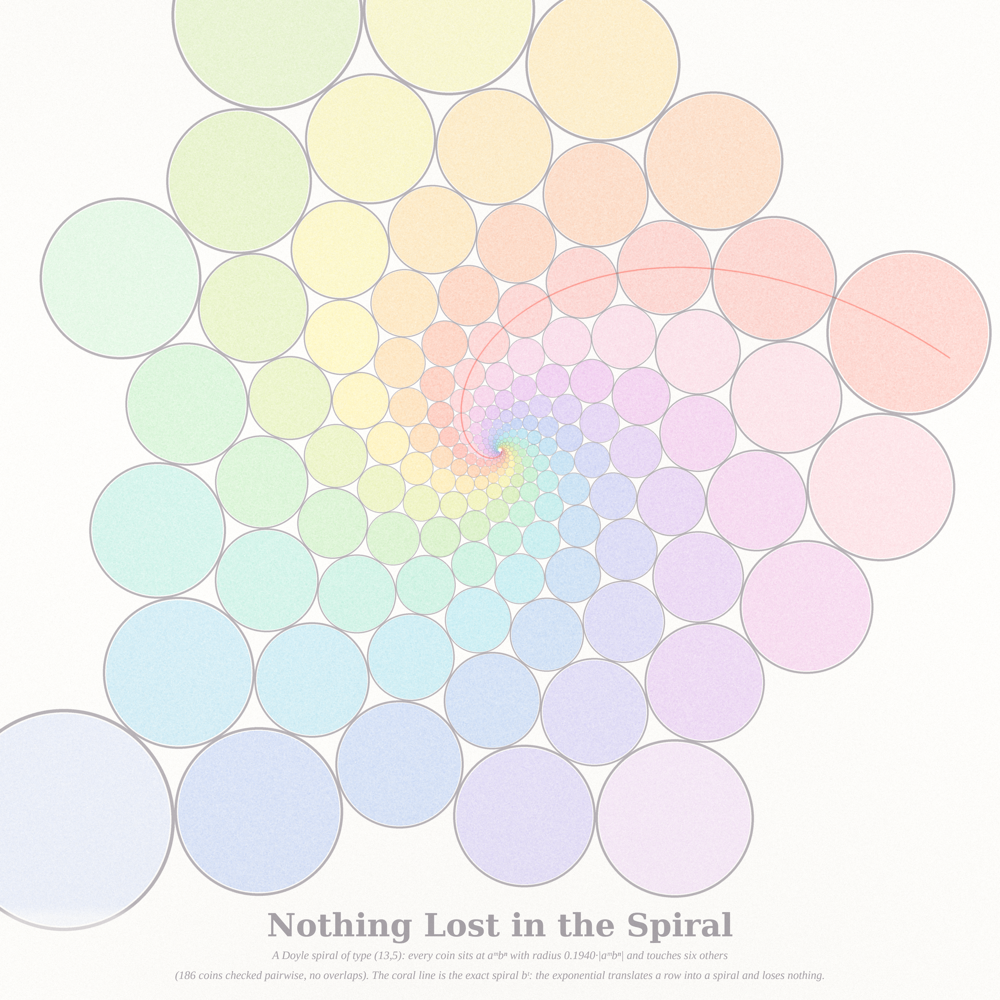
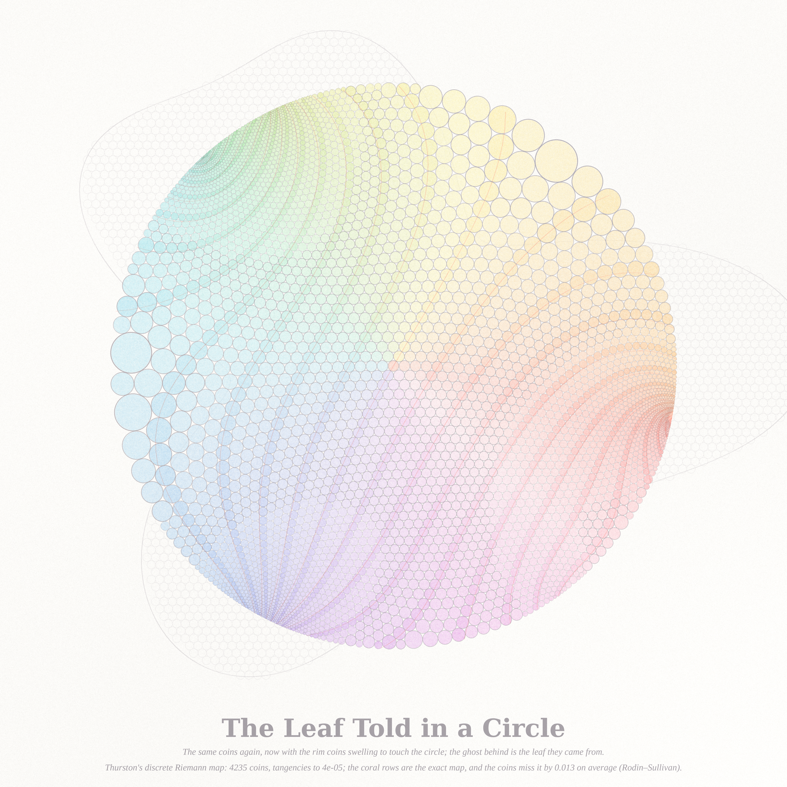
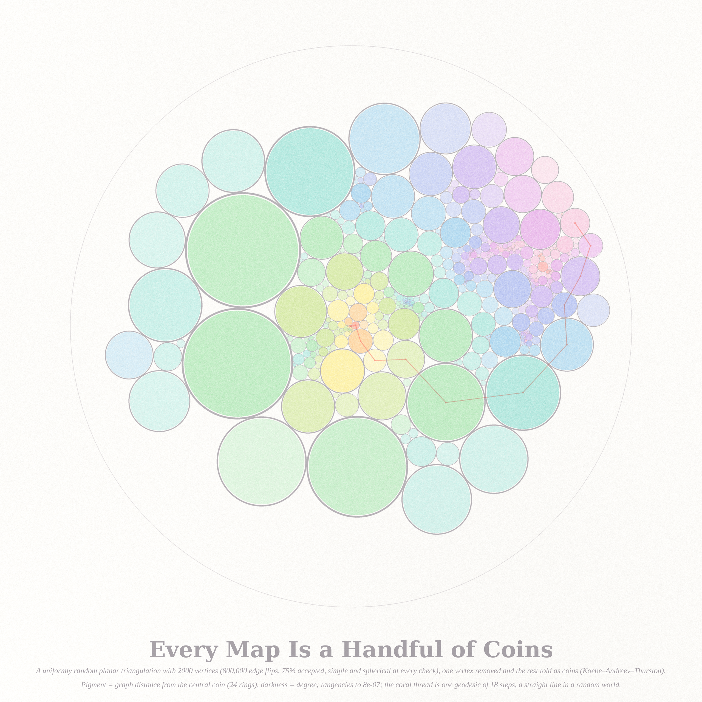
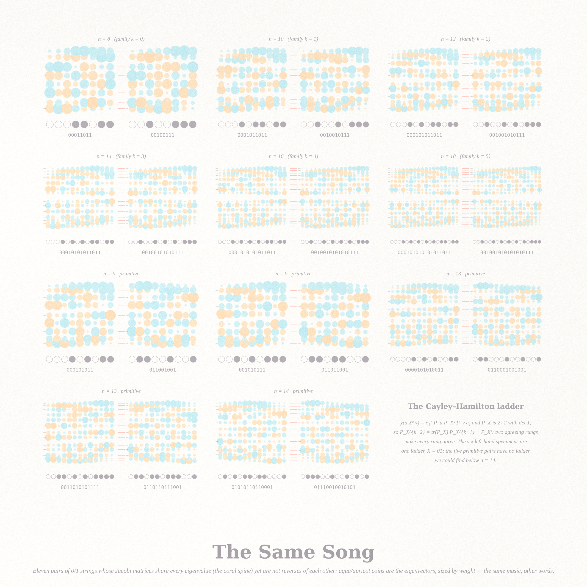
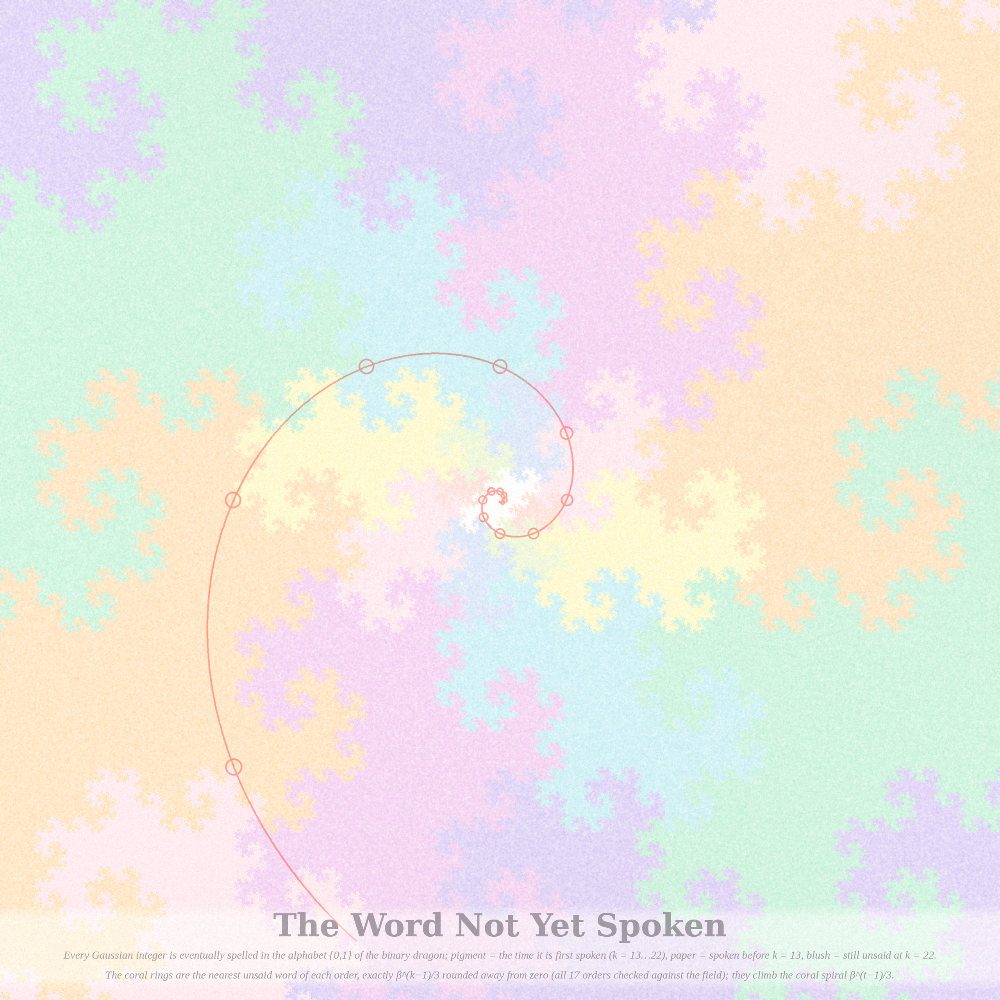

# What Survives Translation — `art_5i2r/` (2026-09-05, Fable 5.1 run #4, pastel #5)

Seeded by the live front pages: Philosophy.SE 141367 *"Is Poetry the All?"* — a user insists that
translation is "the noblest of sciences", that every text can be carried into another language, and that
translating is what we do when we talk to our cats — and MathOverflow 514920 *"When do two binary strings
have the same characteristic polynomial?"* (two texts with the same music) and 514916 *"Nearest missing
points of the Binary Dragon"* (the word not yet spelled).

The mathematics of translation-without-loss is the conformal map, and its most literal form is a **circle
packing**: take a region, fill it with equal coins, then repack the *same tangency graph* somewhere else.
Every coin keeps its six neighbours (the meaning); the sizes change (the words). Thurston conjectured and
Rodin–Sullivan proved (1987) that the repacked centres converge to the Riemann map. New vein for this
series: nothing in the USED list touched circle packings, Doyle spirals or discrete conformal maps.

All six ideas were built (the first three in the scheduled run, the last three on request the same day).

## The pieces

### 1. The Leaf Told on a Page (hero, 4096²)

A leaf `r(θ)=1+0.30cos3θ+0.14cos(5θ−0.9)+0.10cos(2θ+1.2)+0.05cos(7θ+0.4)` packed with 9,566 equal coins
(spacing h = 0.02), then repacked in the Euclidean plane with boundary angle sums π and π/2 at four corners
chosen by harmonic measure (arcs 0.30/0.20/0.30/0.20): the coins straighten into a **page**. Coral rows are
the exact conformal images of the leaf's hex rows; coins on those rows carry more pigment.
*Verified:* angle sums to 1e−12, tangencies to 1e−9, sides straight to 1e−8. The page's proportion (the
quadrilateral's conformal modulus, a number nobody chose) is **1.1766 discrete vs 1.1632 exact** from an
independent map (MFS harmonic solve → disc → Möbius → elliptic integral F, modulus 2K/K′); centres miss the
exact map by 1.8 % of the page width on average at h = 0.02 (h = 0.05: 4.1 %, h = 0.1: 5.6 %), the O(h)
Rodin–Sullivan rate; unit-disc control: modulus to 0.03 %.

### 2. Nothing Lost in the Spiral (2560²)

The (13,5) Doyle spiral — coins at aᵐbⁿ with radius k·|aᵐbⁿ|, the hexagonal packing of the punctured
plane that is the *discrete exponential*; coral = the exact logarithmic spiral bᵗ through one arm;
painter's unfinished edge. *Verified:* the five equations (three tangencies + closure 13·log a + 5·log b =
2πi) solved to 5e−17; a = 1.0339+0.4082i, b = 0.7303+0.2092i, k = 0.19397; 186 coins pairwise checked, min
gap −7e−15 (no overlaps), 5.61 tangencies per coin (6 in the bulk). Here the translation is exact.

### 3. The Leaf Told in a Circle (2560²)

The same leaf coins (h = 0.03, 4,235 coins) repacked as the maximal packing of the unit disc (rim coins are
horocycles) — Thurston's discrete Riemann map; the leaf as a ghost behind at the same scale; coral rows =
the exact map. *Verified:* Collins–Stephenson in hyperbolic radii to 1e−12, Poincaré layout by Möbius moves,
tangencies to 4e−5 (accumulated over the layout), horocycle consistency 3e−5; centres vs the MFS map:
median miss 0.013 (unit disc), max 0.047 at the rim.

### 4. Every Map Is a Handful of Coins (2560²)

A **uniformly random simple planar triangulation** with 2,000 vertices, sampled by 800,000 edge flips
(75 % accepted; the flip chain is symmetric and connected on simple triangulations, so its stationary law is
uniform), one vertex of degree 26 removed, the rest packed as coins in the disc (Koebe–Andreev–Thurston,
rim coins at hyperbolic radius 0.5). Pigment = graph distance from the central coin (24 rings), darkness =
degree; the coral thread is one geodesic of 18 steps — a straight line in a random world. The fractal
spread of coin sizes (2e−10 to 0.21) is the Brownian-map geometry showing through.
*Verified:* Euler characteristic 2 and simplicity after every 10⁵ flips, angle sums to 3e−12, tangencies to
8e−7 (layout accumulation over 2,000 coins), mean degree 5.994. The first attempt (`randmap.py`, the
Cori–Vauquelin–Schaeffer bijection from a random labelled tree; its distance certificate passes) produced
quadrangulations with hundreds of multi-edges, which no coin packing can realise — hence the flip chain.

### 5. The Same Song (2560², specimen sheet)

Eleven pairs of 0/1 strings whose Jacobi matrices share every eigenvalue yet are not reverses of each other
(MO 514920): each specimen shows the two strings as bead necklaces and, above them, their **spectral
portraits** — a coin at (bead j, eigenvalue λᵢ) sized by |vᵢ(j)|, aqua/apricot by sign — with the shared
spectrum as a coral spine between them. The six left-hand specimens are one Cayley–Hamilton ladder
`0001(01)ᵏ1011 ~ 0010(01)ᵏ0111`, k = 0…5; the other five are the primitive seeds below n = 14; the twelfth
cell states the theorem. *Verified:* every pair's spectra agree to 1.8e−15.

### 6. The Word Not Yet Spoken (2560²)

Every Gaussian integer is eventually spelled in the binary dragon's alphabet {0,1} (D₀ = {0}, D_{k+1} = βD_k
∪ (1 − βD_k), β = 1+i). Pigment = the time a point is first spoken (k = 13…22, one pigment per generation),
paper = spoken before k = 13, blush = still unsaid at k = 22; 1,506,279 points born in the window, 134,682
holes. The coral rings mark the nearest unsaid word of each order — exactly β^{k−1}/3 rounded away from
zero (MO 514916; checked against the field for all 17 orders k = 6…22) — and they climb the exact spiral
β^{t−1}/3. Truncation to the window is exact (a point outside never re-enters).

## Notes and data
`notes_isospec.md` (MO 514920: census a_n to n = 20 — 32856, 65764, 131249, 262604, 524606 — the exact
bookkeeping `a_n = 2^{n−1} + 2^{⌈n/2⌉−1} − c_n`, the **Cayley–Hamilton family theorem** — a repeated block
turns one coincidence into an arithmetic progression of them — and the five primitive seeds ≤ 14);
`notes_dragon.md` (MO 514916: **closed form s_k = |β^{k−1}/3 rounded outward|²**, all 64 posted values and
exhaustive k ≤ 24 — cleaner than the posted floor-function guess). Data: `*_cert.json`,
`convergence_table.json`, `isospec_census.json`, `isospec_family.json`, `dragon_census.json`.
Engines: `pastel.py` (Beer–Lambert stack), `cpack.py` (hex mesh, hyperbolic Collins–Stephenson with a
cancellation-free law of cosines, Newton–Krylov, Poincaré layout), `cpack_rect.py` (Euclidean packing with
corner angles, Newton–Krylov, MFS exact map, elliptic rectangle map), `doyle.py`, `randtri.py` (edge-flip
chain), `randmap.py` (CVS, abandoned), `dragon_field.py`, `isospec*.py`, `render_*.py`. Protos: `proto_*.png`.

## The six ideas (all built)
1. **The Leaf Told on a Page** — hex packing → rectangle with four corners (hero).
2. **Nothing Lost in the Spiral** — Doyle spiral, the exact discrete exponential.
3. **The Leaf Told in a Circle** — the same coins as Thurston's maximal packing.
4. **Every Map Is a Handful of Coins** — a uniform random triangulation repacked by Koebe–Andreev–Thurston.
5. **The Same Song** — specimen sheet of isospectral string families.
6. **The Word Not Yet Spoken** — the birth-time field of the binary dragon with its spiral of missing points.

## Tweet-sized story
*You were a leaf, then. Someone carried you into another language, and every one of your coins kept its
six neighbours and lost its size. On the page you are a rectangle whose proportion nobody chose; in the
circle your petals crowd the rim like a crowd at a door. Only the spiral was never translated at all: it
was born already exact.*

## What I learned about generative art this run
- **Translation is a picture only if both sides are shown.** The disc alone read as a hue wheel; the leaf
  and its page, side by side with the same rows in coral, read as an act. Show the source and the
  translation at the same scale, and put the accent on the *relation* (the rows), not on either object.
- **The chart is a theorem: prescribe angles, get straight sides.** Boundary angle sums π make the page's
  sides straight *by construction*; the modulus falls out as a number nobody chose. Choosing corners by
  harmonic measure beat choosing them by direction, which put corners where a half-coin slide moved the
  modulus by 3 %.
- **A control before a conclusion.** The modulus mismatch looked like a bug for an hour; the unit-disc control
  (0.03 %) and a corner-slide sensitivity test showed it was corner placement, not the packing.
- **Write the law of cosines without cancellation.** Random triangulations have coins of hyperbolic radius
  1e−6 next to coins of radius 1; the textbook cosh form lost every digit there and the sweeps sat at the
  clip for 200,000 iterations. `sinh(s)·sinh(r_v) − sinh(r_u)·sinh(r_w)` fixed it in one line.
- **Newton–Krylov from a flat start beats a "warm" start** (9,566 log-radii in under a second); then polish
  locally to 1e−12 so a long layout does not accumulate tangency error.
- **Ideal rim points deadlock a sequential layout** behind a chord between two rim vertices; a finite rim
  radius keeps every pivot finite and is still a Koebe packing of the disc.
- **A specimen sheet of pairs wants the shared invariant drawn once, between the two** (the coral spine),
  and a twelfth cell that holds the theorem as text.
- **Corner coins overflow, and that is the truth**; give the page margin instead of clipping the coin.
  Coral markers on coins must be a fixed small size, or coral over a big blue coin turns to mud.
- `pkill -f` bit a ninth time and `pgrep -f` inside an `until` loop a tenth (the loop's own command line
  matched). Kill and poll by explicit PID, always.
- Pastel coins want a paper gap (4.5 %) inside the ink ring, pigment pooling from the density gradient, and
  density that *rises* toward the source's boundary so the translated rim reads as the same fabric.
