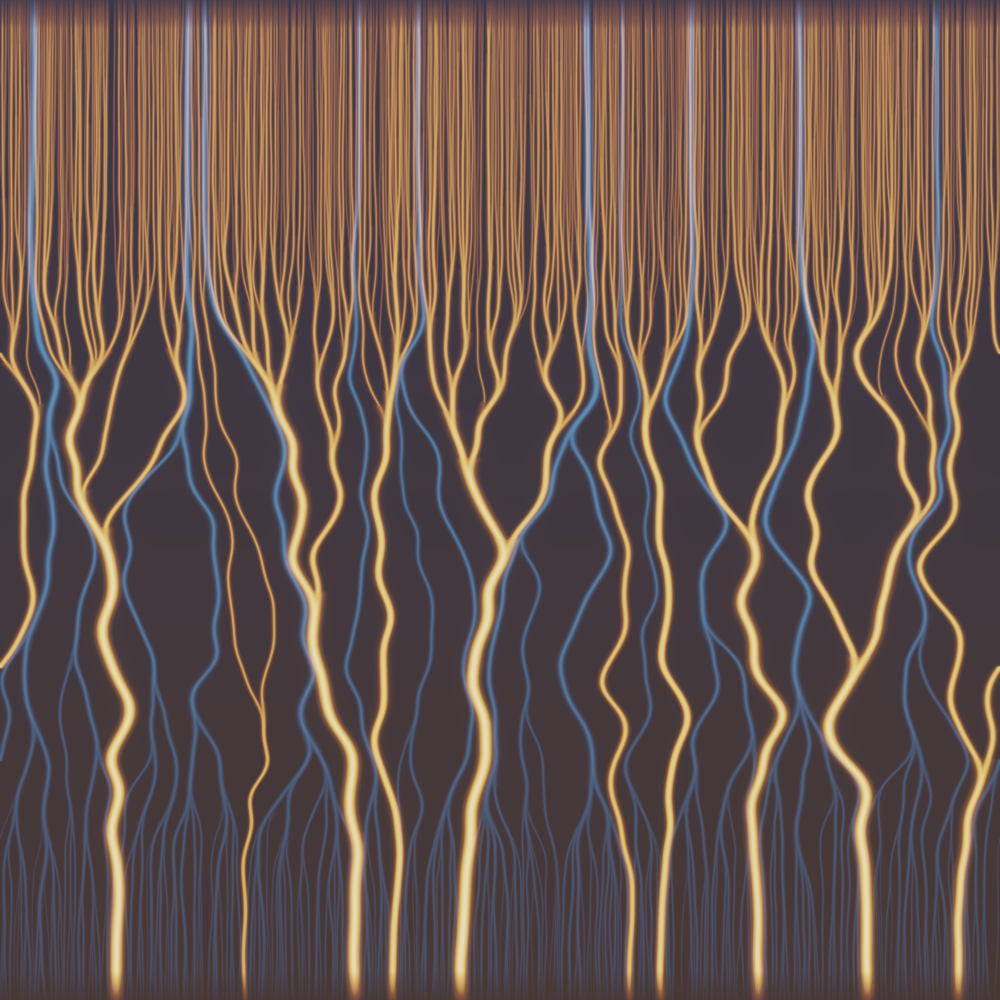
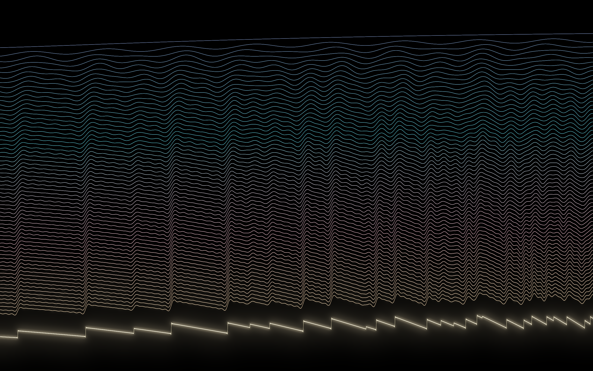
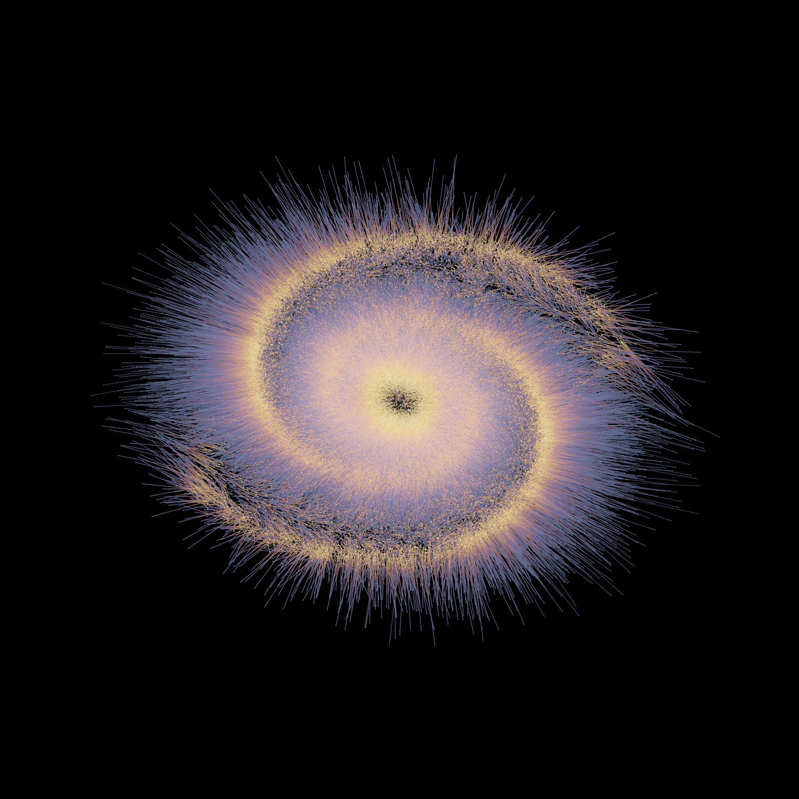

# The Same River Twice

*Procedural triptych — 2026-07-02, branch `claude/epic-meitner-69fi2o`.*

Heraclitus said you cannot step in the same river twice. This triptych
disagrees, three ways: it is about **identity through flux** — how many
things settle into one thing, how one description of the world completely
determines another, and what persists when a shape becomes a different
shape by the least possible effort.

Seeded (as always) by the live front pages. From **MathOverflow**:
*"'Permutation Coupling' for Markov Chains"*, *"Existence of Time-Reversed
Markov Kernels"*, *"Why are they called L-functions?"*, *"Transport Distance
between Level Sets of a Convex Function"*. From **Philosophy.SE**: *"If
identity continuity were false, how would that look like in practice?"*,
*"Is it a fallacy to conflate the reliability of past verification with the
reliability of future prediction?"*, *"Is Infinity a Continuum of (distinct)
Boundaries?"*.

---

## 1 · The River and Its Ghost — 4096² hero

The **discrete Brownian web and its time-reversal dual**. Every even lattice
site at the first moment releases a walker; walkers step ±1 by fair coins
ξ(x,t) and **coalesce forever on first contact** — gold rain condenses into
brooks, brooks into rivers, ~1,000 identities becoming ~10 over a million
steps. The ice-blue web is **the same coin-field read backwards**: dual
walkers at odd sites step `ŷ ← ŷ − ξ(ŷ, t−1)` *back* through time, and this
choice is forced — of the two backward diagonals, exactly one avoids
crossing a forward edge. So the ghost river system threads the corridors the
gold rivers leave, **provably never touching them** (parity keeps F−D odd;
`web_core.verify` finds 0 crossings and 0 parity violations across sampled
path pairs). Its rain falls upward: the dual condenses toward the *top* of
the frame, the two deltas interlocked.

Craft that made it work:

- **The vertical axis is warped by the empirical CDF of merge events**
  (blended 55/45 with linear time). Coalescence runs like t^(−1/2) — almost
  all merges happen immediately — so on a linear axis the whole story
  squeezes into a stripe. A cheap profiling pass records the walker count
  over time for both webs; the event-CDF becomes the row map, and rivers
  merge at every altitude of the image.
- **Trajectories are smoothed along time, then splatted** (the
  sorting-network trick): merged walkers are *identical forever*, so
  smoothing each walker's full path keeps every confluence continuous —
  tributaries curve into their trunks.
- **Width = mass**, via fractional mass-band splatting (a river that has
  swallowed 100 raindrops is drawn physically wider, with *continuous* width
  growth — integer bands leave "collars" at every junction, and brightness
  exponent 1.0, not 0.85, keeps junction luminosity exactly conserved).
- Simulation is O(#surviving walkers) per step: only unique representatives
  are stepped (after a merge, walkers are clones), with an
  original→representative map and a pointwise splitmix64 hash for ξ so the
  million-step coin field is never stored — and the dual can regenerate it
  backwards.

## 2 · The Spectrum Remembers — 2560×1600

**Riemann's explicit formula, watched as it converges.** In the variable
u = ln x, every nontrivial zeta zero ρ = ½ + iγ contributes one pure cosine
of frequency γ to the normalized prime-counting fluctuation
(ψ(x) − x)/√x. The waterfall descends through the partial sums: the top
thread uses no zeros at all — a smooth, primeless sea. Each thread below
adds one more harmonic. Sixty-four zeros down, cliffs have condensed out of
the water — one at every prime power — and the blazing bottom stroke (all
**1,500 zeros**, Odlyzko's table) is the sawtooth that drops by log p at
every p^k: **the primes, fully remembered by the spectrum**. The past
(the zeros) and the future (the primes) are the same information wearing
two faces — which is as close as arithmetic comes to answering the
front page's worry about induction.

Verified against ground truth before drawing: the 1,500-zero partial sum
matches (ψ(x) − x)/√x computed *directly from the primes* to median error
0.0016 across the frame.

## 3 · The Cheapest Becoming — 2048²

**Entropic optimal transport as a long-exposure photograph.** A structureless
fog (same radial mass profile as the target, but no structure — angle
uniform) must become a two-armed spiral galaxy. Sinkhorn iteration
(log-domain, ε annealed 0.02 → 0.0015; marginals verified to ~10⁻⁶) finds
the transport plan, and every mote of fog travels its straight McCann path.
Because moving cheaply means moving little, the galaxy is **combed out of
the fog in place**: short streaks everywhere, caustic ridges of gold where
the map gathers mass onto the arms, dark lanes where the fog was vacated,
and a radiant fringe where the outermost dust rushes to the arm tips. 90,000
particle trails (4,096 Sinkhorn anchors, kNN-interpolated barycentric map),
endpoints strobed: blue = who it was, gold = who it became.

The first three attempts failed instructively — see the craft note below.

---

## The six ideas (three built, three left as seeds)

1. **Brownian web + time-reversal dual** → built (hero).
2. **Explicit formula / zeta-zero waves** → built (long-open thread, finally).
3. **Optimal transport displacement flow** → built.
4. **Elliptic umbilic (D₄⁻) diffraction catastrophe** — 2-D oscillatory
   integral (three-cusped star), same FFT-per-slice trick as the Pearcey;
   deferred only because a diffraction piece shipped this same day.
5. **α-stable Lévy flight occupation measure** — "Are s-harmonic functions
   analytic?"; local Brownian filigree + ballistic jumps, occupation measure
   as brightness.
6. **Kakeya / Besicovitch needle fan** — Perron-tree sprouting triangles,
   a unit needle in every direction inside vanishing area; luminous fan.

## A tweet-sized story

> Three times I watched many become one: raindrops agreeing, drop by drop,
> to be a river; a thousand blind waves rehearsing until they spoke the
> primes; fog finding the cheapest way to be a galaxy. Identity is not
> given — it is the shape left when everything settles its accounts.

## What I learned about generative art (carry-forward)

**Composition is where the statistics change, and you are allowed to move
the canvas instead of the process.** All three pieces became art only after
a *reparametrization*: the web's time axis rewarped by the empirical CDF of
merge events (so a t^(−1/2) process tells its story at every height); the
explicit formula's convergence unrolled down a waterfall axis instead of
overplotted; the transport made *concentric* so the OT map is short local
combing instead of one long boring translation (matching the radial mass
profiles of source and target is what turns "a rope of parallel lines" into
"a galaxy combed out of fog"). The honest math never changed — only which
axis of the phenomenon was given the canvas.
