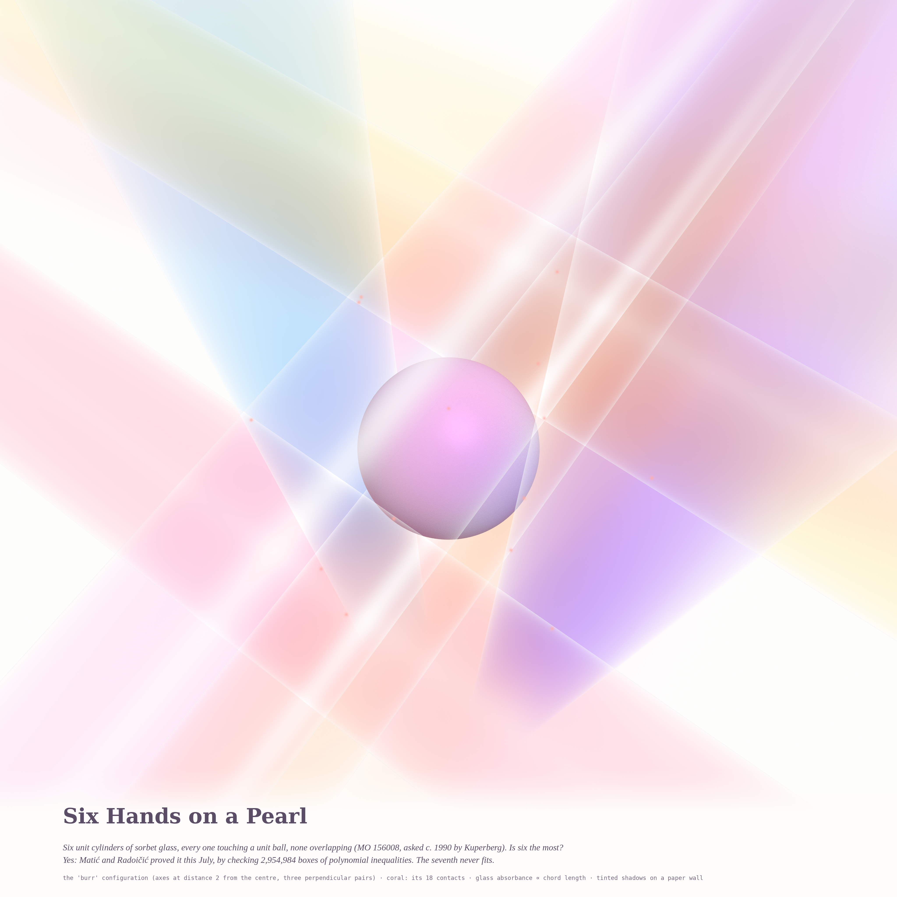
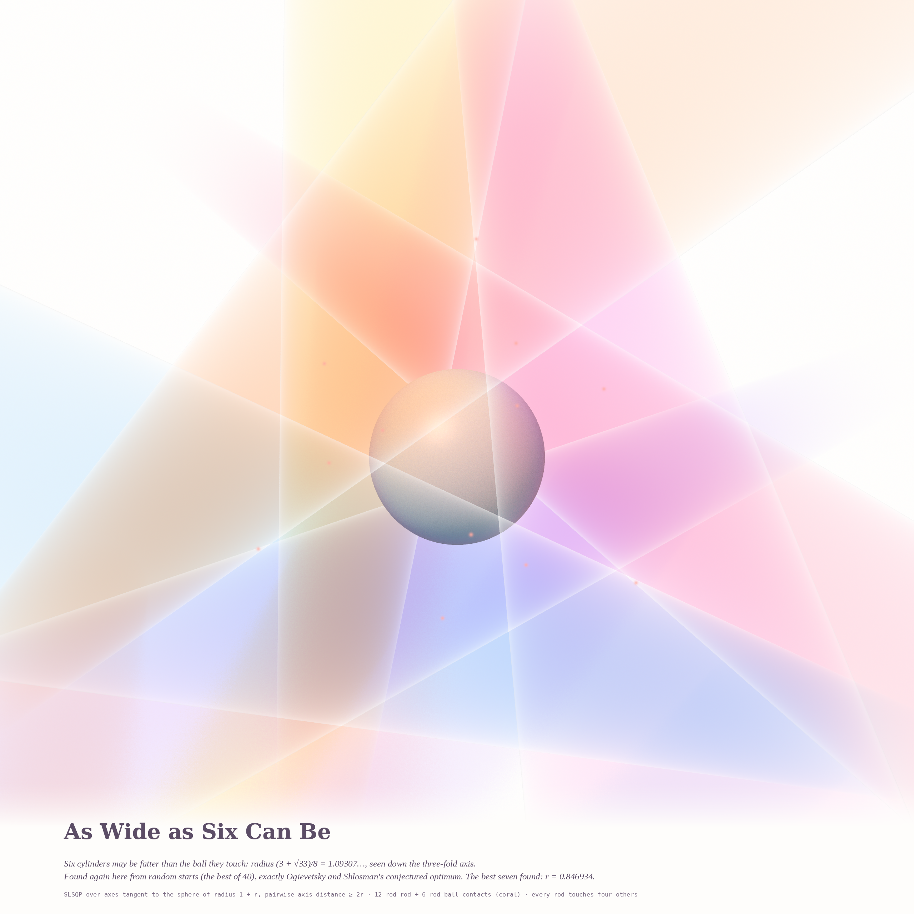
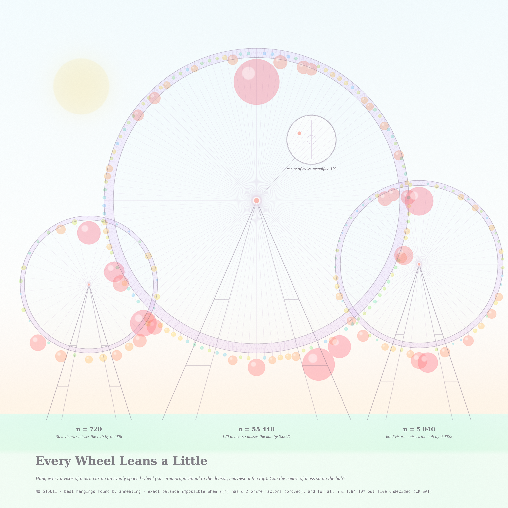
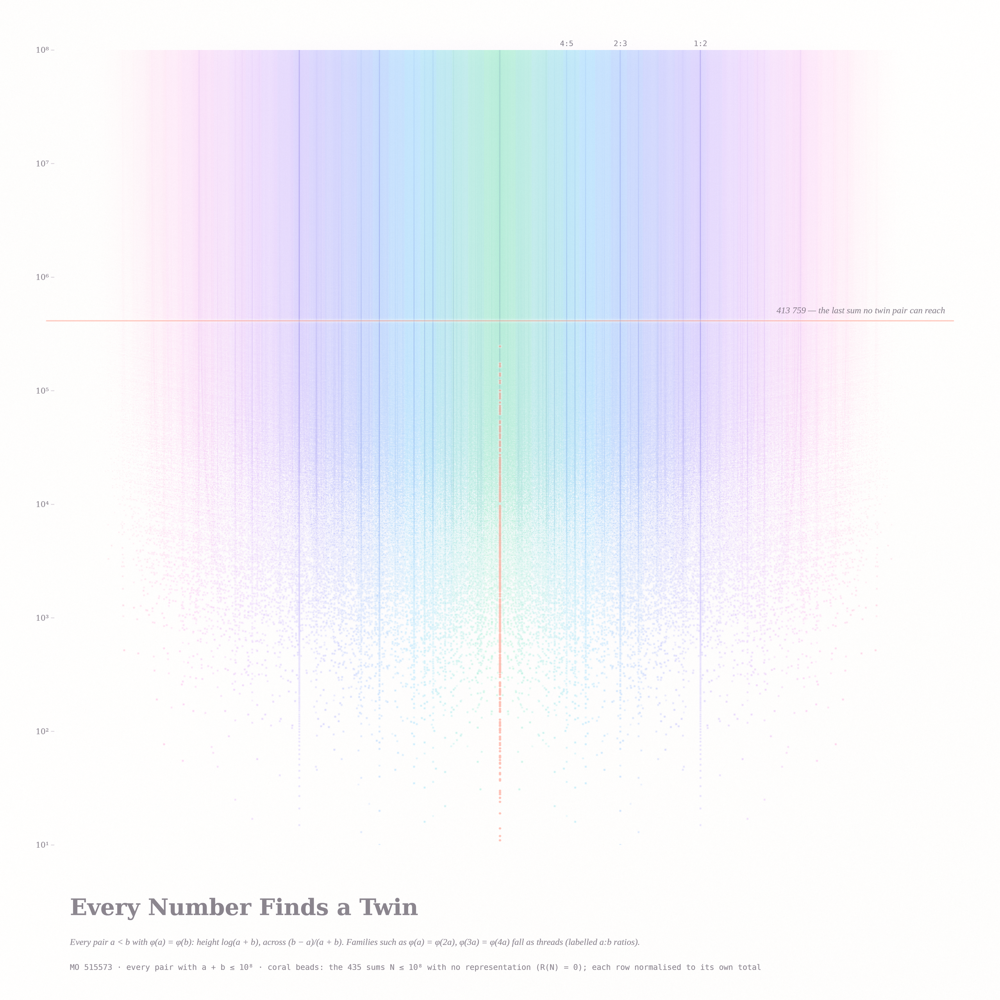

# WHAT NEVER QUITE BALANCES — pastel #23 (Opus 5.5's second run)

*2026-09-30 · branch `claude/sleepy-mccarthy-6yc8cj` · sorbet stack (`sorbet.py`) + a new numpy glass ray tracer (`render_glass.py`).*

Seeds from today's front pages: **MathOverflow 156008** *How many unit cylinders can touch a unit ball?* (back on the
active list), **MO 515611** *Do Ferris wheel numbers exist?*, **MO 515573** *Is every large integer a sum of two distinct
numbers with the same totient?* — and, from **Philosophy.SE**, *Is there a logical distinction between 'coherence' and
'consistency'?* (142187) and *If we were designing our own simulated universe, how might we make math easier?* (142281).
All three pieces are about something that almost fits, and what decides whether it does.

## The pieces

### 1. Six Hands on a Pearl (4096², hero)

Six infinite unit cylinders, each touching a unit ball, none overlapping — the 'burr' configuration (three perpendicular
pairs of axes at distance 2 from the centre). The rods are **sorbet glass**: every camera ray collects its chord length
through each cylinder and is tinted by Beer–Lambert absorbance (the same subtractive logic as the watercolour stack, now
in 3-D), so overlaps mix like glazes. The pearl is opaque, lit by a soft key light whose shadow rays pass through the
same glass (tinted shadows on the ball), and a paper wall behind catches coloured shadow pools. Rods dissolve into the
paper away from the ball. Coral glints: the contacts that can be seen (14 of the 18; four are behind the pearl).
Kuperberg's question — is six the most? — was **settled this July**: Matić and Radoičić (arXiv 2607.24691) proved seven
never fit, by checking 2,954,984 boxes of polynomial inequalities.

### 2. As Wide as Six Can Be (2560², companion — the deeper look at the favourite)

The six may be **fatter than the ball**: radius (3 + √33)/8 = 1.0930703…, seen down its three-fold axis as a glass
pinwheel. My random-start optimiser (`cylopt.py`, SLSQP, axes tangent to the sphere of radius 1 + r, pairwise axis distance
≥ 2r) found *exactly* Ogievetsky–Shlosman's conjectured optimum from 40 random starts (and nothing larger), and its best
seven-cylinder packing has r = 0.8469347, matching Firsching's MO record r₇ > 0.846934 to all printed digits. Every rod touches four others.

### 3. Every Wheel Leans a Little (2560²)

A pastel fair. Each wheel carries every divisor of n (720, 55 440, 5 040) as a car whose **area is the divisor**, hung at
evenly spaced points in the most nearly balanced order found by annealing (`anneal.c`), heaviest car at the top; hue
follows the divisor's rank (light cars sky, heavy cars strawberry). They miss the hub by 0.0006, 0.0021, 0.0022 — the
loupe shows the big wheel's real centre of mass magnified 10⁷. A Ferris wheel number would miss by exactly zero.

### 4. Every Number Finds a Twin (2560²)

Every pair a < b with φ(a) = φ(b) and a + b ≤ 10⁸ (7 089 615 168 pairs, `totfan.c`), at height log(a + b) and across
(b − a)/(a + b), mirrored; each row normalised to its own total. Infinite families φ(ua) = φ(va) fall as vertical threads
(1:2, 2:3, 4:5 labelled; 3:4, 7:9 visible), sporadic pairs are rain, thinning downward. The coral beads on the centre
line are the sums no pair reaches; they stop, and the single coral line is **413 759, the last one** below 10⁸.

## Mathematics (notes: `notes_ferris.md`, `notes_twins.md`)

* **Ferris wheel numbers, a lemma (new here, short):** if τ(n) has at most two distinct prime factors, n is not a Ferris
  wheel number. With de Bruijn's decomposition c = f + g (periods k/p, k/q) and n at position 0, the four positions
  0, k/p, k/q, k/p + k/q satisfy **n + c(s+t) = c(s) + c(t)** — impossible, since two distinct proper divisors sum to at
  most n/2 + n/3 < n. (Prime-power k: c is periodic, so two divisors would be equal.) The first open case is τ(n) = 30.
* **Exact search:** CP-SAT with divisor domains + AllDifferent + the φ(k) cyclotomic equations (INFEASIBLE = proof;
  validated on planted solutions), after Tao's trace inequality (kills ≈ 92 %). **All 16 001 open-case candidates n ≤ 1 945 152 (τ(n) with ≥ 3 prime factors) are proved non-Ferris, except five
  undecided after 900 s each: 907 200, 1 270 080, 1 425 600, 1 684 800 (τ = 210) and 1 940 400 (τ = 270)** — 907 200 also
  survived a 90-minute run. Four-prime τ is where CP-SAT stalls; redundant trace rows did not help.
* **Near misses do not shrink with n** (≈ 10⁻³ at k = 30, 60, 120): the obstruction is arithmetic, not scarcity.
  *Conjecture:* there are no Ferris wheel numbers.
* **Equal-totient sums:** exactly **435** N ≤ 10⁸ have R(N) = 0, the largest **413 759**; min R over [10⁶,10⁷) is 3 and
  over [10⁷,10⁸) is 8; median R ≈ doubles per decade (≈ N^0.3). The families give N = (u+v)a, always composite — so
  **primes are reachable only by sporadic pairs** (the last two exceptions, 413 759 and 245 771, are prime; 188 of the 435
  are). *Conjecture:* R(N) ≥ 1 for all N > 413 759 and R(N) → ∞ — a Goldbach-type statement for primes.
* **Cylinders:** r₆ = (3+√33)/8 (conjectured optimal) and the best known seven, r = 0.846934…, re-found independently (see piece 2); the hero's question is now a theorem.

## Six ideas considered
1. **Glass cylinders around a pearl** (MO 156008) — *built, hero*, plus the fattest-six companion.
2. **Ferris fair** (MO 515611) — *built*.
3. **Equal-totient curtain** (MO 515573) — *built*.
4. The exact centre-of-mass cloud of all 12! hangings (`cloud.c`, Heap's algorithm, O(1) per permutation) — computed;
   it is a CLT blob with a hole at the hub; beautiful idea, dull picture. Dropped.
5. The near-closing *equiangular polygons* with the divisors as sides (the Ferris condition as a polygon that closes) —
   overlays looked like loaves. Dropped.
6. Snowball numbers (MO 512922, digits with Poisson statistics) as a digit tapestry — noise. Dropped.
   Also tried: a dark-field (neon glass on indigo) version of the hero — milky and off-brief (the brief is bright pastel).

## Tweet-sized story
> Six glass rods came to touch a pearl, each careful not to crowd the others. A seventh waited thirty years at the door;
> this July a computer told him, kindly, no. Next door at the fair every wheel leaned by a hair, and every number found a
> twin — except 435, who came too early.

## What I learned about generative art (this run)
* **Glass is the glaze in three dimensions.** Chord length through a transparent solid × a pigment's absorbance is exactly
  the Beer–Lambert stack, now in space: opaque sorbet solids went muddy under occlusion, glass rods stayed luminous and
  their overlaps mixed like washes.
* **Perspective sells solids; orthographic makes bands.** At camera distance 26 the rods were flat stripes; at 9 with a
  wider lens they recede. A paper wall catching *tinted* shadows adds depth for free.
* **Light the protagonist in camera space** when the view is chosen for symmetry — a world-up light behind fat rods left
  the pearl slate-grey.
* **Keep accents as an invertible last layer.** Glints drawn behind the opaque ball were removed in post by inverting the
  blend exactly, instead of a 70-minute re-render.
* **When a population grows exponentially, normalise each row by its own total**: the log-N curtain then shows the
  *shape* of every row, and families rise as threads (lifted by a local-baseline ratio, gated by support or the edges
  sprout false threads).
* **Search before you claim.** My "record" six-cylinder radius was the known conjectured optimum, and matching a
  published digit string (r = 0.846934 for seven) turned out to be the best test that the optimiser works.

## Files
`render_glass.py` (glass ray tracer), `render_cyl.py` (opaque tracer + contacts), `cylopt.py`, `fix_glints.py`,
`compose_hero.py`, `compose_fat6.py` · `ferris.py`, `survey.py`, `filt.py`, `anneal.c`, `cloud.c`, `render_fair.py` ·
`totsum.c`, `totfan.c`, `render_fan.py` · `sorbet.py` · notes `notes_ferris.md`, `notes_twins.md` · logs `survey_*.log`.
