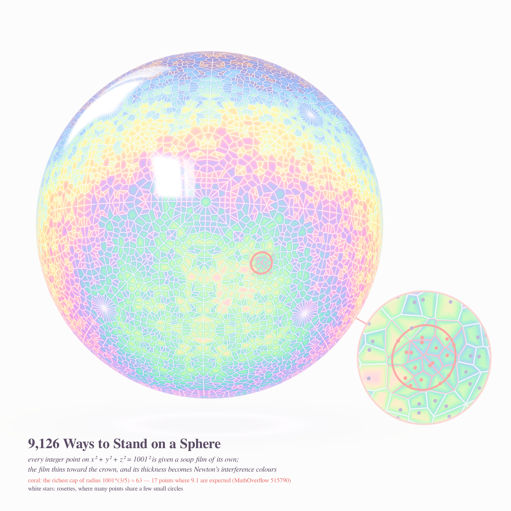
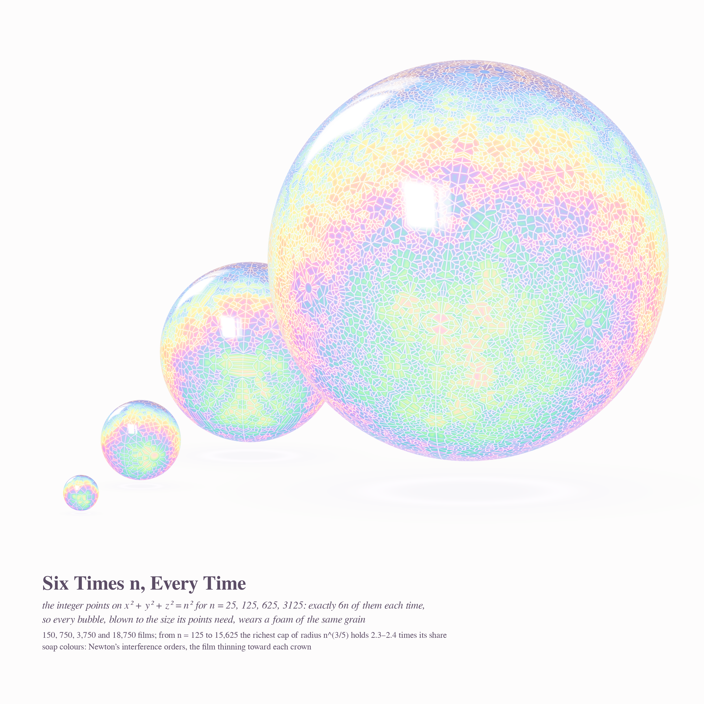
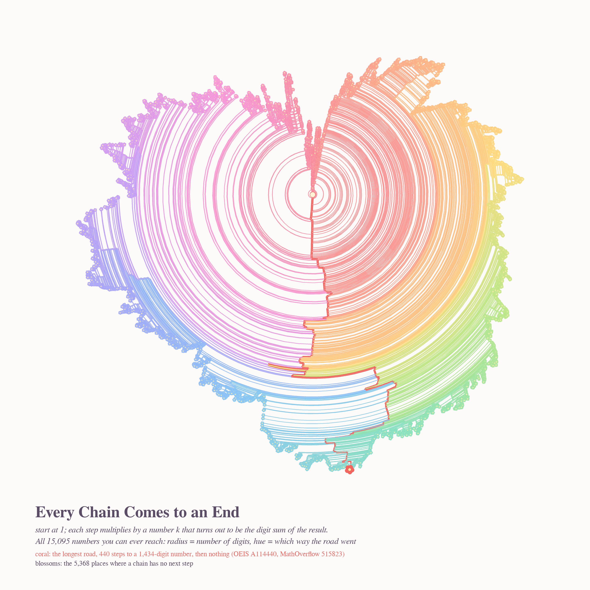
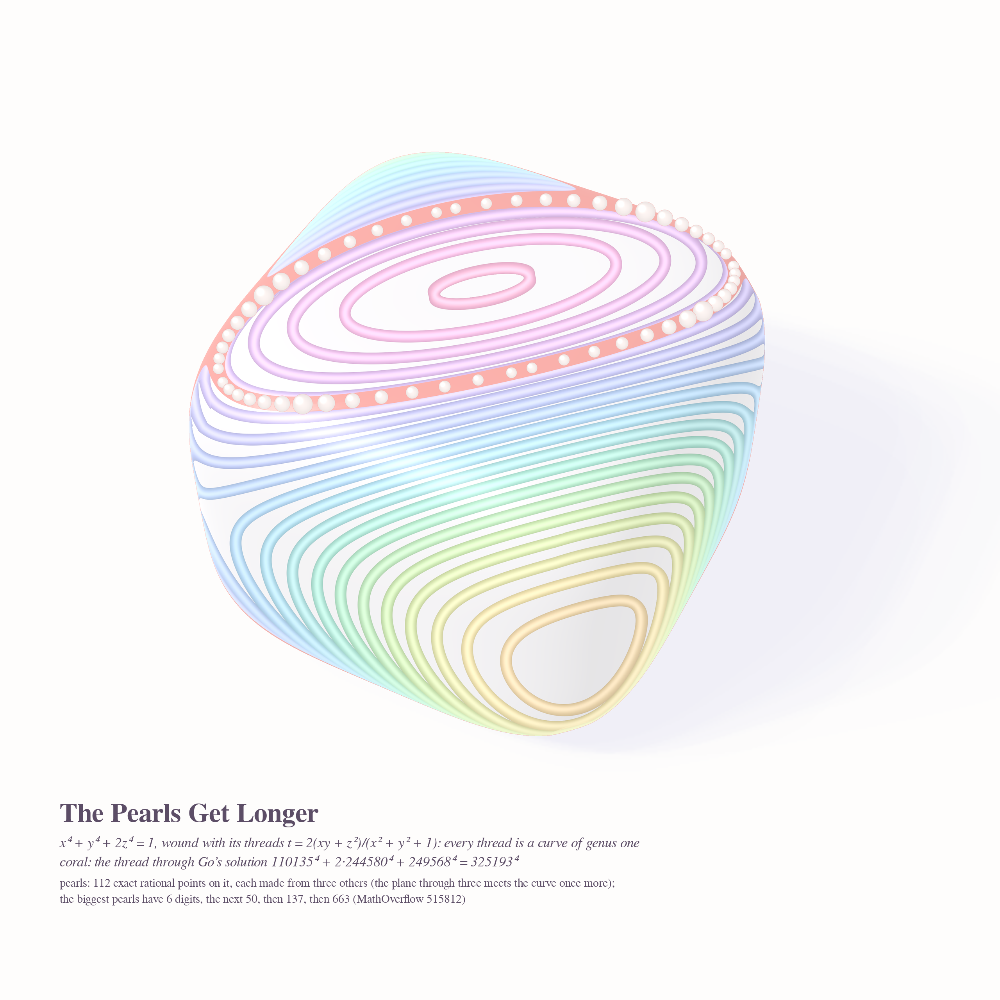

# WHAT COMES NEXT — pastel #31 (Opus 5.5, run 10)

Seeded by Philosophy.SE 142428 *"After one reaches the ultimate purpose, what comes next?"* and three
MathOverflow questions from the live front page: 515790 (integer points on spheres in small caps),
515823 (must the chain aₙ = aₙ₊₁ / s(aₙ₊₁) end?) and 515812 (the new family 2a⁴ + c⁴ + d⁴ = e⁴).

New register this run: **soap film**. Real thin-film interference (`film.py`: a water film's reflectance
integrated against analytic CIE matching functions), so the colours are Newton's orders. They come out
pastel without any tinting.

| piece | size | object |
|---|---|---|
| **9,126 Ways to Stand on a Sphere** (hero) | 4096² | every integer point on x²+y²+z² = 1001² gets its own soap film (spherical Voronoi), with a loupe on the richest small cap |
| **Six Times n, Every Time** (go deeper) | 3200² | the same foam for n = 25, 125, 625, 3125, each bubble sized so the grain stays the same |
| **Every Chain Comes to an End** | 2880² | the whole finite tree of chains 1 → … , each step multiplying by the digit sum of the result (15,095 numbers) |
| **The Pearls Get Longer** | 2560² | the quartic x⁴+y⁴+2z⁴ = 1 wound with its pencil of genus-one curves, plus 112 rational points as pearls |

### 9,126 Ways to Stand on a Sphere

### Six Times n, Every Time

### Every Chain Comes to an End

### The Pearls Get Longer

## How they are made
- `film.py`: reflectance sin²(2π n d cosθₜ/λ) over 380–780 nm, Wyman–Sloan–Shirley CIE fit, to sRGB, then mixed toward paper.
- `render_foam.py`: ray-sphere per pixel. The two nearest lattice directions (KD-tree) give the cell and its distance to
  the border. Thickness comes from drainage (thin crown), log cell area and a slow swirl. Each cell is slightly domed so
  it catches its own highlight. White plateau borders, two reflected windows, a coral cap and a magnifying loupe.
  `render_bubbles.py` composes several bubbles. `caps.py` searches the richest cap.
- `harshad_tree.py`: children of a are the k > 1 with s_b(a·k) = k. The search is bounded by k ≤ (b−1)·digits and
  filtered by k(a−1) ≡ 0 mod (b−1). `render_tree.py` is a radial dendrogram with radius = digits^0.6 and blossoms at the leaves.
- `quartic_pts.py`: exact rational points on one fibre. Four points of a curve cut out by two quadrics are coplanar, so the plane
  through three known points gives a fourth. With the three points as the plane's basis, the two restricted conics are
  linear in (1/u, 1/v, 1/w), and one cross product gives the new point. `render_quartic.py`: bisection ray-march of the
  quartic, strands at equal steps of t = 2(xy+z²)/(x²+y²+1) with a constant pixel width.

## Mathematics (computed this run)
- **Small caps (MO 515790).** For n = 5^k the sphere carries exactly 6n points. The richest cap of radius n^{3/5}
  found by search (every point and 200k random centres, so a lower bound for the sup) holds 9, 13, 18, 24 points for
  n = 125, 625, 3125, 15625. The expected counts are 3.9, 5.4, 7.5, 10.4. The ratio stays at **2.28, 2.39, 2.40, 2.32**,
  far below the n^{2/5} = 6.9 … 47.6 of the "one point per cell" bound. Other n: 1001 → 17 (exp. 9.1), 1105 → 16, 4095 → 33.
  *Conjecture:* for r = n^{3/5}, sup_C N(n, C) ≍ n^{1/5}, i.e. a bounded multiple (≈ 2.5) of the expected count,
  in line with Bourgain–Rudnick. This sampling cannot rule out rare richer caps; an exhaustive search over centres
  in circumcircles of triples would settle it for each n.
- **The chain tree (MO 515823, A114440).** It is finite in bases 3, 4, 5, 6 and 10 (604, 173, 73, 6,592 and 15,095 nodes; depth
  74, 41, 15, 278, 440). Base 10 reproduces OEIS's 15,095 terms and its 1,434-digit last term. *Heuristic:* once a
  is ≡ 0 mod 9, a child needs k ≡ 0 mod 9 and P(s(ak) = k) ≈ 9/σ on that class. Summed over the window that is
  **mean 1**, so the tree should behave like a critical Galton–Watson tree with Poisson(1) offspring. The data agree.
  In base 10 the offspring frequencies at depth ≥ 3 are 0.356, 0.379, 0.192, 0.058, 0.011, 0.003, against Poisson(1)'s
  0.368, 0.368, 0.184, 0.061, 0.015, 0.003. The heights are 1.2–1.4 × √(2πN), the mean height of a random tree of the same size.
  So finiteness is almost surely "true for the same reason a fair family name dies out". That explains why no explicit
  proof is easy: there is no monotone quantity, only criticality. The same picture predicts heavy-tailed tree sizes
  (P(N) ~ N^{-3/2}) across bases.
- **2a⁴+c⁴+d⁴ = e⁴ (MO 515812).** The fibre through Go's solution (t = 0.96918) contains the 8 symmetric images of it
  (6 digits). The first round of coplanar fourth points gives 16 points of height ≈ 10^{49.4}, which matches the 50-digit
  solution in the question. Later rounds give 10^{137} and 10^{663}. All 112 points are verified exactly on both quadrics.
 

## Tweet
> A soap bubble learned it had exactly 6n places to stand. A chain of numbers learned every road ends,
> as surely as a family name. A string of pearls learned each new one is longer than the last.
> They asked what comes next. The film just got thinner and changed colour.
