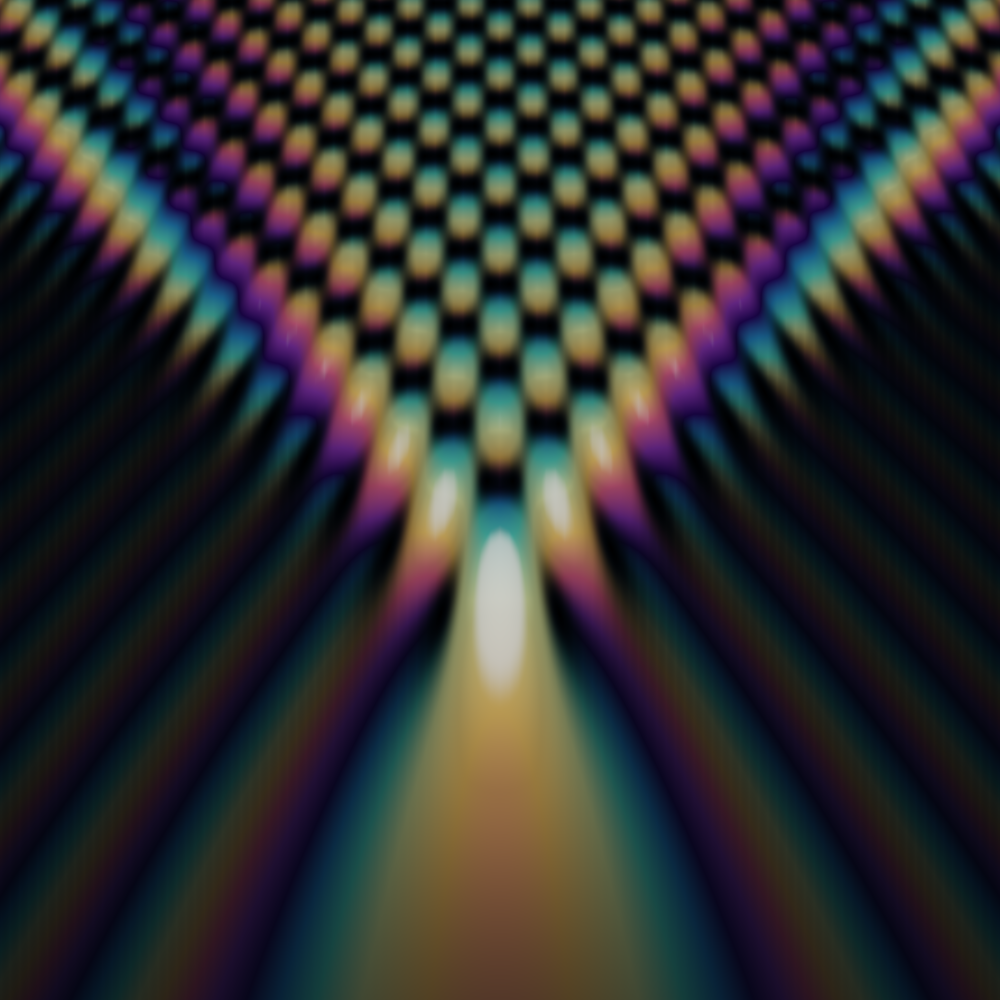
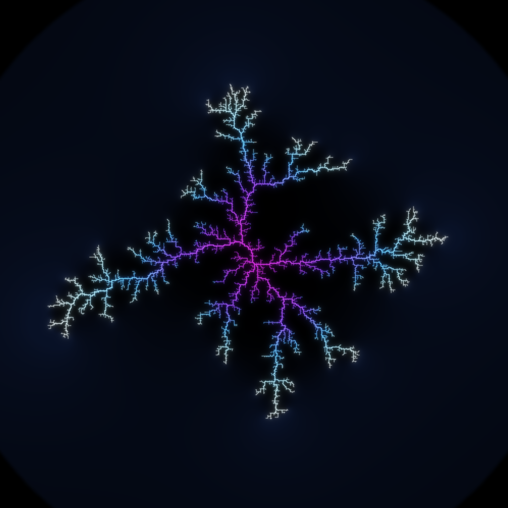
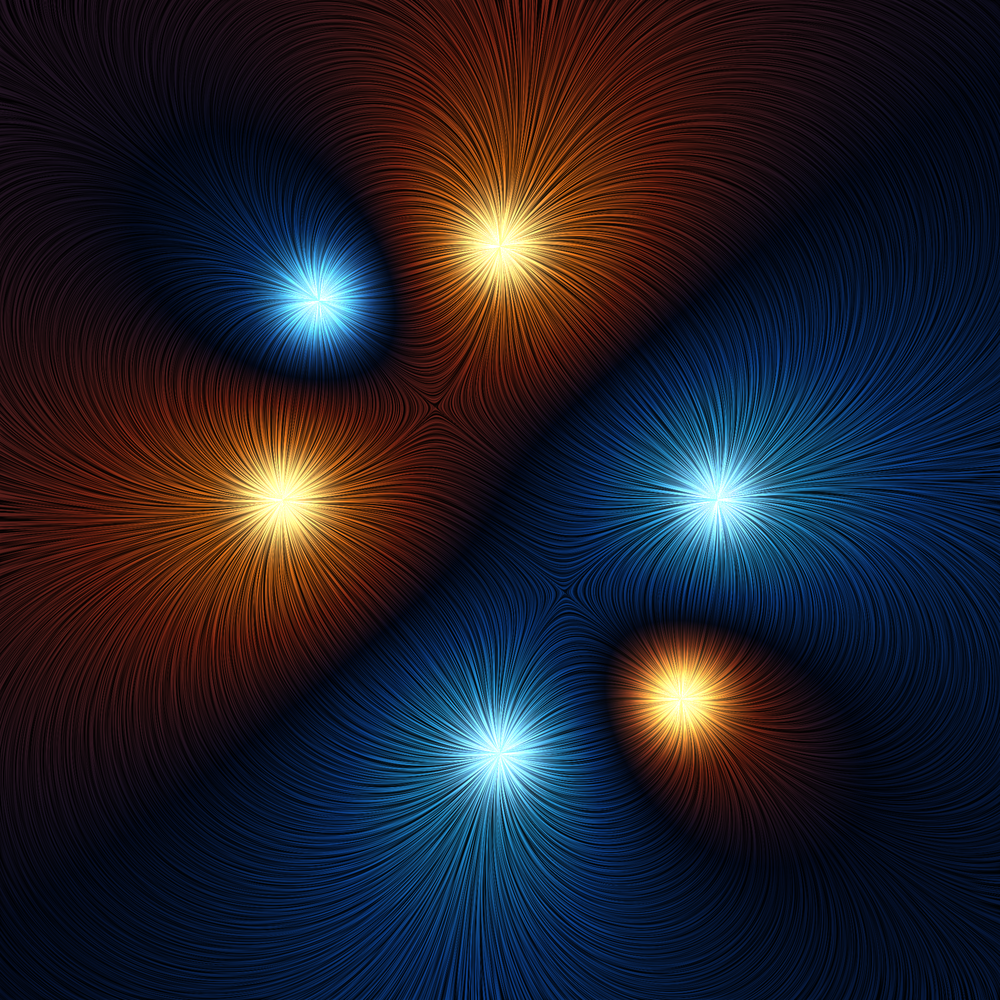

# Where the Field Folds

*Three fields — light, charge, flow — each smooth almost everywhere, each
remembered only for the measure-zero skeleton where it goes singular.*

A physical field spends nearly all of itself being calm: the intensity of
light, the potential of a charge, the direction of a flow are, at almost every
point, boring and smooth. But every such field has a thin scar — a set of
measure zero — where the smoothness breaks and the whole structure organizes
itself. Geometric optics diverges to infinity on a **caustic**. An electric
field concentrates without bound at a discharge **tip**. A flow's basins are
divided by a razor **separatrix** running through a point where the field
vanishes. This triptych is three ways of photographing that skeleton.

Each piece is a **density / phase field** rendered so that *brightness (or hue)
is a measured quantity*, not a drawn shape — a wave amplitude, a growth age, a
convolved streamline. Three physical registers (wave / growth / flow), three
new techniques, one idea.

Seeded by the live front pages of MathOverflow (*"Is there a subset of the
plane whose intersection with every line is countable, yet has positive outer
measure?"*, *"Why are polynomials of degree 24 with 20 real roots hard to
find?"*) and Philosophy.SE (*"Can starting and ending boundary of a set have
different definitions?"*, *"Is Infinity a Continuum of distinct Boundaries?"*,
*"Should we always prefer a coincidence with a known mechanism over an
explanation with none?"*).

---

## 01 · The Fold of Light — *Pearcey cusp diffraction catastrophe*  (hero, 4096²)

The **Pearcey integral** is the wave-optics dressing of the simplest curved
caustic — the **cusp** (Thom's catastrophe A₃):

> Pe(x, y) = ∫₋∞^∞ exp( i ( t⁴ + y·t² + x·t ) ) dt

Ray optics predicts an *infinite* intensity along the semicubical caustic
`8y³ + 27x² = 0` — the bright fold where families of rays touch. Wave optics
refuses the infinity: it replaces the divergence with a finite but exquisitely
structured field — an **interference lattice** of Airy fringes filling the
illuminated region, two caustic arms, a blazing focus at the cusp point, and an
**exponentially dark shadow** beyond. This is the exact mechanism that colours
the bright net of light on the floor of a swimming pool.

- **Colour is the phase, `arg Pe`** — mapped through a curated cyclic thin-film
  palette. The iridescence is not decoration: it *is* the wavefront. Saturation
  rises with amplitude, so the shadow stays a clean dark field (negative space)
  while the fringes glow, and the true foci bloom white-hot.
- **Computed as a Fourier transform.** At fixed `y`, `Pe(·,y)` is the FT of
  `exp(i(t⁴+y t²))`, so one FFT per row gives every `x` at once — ~50× faster
  than the naive rotated-contour quadrature, and cross-checked against it to
  ~1%. `Pe` is even in `x` (proven by `t → −t`). Rendered at 8192² and
  downsampled 2× for anti-aliasing of the finest fringes.

`pearcey_fft.py` · `pcolor.py` · `hero_field.py` → `hero_final.py`

---

## 02 · The Reach of the Spark — *dielectric breakdown (Lichtenberg figure)*  (2048²)

A charged dielectric discharges along a branched fractal — the **Lichtenberg
figure** captured in a block of acrylic. This is the **η-model** of dielectric
breakdown (Niemeyer–Pietronero–Wiesmann): the discharge tree is held at
potential 0, the far boundary at 1, and Laplace's equation `∇²φ = 0` is solved
in the gap. Growth is stochastic and greedy at the **tips**, where the field
concentrates: a new cell is added to the perimeter with probability

> pᵢ ∝ φᵢ^η        (here η = 1.4)

after which the field is re-solved and the process repeats — 8 500 times. The
tree is the moving **boundary** between the discharged region (an equipotential)
and the virgin dielectric, and it grows precisely where `|∇φ|` is largest.

- **Warm-started SOR.** Re-solving Laplace from scratch each of thousands of
  steps is hopeless; instead a red–black over-relaxation is *warm-started* from
  the previous solution (a few sweeps suffice, since one added cell barely
  perturbs the field), with a full re-solve every 110 steps.
- **Rendered as tapered strokes.** The model runs on a coarse 620² grid but
  records a **parent pointer** per cell → a tree. Subtree sizes give each
  branch a width `∝ log(descendants)` (thick trunk, hair-thin tips); age gives
  the colour (magenta core → blue → electric white tips); glowing bloom and a
  faint cool haze of `|∇φ|` (the field pooling around the figure, waiting to
  break through) complete the "trapped-in-glass" look.

`dbm2.py` → `dbm_grow2.py` → `render_dbm.py`

---

## 03 · The Line Between — *electrostatic field lines by Line Integral Convolution*  (2048²)

Six point charges (three sources, three sinks) in the plane. Their field lines
are made visible by **Line Integral Convolution**: a white-noise texture is
smeared along each streamline of `E = Σ qᵢ (x−pᵢ)/|x−pᵢ|²`, so the noise
correlates *along* the flow and decorrelates *across* it — silk brushstrokes
that trace the field exactly.

The **charges are the singular points** (the poles where `E` diverges and the
field lines pinch to a star). Between two like charges sits a **saddle** — a
null point where `E = 0` — and through the saddles run the **separatrices**,
the razor lines that divide the plane into basins of attraction. Here they read
as the dark diagonal seam cutting the frame: the boundary between what belongs
to one pole and what belongs to another.

- **Colour is the potential**, `φ = −Σ qᵢ log|x−pᵢ|`, through a diverging
  warm/cool palette — gold sources, blue sinks — so charge reads instantly; the
  LIC texture supplies the luminance (the brushstrokes), and each pole blazes.
- Integrated with RK2 both up- and down-stream under a Hann taper, ~95 steps
  per direction over the whole 2048² grid at once.

`lic.py` · `lic_color.py` · `lic_hero.py`

---

## Coda — the story

> *Light, charge, and flow were each asked where they truly lived. None pointed
> to the calm expanse it filled. Light pointed to the fold where its rays
> pile into a bright scar; charge, to the thin tree it burns to escape; flow, to
> the seam that divides one belonging from another. A field is smooth almost
> everywhere — and honest only on the measure-zero edge where it breaks. We are,
> every one of us, our discontinuities.*

---

*Procedural pixel art, generated end-to-end from mathematics. Part of an
ongoing series; see the `memory` branch for the running craft log.*
