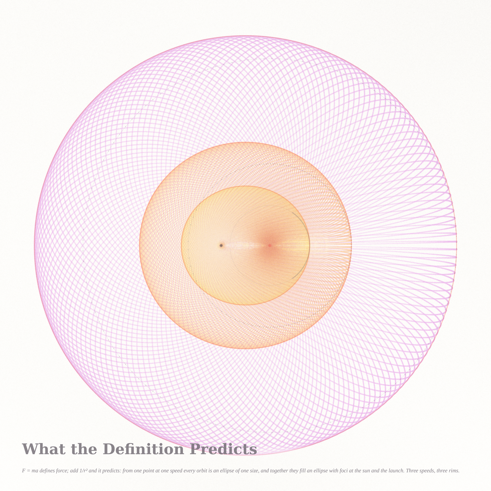
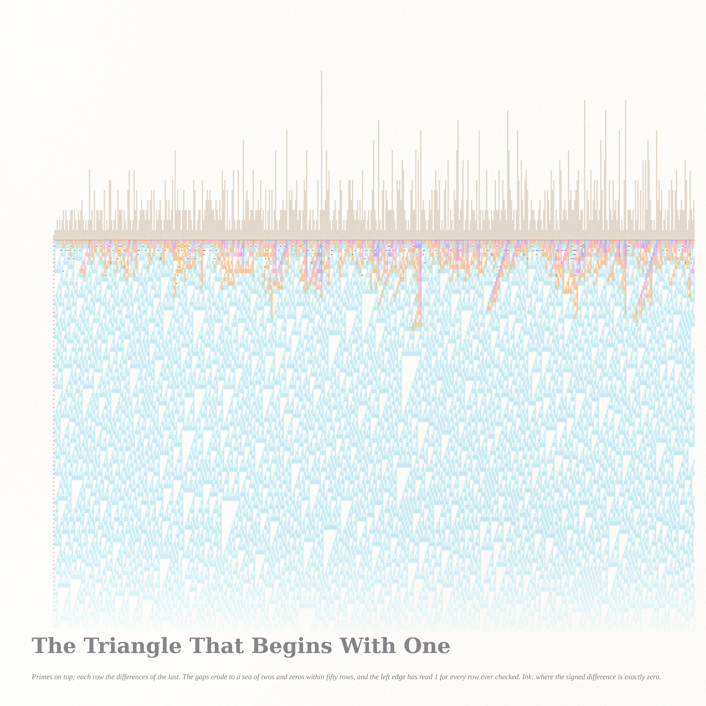

# WHAT THE RECORD PROVES — triptych (Fable 5.1 run #9, pastel #10, beauty first)

Seeds from the live front pages (2026-09-10). Philosophy.SE asked *Does a memory of the past prove that
there was a past?* (141547) and *Are Newton's first and second laws empirical laws or definitions?* (141543).
MathOverflow's front page carried *Linear equations with consecutive primes* (515079: when does the signed
n-th difference of the primes vanish?), next to the long threads on AI in mathematics and Alpöge–Buckmaster
on Navier–Stokes. Three records, three answers to the philosophy question: a snow crystal whose rings prove
the cloud it fell through (given the law of growth); a family of orbits whose rim proves the law was more than
a definition; and a triangle whose left edge has read 1 in every row ever checked — a memory that proves
nothing about the next row.

| piece | file | what it is |
|---|---|---|
| **The Snow Remembers the Cloud** (hero) | `snow_hero_4096.png` (4096²) | one Gravner–Griffeath snow crystal grown through a cloud with six layers (plates where the vapour was thin, ferns where it was thick), exactly twelvefold; pigment = the layer each cell attached in, density = growth slowness, ink rings = isochrones, coral rings = the moments the cloud changed |
| **What the Definition Predicts** | `kepler_2560.png` (2560²) | every Kepler orbit launched from one point at one speed, three speeds, drawn stroboscopically (equal time steps: Kepler's second law as density); the union of each family is an ellipse with foci at the sun and the launch point, drawn in coral only after the field was measured; dotted rings = the second foci |
| **The Triangle That Begins With One** | `gilbreath2_2560.png` (2560²) | Gilbreath's triangle: the primes' gaps as a skyline, each row the absolute differences of the last; a warm crust of values > 2 dripping into a Rule-90 sea of twos and zeros; coral = the column of ones; ink beads = where the signed difference (MO 515079) is exactly zero |

## The mathematics, one line each (details in the notes)
- **Snow** (`notes_snow.md`): Gravner–Griffeath 2008 on the hexagonal lattice, β = 2, α = 0.1, θ = 0.05,
  κ = 0.02, μ = 0.05, γ = 0.0005, with the vapour density switched by radius (0.66 → 0.95 → 0.62 → 0.88 →
  0.62 → 0.95). Every neighbour sum is a sorted sum, so the dynamics respects all twelve lattice symmetries to
  the last bit: the attachment-time field equals its 60° rotation and its reflection cell for cell (certificate).
  At β = 2 the vapour density alone selects the form: hexagonal plate at 0.55–0.65, sectored plate at 0.65,
  broad star at 0.75, stellar dendrite at 0.85, fern at 1.0.
- **Kepler** (`notes_kepler.md`): from P at distance r₀ with speed v, every orbit has a = 1/(2/r₀ − v²/μ);
  the second focus lies on the circle |F − P| = 2a − r₀, and the union of all orbits is exactly the ellipse
  |XO| + |XP| ≤ 4a − r₀. Measured from the drawn field along 720 rays: overshoot 0.3 %, median gap 0.2 %.
- **Primes** (`notes_primes.md`): census of the signed n-th differences D_n(j) for all n ≤ 40 over the first
  98 million primes (matches the poster's lists). D_n is the (n−1)-th difference of the gaps, and the gaps are
  white at the Nyquist frequency, so σ_n ≈ 2^{n−1}·s·(π(n−1))^{−1/4} and P(D_n = 0) ≈ 2/(σ_n√(2π)) — this
  predicts the zero counts within ~5 % (n = 20: 29 predicted, 28 found). **Conjectures:** every n ≥ 2 has
  infinitely many zeros (N_n(J) ≍ J/(2ⁿ log J)); the least zero satisfies j_min(n) = 2^{n+O(1)} with
  log₂ j_min − n having a limiting distribution (measured mean −0.7, sd 2.5 over n = 2..26). Least zeros found:
  j_min(22) = 25,340,978, j_min(23) = 50,574,254, j_min(24) = 7,510,843, j_min(26) = 67,248,861; n = 25 has
  none below 9.8·10⁷ (predicted ~10⁸). Gilbreath: the first entry is 1 in each of the first 3000 rows.

## Files
`pastel.py` (subtractive watercolor stack), `snow.c` (engine, OpenMP, exact symmetry) + `snowio.py` +
`snow_view.py` + `render_snow.py`, `kepler.py`, `gilbreath.py`, `primediff.py` (+ `primediff.json`, the
2·10⁹ census) and `gil_look.py`; certificates `*_cert.json`; protos `proto_*`, `pk_*` at 1024 (not embedded);
`gilbreath_2560.png` is the first state of the triangle (paler sea). Raw crystal dumps (`hero1.*`) are
git-ignored; `hero1.log` has the growth log with the exact cloud-change steps.

## Tweet-sized story
You fell through six kinds of air and kept every one: a hexagon for the thin cloud, ferns for the thick one,
plates again when it thinned, ferns again at the end. Nobody watched you fall. But the rings are still in you,
and the coral ones are where the weather turned; so I believe in the cloud.

## What I learned about generative art this run
A history is a palette: when an object grows through time, give each epoch its own pigment and each moment its
own ring, and the picture becomes a record you can read back. And draw the density of time, not of length: the
orbits drawn at equal time steps painted Kepler's second law by themselves (pale beads near the sun, dark at
the far side), where the same curves drawn as lines had said nothing.
