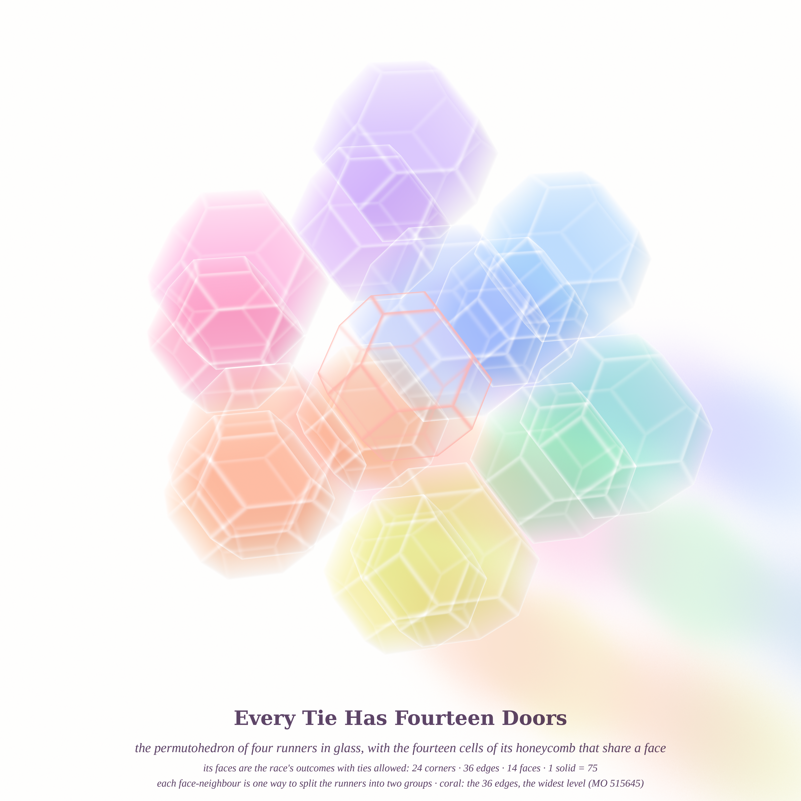
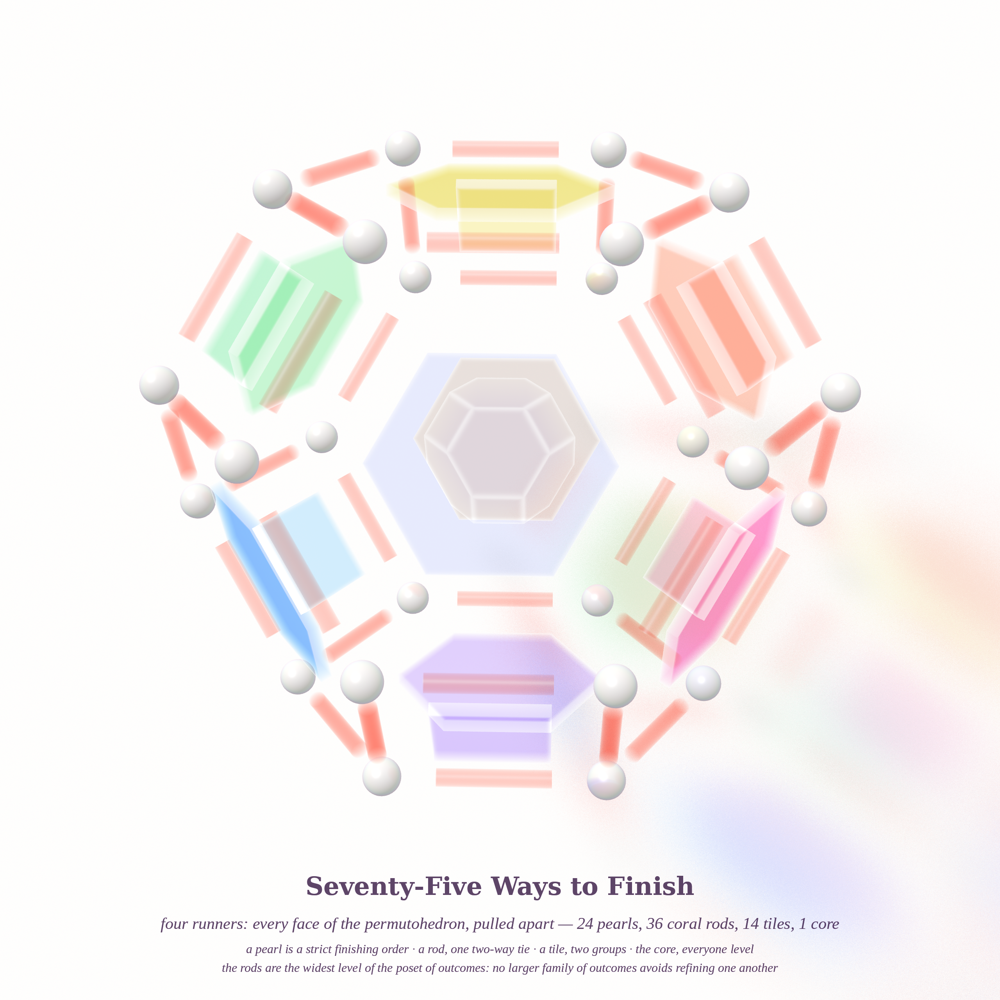
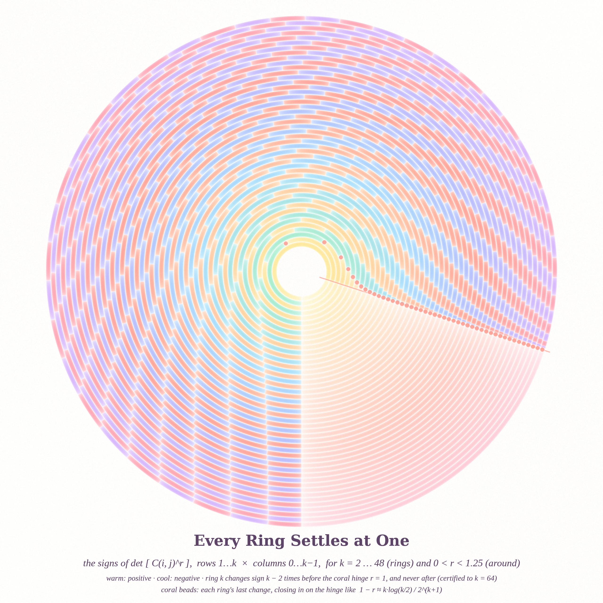
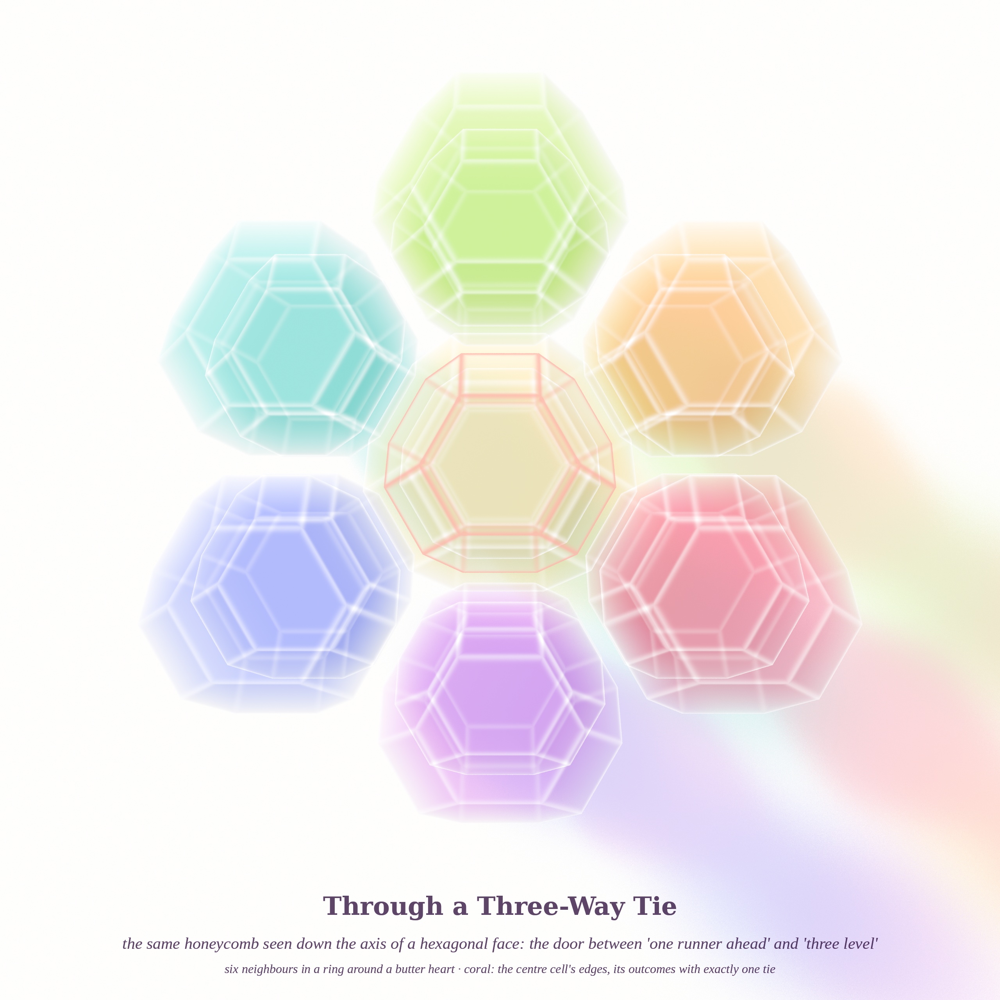

# EVERY WAY TO FINISH — pastel #24 (Opus 5.5, run 3), a quadriptych

Four pictures about orders, ties, and when a positive thing stays positive. Seeds from this morning's
front pages: **MathOverflow 515645** (*is the poset of ordered set partitions Sperner?*),
**MathOverflow 515594** (*are the minors of the Hadamard powers [C(i,j)^r] of Pascal's matrix positive?*),
and **Philosophy.SE 142185** (*does "the limit is zero" refute Zeno, or only a leftover Zeno never claimed?*).

An ordered set partition of four runners is a way a race can end, ties allowed: 24 strict orders, 36 with
one two-way tie, 14 with two groups, 1 where everyone ties — 75 outcomes, the Fubini number. They are
exactly the faces of the **permutohedron** (24 corners, 36 edges, 14 faces, 1 solid), and permutohedra
tile space. Two glass pictures come from that; the third is the Pascal question, which turned out to hide
a small theorem and a surprise (see `notes_pascal.md`).

| # | piece | size |
|---|---|---|
| 1 | **Every Tie Has Fourteen Doors** — the permutohedron in sorbet glass with the 14 cells that share its faces (one per two-group outcome), pulled a little apart; its 36 edges, the poset's widest level, in coral | 4096² |
| 2 | **Seventy-Five Ways to Finish** — the same solid exploded into all 75 faces: 24 pearls, 36 coral glass rods, 14 tinted tiles, 1 clear core | 2560² |
| 3 | **Every Ring Settles at One** — the sign of det[C(i,j)^r] (rows 1…k, columns 0…k−1) as a rose window: ring k, angle r; coral beads = each ring's last sign change, spiralling into r = 1 | 2560² |
| 4 | **Through a Three-Way Tie** — going deeper on the favourite: the same honeycomb seen down a hexagonal door, six neighbours around a butter heart | 2560² |

## Six ideas (built ✔; piece 4 is idea 1 again, seen down a hexagonal axis)

1. ✔ **Glass honeycomb of permutohedra** (MO 515645) — Beer–Lambert chords through 15 convex glass cells,
   hue by each cell's angle around the view axis so overlapping neighbours blend into adjacent sorbet hues.
2. ✔ **Exploded face lattice** — every ordered partition as its own glass object; the widest rank (36 edges)
   is the coral one, because a Sperner-type answer says that level *is* the largest antichain.
3. ✔ **Pascal's rose window** (MO 515594) — exact certified signs of the Hessenberg minors f_k(r).
4. ✗ **Seven runners in the Coxeter plane** — all 16 800 two-faces of the 7-permutohedron as glazes. Prototyped
   twice; the centre turned grey (every hue overlaps there) and a count-ramp made it a pale blob. Dropped.
5. ✗ **Wheeler's one-electron universe** (Phil.SE 142304 "one particle universe") — one worldline, warm
   forward in time, cool backward, coral pair creations. Prototyped; too thin to carry a canvas. Kept as a seed.
6. ✗ **Six circles in a rectangle** (MO 515498, a sangaku) — the diagram image was unreachable; not built.

## Mathematics (details in `notes_pascal.md`)

* **Theorem (via Aissen–Schoenberg–Whitney–Edrei).** C(i,j)^r = (i!)^r (j!)^{−r} · 1/((i−j)!)^r, so
  [C(i,j)^r] is totally nonnegative iff E_r(z) = Σ z^m/(m!)^r generates a Pólya frequency sequence. E_r
  is entire of order 1/r, and an entire PF generating function has order ≤ 1. **So for every 0 < r < 1
  some minor below the diagonal is negative**; the smallest is det[C(i,j)^r]_{i=1..3, j=0..2}
  ∝ 6^r − 2·3^r + 1 < 0 for r < 0.5198….
* **Data / conjecture A.** The Hessenberg minors f_k(r) (rows 1…k, columns 0…k−1) change sign at least
  k − 2 times in (0,1), certified in ball arithmetic for every k ≤ 64 (exactly k − 2 on the grid), and are
  positive on [1, 6]. The last change obeys **1 − r_k ≈ k·log(k/2)/2^(k+1)**: a first-order expansion
  gives 1/T_k with T_k = Σ_m C(k,m)(−1)^m 2^(k−m) log m!, matching the certified roots to 4 digits at k = 40.
* **Surprise (found while writing the caption).** That last positivity is NOT total positivity for r > 1.
  E_{1.2} has the non-real zero −9.3408 ± 5.8363i, and the 10×10 minor rows 2…11, columns 0…9 of
  [C(i,j)^{1.2}] equals −26 911.28…; even at r = 1.003 the 14×14 minor rows 2…15 is −8.19…
  (80-digit determinants, confirmed in arb); a certified census of the minors rows s…s+k−1, columns
  0…k−1 (s ≤ 16, k ≤ 64) finds a negative one at every grid r in (1, 1.72]. Past that the witnesses get
  too big to list, but the reason is visible: by the argument principle E_r has non-real zeros at
  r = 1.8 (10 inside |z| < 1000) and r = 1.9 (38 inside |z| < 12 000, none inside 2 000) — the bad zeros
  escape to infinity as r → 2, and ASWE turns every one of them into a negative minor somewhere.
  Integer r are TN (Laguerre's multiplier sequence 1/n!).
  **Conjecture B: [C(i,j)^r] is totally nonnegative exactly for r ∈ {0, 1, 2, 3, …}** — the Pascal
  version of Schoenberg's "only integer Hadamard powers preserve positivity in every dimension".
  Proven here: fails on (0,1). Certified: fails at r = 1.003, 1.2 (explicit minors) and on a grid of
  (1, 1.72]. Numerically (argument principle, 120–220 digits): fails at 1.8 and 1.9. Open: r between 2 and 3 and beyond (no non-real zero
  of E_2.1 or E_2.5 inside |z| < 2 000).

## Files

* `render_perm.py` — glass permutohedron honeycomb (convex polyhedra by half-spaces, Beer–Lambert, tinted shadows)
* `render_lattice.py` — exploded face lattice (pearls, finite glass cylinders, thin glass prisms, a core)
* `pascal_fast.py`, `pascal_roots.py`, `pascal_pos.py`, `rect_field.py`, `schur_search.py` — certified
  (python-flint arb) sign censuses; `render_fan.py` — the rose window; `compose.py` — captions; `sorbet.py` — paper/pigment stack
* `coxeter.py`, `render_coxeter.py`, `ramp_cox.py`, `one_electron.py` — the dropped ideas, for later

## A tiny story

> Four runners crossed the line seventy-five ways, and a glassblower made each way its own piece of
> glass. Pascal, watching, raised every count to a power and asked whether they would all stay positive.
> At one they all did. Just past one, deep in a ten-by-ten corner, one of them quietly didn't — and the
> glass kept every way to finish anyway.
