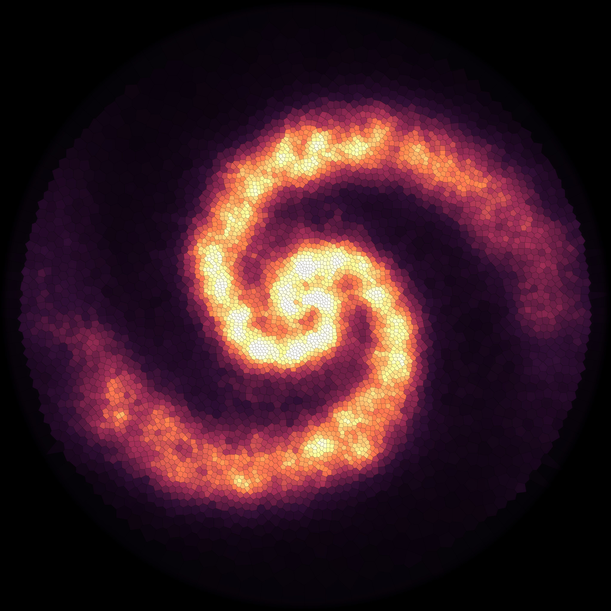
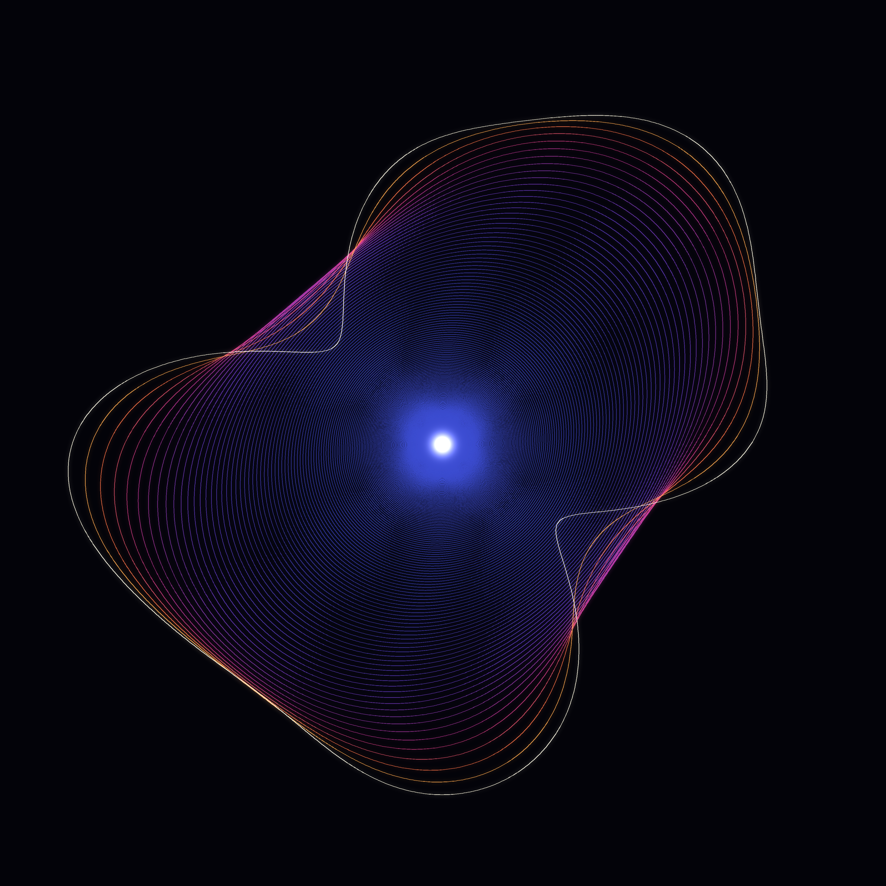
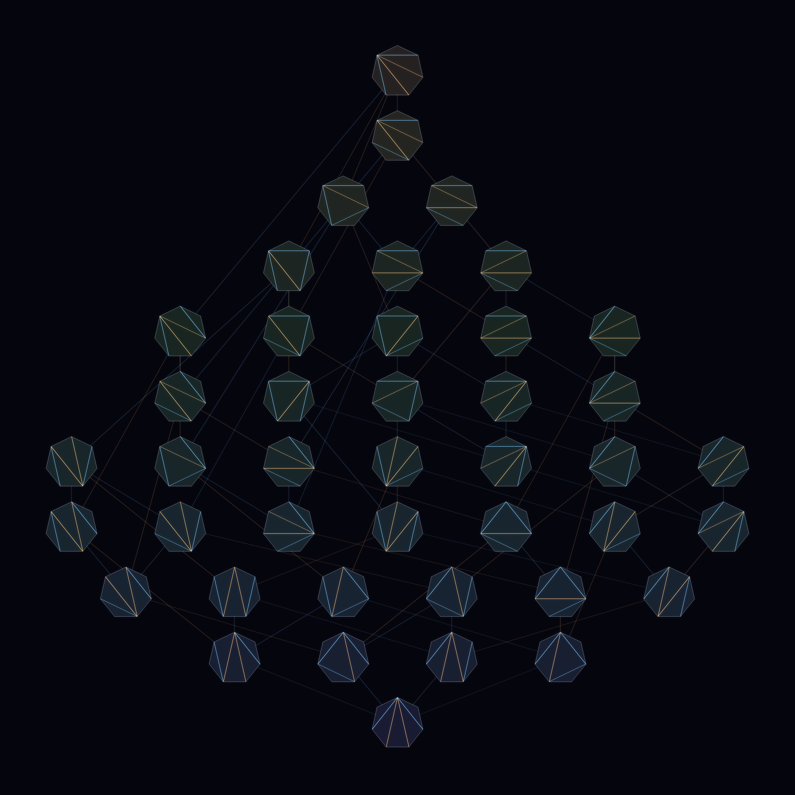

# What the Cost Chooses

*A procedural triptych — three extremal principles, each singling out one
privileged configuration from a whole continuum of alternatives.*

Every piece here is governed by a **cost functional**. Out of uncountably many
ways the world could arrange itself, the cost forbids almost all of them and
elects exactly one: the cheapest map, the roundest shape, the flip-lattice's
spine. The mathematics is honest; the pictures are just what the arithmetic was
reaching for.

Seeded, as this routine always is, by the day's front pages of
[MathOverflow](https://mathoverflow.net/) and
[Philosophy.SE](https://philosophy.stackexchange.com/) — which on 2026-07-07
happened to be arguing about *optimal transport between rotation-invariant
measures*, *isoperimetric problems*, the *Tamari lattice*, and (from the
philosophers) the near-miss fallacy and *"what privileges the real?"* All three
subjects below were sitting on the MathOverflow front page that morning.

---

## I — Where the Mass Goes  ·  **4096 × 4096**
### semidiscrete optimal transport / optimal quantization

The optimal **N-point quantization** of a measure μ is its *centroidal Voronoi
tessellation*: the tiling in which every cell carries equal transport cost, so
cells shrink where μ is dense and swell where it is sparse. It is the fixed
point of **Lloyd's algorithm** and the semidiscrete optimal-transport map from μ
to its best N-point approximation.

Here μ is a symmetry-broken spiral density on a disk and N = 5,600. The
tessellation crowds into the arms (small, bright, high-magnification cells) and
starves in the voids (wide, dark cells). The negative space is not decoration —
it is the transport plan telling you that almost no mass is sent there.

A quiet truth hides underneath: a Brenier optimal map is the gradient of a
*convex* potential, so it is **curl-free — optimal transport can push and
stretch mass but can never swirl it.** The picture looks like a rotating galaxy;
the transport that built it never turned.

## II — The Roundest Shape  ·  2048 × 2048
### curve-shortening flow (Gage–Hamilton–Grayson)

Take any wild embedded loop and let every point drift inward at a rate equal to
its curvature (`∂γ/∂t = κN`). The **isoperimetric ratio** `L²/4πA` falls
monotonically; the curve becomes convex, then round, then vanishes to a single
point. The circle is the unique shape the flow chooses — the isoperimetric
optimum, reached by pure gradient descent on length.

The nested snapshots are spaced equally in *shrinking area*, so they pile up as
the loop dies — the flow's own clock makes the singularity free detail. The
magenta ridges are where curvature (and therefore speed) is highest; the whole
history collapses to the luminous point at the centre: a circle, shrunk to
nothing, still the only shape left.

## III — The Fewest Flips  ·  2048 × 2048
### the Tamari lattice / associahedron

The C₅ = 42 triangulations of a heptagon, drawn as little glyphs and connected
whenever a single **diagonal flip** turns one into another. Oriented by the
Tamari rule (a right rotation of the associated binary tree), that flip graph
becomes a **lattice** — the 1-skeleton of the 4-dimensional *associahedron* —
with one minimum (the all-left fan, bottom) and one maximum (the all-right fan,
top). Nodes are stacked by height (flips from the minimum) and tinted indigo→
amber by depth; edges are coloured by the span of the diagonal that changes.
The long edges that leap across several rows are honest: the Tamari lattice is
*not graded*, so some covers skip ranks. Out of 42 ways to associate, the cost
"number of flips" imposes a single order.

---

### The thread
Transport chooses **where the mass goes**; the isoperimetric flow chooses **the
roundest shape**; the Tamari order chooses **the fewest flips**. Three costs,
three continua, three lonely optima. What privileges the real, the philosophers
asked that morning. Here the answer is small and exact: a cost function does.

### A small story
> Three times I asked a shape to choose. Transport chose where the mass should
> fall, and would not spin to get there. The wild loop chose to become a circle,
> then a single spark. The triangles chose the fewest quarrels needed to agree.
> Every cost is a quiet, ruthless little god — and it loves exactly one world.

*Techniques new to this series: centroidal-Voronoi / semidiscrete-OT
quantization of a measure; curve-shortening flow; the Tamari-lattice Hasse
diagram of polygon triangulations. Rendered with numpy + scipy + Pillow.*
