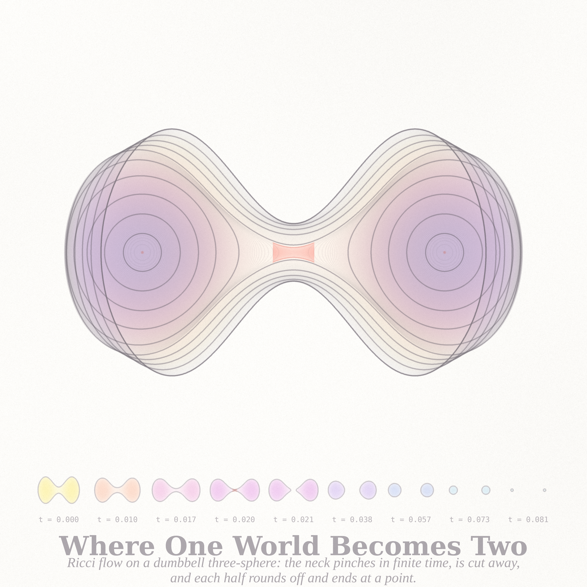
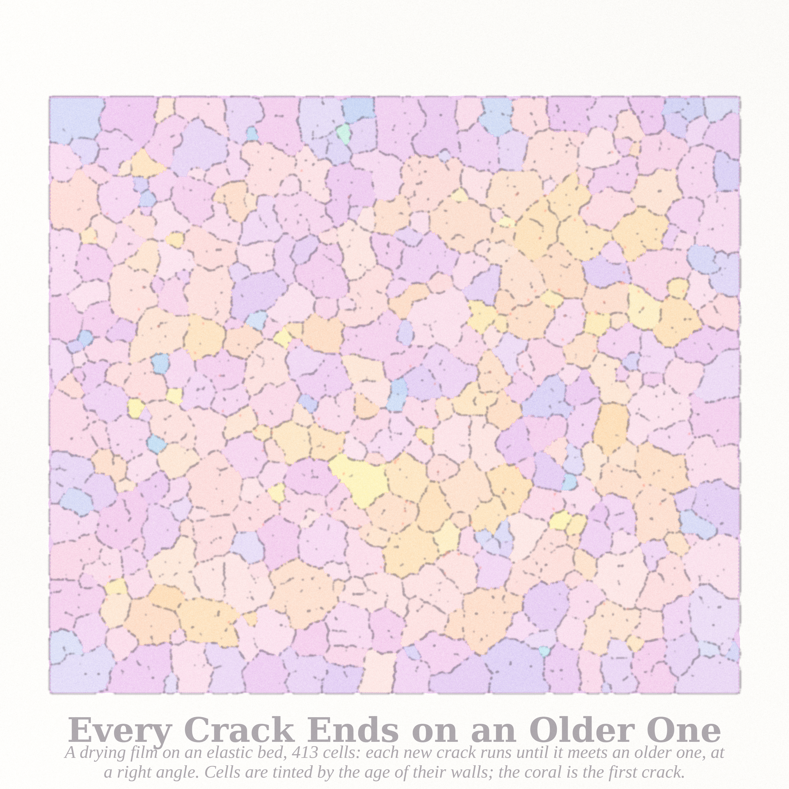

# WHERE ONE WORLD BECOMES TWO — three pictures (run of 2026-09-16, Fable 5.1 run #15, pastel #16)

Seeds from the live front pages (through the Stack Exchange API): Philosophy.SE **"Could the end of one universe be
the beginning of another?"** (141711), **"Why aren't we curious about beyond death?"** (141645), **"If death is
inevitable, is there an objective reason to keep living?"** (141517); MathOverflow **"Is an initial bound missing from
Claim 19.27 in Morgan–Tian's finite-extinction argument?"** (515040) — a question about the chapter of *Ricci Flow and
the Poincaré Conjecture* where every world ends in finite time. Three endings that are beginnings: a three-sphere whose
neck pinches and is cut into two worlds (Ricci flow with surgery — never touched in the 71 previous runs), the sky at
the moment the plasma ended and light began, and a film of paint whose every crack ends on an older one and begins the
cells on either side.

| piece | file | what it is |
|---|---|---|
| **Where One World Becomes Two** (hero, 4096²) | `neck_4096.png` | Ricci flow on a dumbbell S³, solved in the Angenent–Knopf warping equation (linear in ψ² for S³). Every recorded moment is a solid of revolution drawn as glass — pigment density = chord length through the solid, a physically honest x-ray — laid over one another at equal time steps, so the tone is dwell time. The parent drifts lemon → apricot → blush → orchid up to the pinch; the two children orchid → lavender → cornflower → aqua until each ends at a coral point inside its lobe. The coral bowtie is the neck that is cut away. Hairlines are every profile; the film strip beneath is nine moments with their times. Neck law d(ψ²_min)/dt → −2 (measured −1.15 → −1.55 as the window shrinks, the theorem's logarithmic approach); each child a round sphere with d(r²)/dt = −4 to 3 %. |
| **The Last Light** (4096 × 3522) | `sky_4096.png` | The microwave sky at 380,000 years: the Planck-2018 spectrum from CAMB, one Gaussian realisation on 50 million HEALPix pixels, Mollweide. Warm family above the mean, cool below, density by |ΔT|. Below, a 14° window (its footprint is the hairline circle on the ellipse); the coral circle in it is the first acoustic peak, ℓ = 220, 0.82° across — the loudest note of the plasma's last moment. |
| **Every Crack Ends on an Older One** (2560²) | `craquelure_2560.png` | A drying film on an elastic bed: a jittered triangular spring lattice whose rest length shrinks, every node tied to its substrate, bonds breaking past a random threshold, one bond at a time from the crack tip. New cracks run until they meet an older crack, at right angles. Cells are drawn in their deformed positions (the gaps are the real openings, wider on older cracks), each tinted by the age of its walls; ink width by crack age; coral for the first crack. |

## Mathematics (`notes_ends.md`, certificates in `cert_*.json`, `sky_cert.json`)
- **Neckpinch**: for S³ the warping function's square obeys the *linear* equation u_t = u_ss − 2 in arclength gauge
  (the (n−2) u_s²/2u term vanishes at n = 2) — that observation is what made the pole numerics stable. Round-sphere
  test exact to 1e-4. Surgery at ψ_min = 0.02; both children reach the round law d(r²)/dt = −4 and die at t = 0.0823.
- **Sweep**: with these lobes the neck pinches iff its initial radius is below ≈ 0.37 of the lobe radius
  (a = 0.65 pinches at 0.1395, four thousandths before its children would have died anyway; a = 0.60 rounds off).
- **Hypothesis** (stated in the notes): pinch time ≈ ψ₀²/2 once the neck is cylindrical; measured times are ~2× that
  because the neck first has to *become* a cylinder.
- **Sky**: first peak ℓ = 220 → 0.82°; rms 114.5 μK.

## Files
`pastel.py` (subtractive watercolour stack) · `ricci.py` (the flow + surgery) · `run_hero.py`, `sweep_a.py` ·
`render_neck.py` · `sky.py`, `render_sky.py` · `craq.c`, `render_craq.py` · `notes_ends.md`. Records and protos live
in `cache/` (not committed); the certificates are committed as `cert_a85w50.json`, `cert_a80w35.json`, `sky_cert.json`,
`sweep_*.json`.

## Tweet-sized story
You were one world with a waist, and the waist kept thinning; you thought that was the end. Then the cut, and you were
two, each rounder than you had ever been, each with a whole short life still to live. Every ending you have seen was a
neck.

## What I learned about generative art this run
- **Write the object in the variable that is smooth where the picture is delicate.** ψ is a cone at the poles and every
  scheme I tried there fed an error back through the drift; ψ² is even, smooth, and for S³ its equation is linear. Three
  hours of pole instabilities ended in one line of algebra.
- **A glass x-ray is a pastel glaze with a physical meaning**: chord length through a solid of revolution is a density,
  and stacking the solids at equal time steps turns the flow's dwell time into tone. Hue drifting monotonically through
  time (lemon → aqua by way of the pinks) kept the heart from going grey; two families meeting head-on did not.
- **A film strip under a superposition** tells the story the superposition hides (which moment is which); nine small
  glass objects with their times cost nothing and made the hero legible.
- **Two lattice bugs that looked like physics**: an unconverged relaxation and a wrong reverse-bond parity both produced
  confident, structured, wrong pictures (a V-shaped shatter, a shear band). A model's first convincing image is the one to
  distrust; test Newton's third law and convergence before believing a pattern.
- **Cells of a crack network need a raster, not the graph**: unstrained ligament bonds across every crack never break, so
  graph components leak; a raster of the cracks with a morphological closing gives the cells, and the film's own rim closes
  the edge ones.
