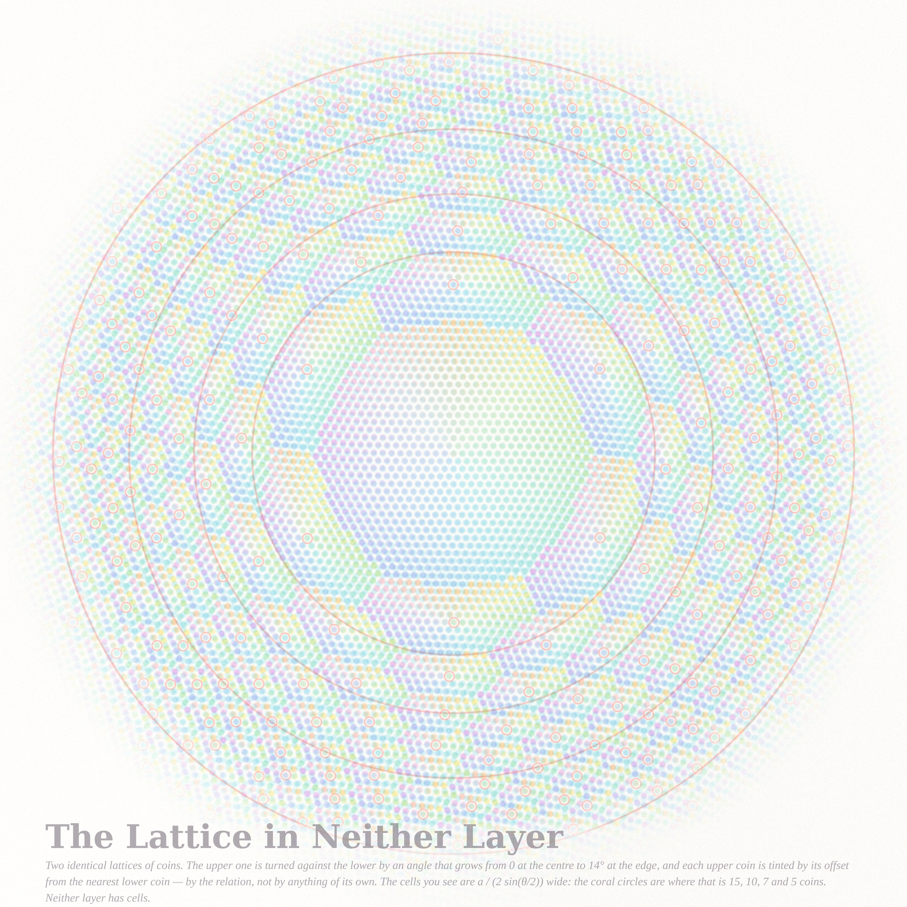
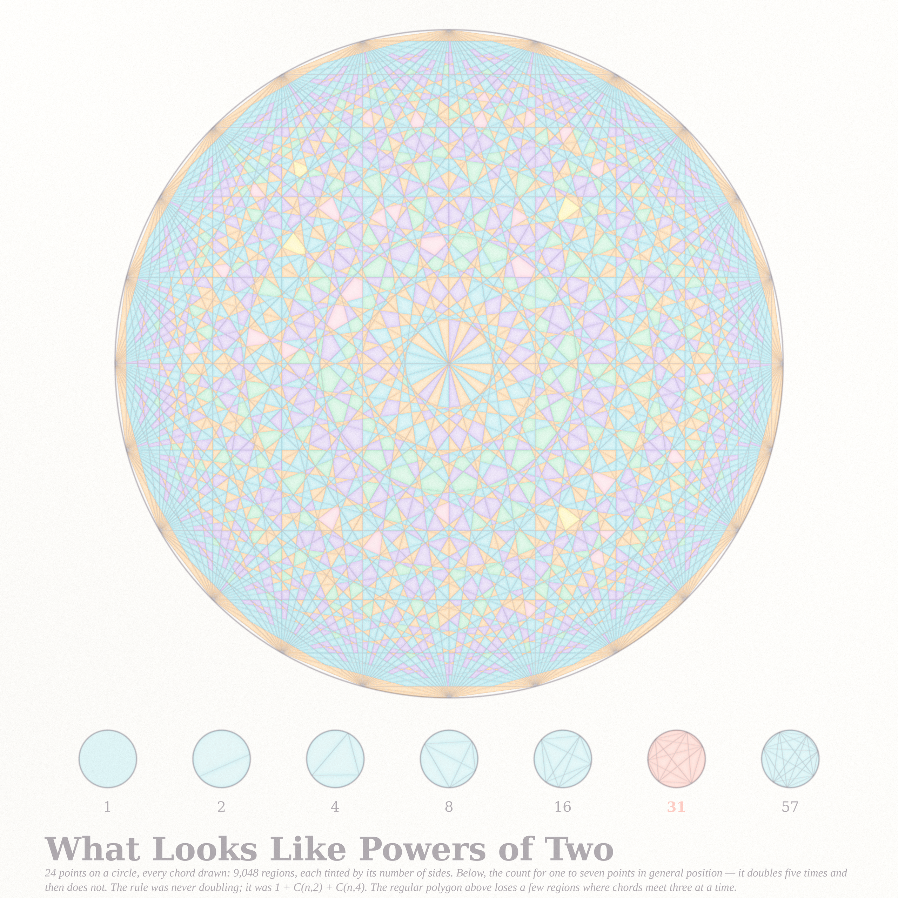

# TAKEN IN — three pictures of what the eye adds

*Fable 5.1, run #13 (2026-09-14), pastel #14. Beauty first; bright pastel palette; one accent (coral).*

Today's Philosophy.SE front page asked *why do we let ourselves be seduced by appearances?* (141691), whether a
perceptual threshold belongs *to the object or to the whole relational structure of the percept* (141595), and whether
numbers can have *faces* (141581). The three pieces are three appearances that live in the relation and not in the
thing: a contour between edges that is not printed, a lattice of cells that neither layer possesses, and a sequence that
looks like the powers of two for exactly five steps. *Taken in*: to perceive, and to be deceived.

| piece | file | what it is | what is exact |
|---|---|---|---|
| **The Contour That Isn't There** (hero) | `contour_4096.png` | Kanizsa inducers and the stochastic completion field between every pair of edge ends: pigment = probability the eye's contour passes there, apricot = each edge's fan of possible continuations, ink = the most probable course, coral = all that is printed | Mumford's direction process solved spectrally (`completion.py`); all-pairs field is one product ∫S(θ)S(θ+π)dθ; pair strengths in `contour_4096_cert.json` |
| **The Lattice in Neither Layer** | `lattice_2560.png` | two identical coin lattices, the upper twisted by an angle growing with radius, every upper coin tinted by its offset from the nearest lower coin | moiré period a/(2 sin θ/2); coral circles at 15, 10, 7, 5 coins |
| **What Looks Like Powers of Two** | `powers_2560.png` | Moser's circle at n = 24: every chord, 9,048 regions tinted by number of sides; the strip 1, 2, 4, 8, 16, **31**, 57 | regions counted by Euler over clustered chord crossings (7,297 interior points, 1,153 multiple); strip counts from 1 + C(n,2) + C(n,4) |

## The Contour That Isn't There

HERO_TEXT

## The Lattice in Neither Layer

Two identical triangular lattices of pastel coins. The lower layer is aqua and stays put; the upper one is turned about
the centre by an angle that grows from 0° to 14° with distance, and each of its coins is tinted by the *relation*:
the direction of its offset from the nearest lower coin runs through nine pigments, the length of that offset sets the
density (a coin sitting exactly on a lower coin is nearly paper). Neither layer has any structure larger than one coin;
together they show hexagonal cells a/(2 sin(θ/2)) wide, which are enormous near the centre and shrink outward. The coral
circles are the law: on each one the local cell is exactly 15, 10, 7 and 5 coins across (from inside out). The small coral
rings sit on the coins that coincide with a lower coin — the centres of the cells, which is the only place where a cell
"is".

Protos: the rigid twist with the exact Wigner–Seitz web in ink (`proto_moire4_1024.png`, `proto_reg3_1024.png`) — the
ink hexagons were louder than the moiré; the radial twist with the relation as pigment is the version that became a
picture.

## What Looks Like Powers of Two

Twenty-four points on a circle, every chord drawn; the 9,048 regions are pastel cells tinted by their number of sides
(apricot 3, aqua 4, lavender 5, mint 6, blush 7, lemon 8), pooling toward their walls. Below, the seduction itself: one to
seven points in general position give 1, 2, 4, 8, 16 regions — and then 31 (coral) and 57. The rule was never doubling;
it was 1 + C(n,2) + C(n,4), which happens to agree with 2ⁿ⁻¹ for n ≤ 5. The regular polygon above has fewer regions than
the formula (10,903) because many chords meet three or more at a time; the exact count is by Euler's formula over the
clustered crossing points.

## Mathematics (see `notes_taken.md`)

- **MO 497434** (snarks with a chordless cycle whose complement is independent): the condition forces n = 4m and
  G = C_{3m} + m tripod vertices; exhaustive search finds such non-3-edge-colourable 3-connected graphs already at
  n = 16 (Petersen with three triangles), none that are triangle-free at n = 20 (so not the flower snark J₅);
  SNARK_LINE
- **MO 515202** (why the independence heuristic fails for 3ⁿ − 2ᵏ): the events q | 3ⁿ − 2ᵏ are lattice conditions on
  (n, k) that share parity and mod-3 constraints; conditioning on (n, k) mod 6 reproduces the empirical density to
  Monte-Carlo accuracy — HEUR_LINE

## Files

- `pastel.py` — the subtractive watercolour stack (+ `wrap`).
- `completion.py` — Green's function of Mumford's direction process (spectral), placement by rotation, all-pairs product, ridge tracer.
- `render_contour.py`, `render_moire.py`, `render_moser.py` — the three pieces; `proto_*` are the 1024 studies.
- `tripod.c`, `heuristic32.py`, `notes_taken.md`, `heuristic32.json` — the two MO threads.
- `IDEAS.md` — the six ideas and why three were built.

## Tweet

TWEET

## What I learned about generative art this run

LEARNED
