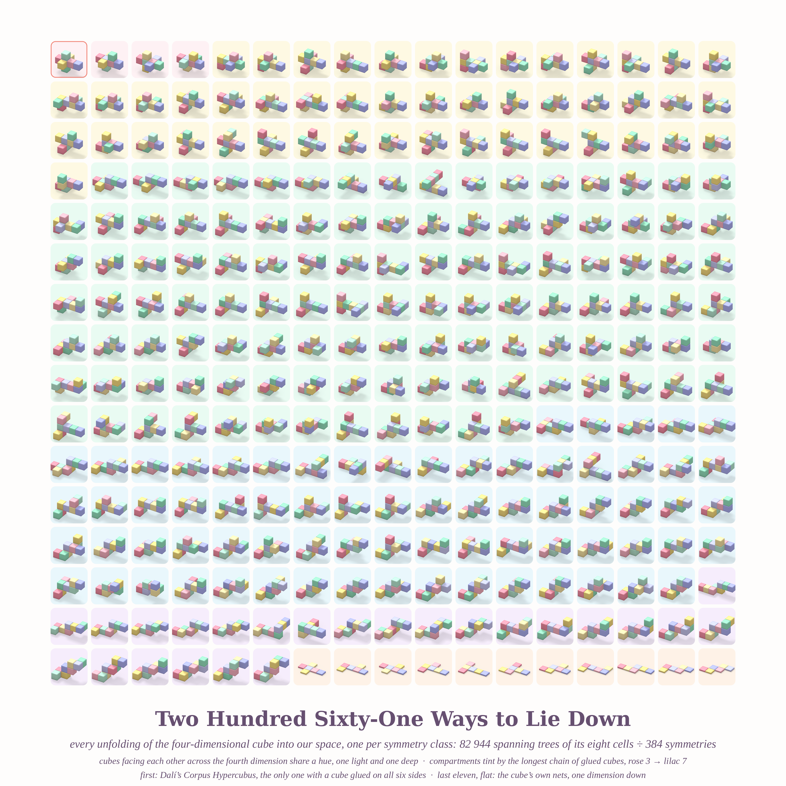
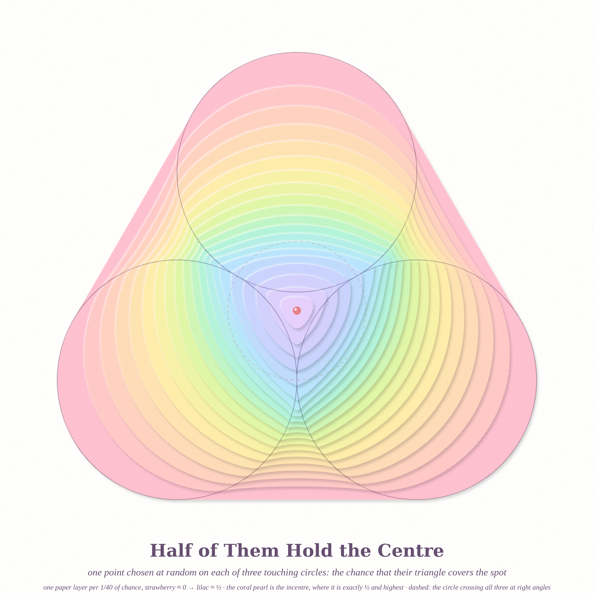
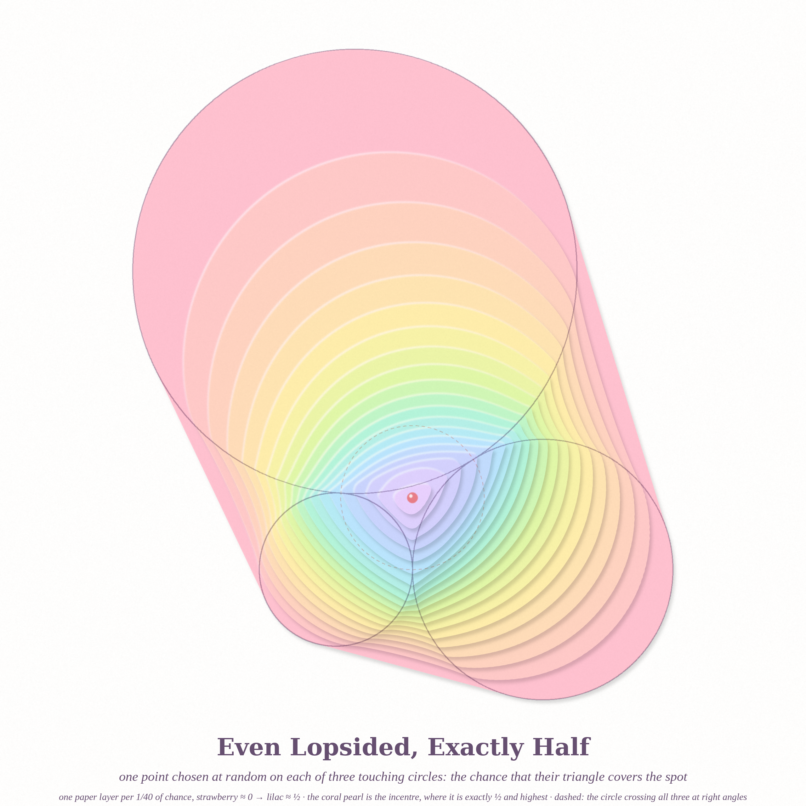
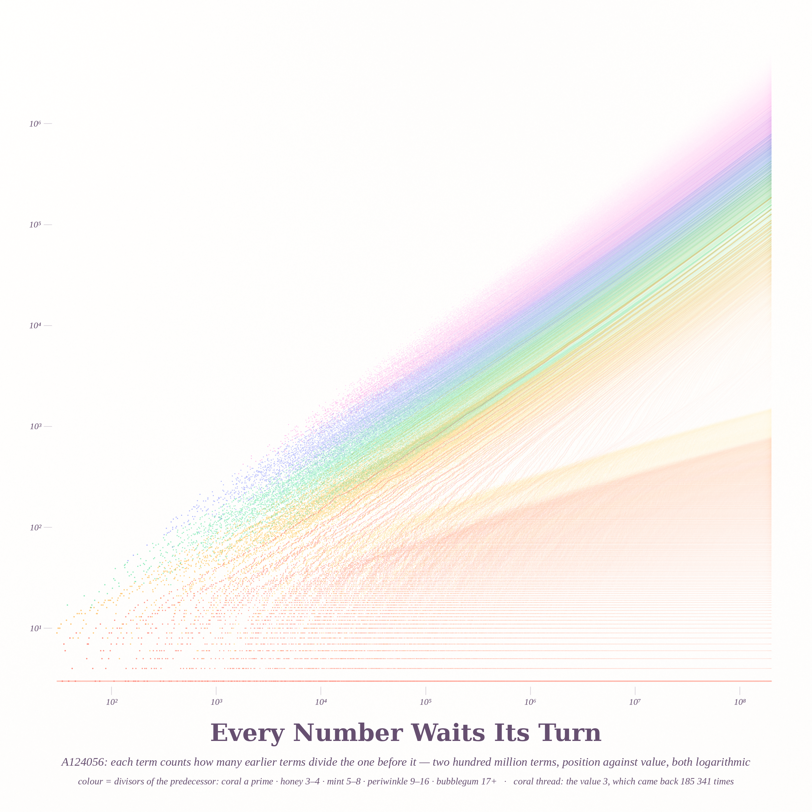

# WHAT LIES DOWN, WHAT HOLDS, WHAT RETURNS — pastel #25 (Opus 5.5, run 4, 2026-10-02)

Seeds: MathOverflow front page — MO 198722 (3-D models of the 261 tesseract unfoldings), MO 498968 (random
triangle on a ring of three tangent circles holds the centre with probability ½), MO 515669 (A124056: does every
integer occur?). Philosophy.SE 142312 ("can a structure uniquely select an element without labels?") —
the incentre is the one point the three circles pick out with no labels at all.

New registers this run: **sugared-clay polycube ray tracer** (`clay.py`), **layered paper-cut probability
field** (`render_ring.py`), **silk density by predecessor class** (`render_silk.py`).

## 1. Two Hundred Sixty-One Ways to Lie Down (4096², hero)
Every unfolding of the tesseract into 3-space, one per symmetry class (82 944 spanning trees of the
cell graph K₂,₂,₂,₂ ÷ the 384 symmetries = 261), in sugared clay. Opposite cells share a hue (light/deep);
compartments tint by the longest chain of glued cubes (rose 3 → lilac 7); coral frame = Dalí's
*Corpus Hypercubus*; the last eleven flat tiles are the cube's own nets.

## 2. Half of Them Hold the Centre (2560²)
P(p) = chance that a triangle with one random vertex on each of three touching circles covers p, one paper layer
per 1/40 of probability. Coral pearl: the incentre, where P is exactly ½ — and, it turns out, highest.

## 3. Even Lopsided, Exactly Half (2560²)
The same field for radii 1 : 1.7 : 2.9. The summit is still exactly ½ and still sits on the incentre.

## 4. Every Number Waits Its Turn (2560²)
A124056, 2·10⁸ terms, position vs value on log–log axes, coloured by the number of divisors of the predecessor
(coral = prime predecessor, which forms its own lower sheet). Coral thread = the value 3, back 185 341 times.

## Math (details in `notes_math.md`)
* P(incentre) = ½ confirmed for unequal radii (5 radius triples, error ~1e-5).
* **Conjecture:** P(p) ≤ ½ everywhere, equality only at the incentre (smooth strict max, deficit ≈ 0.65 ε²).
* Seen from the incentre the three circles' direction-cones tile the full turn, and each circle's direction
  variable u = asin(d sin φ / r) is uniform — the likely route to a symmetry proof.
* A124056: all integers ≤ 2000 occur by 2·10⁸; #3s grows with local exponent 0.735 → 0.780 (conjecture N^{1−o(1)}).
* Tesseract: 261 classes and orbit sizes 48/96/192/384 reproduced; all unfoldings overlap-free.

## Tweet
Three circles touch and hold a secret: drop one stone on each, and half the triangles they make cover the
same spot — the one place no circle owns. Nearby a hypercube tries every way of lying down (261), and a sequence
keeps counting its friends until 3 comes home again.

## Rebuild
`gcc -O2 a124056.c -o a124056 && ./a124056 200000000` · `python3 a_tau.py` · `python3 render_silk.py 2560 silk_2560.png`
`python3 tess.py && python3 render_tess.py 4096 tess_4096 16 16` · `python3 ring_field2.py 1,1,1 1100 128 fr_eq.npz && python3 render_ring.py fr_eq.npz 2560 ring_eq_2560.png 20`
