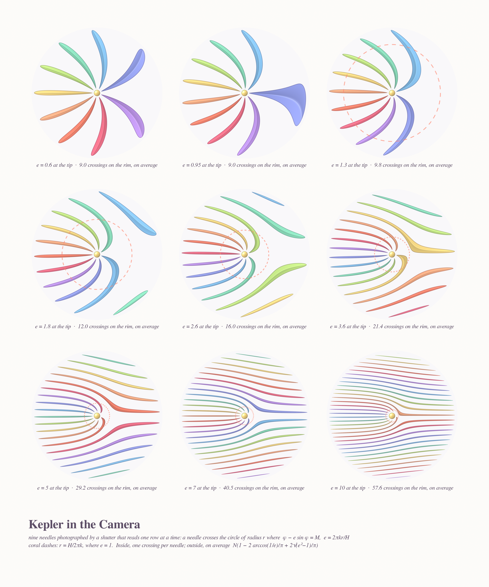
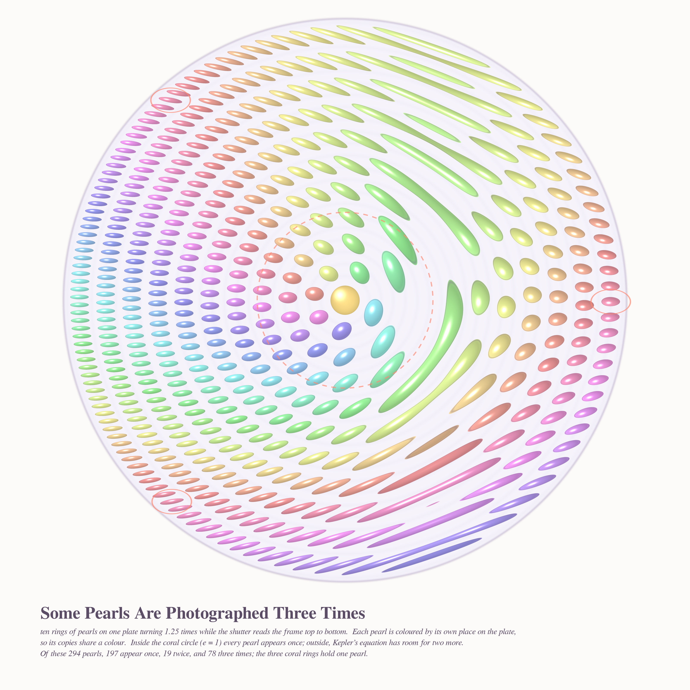
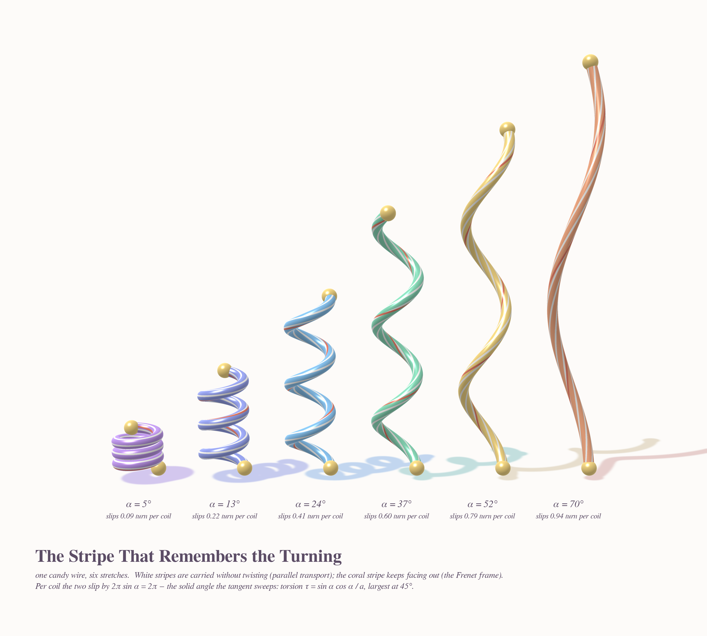
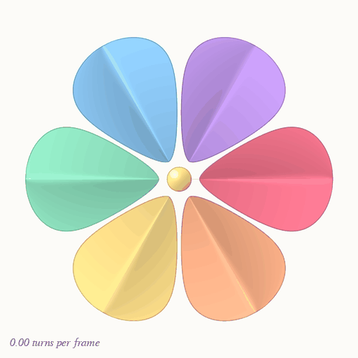
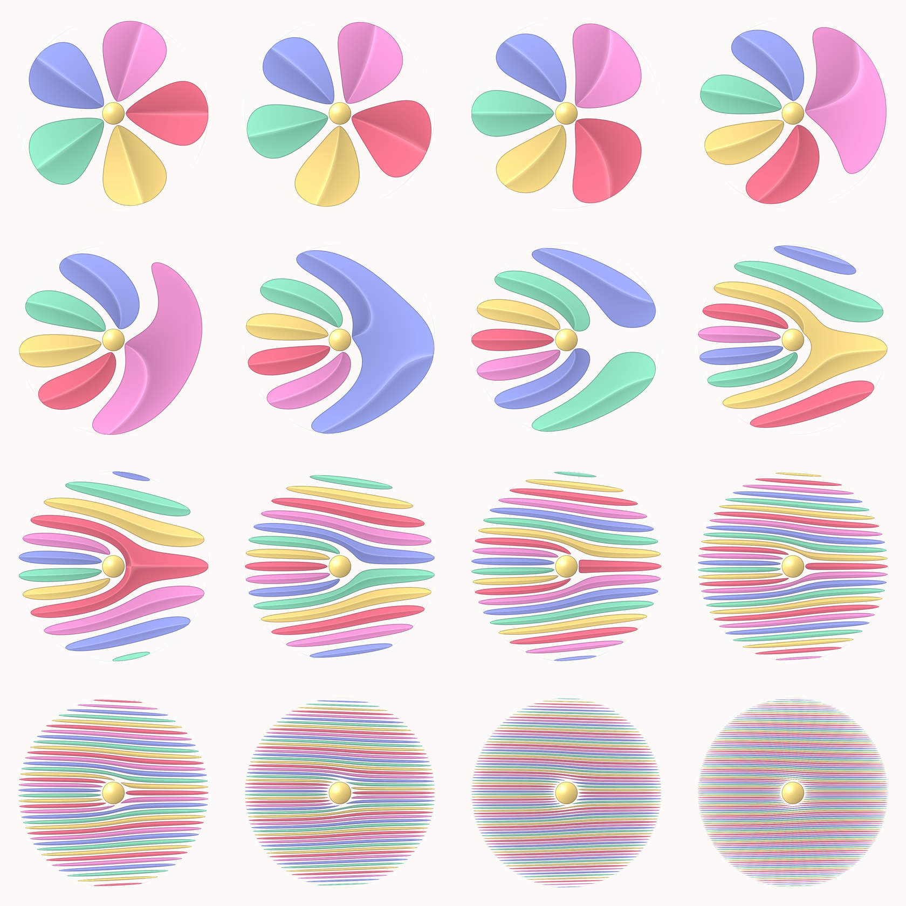

# FALLING FORWARD THROUGH TIME — pastel #32 (Opus 5.5, run 11)

*Seeded by Philosophy.SE 142440 ("Can an internal mental simulation produce a real experience of temporal
acceleration?"): imagine an outer rotating ring around a protected inner region, then spin it faster and faster
until the motion seems to keep its own time. Also by MathOverflow 20493 ("What is torsion, intuitively?") and
Phil.SE 142448 (p-zombies: a physically identical copy with a different inside).*

A rolling-shutter camera reads its rows one after another, so **every row sees a different moment**. Point one at
a spinning pinwheel and the blades come apart. The maths behind that is Kepler's equation:
a thin radial blade crosses the circle of radius r wherever

  **φ − e sin φ = M,  e = 2πk·r/H**  (k = turns per frame, H = frame height).

For e ≤ 1 the left side is monotone, so every circle meets each blade exactly once and the blade stays one piece.
That is the **ignition circle r\* = H/2πk** (the coral dashes in every picture). Outside it the motion "keeps its
own time": blades split, fold into Y-shapes, and shatter into ribbons. The hub is rotationally symmetric, so no
shutter can touch it. It is the protected inner region.

---

## 1 · The Meadow, Read Top to Bottom — hero, 4096²

Thirteen paper pinwheels on candy sticks, on four layered dawn hills, all photographed by **one** shutter, each in
its own wind (k = 0.12 to 80 turns per frame). Left: almost still. Centre: the protagonist (k = 1.45) has just
ignited. Its outer blades are a boomerang and a loose petal, and the coral ignition circle sits around the calm
hub. Right: k = 6.5, a ball of ribbons. On the far hills the fastest ones are tiny striped beads.
`render_meadow.py` (exact per-pixel blade test, AA by s/|∇s|, ink rim at constant pixel width).

## 2 · Kepler in the Camera — 3200×3840

The same nine-needle pinwheel at e_tip = 0.6 … 10. The labels give the **exact mean number of needle crossings
on the rim**:

  N/2π ∫|1 − e cos φ| dφ = N  (e ≤ 1),  N(1 − 2 arccos(1/e)/π + 2√(e²−1)/π)  (e > 1),

checked by Monte Carlo in `kepler_check.py` (e.g. N = 6, e = 7: 27.000 measured vs 27.011).

## 3 · Some Pearls Are Photographed Three Times — 3200²

The question's own picture: an outer rotating ring around a protected centre. Ten rings of glossy pearls on one
plate turning 1.25 times per frame. A pearl at radius ρ shows on row y wherever |y − y₀ − ρ sin(a + 2πky/H)| < b.
That is Kepler again, so outside the coral circle **one pearl can be photographed up to three times**. Each pearl is
coloured by its own angle on the plate, so its copies share a colour; the three coral rings hold the copies of one
pearl. Of 294 pearls, **197 appear once, 19 twice and 78 three times**. The plate and its grooves are
rotationally symmetric, so the shutter leaves them alone.

## 4 · The Stripe That Remembers the Turning — 3000×2700

MO 20493 + the p-zombie: the same wire, two inner frames. One candy wire (same length) stretched six ways,
α = 5° … 70°. **White stripes** are carried by parallel transport (they never twist about the wire), and the
**coral stripe** keeps facing outward (the Frenet frame). Per coil they slip by

  **2π sin α = 2π − Ω**,

where Ω is the solid angle swept by the tangent. That is the geometric phase of light in a coiled optical fibre
(Tomita–Chiao). Torsion τ = sin α cos α / a is largest at 45°, yet the slip per coil keeps growing all the way.
A new chunked splat z-buffer renders the tubes (`render_springs.py`, tens of millions of shaded surface samples, one spring at a time), with soft
shadow pools tinted by each spring's colour.

## Bonus · Temporal Ignition (GIF, 512²)

One pinwheel spun up from rest to 2.6 turns per frame while the camera films it. The blades really advance
2πk between frames, so you also see wagon-wheel stroboscopy near whole numbers of turns.

Variant sheet from the first exploration (16 speeds, k = 0 … 24): 

---

## The six ideas (3 executed + 1 go-deeper)
1. **Rolling-shutter pinwheel meadow** (Phil.SE 142440). ✔ hero
2. **Kepler-in-the-camera specimen sheet** (the e = 1 ignition circle + exact crossing law). ✔
3. **Candy springs: torsion as a slipping stripe** (MO 20493, geometric phase). ✔
4. *Rings of pearls under the shutter* (the question's "outer ring, protected centre"): ✔ added as the go-deeper on the favourite
5. Modular-hyperbola lace for MO 515850 (x·x⁻¹ ≡ 1 mod p as hyperbola families, the 86-part zero-sum partition). Not built.
6. Thompson's F as a silk of piecewise-linear dyadic homeomorphisms (MO 515834); signed-sum curtain for MO 515847. Not built (curtain register already used).

## Mathematics (small, honest)
- **Identity.** A row reads one instant, so it sees a thin radial blade at one angle φ(y) = M + 2πk(y − y₀)/H.
  The image of the blade is therefore exactly the **cotangent graph** x − x₀ = (y − y₀)·cot(M + c(y − y₀)), c = 2πk/H,
  clipped to 0 ≤ r ≤ R. On circles it is Kepler's equation with eccentricity e = c·r.
- **Proposition.** The blade image is connected for e_tip ≤ 1. Proof: φ − e sin φ is strictly increasing for e < 1
  (weakly at e = 1), so each circle meets the needle image exactly once, at an angle continuous in r.
- **Crossing law (proved, checked).** Mean crossings of a circle with N needles = N·TV/2π with
  TV = ∫|1 − e cos φ| = 2π − 4 arccos(1/e) + 4√(e² − 1).
- **Observation / conjecture.** The mean number of separate pieces of one needle is
  **e/π + ½ + o(1)** as e → ∞ (measured: e = 20 → 6.850 vs 6.866; e = 40 → 13.195 vs 13.232; e = 80 → 25.970 vs 25.965;
  `pieces.py`). Heuristic: rows span 2e of phase, so there are 2e/π pole intervals of the cot graph, half of them
  on the needle's side, each giving one piece, plus the hub piece split on average. Open: an exact formula for
  finite e, and the error term (it looks like O(1/e)).
- **Springs.** Per coil, Bishop vs Frenet slip = τ·L_coil = 2π sin α = 2π − Ω(tangent cone). τ max at α = 45°.

## Story (tweet-sized)
> A pinwheel asked the camera to hold it still. The camera could only look one row at a time, and the pinwheel
> kept turning while it looked. The outer petals came apart into ribbons and the far pearls were seen three times,
> but the little gold button in the middle stayed perfectly round. It had never been moving.

## What I learned about generative art (carry forward)
- **A real camera artifact is a free, lawful distortion.** Rolling shutter = "evaluate the scene at t(y)". It
  turns a simple toy into a family of shapes with a theorem attached (Kepler's equation, e = 1 threshold).
  Similar candidates: line-scan photography, slit-scan, interlaced video, light painting.
- **Exact AA for implicit shapes**: coverage = clip(s/|∇s| + ½) using np.gradient of the signed field, so the
  ink rim stays a constant pixel width even where the shutter shears the shape 10×.
- **Splat z-buffer by chunks** (sort far→near, last write wins, merge with a global z-buffer via np.unique):
  a glossy tube renderer of ~100 lines that ran at 3000 px in a few minutes within 3 GB.
- **Colour the copies by identity** when a process duplicates things (pearl hue = its angle on the plate), and
  ring one example in coral so the claim in the title is visible.
