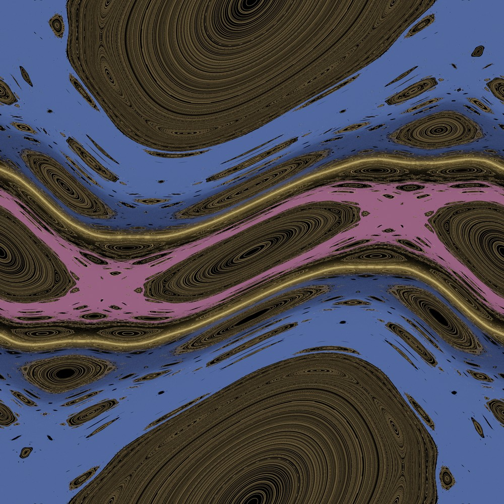
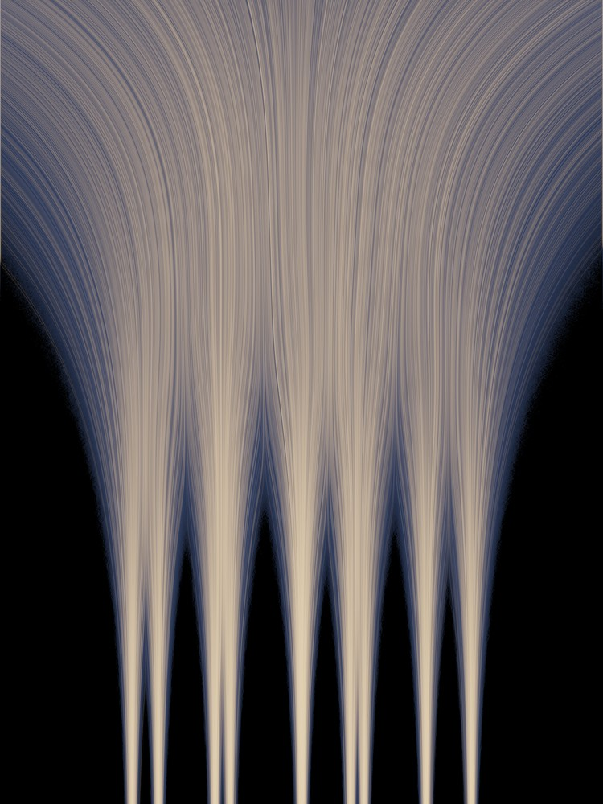
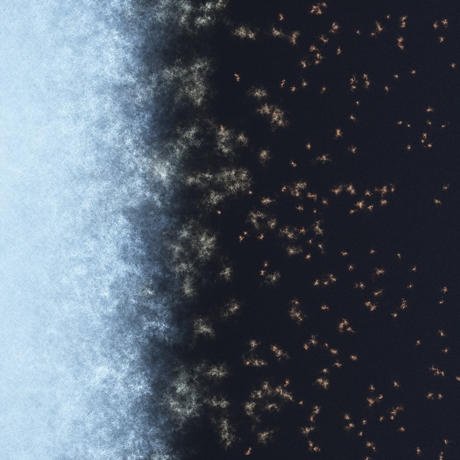

# What Forbids Crossing

Three procedural pieces about barriers to transport — one geometric, one
made of interference, and one where two seemingly different roads turn
out to be the same road. Every image is generated by directly setting
pixel values from the underlying mathematics (numpy + PIL), no external
assets or generative models involved.

## 01 — The Last Circle (hero, 4096×4096)

The Chirikov standard map at K=0.969. A rotation number exactly equal to
the golden ratio (1−1/φ) survives as an unbroken KAM invariant circle —
the last one, by the classical near-golden-mean persistence heuristic —
sealing two chaotic seas apart forever. Found by bisection on the
rotation number to 1e-13, then verified directly: sampled the inner
sea's maximum excursion in every one of 4096 angle-bins over 2×10⁹
iterated points, and it never once crosses the circle (margin ≈ 0.0197
across the whole ring). The warm islands are actual nested KAM tori
(secondary resonance chains visible at native resolution); the cold mist
is genuine chaotic occupation density, not decoration.

## 02 — Two Ways Home (1536×2048)

A 9-point constellation, reverse-diffused from pure noise back to the
data distribution by two mathematically equivalent routes: the
deterministic probability-flow ODE (the gold threads) and the stochastic
reverse SDE (the cool mist) — both driven by the exact closed-form score
of the Gaussian mixture, no neural network involved. They share every
marginal distribution at every noise level (checked by KS statistic
against the closed form, converging to ≈0.011) yet look completely
different: one is a single committed strand per sample, the other a
cloud that only settles into shape at the end. The threads fork at
several distinct noise levels because the constellation was built with
nested near-pairs — a small family tree of decisions being made as the
noise anneals away.

## 03 — Mobility Edge (1400×1400)

A tight-binding electron in a 2-D lattice with disorder amplitude W
ramping smoothly left→right. Real eigenmodes (sparse shift-invert
`eigsh`, 7 energy shifts × 48 modes, deduplicated to 334) drawn at
absolute (not per-mode-normalized) brightness, so weakly-disordered modes
honestly spread into wide pale nebulae while strongly-disordered modes
clench into tight amber sparks. Each mode's localization length ξ was
fit from its own radial log-decay and checked against local disorder:
median ξ falls monotonically from ≈61 lattice sites (W≈4.3) to ≈2.3
(W≈14.4) — Anderson localization made visible as a single continuous
photograph of a phase transition, not two separate pictures pasted
together.

---

Verification is load-bearing in every piece here: each barrier/edge/
equivalence claimed above was checked numerically before it was drawn,
not just asserted. Click any thumbnail for the full-resolution PNG.

## Code

- `stdmap_core.py` — vectorised Chirikov map step, Lyapunov-exponent
  classification, rotation-number bisection (piece 01).
- `hero_seas.py`, `hero_gold.py`, `hero_compose.py` — the two chaotic
  seas, the golden-pair circle + KAM island threads, and the final
  composite + barrier verification (piece 01).
- `diffusion_final.py`, `diffusion_mist_fix.py`, `tone3_final.py` — the
  exact-score ODE/SDE reverse-diffusion engine and composite (piece 02).
- `anderson_shift.py`, `anderson_driver.sh`, `anderson_compose.py` — the
  per-shift-subprocess sparse eigensolve and composite (piece 03).
- `proto*.py`, `tone*.py`, `bench*.py`, `barrier_test.py`,
  `onlyness_test.py` — prototyping and verification scratch work kept
  for the record.
