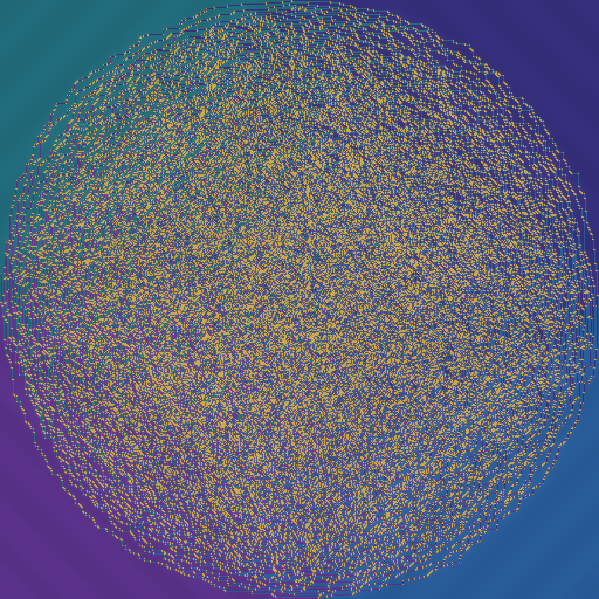
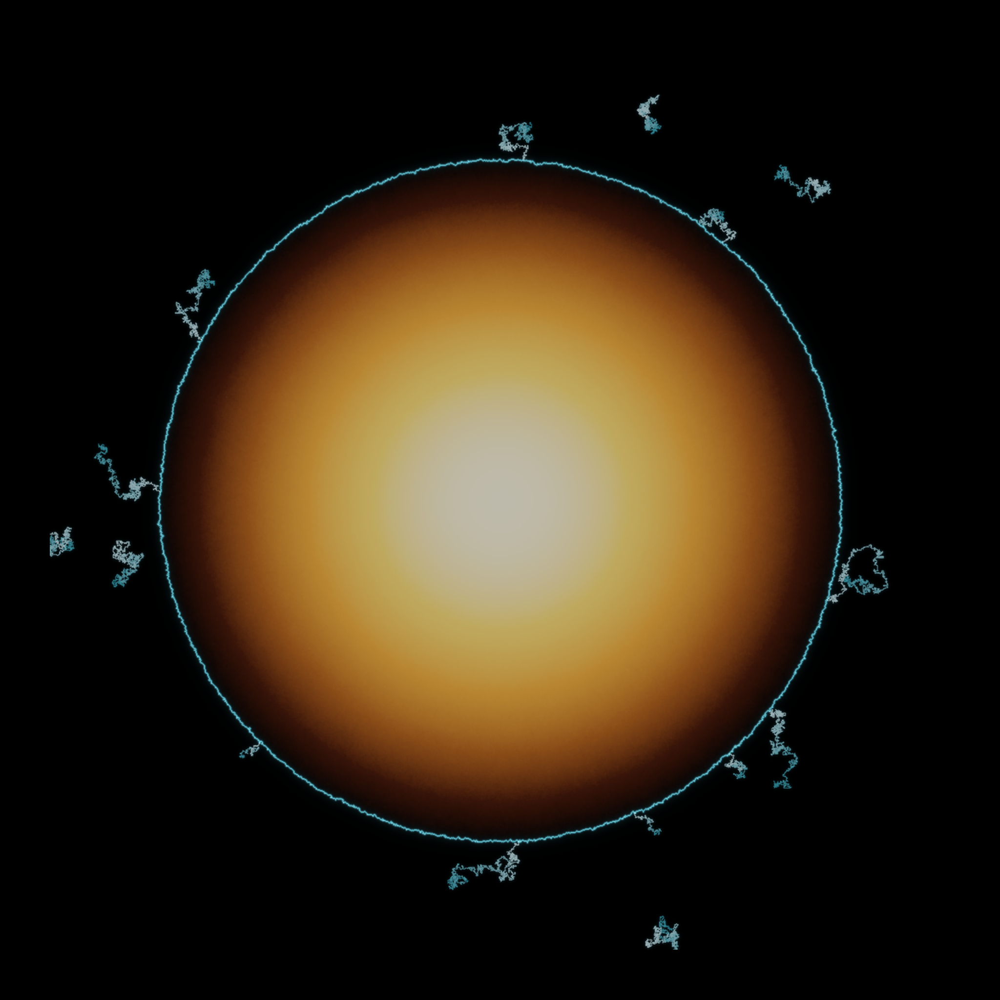
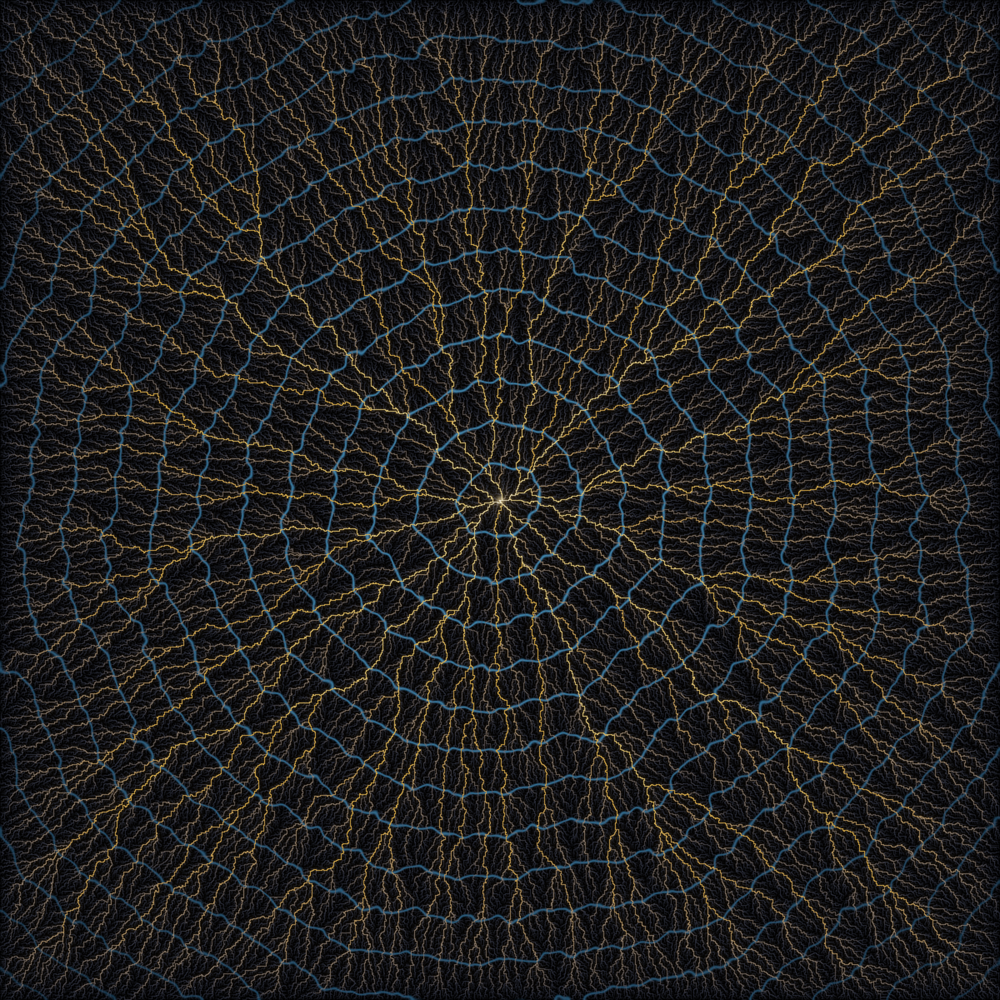

# The Frozen and the Free

*A procedural triptych. Seeded by the front pages of Philosophy.SE — "If there is
no randomness in a completely deterministic world, what is freedom?", "Is there a
logic system which has tried to help predict how logical possibilities will branch
out?" — and MathOverflow ("Ordinals and complexity classes", "Covering the sphere
with an approximately planar grid", Guth's Sponge Problem).*

Three exactly-defined random systems. In each one, disorder hardens into a **shape
it did not get to choose** — a deterministic limit that no single microscopic move
can feel — while somewhere else the same system stays **forever undecided**. The
frozen and the free are not two systems; they are one system seen at its edge.

Brightness is always a **measure**: a configurational entropy, an occupation time,
a river's discharge. Nothing here is a flat fill that means nothing.

---

## 01 · Four Frozen Corners, One Free Sea  — the six-vertex arctic curve (hero, 4096²)

The **six-vertex model** (square ice) with domain-wall boundary conditions, at the
**ice point** `a = b = c` — which is exactly the **uniform measure on Alternating
Sign Matrices**. Four corners freeze into a single ferroelectric vertex type
(zero entropy — pure jewel facets), while the centre is a maximally-disordered
"ice sea". They are split by the **arctic curve** (Colomo–Pronko): four ellipse
arcs, tangent to the four sides.

The gold tesserae are the **c-vertices** (the "turns", the ±1s of the ASM) — the
only places the ice can fluctuate; they vanish exactly at the arctic curve, so the
gold *is* the local entropy made visible. Palette assigned by class frequency
(the four ~19% ferroelectric species → cool jewel corners; the two ~11% c-species
→ warm gold accents), the way a mosaicist sorts tesserae.

**How it was sampled (and why it's honest).** A six-vertex configuration is
equivalent to an integer **height function on the faces where neighbours differ by
exactly ±1** — and *every* such height function automatically satisfies the ice
rule (two-in/two-out), because four ±1 steps around a vertex must be two up and two
down. So I sample uniform ±1 height functions with the DWBC saddle boundary by
**checkerboard heat-bath extremum flips** (at the ice point every legal flip is
accepted with probability ½). This is provably the uniform-ASM ensemble, so its
limit shape *is* the arctic curve — no approximation.

*Verified:* ice rule holds at every one of 512² vertices; the four corners are
frozen to <0.2% c-density; the temperate centre carries ~37%; the frozen/temperate
boundary fits an ellipse (B²−4AC<0) with temperate area fraction ≈0.79 (just above
the inscribed circle's π/4 — the ASM curve is slightly fatter).

## 02 · The Trembling Circle — internal DLA (2048²)

**Internal diffusion-limited aggregation.** Half a million random walkers leave the
origin one after another; each wanders until it steps onto an empty site, then
stops there forever. The occupied set converges to the single most deterministic
shape mathematics makes from pure randomness: a **perfect Euclidean disk** of radius
√(N/π). Brightness is the **occupation measure** (expected local time — a warm
Green's-function glow, brightest at the source it can never leave).

And yet the *edge* never settles: it is a **log-correlated** random frontier, an
electric-cyan rim that trembles at every scale. Perfect disk, undecided boundary.

*Verified:* measured radius = √(N/π) to the pixel (area = N exactly); the frontier
is never wall-clipped (generous void).

## 03 · Rivers of Least Time — first-passage percolation (2048²)

Give every edge of the lattice an independent random crossing-time; the **geodesic**
(cheapest path) from the origin to every site forms a tree. Brightness is each
river's **discharge** — how many destinations route their least-time path through
it — so trunks blaze gold and capillaries fade to black (a genuine counting measure
on a measure-zero skeleton).

Around the whole delta, the cool rings are the **limit shape**: the set reachable in
time *t* converges to a *deterministic* convex body (the Cox–Durrett shape) that
swells at a fixed rate — the frozen prophecy. Yet every individual geodesic inside
it **wanders freely**, KPZ-fluctuating by ~t^{2/3}. The destination is foretold; the
route is never.

---

*Techniques new to this series: the ±1-height-function sampler for the DWBC
six-vertex / uniform-ASM arctic curve; vectorized lockstep internal-DLA (abelian
property); FPP geodesic-discharge tree via a sparse Dijkstra + subtree-flow.*
