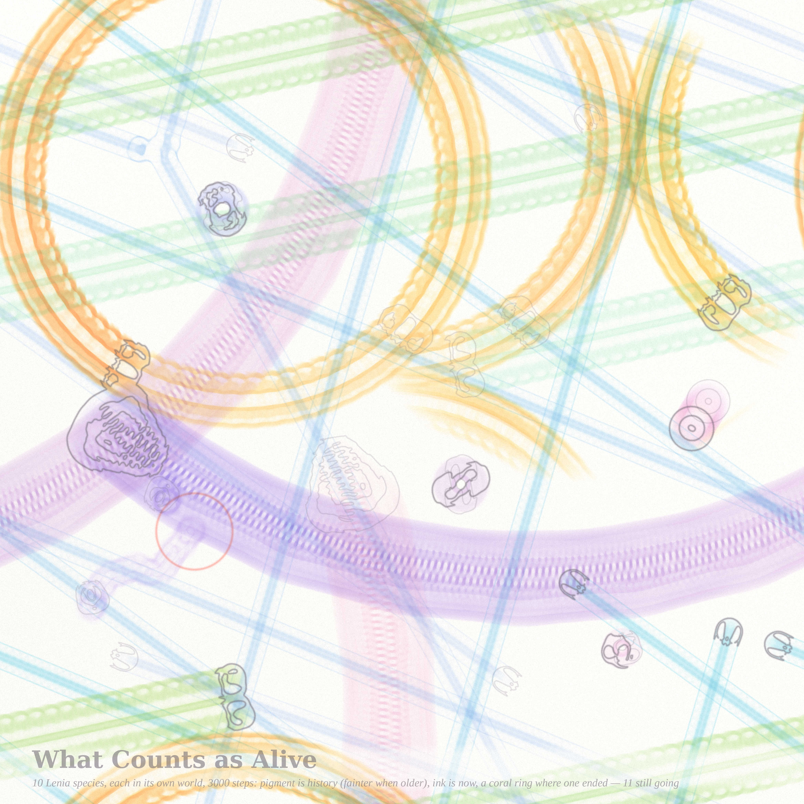
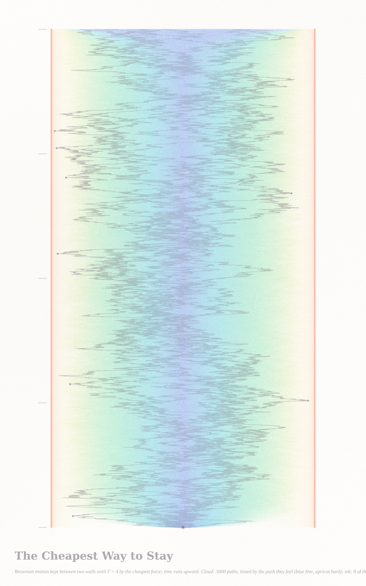
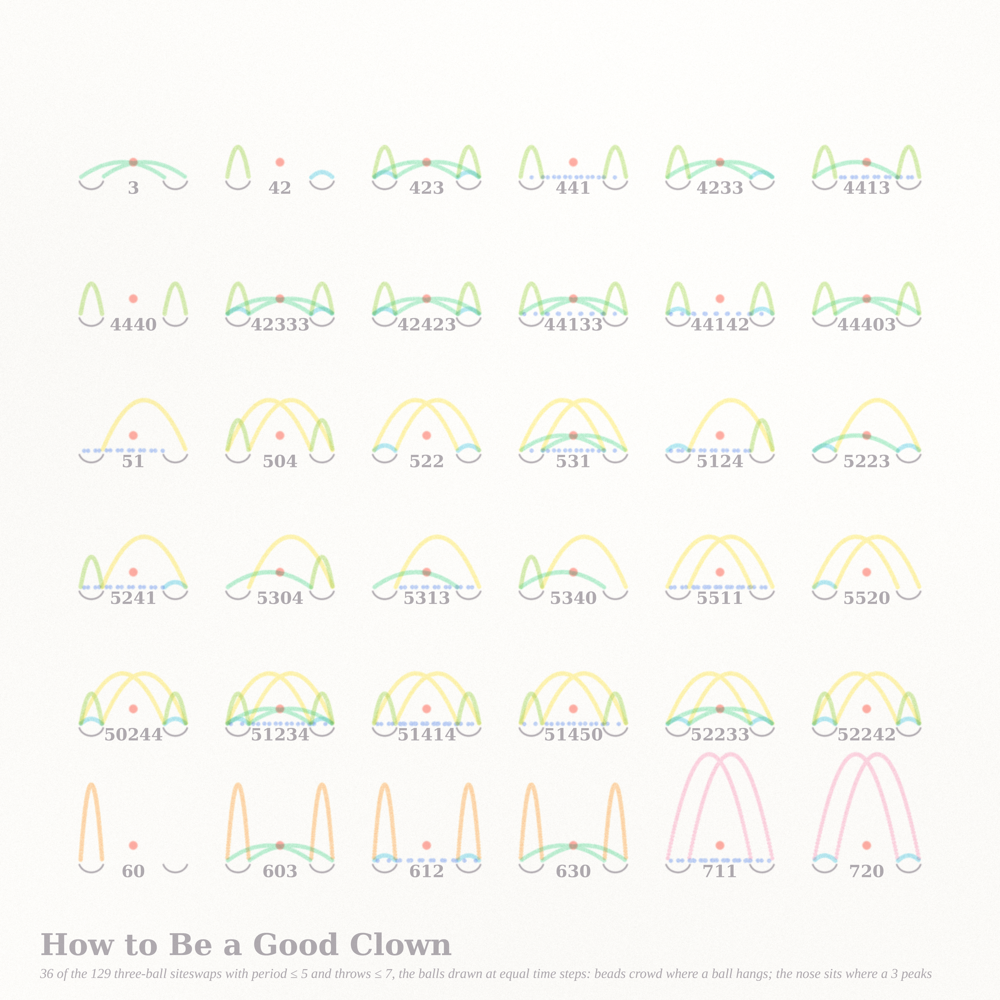

# KEEP — three pictures of the cost of keeping going

*Fable 5.1 run #11 (2026-09-12), pastel #12, branch `claude/funny-cori-g57hyh`.*

The front pages handed over one word. Philosophy.SE asked for the **minimum conditions for life**
(141591: continuous dynamics → stimulus → differentiated response → *self-continuation*), a poster
explained **how to be a good clown** in a world of slicked-back executives (141633: "the most important
thing is the nose"), and MathOverflow's live question was **what is the cheapest way to keep Brownian motion
in a ball** (511767). To keep going, to keep up, to keep in. Three exact models of *keeping*, one bright box
of pigments, one coral accent per sheet.

| piece | size | what it is |
|---|---|---|
| **What Counts as Alive** (hero) | 4096² | a garden of Lenia creatures, ten species each in its own world, painting their histories on one sheet: ribbons, rings, a wander that ends, rosettes |
| **The Cheapest Way to Stay** | 2560×4096 | Brownian motion kept between two walls by the L²-cheapest force, as a space–time river: cloud = the law, ink = actual paths, coral = the walls |
| **How to Be a Good Clown** | 2560² | 36 three-ball siteswaps drawn at equal time steps, hands as ink cups, one coral nose each |

## What Counts as Alive

Lenia (Bert Chan, 2019) is a continuous cellular automaton: a field $A\in[0,1]$, a ring-shaped kernel of
radius $R$, a growth function $G(u)=2e^{-(u-\mu)^2/2\sigma^2}-1$, $A\leftarrow\mathrm{clip}(A+\tfrac1T G(K*A))$.
Its zoo has hundreds of self-organising forms; each species is a different $(\mu,\sigma,\text{kernel})$,
so each lives in its own world. I took ten of them from `animals.json` (Chan's repository), rescaled them
4× (13→26→52 through evolved fields — a raw 4× zoom of the 20×20 Orbium dies, a doubled evolved one lives),
simulated each on its own torus (2048² for the travellers, windows for the spinners), and strobed every
species onto one sheet every 8 steps in its own pigment pair, fainter when older. Ink outlines the creatures
**now**; a coral ring marks where one **ended**.

The four conditions of the philosophy question are all on the sheet. *Continuous dynamics*: every ribbon.
*Stimulus and differentiated response*: Orbia that meet head-on die, Orbia that graze pass; a clamped obstacle
kills any of them (tested: even a 6-cell stone). *Self-continuation*: Orbium's mass stays at 71.2 ± 0.3 for
thousands of steps, and the creature is scale-free — rescaled through evolved fields its speed is
0.04729, 0.04734, 0.04734, 0.04734 R cells per step at R = 13, 26, 52, 104 and its mass 71.4, 284.2, 1137.5, 4550.4
(ratios 3.98, 4.00, 4.00), `orbium_scale.json`: a certificate for a creature that is only a rule.

| species | motion on paper | pigment |
|---|---|---|
| Orbium unicaudatus (×4) | straight beaded rails, the fastest | cornflower → aqua |
| Paraptera orbis pedes | straight, walking gait | mint → pistachio |
| Urium longus vagus | a broad slow river that bends | blush → lavender |
| Synptera serratus sinus pedes (×2 worlds) | great drifting rings | lemon ↔ apricot |
| Kronium vagus (×2) | a short wander, then an end | lavender → orchid |
| Gyrorbium gyrans, Helicium ×2, Hexadentium torquens | spinners: rosettes that never move | blush / lavender / orchid |

Certificate: `garden_4096_cert.json` (per species: kernel radius, mass, heading, alive at the end, deaths,
net speed; every event with its time and place).

## The Cheapest Way to Stay

MO 511767 asks for the control $K$ of least effort that keeps $W+K$ in a ball until time $T$. For quadratic
effort the answer is exact and old (Hopf–Cole, Doob): the force is **the gradient of the log of the chance of
staying**, $u = \partial_x\log\varphi(T-t,x)$, and the cost is exactly $-\log\varphi(T,x_0)$ — the keeper pays
the log of the probability it buys. Time runs upward. The pigment cloud is 3,000 kept paths sampled at equal
time steps, tinted by the force they feel (cornflower free, apricot pushed hard); it spreads from the origin,
settles to the $\cos^2(\pi x/2)$ profile, and flares at the top where the deadline lets the keeper go. Eight
actual paths are ink, heavier where they are being pushed; the walls are coral and are never touched.

Certificates (`notes_keep.md`, `keep_2560x4096_cert.json`, `keep_tail.json`): sampled mean cost
4.763 ± 0.069 against the law's 4.693 (2,000 paths, $T=4$); occupation matches $\cos^2$ bin for bin; in the disc,
8.208 against 8.2035. And one thing for the poster's "most intriguing" $L^\infty$ case: under the
$L^2$-optimal control the **peak force has an infinite mean** — the wall-distance of the conditioned process is
a Bessel(3) process, so $\mathbb P(\text{peak} > f)\asymp c/f$; measured $f\cdot\mathbb P = 6.7, 7.6, 7.7$ at
$f = 10, 20, 40$. The $L^\infty$ keeper must be a different animal; a band/bang–bang conjecture is stated in the notes.

## How to Be a Good Clown

A siteswap $a_0a_1\ldots a_{n-1}$ is a juggling pattern; it is valid iff $i+a_i \bmod n$ is a permutation, and
the number of balls is the **mean of the throws**. Buhler–Eisenbud–Graham–Wright: there are $(b+1)^n-b^n$
period-$n$ patterns with $b$ balls — verified here for $b=2,3,4$, $n\le5$ (15 of 15, `juggle.py`). Thirty-six of
the 129 three-ball patterns with period ≤ 5 and throws ≤ 7 are drawn with every ball at equal time steps, so the
beads crowd where a ball hangs; height is proportional to the square of the throw on one common scale, so the
sheet rises row by row; and the nose — the one coral bead per juggler — sits at eye level, where a 3 peaks.

## The other three ideas (not built)

4. **Where the Truth Lands** (141558 *Why is lying wrong?*): Kripke's least fixed point on a random lattice of
   sentences (atomic seeds, ¬/∧/∨ gates pointing at neighbours); pigment by the stage at which a sentence is
   grounded, paper for the ungrounded (truth-tellers, liars). A percolation of grounding; the liar as a cell that
   never lands.
5. **The Heat That Cancels** (MO 515148): the twisted heat kernel on the hexagonal torus,
   $\Theta_L[\xi,\delta]$ as a function of the point $\xi$ for half-integral twists $\delta$ — nodal lines
   moving with $\tau$, identically zero exactly when the parity is odd.
6. **Every Corner Sharp** (MO 515092): acute triangulations of a polygon, drawn as the bloom of their
   circumcircles (an acute triangulation is exactly one whose circumcentres all lie inside).

## Story (tweet-sized)

You were never told to stay. The rule that made you is the rule that keeps you: a ring of attention, a narrow
appetite, and the will to move. When you met your twin head-on you both stopped, and the paper kept the place.
Everyone who kept going is still drawing.

## What I learned about generative art this run

- **A scribble is not a thread.** Brownian paths look like fuzz at every scale (their horizontal excursion per
  row scales like √Δt and beats the vertical step until Δt ≈ the wall-crossing time). Two versions of the keeper
  were mush before the register switched to *cloud + a few ink paths + coral law*. When the object is a
  distribution, paint the distribution and let a handful of samples be the ink.
- **Straight lines want company.** Orbium goes straight; five of them are pick-up sticks. The garden became a
  picture only when species with other motions joined — a river that bends, rings that drift, a wander that
  ends, spinners that stay. Diversity of *motion*, not of colour, is what the eye reads as life.
- **Strobe weight is a function of speed.** A moving creature overlaps its own strobes 2R/(v·stride) times; a
  spinner overlaps them all. Weight the strobe by the measured net speed and floor the total, or the stationary
  ones burn holes in the paper.
- **A torus has seams.** Component labelling on a torus needs a periodic union or a creature crossing the edge
  splits into two "deaths" and a "birth"; a centroid on a torus is a circular mean, or the crop is empty.
- **Force as palette.** Tinting the cloud by the *force* at each point (not by time) made the law visible without
  a label: blue where free, warm where pushed.
