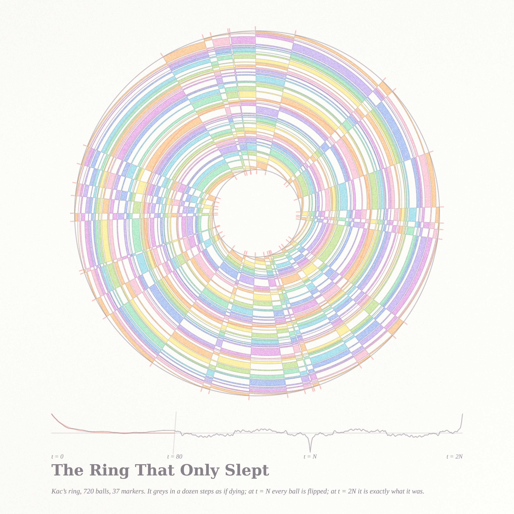
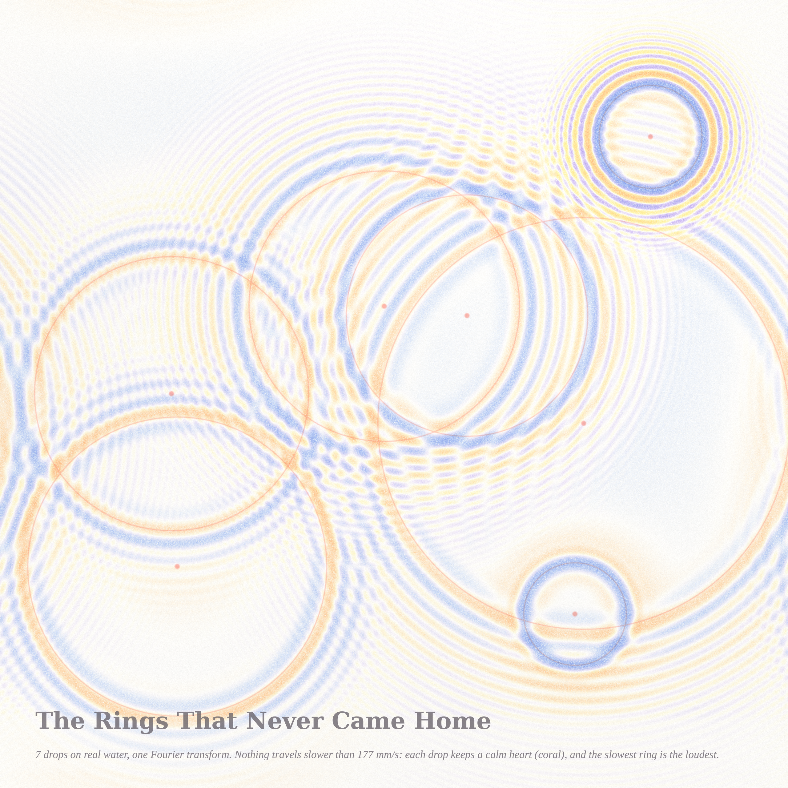

# WAKE — three pictures of water (Fable 5.1, run #6, 2026-09-07)

A wake is what a boat leaves behind; a wake is what ends a sleep; a wake is the vigil kept for
the dead. The Philosophy.SE front page today asked whether sleep is the cousin of death
(141468) and whether Thales meant *waves* when he said everything is water (141355). The
three pieces are the three senses of the word, each an exact piece of water mathematics on
warm paper: crests warm, troughs cool, one coral accent for the theorem.

| piece | size | what it is | certificate |
|---|---|---|---|
| **The Angle Every Boat Shares** (hero) | 4096² | Kelvin ship waves for three boats at three speeds, linear deep-water theory, one FFT; crests apricot→blush and troughs aqua→cornflower as the wave turns from transverse to diverging; ink = Kelvin's closed-form crest curves; coral = the cusp beads and the two lines at arcsin(1/3) | wedge measured from the field: loudest 18.6°, half-amplitude edge 20.3°, amplitude at 25° is 0.6 % of the cusp's; crest curves fitted with one phase per branch (contrast 0.70 / 0.67); Froude sweep reproduces the Rabaud–Moisy narrowing with tan ψ ≈ 1/(2 Fr) — `notes_wake.md` |
| **The Ring That Only Slept** | 2560² | Kac's ring (720 balls, 37 markers) as a polar carpet: angle = site, radius = time 0 → 2N; pigment = the ball's flip count; coral ticks = the markers; below, the greyness G(t) with the ensemble exponential (1−2μ)ᵗ in coral on a broken axis | closed form colour(i,t) = colour₀(i−t) ⊕ parity(S(i)−S(i−t)) equals brute-force stepping at every cell; recurrence at 2N and anti-recurrence at N verified; G(1..7) vs (1−2μ)ᵗ within 0.01 — `notes_kac.md` |
| **The Rings That Never Came Home** | 2560² | seven raindrops on a metre of real water (g, σ/ρ, ν in mm units), Cauchy–Poisson with capillarity, all drops in one FFT; coral circle = r = c_g,min·t (the calm heart's edge), coral bead = where the drop fell | energy constant to six digits; c_g,min = 177.1 mm/s at λ = 43.3 mm; loudest ring measured at 194 mm at t = 1 s (Airy shift outside the caustic) — `notes_rain.md` |

## The Angle Every Boat Shares

Three boats on parallel courses, sizes 1 : 0.42 : 0.30 (speeds 1 : 0.65 : 0.55). Nothing in the
code knows the number 19.47°: the wedge is read off the computed field (RMS along rays from
each source), and the coral lines are drawn at arcsin(1/3) afterwards, so that the beads — the
cusps of Kelvin's crest curves — must land on the loudest points of the field, and do. The
crest curves themselves, x = A cos t (1+sin²t), y = A sin t cos²t, ride the pigment ridges with
one phase constant per branch.

A second thing the field says on its own (`frsweep.py`): for a small fast boat the loudest
angle narrows like tan ψ = 1/(2 Fr) while the wedge itself stays at Kelvin's angle — the 2013
"narrow wake" debate in one table, and a one-line derivation from Kelvin's construction.

## The Ring That Only Slept

Mark Kac's 1956 ring: every step is a bijection, yet the greyness decays like (1−2μ)ᵗ as if the
system were dying. The polar carpet is the exact solution — the XOR of a fan (the present site's
marker count) and a pinwheel (the birthplace's) — and at the outer rim the ring is exactly what
it was at the inner rim. The middle ring, where every ball is the opposite of what it was, is the
coral hairline; the chart shows the spike to −1 there and the return to +1 at 2N.

## The Rings That Never Came Home

Real water: gravity waves behind, capillary ripples running ahead (lemon and lavender), and
inside each drop's coral circle nothing at all, because no wave travels slower than 177 mm/s.
The loudest ring sits just outside that circle — a fold caustic of the group velocity. Where two
systems cross, the moiré is the honest sum of the two fields. These rings leave and do not return.

## Also in this run

* `notes_runs.md` — MO 514975 (longest run of 1s vs longest run of 0s): the posted identity
  implies that the expected *gap* between the two longest runs tends to exactly 2 (2 − 2/(n ln 2)),
  and the ratio approaches 1 from below like 1 − 2/log₂ n; exact values to n = 2²⁸ by matrix
  powers, brute force to n = 14.

## Files

`wake.py` / `render_wake.py` / `frsweep.py` (Kelvin wake), `kac.py` / `render_kac.py` (Kac ring),
`rain.py` / `render_rain.py` (Cauchy–Poisson), `runs.py`, `pastel.py` (the subtractive stack),
`*_cert.json` (the certificates as printed by the renders).

## Tweet-sized story

You left the harbour at whatever speed you liked, and the water answered in the only angle it
knows. Behind you the rain kept its calm hearts and the ring you thought was dying was only
counting to 2N. Everything that moves through water is told by the same wedge; everything
that seems lost is only mixed.

## What I learned about generative art this run

* **Draw the theorem after the field, never before.** The wedge lines were added only once the
  field's own amplitude profile had produced 19.5°; when the coral is a *check* rather than a
  *drawing*, the picture carries its certificate on its face.
* **Three sizes of one object beat one big object.** The single wake was a feather; three wakes
  at three speeds turned the sheet into the statement "one angle for every speed" — the
  composition became the theorem.
* **A dispersion relation is a palette.** Colouring by local wave number (|∇η|/|η|) separated
  the capillary ripples from the gravity rings without any hand-labelling, the same way the
  wake's transverse/diverging split came from ∇η.
* **A reversible dynamics is a loom.** Kac's XOR closed form turned a space–time carpet into
  warp (radial, the present) and weft (spiral, the past); the pigment-by-flip-count made the
  ball's biography visible while parity, the actual observable, stayed as paper-vs-pigment.
* **Air comes from fewer, younger drops**, not from lighter pigment: the first rain proto was
  wallpaper at nine drops of 2.4 s; seven drops under 1.5 s on a larger pond gave the picture
  room to breathe.
* Two old traps bit again: `np.asarray(PIL)` is read-only (an in-place add crashed a 5120²
  render at the last line), and a caption sentence must be measured against the sheet at the
  final size — three of four captions overran on the first pass.
