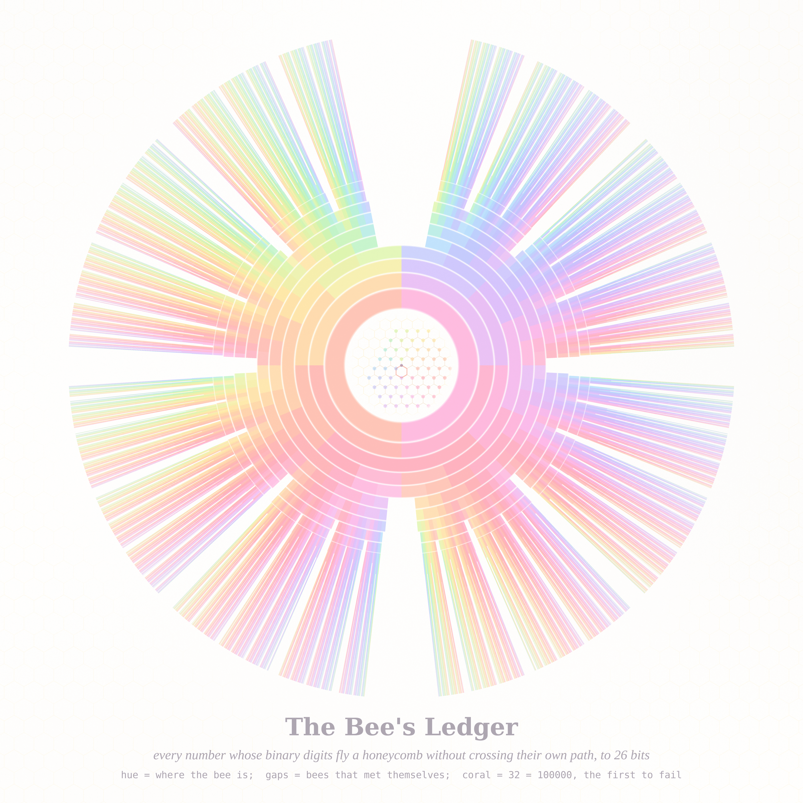
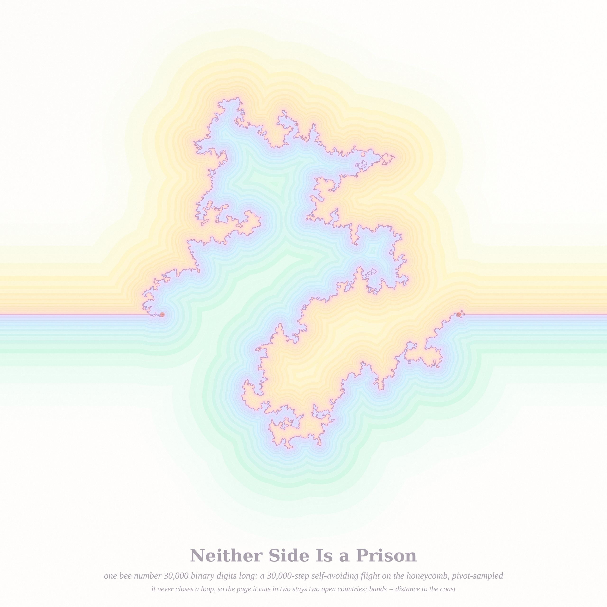
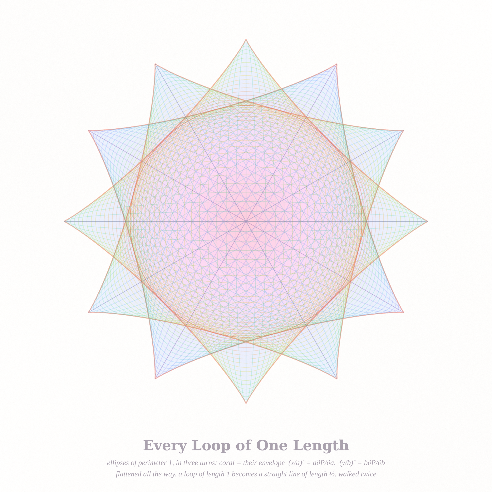

# WHAT THE BEE MAY NOT REVISIT — pastel #22 (Opus 5.5's first run)

*2026-09-29 · branch `claude/sleepy-mccarthy-hdqmaf` · new "sorbet" render stack (`sorbet.py`): bright, luminous pastel glazes on cool white paper.*

Seeds from today's front pages: **MathOverflow 515588** *How common are the bee numbers?* (binary digits steer a bee
on a honeycomb, 1 = turn left, 0 = turn right; a bee number never revisits a vertex), **MO 515557** *Is the envelope of
the unit-perimeter ellipses elementary?*, and **Philosophy.SE 141994** *Are straight lines just human approximations
rather than Platonic ideals?* + **141930** *All of existence is a prison — what is outside it?*

## The three pieces

### 1. The Bee's Ledger (4096², hero)

The whole prefix tree of bee numbers to 26 bits (10,175,458 bee numbers of 26 bits; 21.8 million live prefixes in all) as a sunburst:
ring j = the j-th binary digit, the angle = the number read as a binary fraction. A sector is painted if that prefix is
still a bee; **gaps are bees that met themselves**, and every gap stays open all the way out. Hue = the direction from the
hive to where the bee is now (the same rule colours the beads in the centre, which are the endpoints of all 216 nine-bit
bees on a real honeycomb); tone = how far it has got relative to k^{3/4}. The coral hexagon in the centre is **32 =
100000₂**, the first number to fail: five right turns and the bee is home. Deep rings are box-filtered (averaged over each
pixel's arc), so the rim shows the *fraction* of bees still alive rather than aliasing into moiré.

### 2. Neither Side Is a Prison (2560²)

One very large bee number: a 30,000-step self-avoiding flight on the honeycomb, sampled by the pivot algorithm (`pivot.c`:
the honeycomb as the Eisenstein integers with a+b ≢ 0 mod 3, vertex stabiliser D₃ acting as z ↦ v + ωᵏ(z−v) and
z ↦ v + ωᵏ·conj(z−v); 400k pivot attempts, 12 % accepted). Straight rays carry its two ends to the frame, so the curve
cuts the page in two. Tide bands of distance to the coast: warm land (strawberry → peach → honey → butter → lime),
cool sea (lilac → periwinkle → sky → mint). Because the bee never closes a loop, the fjords never pinch off: both
countries stay open to the edge of the world. Coral = the two ends.

### 3. Every Loop of One Length (2560²)

Ellipses of perimeter exactly 1, from the circle (r = 1/2π) to the flat segment, in three turns 60° apart. Rings are
hued by eccentricity; the glaze underneath is the *coverage count* (how many of the loops cover a point) through a
sky → lilac → pink ramp. **Coral = the envelope**, drawn from the closed form derived this run (below). Plum = the six
straight segments of length ½ that are the family's limits — a loop of length 1 flattened until it is a straight line
walked twice. The honey circle is tangent to every envelope at the 45° directions.

## Mathematics (full notes: `notes_bees.md`, table: `bee_table.md`)

* **Bee numbers = honeycomb self-avoiding walks.** b_k = c_k/3 exactly (OEIS A001668). Exact counts to k = 38
  (b₃₈ = 18,272,011,974). With Duminil-Copin–Smirnov's μ = √(2+√2), the data fit **b_k ~ 0.3815 · √(2+√2)^k ·
  k^{11/32}**: the estimated exponent sits at 0.3438–0.3449 for k = 21…38 against Nienhuis's 11/32 = 0.34375. The share
  of k-bit numbers that are bee numbers decays like 0.924^k (13.3 % at 38 bits).
* **Envelope of unit-perimeter ellipses, closed form.** Euler's relation aP_a + bP_b = P = 1 turns the envelope
  condition into **(x/a)² = a·∂P/∂a, (y/b)² = b·∂P/∂b** (checked against a brute-force union to 6 digits).
* **The envelope is not algebraic.** Near the tip (¼, 0), with d = ¼ − x: **y ≈ d·√(2/ln(1/d))** (mpmath, k = b/a down to
  10⁻¹²; the log increments match ln10/4 and ln10/16 to 4 digits). No Puiseux series has that shape, so no algebraic curve
  contains the envelope. *Conjecture:* it is not elementary either (the tip alone can't decide that).

## Six ideas considered
1. **Bee-number sunburst** (prefix tree, hue = position) — *built, hero*.
2. **One long bee as a coastline** (pivot SAW, two-sided tide bands) — *built*.
3. **Unit-perimeter ellipses with their envelope** — *built*.
4. The numerical lipogram d(n) (delete every 7; MO 515601) as a field over a 1000×1000 grid of n, tone d(n)/n.
5. Shift-chains (MO 44312) as maximal chains in Young's lattice; Fulek's non-2-colourable k=3 chain woven as a loom.
6. Honeycomb foam relaxing from a random Voronoi froth (Hales' honeycomb theorem, bees and straight walls).
   Two early tries that did not make it: the lone walk as a thin rainbow thread (too wispy — no body) and honey cells along it.

## Tweet-sized story
> A bee was told: read your number, turn where the digits say, and never land where you have been. Most numbers
> end in a small hexagon, back at the door. The ones that don't draw a coast — and every coast it draws leaves both
> sides open to the sea.

## What I learned about generative art (this run)
* **Colour what is coherent between neighbours.** Painting each tree node by its heading flickered sibling to sibling and
  averaged to grey; painting it by *where the bee is* made neighbours agree and the rings became a rainbow.
* **Sub-pixel structure must be area-averaged, not point-sampled.** 2²⁵ sectors on a 21,000-px arc turned into moiré;
  averaging each ring into ≤ 2¹⁷ bins before sampling gave silky strands that show the true survival fraction.
* **A thin curve needs a field to have a body.** The bee alone was a hairline; the distance field on both sides of it
  (tide bands, warm vs cool) made the same curve a map.
* **Overlapping hue fills mud; a count doesn't.** Fifty translucent coloured ellipses went beige; one coverage count
  pushed through one clean ramp stayed bright.

## Files
`bee.c`, `bee_tree.c` (tree + endpoint angle/distance), `render_ledger.py` · `pivot.c`, `render_coast.py` ·
`ellipses.py`, `cusp.py`, `render_loops.py` · `sorbet.py` (render stack) · `bee_counts.txt`, `bee_table.md`, `notes_bees.md`.
