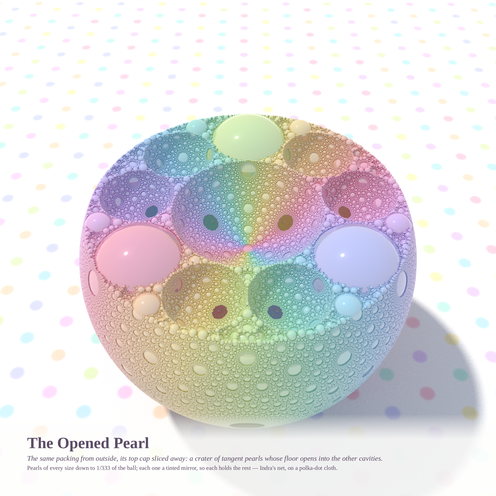

# INDRA'S PEARL — follow-up to *WHO WAKES UP* (Opus 5.5, 2026-10-06)

*Request: "could you build an Indra's pearls type thing with those beautiful marbles? just like something vast and
ambitious and wonderful."*

In the Avatamsaka Sutra, Indra's net hangs a jewel at every knot, and each jewel reflects all the others. Here the net
is a **3-D Apollonian sphere packing**: 394,684 mutually tangent pastel pearls filling a ball, every one a tinted
mirror with a nacre skin, ray-traced in a new C path tracer (`indra.c`). Remove the four largest pearls and each
leaves a cavity whose wall is a dome tiled by pearls of every size. Where a cavity touched the invisible outer sphere,
the pearls shrink toward that tangency point and leave an opening to the sky: an **oculus**, as in the Pantheon.

| piece | size | what it is |
|---|---|---|
| **394,684 Pearls and One Window** (hero) | 4096² | inside a cavity, looking up the rainbow dome to the oculus, with a shaft of sun falling through |
| **The Opened Pearl** | 2560² | the same pearl from outside, its top sliced away: a crater of pearls whose floor opens into the other cavities |

### 394,684 Pearls and One Window

### The Opened Pearl

## How it is built
* **Packing (`packing.py`).** Five mutually tangent spheres in 3-D satisfy the Soddy–Gosset relation (Σk)² = 3Σk², so
  swapping sphere i for its partner is linear: k′ = Σ_{j≠i} k_j − k_i, and the same for k·centre. Root: the unit
  sphere (k = −1) plus four equal spheres in a tetrahedron. The search runs over **quintuples**, deduplicated as
  sets of five spheres. Deduplicating spheres instead loses branches: a sphere borders many gaps, so the first two
  attempts undercounted (a tree that cycled, then a gap that shrank too slowly).
* **Checks.** Tangency error ≤ 3·10⁻¹¹; no overlaps (min pairwise gap −4·10⁻¹³ at r ≥ 0.02); everything inside the
  unit ball. Counting gives N(r ≥ 0.005) = 111,064 and N(r ≥ 0.003) = 394,688, a slope of **2.48**. The unfilled
  volume shrinks like r_min^0.53, so D ≈ 3 − 0.53 = **2.47**. Both match the known dimension of the 3-D Apollonian
  packing, ≈ 2.4739.
* **Renderer (`indra.c`).** BVH over spheres; tinted-mirror pearls with a Schlick weight and a diffuse nacre layer, so
  each reflection adds one pearl's tint (the colour of a point deep in a gap is the word of reflections that
  reached it). Polka-dot cloth, pastel sky with rainbow, soft sun, thin lens, OpenMP.
  * Inside the cavity, physically correct light (sun + sky through one small window) was dim and muddy: tinted
    mirrors multiplied to brown. So the interior uses **window light**: every pearl is lit from the oculus's position
    (unshadowed) plus a soft ambient. Direct sun stays shadowed, which leaves a real sunlit patch on the floor.
  * The **sunbeam** is single scattering along primary rays, rendered as a separate 1024² fog pass (48 spp) and
    added to the 4096² beauty pass (24 spp).
* **Colour.** Hue walks the sorbet wheel twice around the dome's vertical axis (`huemode=az turns=2`), so neighbours
  share hues and reflections never mix complementary colours into olive. Colouring by size went pink-and-brown;
  colouring by depth flickered.

## Variants on the way (in `protos/`)
Mirror ball of 3,479 pearls (the first light) → geode cut (a flat medallion; dropped) → a spiral of shrinking
pearl-balls on the cloth (candy, not vast) → **inside a cavity** (the oculus appeared) → size-hued (pink/brown) →
azimuth-hued (rainbow) → flat glow (no form) → glow through mirrors (muddy) → **window light** (form and pastel) →
fog with forward scattering (glare) → isotropic fog (**the beam**).
