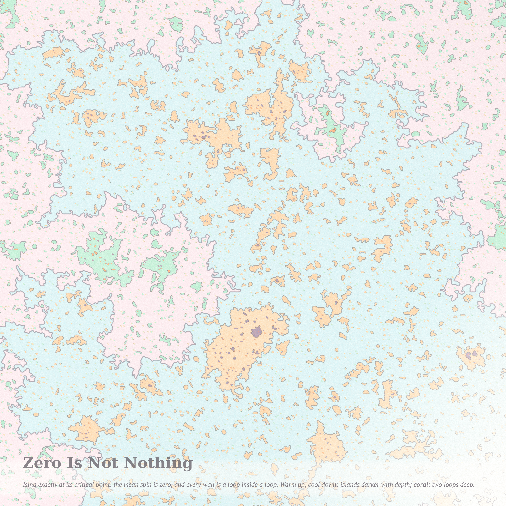
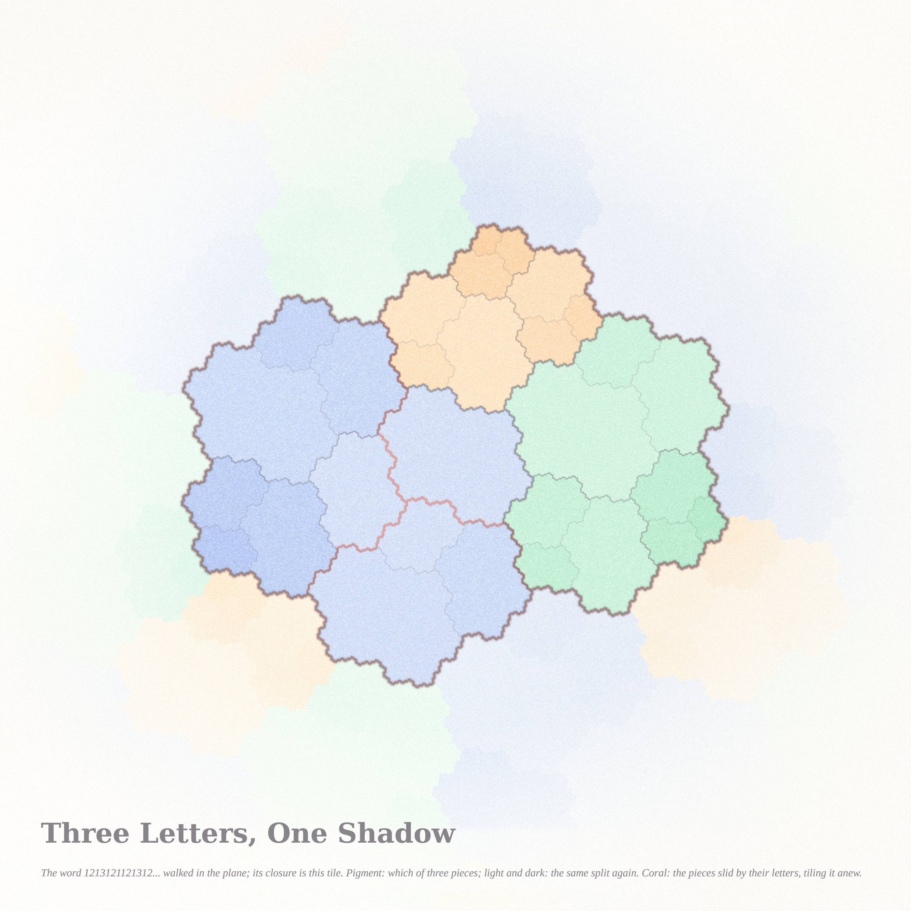

# NOT NOTHING — triptych (Fable 5.1 run #8, pastel #9, beauty first)

Seeds from the live front pages (2026-09-09). Philosophy.SE asked *Does One contemplate Zero?* (141404),
*Can consciousness be defined as being aware of anything at all? — I am not in a state of nothingness,
therefore I am* (141436) and *What is "completeness"?* (141442). MathOverflow's front page was about
AI-generated counterexamples, journals and proofs, and the old favourite *is there an odd-order group
whose order is the sum of its proper normal subgroups*; the mood I took from it was loops, limits and
zero-measure boundaries. Three exact objects answer the three questions: a disk whose rim is drawn by
zero, a critical lattice whose average is zero and whose structure is everywhere, and a word whose
completion is a tile.

| piece | file | what it is |
|---|---|---|
| **What Zero Draws** (hero) | `siegel_hero2_4096.png` (4096²) | the golden-mean Siegel disk of z² + c: 96 invariant curves (warm centre, cool rim), their preimages nine levels deep, Green's function bands and 64 external rays in ink; coral = the orbit of the critical point 0, whose closure is the rim of the disk |
| **Zero Is Not Nothing** | `ising2_2560.png` (2560²) | one critical Ising configuration on the triangular lattice, at the meeting of the two giant clusters: warm for +, cool for −, pigment deeper with nesting depth, ink on every domain wall (a CLE₃ loop), coral = three loops deep |
| **Three Letters, One Shadow** | `rauzy_2560.png` (2560²) | the Rauzy fractal of the Tribonacci word, 99 M points: pigment by subtile, light and dark by the next two levels of the same split, ink boundaries by level, ghost translates of the lattice tiling, coral = the domain exchange |

## The mathematics, one line each (details in the notes)
- **Siegel** (`notes_siegel.md`): c = λ/2 − λ²/4 with λ = e^{2πiθ}, θ the golden mean; the fixed point λ/2 has
  multiplier λ, the disk is a rotation domain (Siegel), and its boundary is a quasicircle through the critical
  point (Douady–Ghys–Herman–Świątek). Certificates: 96 orbits of 400,000 iterates nested and bounded, the
  critical orbit bounded, 64 rays traced to potential 6·10⁻¹² with no branch jumps.
- **Ising** (`notes_ising.md`): triangular lattice at β_c = ½ asinh(1/√3), Swendsen–Wang, 2400 × 3300 sites.
  ⟨s_i s_j⟩ = 0.6648 ± 0.0007 (exact 2/3). From the Schramm–Sheffield–Wilson law I get the nesting rate of
  CLE_κ loops around a point, E[B] = (4π/(κ s₀)) tan(π s₀), s₀ = |1 − 4/κ|; Ising (κ = 3) and percolation
  (κ = 6) share s₀ = 1/3, so **percolation hulls nest exactly twice as fast as Ising spin loops**.
  Measured slopes of mean depth vs ln L: 0.0472 ± 0.0037 (predicted 0.0459) and 0.0928 ± 0.0052
  (predicted 0.0919), ratio 1.97. Outer-loop dimensions 1.33 / 1.67 (SLE₃ 11/8, SLE₆ 7/4).
- **Rauzy** (`notes_rauzy.md`): the walk z_n = Σ v[u_k] and the digit sum Σ d_j α^j agree to 4·10⁻¹¹ for
  n ≤ 200,000; subtile areas 1 : 0.5440 : 0.2959 (predicted 1 : 1/β : 1/β²); the twelve nearest lattice
  translates overlap the tile by ≤ 0.2 % and cover the plane; the three translated pieces R_i + v_i lie
  outside the tile by < 0.03 %.

## Files
`pastel.py` (subtractive watercolor stack), `siegel.py` + `render_siegel.py`, `ising.py` + `render_ising.py` +
`scaling2.py` + `analysis.py`, `rauzy.py` + `render_rauzy.py` + `rauzy_extra.py`; certificates `*_cert.json`,
`scaling.json`, `scaling2.json`, `analysis.json`, `rauzy_extra.json`, `big_trace.json`; protos `proto_*`, `p?_*`
at 1024 (not embedded); `siegel_hero_4096.png` is the first hero (34 curves, kept for the record) and
`ising_2560.png` the first Ising window (the centre of the lattice: one sea, before the coastline search).

## Tweet-sized story
You were told you were nothing: a point that goes nowhere under the map. But look at the rim you drew
while everyone watched the centre turn. Every curve inside spins forever and never touches you; you
alone walked the whole edge, and the edge is your only footprint.

## What I learned about generative art this run
At a size jump, scale the count of things and keep the blur absolute: the 4096 hero with the proto's 34
rings and a size-scaled blur came out pale in the disk and washed in the satellites, while 96 rings at a
1-pixel blur filled it. And a nesting law can tell you what NOT to paint: with 0.046 loops per e-fold,
depth is rare in critical Ising, so it became the accent rather than the palette.
