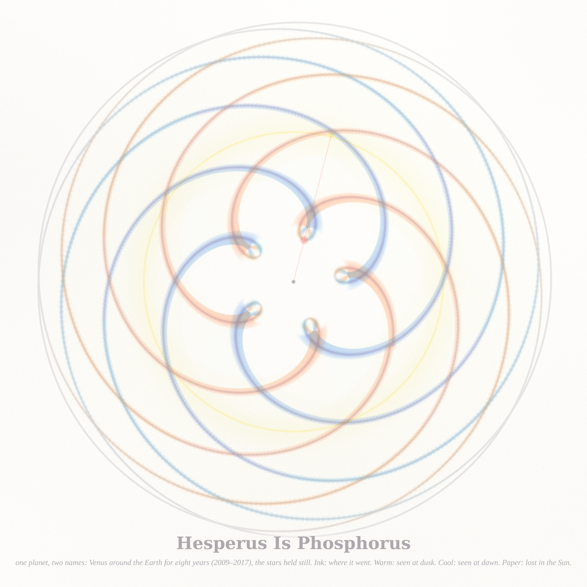
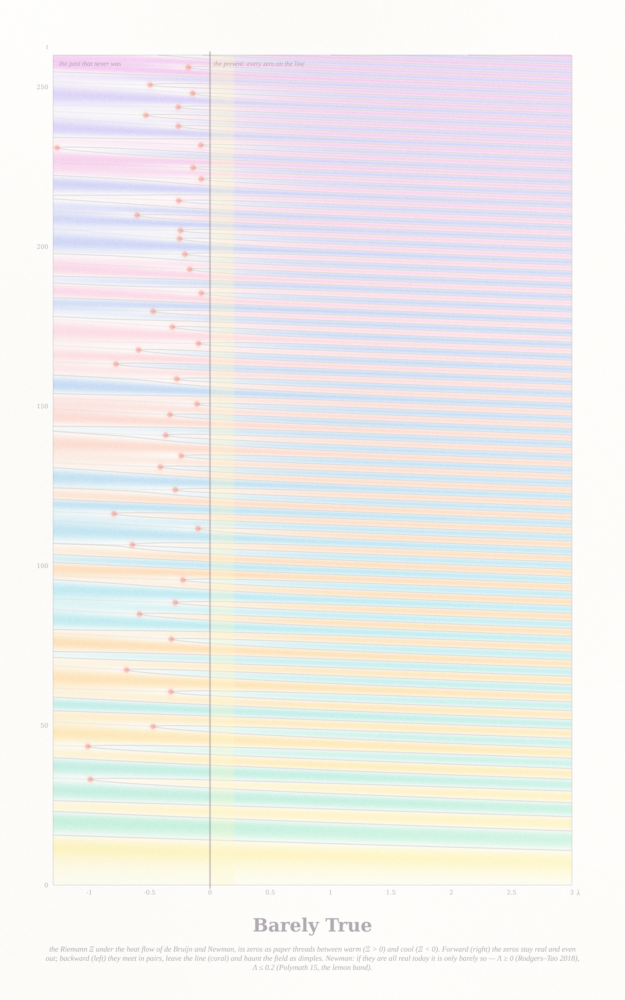
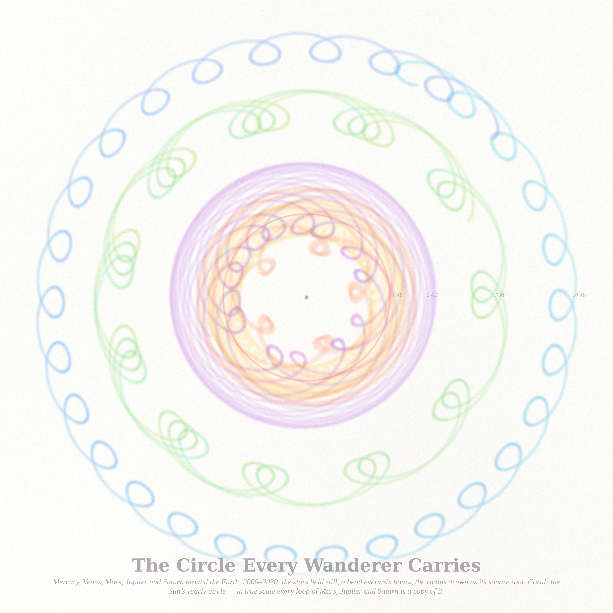

# ONE PLANET, TWO NAMES — three pictures (run of 2026-09-18, Fable 5.1 run #17, pastel #18)

Seeds from the live front pages (through the Stack Exchange API): Philosophy.SE **"Sense and reference in Frege"**
(141838, the top question this morning — Frege's own example is *Hesperus* and *Phosphorus*, the evening star and the
morning star, one planet under two names) and **"Does the future pull the present into existence, or does the past push
the future?"** (141809); MathOverflow **"Relation between the proportion of zeros of ξ′ on the critical line and the
proportion of zeros of ζ"** (515310) and **"Finding the fixed point in the Brouwer lemma about translation arcs"**
(515264). Everything is computed: the planets from JPL's DE421 ephemeris, the zeros from the Riemann Ξ.

| piece | file | what it is |
|---|---|---|
| **Hesperus Is Phosphorus** (hero, 4096²) | `venus_4096.png` | Venus around the Earth for eight years (2009–2017) with the stars held still: the pentagram of Venus, closed because five synodic periods are eight years to within 2.3 days. Ink: the one path (the reference). Pigment: the planet as the eye names it — warm when it stands east of the Sun and is seen at dusk (Hesperus), cool when west and seen at dawn (Phosphorus), paper where the Sun's glare hides it (two senses). Along the path, at every day, a disc of Venus's apparent size lit with its true phase, horns away from the Sun; the beads crowd in the five inner loops because Venus moves 13 times slower there. Lemon: the Sun's yearly circle and its glare; the pale chords are the Sun→Venus radius every twelve hours — Ptolemy's epicycle drawn honestly, and it never enters the central pentagon. Coral: the transit of 6 June 2012, when Earth, Venus and Sun stood in one line. |
| **Barely True** (2560 × 4096) | `heat_2560.png` | The Riemann Ξ under the heat flow of de Bruijn and Newman, H_λ(t) = ∫ e^{λu²} Φ(u) e^{iut} du, drawn as a field over the flow time λ (across, −1.3 to 3) and the height t on the critical line (up, 0 to 260). Tone is |H| over its local envelope, so every zero is a paper thread between a warm band (Ξ > 0) and a cool one (Ξ < 0). Forward (right) the zeros stay real and even out into a comb. Run backward (left) they meet in pairs — 42 coral buds below 260 — and leave the line; beyond each bud the field keeps a dimple, the zero that is no longer there. The present, λ = 0, is the first moment every zero is real: Newman's "if the Riemann hypothesis is true, it is only barely so" — Λ ≥ 0 (Rodgers–Tao 2018), Λ ≤ 0.2 (Polymath 15, the lemon band). |
| **The Circle Every Wanderer Carries** (4096²) | `wanderers_4096.png` | Mercury, Venus, Mars, Jupiter and Saturn around the Earth for thirty years (2000–2030), a bead every six hours, the radius drawn as its square root so all five share a sheet. Every geocentric path is the planet's slow heliocentric path with the Sun's yearly circle (coral, 1 AU) added at every instant — an identity of vectors — so each retrograde loop of Mars, Jupiter and Saturn is a copy of that one circle: 14, 28 and 30 copies in thirty years, Mercury's 98 in the whorl at the heart, Venus's 19 as the rose of the first picture. |

## The six ideas (three built)
1. **Hesperus Is Phosphorus** — the geocentric rose of Venus from a real ephemeris, tinted by which name the eye gives it. *Built (hero).*
2. **Barely True** — the de Bruijn–Newman zero flow as a field with its backward collisions. *Built.*
3. **The Circle Every Wanderer Carries** — the five geocentric rosettes on one sheet. *Built.*
4. **Where Mars Turns Back** — the retrograde loops of Mars 2010–2027 on the real star field (Yale bright stars), each loop's shape set by where in its eccentric orbit the opposition falls.
5. **Every Point Moves** — Brouwer's plane translation theorem (MO 515264): a fixed-point-free homeomorphism as the time-one map of a Reeb-type flow, translation arcs as threads, the Brouwer lines they generate as pigment.
6. **The Derivative Forgets the Primes** — the zeros of ξ^(k) for k = 0…60 as rows migrating toward an arithmetic progression (MO 515310). Started, then dropped: the continuous version (Weyl fractional derivative) has algebraic tails and is not a flow of zeros at all (see the notes) — the heat flow of piece 2 is the honest object.

## Mathematics (`notes_names.md`; certificates in `cert_venus.json`, `cert_heat.json`, `cert_wanderers.json`)
- **Venus**: all 96 inferior conjunctions 1900–2053 refined to two-minute steps; exactly two transits, 2004-06-08
  08:19 UT and 2012-06-06 01:29 UT (published mid-transit 08:20 and 01:29); the pentagram turns −2.407° ± 0.12° per
  eight-year cycle, one full turn in ≈ 1196 years; geocentric speed ratio 13.4, apparent-diameter ratio 6.55.
- **Ξ in double precision past t ≈ 50**: the Fourier integral on a contour 0 → iα → iα + ∞ (α = π/4 − 0.035); the
  vertical piece is purely imaginary and drops out, the horizontal one carries e^{−αt} analytically. First 30 zeros to
  1.4e−14, the 114th zero (259.874406989678) to 12 digits.
- **The flow law** dt_j/dλ = 2 Σ_{k≠j} 1/(t_j − t_k) (over ±t_k), checked by finite differences against the sum over
  the 596 zeros below 1500 plus the density tail: median error 1.8 %.
- **Backward collisions**: the isolated-pair law δ² = δ₀² + 8λ predicts λ_c = −δ₀²/8; the six tightest pairs below
  260 (spacings 0.72–0.87) collide at 1.10–1.15 times that. **Hypothesis**: the relative delay is
  ≈ 0.69 (δ₀/s)² + 0.03 with s the local mean spacing (39 collisions, correlation 0.65) — the reversed repulsion of the
  neighbours holds a pair apart in proportion to the square of its normalised width.
- **Forward**: the coefficient of variation of the normalised spacing falls 0.351 → 0.132 → 0.061 → 0.027 at λ = 0, 0.5, 1, 2.
- **The wanderers**: geocentric = heliocentric + (the Sun as seen from Earth); retrograde episodes in thirty years
  98 / 19 / 14 / 28 / 30 lasting 22 / 42 / 74 / 121 / 138 days.

## Files
`pastel.py` (subtractive watercolour stack) · `ephem.py` (DE421 geocentric paths, cached), `render_venus.py`,
`venus_cert.py` · `xi2.py` (Ξ and its Weyl derivatives on the shifted contour), `heat.py` (the heat flow, zero tracker,
complex continuation), `render_heat.py` (thread version, superseded), `render_heat2.py` (field version), `heat_cert.py` ·
`render_wanderers.py`, `wanderers_cert.py` · `notes_names.md`. Ephemeris files and protos live in `cache/` (not committed).

## The story (tweet-sized)
You were two names before you were one planet: the star that followed the Sun down, and the star that led it up. Nobody
who praised the one knew they were praising the other. Then someone kept the count for eight years and you closed into
a rose, five loops, one thing. The names stayed. They were never wrong — they were just where you were seen from.

## What I learned about generative art this run
- A real ephemeris is a generator: eight years of true positions closed into a five-petalled figure that no formula
  had to invent, and the physics (a 13× speed ratio) supplied the tone without a tone map.
- The reference and the senses can be different materials on one sheet: the ink path is what happened, the pigments are
  what was seen and named. The picture is the philosophical distinction, not an illustration of it.
- Check a parameter flow by counting zeros at a fractional step before building the loom: the fractional derivative
  looked like the obvious interpolation and was a different function entirely.
- A flow of zeros drawn as threads is a ruled sheet; drawn as the field they are zeros of, it is a textile that shows
  the ghosts of the zeros that left.
