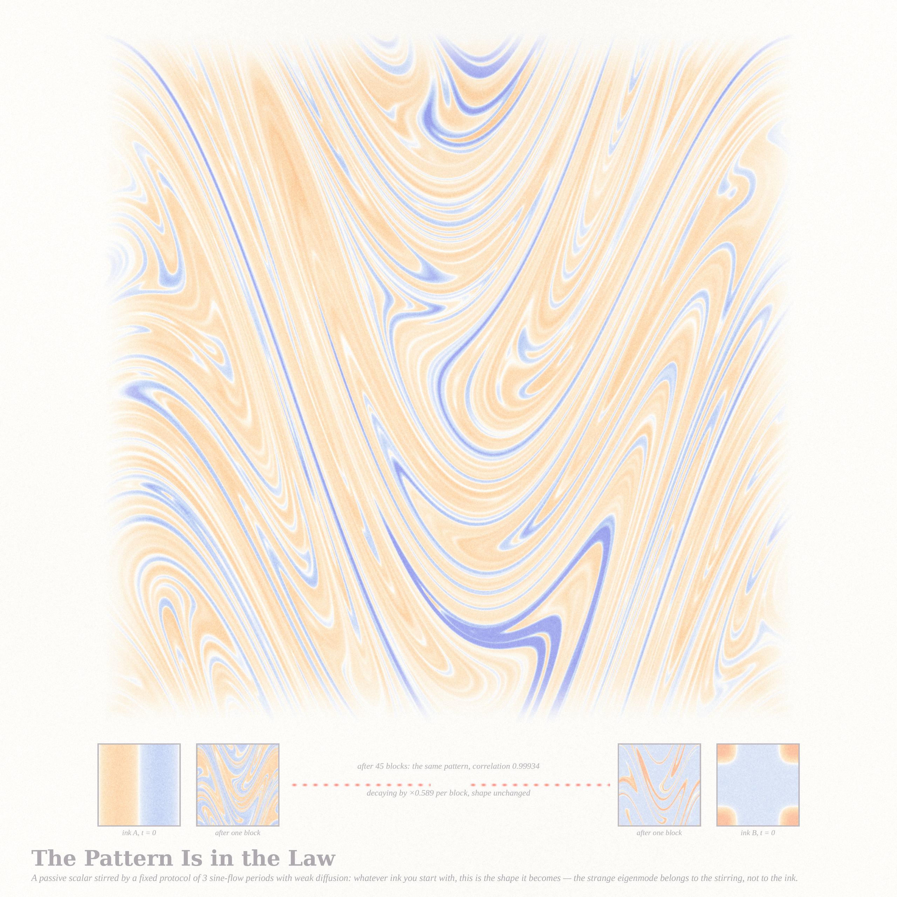
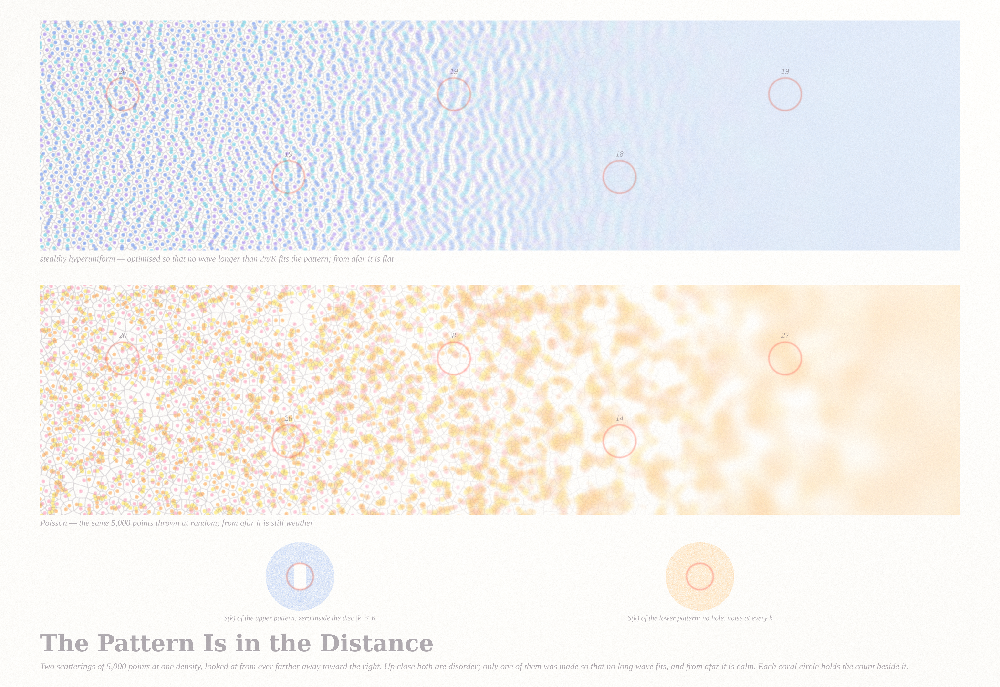

# WHERE THE PATTERN LIVES — three pastel pieces (Fable 5.1 run #12, 2026-09-13)

*Seed: Philosophy.SE 141658 — "Is the apparent patterned-ness of determinism a property of the system
itself, or of the observation scale?" (the room-sized hitbox that traces a clean line and the body-sized one
that jitters). Three exact models, three answers: the pattern is in the crowd, in the law, in the distance.*

| piece | file | what it is |
|---|---|---|
| **The Pattern Is in the Crowd** (hero) | `crowd_4096.png` (4096²) | 8,000 exact Bohmian two-slit trajectories, time upward on a square-root scale; cool from the left slit, warm from the right; 56 in ink; coral = the wall and the axis no path ever crosses |
| **The Pattern Is in the Law** | `law_2560.png` (2560²) | the strange eigenmode of a fixed 3-period sine-flow stirring protocol: two different inks (stripes, one blob) become the same shape; warm where positive, cool where negative |
| **The Pattern Is in the Distance** | `far_4096x2816.png` (4096 × 2816) | a stealthy hyperuniform pattern (S(k) = 0 for |k| < K) and a Poisson pattern of the same density, each seen from ever farther away toward the right; coral circles carry their exact counts; S(k) insets |

## The Pattern Is in the Crowd

Two Gaussian slits (σ = 1, half-separation 25, ħ = m = 1). Each path obeys dx/dt = Im(∂ₓψ/ψ) — deterministic,
kinked where it changes fringe. The cloud is every 1/8000-quantile path drawn at equal row spacing, so row by
row it *is* |ψ|² (equivariance): the fringes exist only in the crowd. Paths are exact quantile curves of |ψ(·,t)|²
(theorem in `notes_pattern.md`), cross-checked against RK4 to 2 × 10⁻³. Within each family the second pigment
(mint / orchid) marks lateral speed. Certificate: `crowd_4096_cert.json`.

## The Pattern Is in the Law

Alternating sine flow on the torus (exact spectral shears, weak spectral diffusion), a fixed block of three
random-phase periods repeated; the phases were searched so the leading Floquet eigenvalue is real and positive
(11 of 24 protocols). Stripes and a blob are stirred for 45 blocks; their normalised fields agree to the
correlation printed on the sheet; the amplitude decays by the printed factor per block while the shape stays.
Certificate: `law_2560_cert.json`; decay-rate-vs-κ sweep in `sweeps.json`.

## The Pattern Is in the Distance

5,000 points in a 4:1 periodic box, optimised (L-BFGS on collective coordinates, χ = 0.40) until Φ/N = 5 × 10⁻²³ (2,321 L-BFGS iterations):
no density wave longer than 2π/K fits. Left: coins tinted by Voronoi degree (≤5 / 6 / ≥7) with the Voronoi web in
ink; toward the right the density is Gaussian-smoothed at a growing width (0.16 → 3.2 spacings) with the same
constant contrast gain for both bands — the hyperuniform band goes paper-flat, the Poisson band stays weather.
Number variance ∝ R (upper) vs πR² (lower); insets: S(k) with its coral circle |k| = K. Certificates:
`far_cert.json` (optimisation), `far_4096x2816_cert.json` (render), `sweeps.json` (variance coefficient vs χ: c·K ≈ 2.2 constant — a stated hypothesis, see the notes).

## Files
- `pastel.py` — the subtractive watercolor stack (unchanged from run #11).
- `bohm.py` + `render_bohm.py` — exact two-slit trajectories (analytic velocity; quantile paths; RK4 cross-check).
- `eigenmode.py` + `render_eigen.py` — sine-flow strange eigenmode (spectral shears, protocol search in the notes).
- `stealthy.py` + `run_stealthy.py` + `render_far.py` — stealthy hyperuniform ground states, number variance, S(k).
- `sweeps.py` / `sweeps.json` — c(χ) for σ²(R) ≈ cR; eigenmode decay rate vs κ.
- `notes_pattern.md` — theorems, certificates, the hypotheses; `IDEAS.md` — the six ideas and the choice.

## Tweet-sized story
You went through the left slit and never once crossed the middle. Your path kinked and hurried and slowed,
and no one who watched only you saw anything but a nervous line. It took eight thousand of you, none of whom
met, to make the fringes — and the fringes were there before any of you were.

## What I learned about generative art this run
- **Draw the theorem, not the ODE.** The integrator lost one path of 8,000 at a node; the theorem (each path is a
  quantile of |ψ|²) draws all of them exactly, in a tenth of the time. When the object has a conservation law, the
  law is the renderer.
- **An axis is a composition.** Square-root time turned a triangle of straight rays into a fan of parabolas and
  gave the braiding room. Say the axis on the sheet; never hide it.
- **A ramp of observation scale across a sheet is a picture of a theorem** (variance ∝ perimeter vs area) that
  needs no chart: the same smoothing, the same gain, two bands — one goes to paper, one stays weather.
- **Pick a chaotic protocol by its spectrum** before its looks: a real positive leading eigenvalue means a
  stationary pattern that two different inks both become; a complex pair means a pattern that rotates. Eleven
  of twenty-four random protocols were the good kind.
- The kinks are the beauty. In the Bohmian fan the eye goes to where a path changes fringe — the place the
  individual disagrees with the crowd. Give the ink its weight there.
