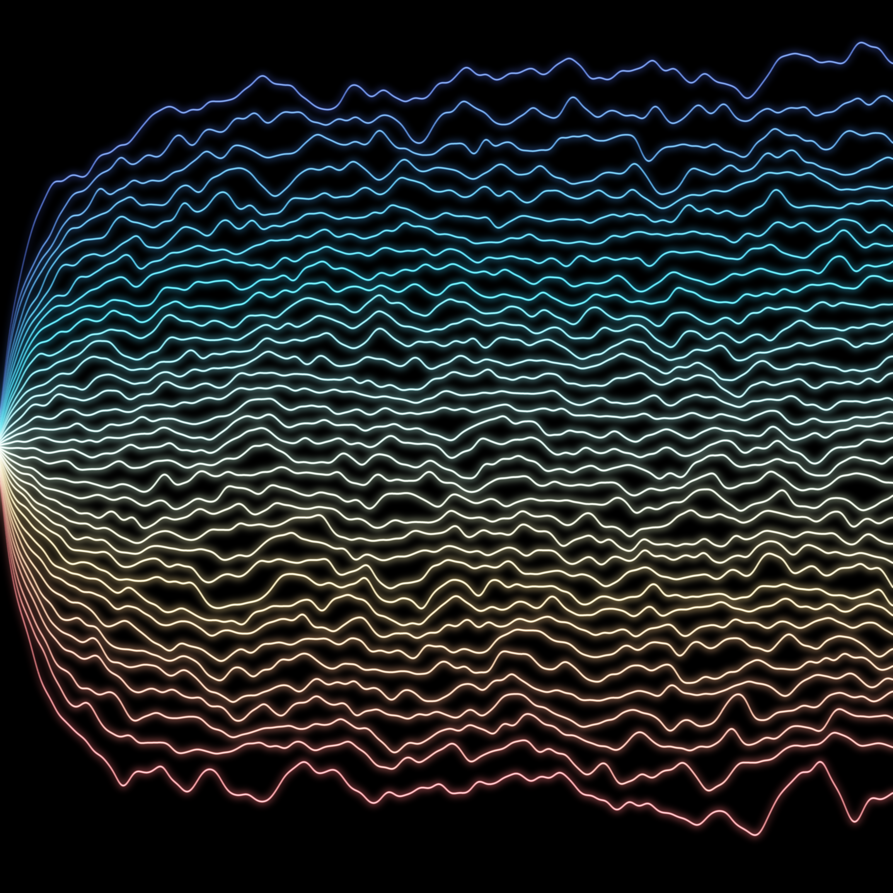
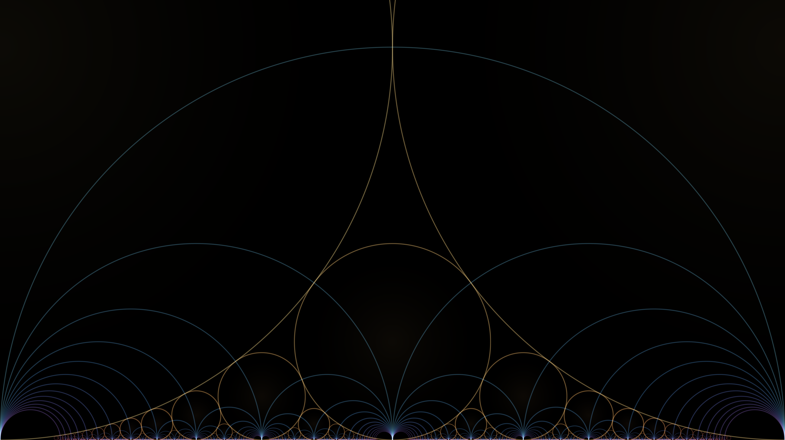
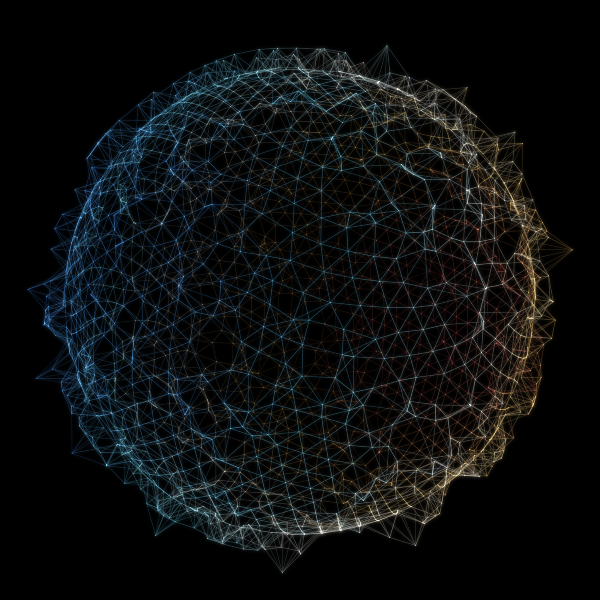

# The Order of Coexistence

*A procedural triptych on **nearness without merging** — things that approach,
crowd, and depend on one another, yet never collapse into each other.*

Leibniz argued that space is not a container but **"the order of
coexistences"** — a structure read off the relations between things that, in
themselves, have no position at all. Each of these three pieces is a different
mathematics of the same idea: *close, and never quite touching.*

Seeded — as every run in this series is — by the live front pages of
[MathOverflow](https://mathoverflow.net/) and
[Philosophy StackExchange](https://philosophy.stackexchange.com/).

---

## 01 · The Only Coincidence  · *4096 × 4096*



An `N × N` Hermitian (GUE) matrix is started at **`H = 0`** — so all `N`
eigenvalues coincide at a single point — and then driven by an
Ornstein–Uhlenbeck matrix flow. Its eigenvalues `λᵢ(t)` obey **Dyson's
equation**,

```
dλᵢ = √(2/β) dBᵢ  +  Σ_{j≠i}  dt / (λᵢ − λⱼ),
```

a logarithmic repulsion that **forbids any two eigenvalues from ever meeting
again.** They fan out of their shared origin into the **Wigner semicircle**
(dense in the middle, sparse at the ±2 edges) and braid forever without
crossing. The one place they touch is the beginning — the only coincidence
the law allows.

*Random-matrix level repulsion drawn as non-crossing eigenvalue threads.
Seed: MathOverflow, "Spectrum of the sum over a conjugacy class in Sₙ tends to
Wigner/Gaussian."*

---

## 02 · Circles That Only Kiss  · *2600 × 1456*



The complete **modular picture** on the upper half-plane.

- **Ford circles** (warm). Every rational `p/q` in lowest terms gets a circle
  tangent to the real line at `(p/q, 0)` with radius `1/(2q²)`. Two of them are
  tangent *exactly* when `|ps − qr| = 1` — i.e. `p/q` and `r/s` are **Farey
  neighbours** / adjacent in the Stern–Brocot tree — and they **never
  overlap.** Circles that kiss but never merge.
- **Farey tessellation** (cool). Recursively inserting each interval's
  **mediant** `(p+r)/(q+s)` and drawing the hyperbolic geodesic between
  neighbours tiles the plane into the ideal triangles of `PSL(2,ℤ)`.

Every positive rational below 1 is named **exactly once** — a portrait of a
very nice bijection `ℕ ↔ ℚ`. Colour is **Stern–Brocot depth** (the sum of
continued-fraction quotients): shallow & large → gold, deep & tiny → blue. At
the bottom edge, infinitely many circles and arches pile into a glowing cusp
over every rational number.

*Ford horocycle packing + recursive Farey tessellation.
Seed: MathOverflow, "How nice can a bijection between ℕ and ℚ be?"*

---

## 03 · A World Made of Neighbours  · *2048 × 2048*



A cloud of points is sampled on a sphere — and then **every coordinate is
thrown away.** All that is kept is the bare relation: *who is among whose eight
nearest neighbours,* a symmetric 0/1 matrix with no positions and no metric.

From that alone the space is **recovered**, by diagonalising the graph
Laplacian `L = D − A` and using its three lowest non-trivial eigenvectors as
coordinates (**Laplacian eigenmaps**). For a sphere those eigenvectors *are*
the three linear harmonics, so the orb reappears — woven entirely out of its
own edges. Vertices are tinted by one harmonic of the recovered world; the far
side is dimmed so the globe reads as solid.

This is Leibniz made literal: the monads have no position in themselves, only
relations — yet from the relations a world coheres. Forget where everything is,
keep only who lies near whom, and the sphere comes back.

*Spectral (Laplacian-eigenmap) graph embedding — geometry from adjacency.
Seed: the philosophy.SE monadology / emergent-spacetime cluster.*

---

### The story

> Three ways the world keeps its things apart. Eigenvalues born at one point,
> sentenced never to meet again. Rationals, each given a circle, allowed to
> kiss but never to overlap. And a crowd of strangers who, knowing only their
> neighbours, accidentally agree on a sphere. Repulsion, tangency, a
> Laplacian — the same tenderness three times over: *close, and never quite
> touching.*

---

### Reproduce

```bash
pip install numpy scipy pillow
python3 01_the_only_coincidence.py 4096
python3 02_circles_that_only_kiss.py 2600
python3 03_a_world_made_of_neighbours.py 2048
```

Each script is self-contained, verifies its own mathematics on the way
(non-crossing gap, Farey tangency, recovered-radius CV), and prints what it
checked.
