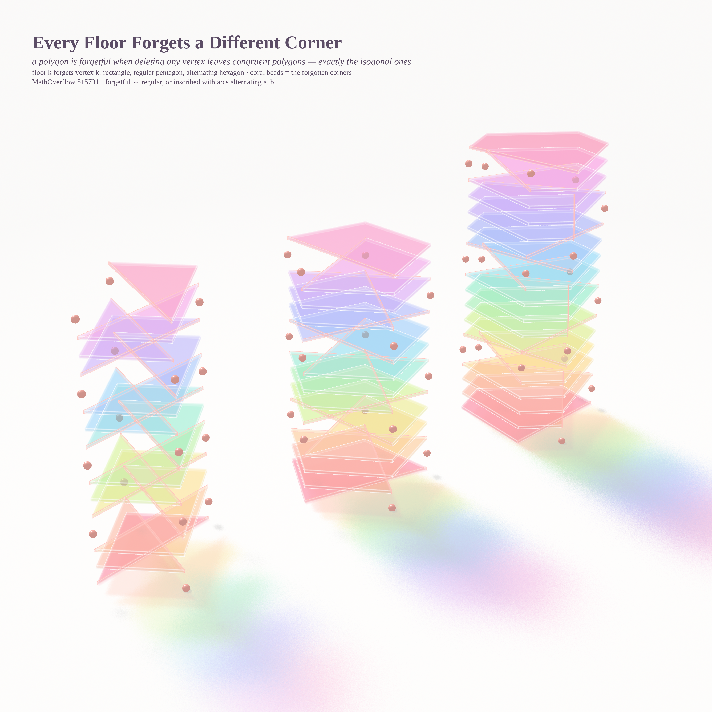
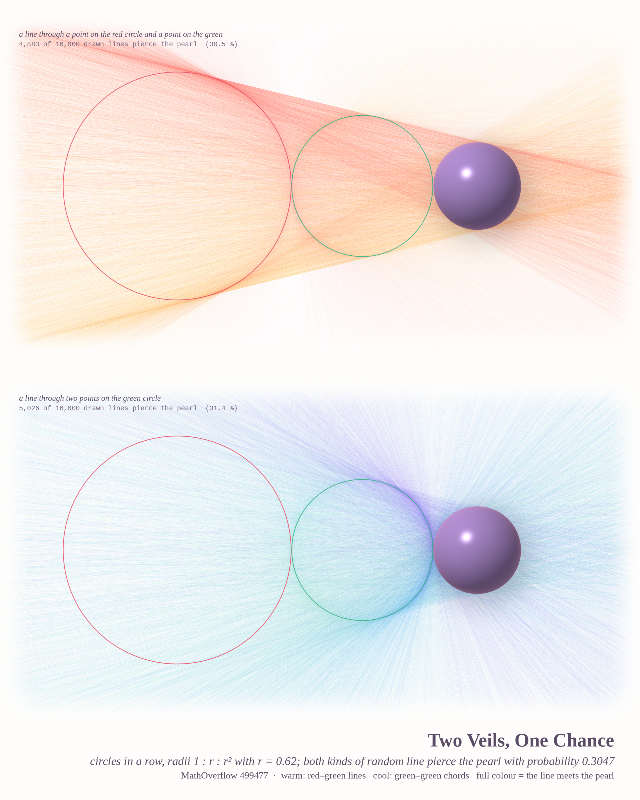
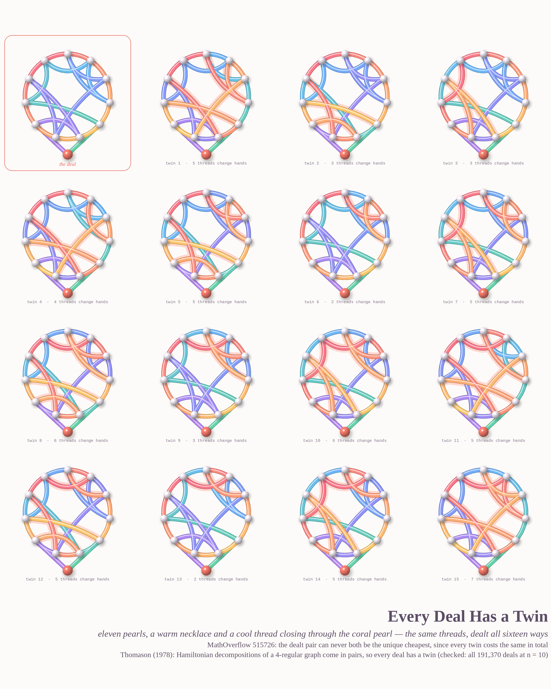
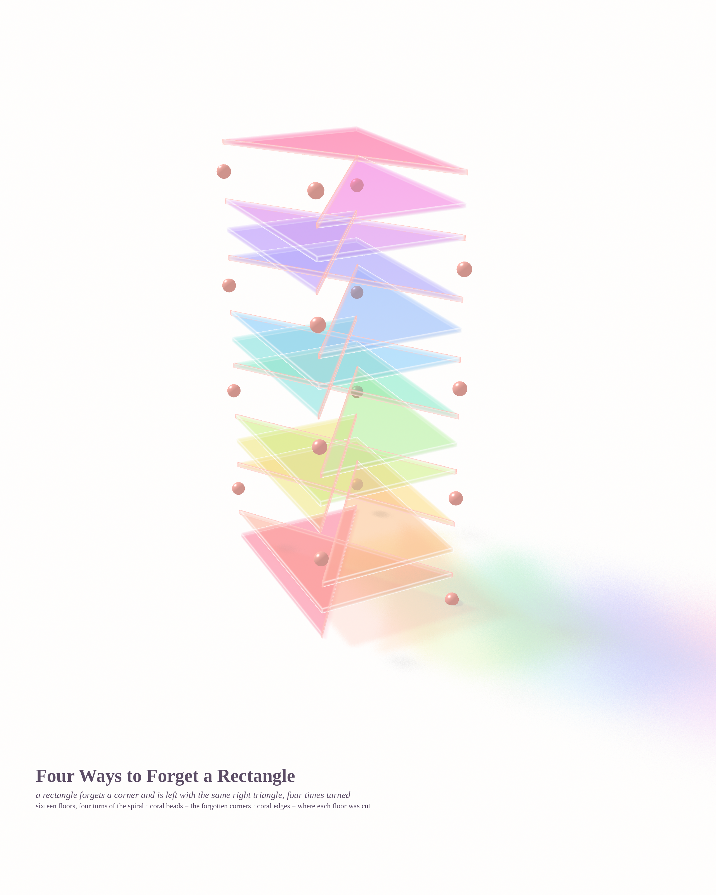

# BEAUTY SEEKS REASON — pastel #28 (Opus 5.5, run 7, 2026-10-05)

> *"Reason seeks beauty, just as beauty seeks reason."* — Phil.SE 142363, **Beauty or reason?**

The brief this time: bright pastel colours, with beauty as the first priority. All three subjects come from this week's MathOverflow
front page. In each one a purely logical condition ends up forcing a pretty, symmetric answer.

| piece | size | source |
|---|---|---|
| **Every Floor Forgets a Different Corner** (hero) | 4096² | MO 515731 *Which polygons are forgetful?* — **solved here** |
| **Two Veils, One Chance** | 2560×3200 | MO 499477 *Why do these two lines have the same probability…* |
| **Every Deal Has a Twin** | 2560×3200 | MO 515726 *Can adding one vertex change every edge of the shortest Hamiltonian cycle?* — **answered here (no)** |
| **Four Ways to Forget a Rectangle** (go-deeper) | 2560×3200 | the hero's simplest member, alone |

## Every Floor Forgets a Different Corner

A polygon is *forgetful* when deleting any one of its vertices leaves congruent polygons.
**Theorem (this run):** the forgetful polygons are exactly the **isogonal** ones: the regular polygons, and the
2m-gons inscribed in a circle whose arcs alternate a, b. (The proof counts minimal arcs; see `notes_math.md`.)
There are three glass towers, one per family member: a rectangle, a regular pentagon and an alternating hexagon. Floor k
of a tower is the polygon with vertex k forgotten. Every floor is the same plate turned, so the missing corner climbs
a spiral, and a coral bead floats where each forgotten vertex used to be. The rainbow shadows come from the
Beer–Lambert tint of each plate. Engine: `render_tower.py` (convex prisms by half-spaces, numpy ray tracer, strip-parallel).

## Two Veils, One Chance

The configuration is three circles in a row: red (1), green (r), black (r²). Warm veil: 16,000 random lines through a point of red and a
point of green. Cool veil: 16,000 lines through two points of green. Lines that pierce the pearl are drawn in full
colour, the misses are faint. The two veils look nothing alike, yet both pierce with probability **0.3047** (r = 0.62).
The equality is not pointwise in B; it holds only on average. `render_veils.py`.

## Every Deal Has a Twin

Eleven pearls, with a warm Hamiltonian necklace and a cool Hamiltonian thread that closes through a coral pearl. The same
threads can be dealt in **16** ways: the original deal plus 15 twins. Every twin has the same total weight, so the original pair
cannot be the unique cheapest on both sides. **Answer to MO 515726: no.** Contract the coral pearl to an edge
and the threads become a 4-regular graph. Thomason (1978) proved that Hamiltonian decompositions of such a graph come in pairs. I also checked it by
direct census: every one of the 191,370 deals on 10 pearls has a twin, an LP shows that no weights exist for n ≤ 9, and the twin count is
always odd. `ham_*.py`, `render_deal.py`.

## Four Ways to Forget a Rectangle

This is the simplest forgetful polygon with its own tower. A rectangle that loses a corner leaves the same right triangle, turned. Sixteen floors make four turns of the spiral, and the diamond windows open where consecutive floors miss different corners.

## Six ideas (three built, plus one go-deeper)
1. **Forgetful glass towers** (MO 515731): built as the hero.
2. **Two veils of random lines** (MO 499477): built.
3. **Every deal has a twin** (MO 515726): built.
4. Narayana parity lace (MO 515413): the identity was verified to n = 512, but the triangle is a Sierpiński variant, so it was dropped as too familiar.
5. The fly and the honey pot (MO 499431): random piles drawn as a river delta on the simplex. Not built.
6. Lipogram staircase (MO 515601): the delete-every-7 map as a devil's staircase. Not built.

## Tweet
> A polygon wanted to be remembered no matter which corner it lost. Reason told it the price: every corner
> must look like every other. So it became a tower of glass, and each floor forgot a different corner while
> the tower stayed the same.

## Note on generative art (carried forward)
Beauty and legibility both came from **showing the whole orbit, not one instance**. That means every deletion stacked as
floors, every random line drawn edge to edge, and every way of dealing the same threads. When a theorem says "all
of these are the same", show all of them and let the viewer see that they are.
