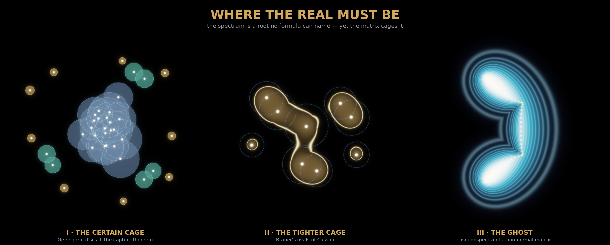

# Where the Real Must Be

*Run `claude/determined-tesla-n4fogv` · 2026-07-13 · a triptych on spectral localization*

An eigenvalue is a root of a matrix's characteristic polynomial. By **Abel–Ruffini**
there is no formula, no finite tower of radicals, that names it once the matrix is
5×5 or larger. You cannot *write down* where the spectrum is. And yet the matrix
carries the answer in plain sight: its diagonal is your naive guess for each
eigenvalue, its off-diagonal entries are your uncertainty, and a chain of theorems
turns that uncertainty into a **cage the truth cannot leave**.

That is the whole epistemology of the spectrum, and it answers the philosophy front
page this run was seeded from — *What Privileges the Real?*, *how do we detect
absurdity given the egocentric predicament?* You never touch the real directly. You
fence the dark with things you *can* compute until the truth has nowhere left to hide.

Seeded from the **live MathOverflow front page** (*"Gershgorin's 2nd theorem
(disjoint circles): elementary proof?"*) and the **live Philosophy.SE hot list**.

---

## I · The Certain Cage — Gershgorin discs & the capture theorem
`gershgorin_I_the_certain_cage.png` — 4096×4096

Every eigenvalue of `A` lies in the union of the **Gershgorin discs**: disc `i` is
centred at `a_ii` with radius `R_i = Σ_{j≠i} |a_ij|` (the off-diagonal row sum). The
translucent steel haze is that union — your uncertainty, depth = how many discs overlap.
The white-hot points caught in the spirograph net of disc boundaries are the true
eigenvalues: **the real, blazing where no formula could place it.**

The **second theorem** (the live MO question) is the composition itself: a connected
component built from `k` discs contains *exactly* `k` eigenvalues. So the nine isolated
**gold jewels** each cage exactly one resolved eigenvalue; the three **teal pairs** each
overlap only their partner and cage exactly two; the central **steel bath** of 22 fused
discs holds exactly 22 contested eigenvalues. Colour = component size = how resolved the
truth is. *Verified in code:* every eigenvalue inside its cage, and every component's
capture count equal to its disc count — `[(1,1)×9, (2,2)×3, (22,22)]`.

## II · The Tighter Cage — Brauer's ovals of Cassini
`gershgorin_II_the_tighter_cage.png` — 2560×2560

Brauer sharpened Gershgorin: every eigenvalue lies in some **Cassini oval**
`|z − a_ii|·|z − a_jj| ≤ R_i R_j` for a pair `i ≠ j`. These are lemniscates — they
fuse into golden peanuts where two centres sit close, and shrink to tight eyes around a
lonely one. The Brauer set is *strictly inside* the Gershgorin set (drawn here as the
faint steel ghost-discs): the cage **warms toward gold as it tightens onto the truth**.
The two loners show it plainly — a big blue disc, but the gold oval hugs the eigenvalue
close. *Verified:* Brauer containment holds, and the Cassini union sits inside the disc
union at every sampled point.

## III · The Ghost — pseudospectra of a non-normal matrix
`gershgorin_III_the_ghost.png` — 2560×2560

The cages say where the spectrum **must be**. Pseudospectra say where it could **go**:
`σ_ε(A) = { z : σ_min(zI − A) ≤ ε }` — exactly the eigenvalues of some `A + E` with
`‖E‖ ≤ ε`. For a **non-normal** matrix (here the Grcar Toeplitz) the eigenvalues sit on
a tight gold comma-curve, but the ε-pseudospectra bulge into a vast cyan cloud: the
spectrum is a **ghost**, pinned in place yet fleeing at the faintest perturbation. Density
is the resolvent norm `1/σ_min`; the nested shells are decades of ε. *Verified:*
`σ_min = 6×10⁻¹⁰` at an eigenvalue on the grid (a true zero of the resolvent).

## Bonus · The Capture Dance
`capture_dance.gif` — 720×720, 60-frame loop

The hero states the 2nd theorem; this animates it. Three cages breathe: when disjoint,
each holds exactly one eigenvalue (gold, resolved); as a coupling grows two discs merge
into one component that now holds two (teal) — and you watch the two eigenstars get
*caught together*, then freed as the cage shrinks. The colour is recomputed live from the
component structure every frame, so the theorem literally choreographs the loop. Six gold
jewel-witnesses stay resolved throughout.

---

## The story

> Three portraits of a truth no formula can name. An eigenvalue is a root Abel forbade
> us to write; still the matrix cages its own secret — draw the discs from its rows and
> the answer *must* lie inside. Tighten them to lemniscates and the cage hugs closer.
> But tilt the matrix off-balance and the spectrum turns to ghost: fixed, yet fleeing at
> a touch. We never see the real. We only fence the dark until it can't hide.

## What I learned about generative art (carried to memory)

- **Draw the cage, not the answer.** When the true object is uncomputable/measure-zero
  (an eigenvalue, a root), render the *provable enclosure* as translucent haze and let
  the truth blaze as a point inside it — the theorem becomes the composition and the
  brightest thing on the canvas is the thing you couldn't compute.
- **Component structure is free composition.** A union-find over overlapping discs, with
  colour = component size, self-sorts a random matrix into jewels / pairs / bath — the
  2nd Gershgorin theorem *is* the layout, no hand-placement needed.
- **A smooth scalar field can be computed coarse and upsampled.** `σ_min(zI−A)` is
  Lipschitz, so a 560² SVD grid cubic-zoomed to 2560² is indistinguishable from native —
  the expensive part stays bounded while the canvas goes large.

## Files
`hero.py` · `panel2.py` · `panel3.py` · `kit.py` (shared rasteriser) · `verify.py`
(theorem checks) · `make_sheet.py`. All math verified before pixels; `variants/` holds
the iteration trail.
