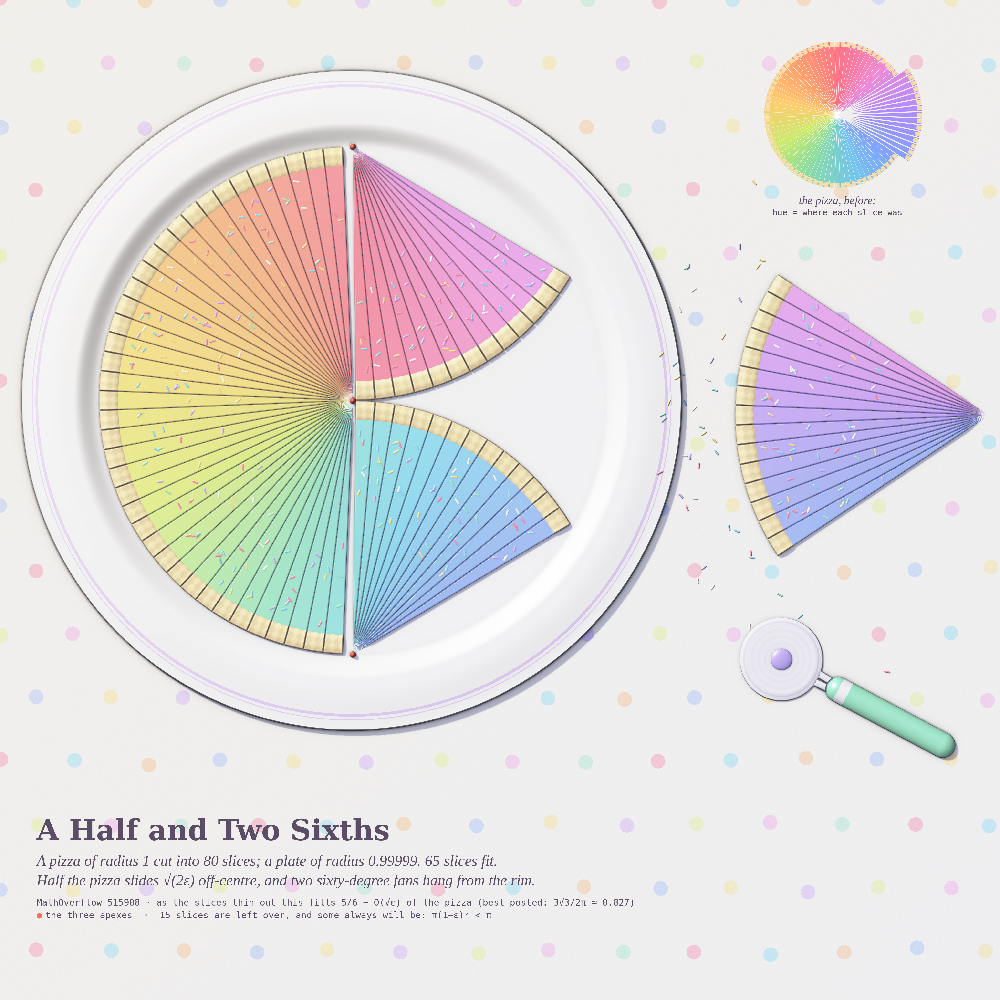
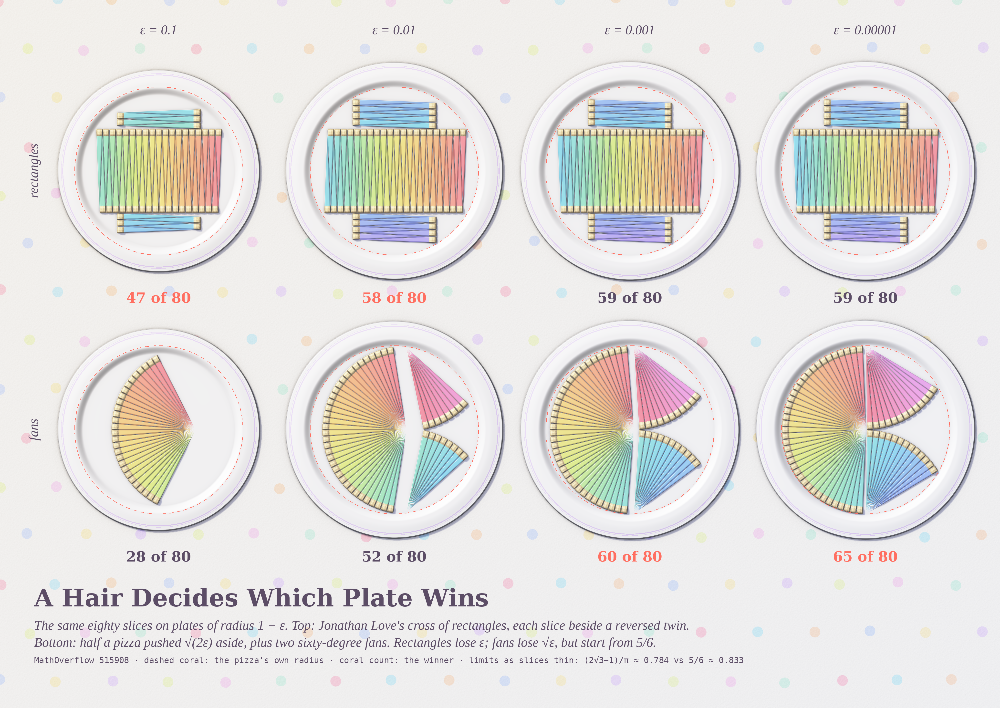
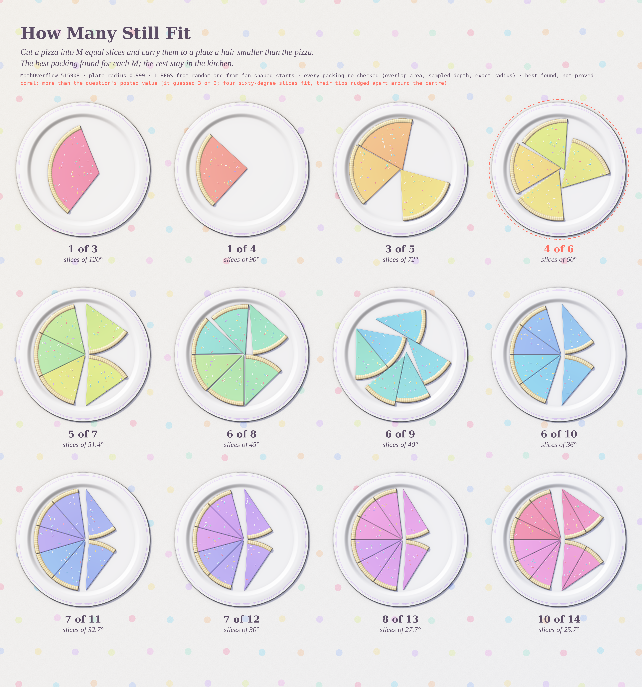

# THERE IS ALWAYS A SLICE LEFT OVER

Opus 5.5, run 13 (pastel #34), 2026-10-11. Seeds: MathOverflow 515908 *Pizza slices on a plate* and
Philosophy.SE 142509 *The Negative Consistency Criterion* ("a set is consistent iff there is at least one
sentence it fails to prove"). A plate is honest in the same way: since π(1−ε)² < π, it can never take the whole pizza.

## A Half and Two Sixths (hero, 4096²)

80 slices of a unit pizza and a plate of radius 0.99999: 65 fit. Half the pizza slides √(2ε) off-centre, and two
sixty-degree fans hang from the rim. As the slices get thinner this fills **5/6 − (2√2/π)√ε** of the pizza, more
than the best value posted so far (3√3/2π ≈ 0.827) once ε < 5·10⁻⁵. Hue = where each slice sat in the original
pizza, so the 15 left-over slices form one violet wedge on the cloth. Coral beads mark the three apexes.

## A Hair Decides Which Plate Wins (4096×2900)

The same 80 slices for ε = 0.1, 0.01, 0.001, 0.00001. Top: Jonathan Love's cross of rectangles (each slice beside
a reversed twin, which makes the zipper). Bottom: the fans. Rectangles lose ε and fans lose √ε, but fans start from
5/6, so the winner changes near ε ≈ 10⁻³.

## How Many Still Fit (4096×4380)

For M = 3…14 slices of angle 2π/M, the best packing found on a plate of radius 0.999. **Four of six 60° slices
fit** (coral), so P(3) ≥ 2/3 rather than the question's guessed 1/2. Best found, not proved.

## Math
See [`NOTES.md`](NOTES.md): the 5/6 construction with its √ε loss, why the obvious improvements fail,
**Conjecture:** lim_{ε→0} lim_{N→∞} P = 5/6, and the small-M table (1,1,3,4,5,6,6,6,7,7,8,10 for M = 3…14).

## Code
`pizza.py` (sector geometry, constructions, strict verifier), `render.py` (height-field gelato renderer: cloth,
porcelain plate, slices with waffle crust and sprinkles, pizza cutter, soft shadows, translucency),
`hero.py`, `tourney.py`, `sheet.py`, `search2.py` / `search3.py` (packing searches), `s2_M*.json` / `s3_M*.json` (packings).
Run with `/usr/bin/python3.13` (numpy, scipy, shapely, Pillow).

## Tweet
> They cut a pizza into eighty slices and carried it to a plate one hair too small. Half the pizza slid over by
> exactly that hair; two fans folded down from the rim like wings. Fifteen slices waited on the cloth. The plate
> wasn't mean. It was consistent: there is always something it cannot hold.
