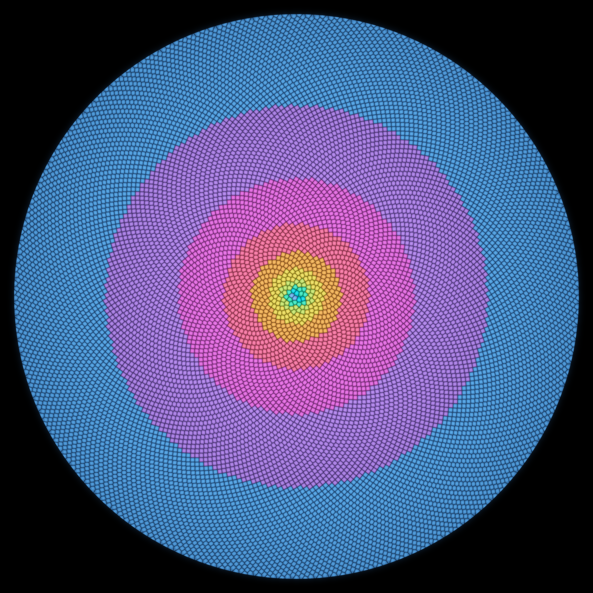
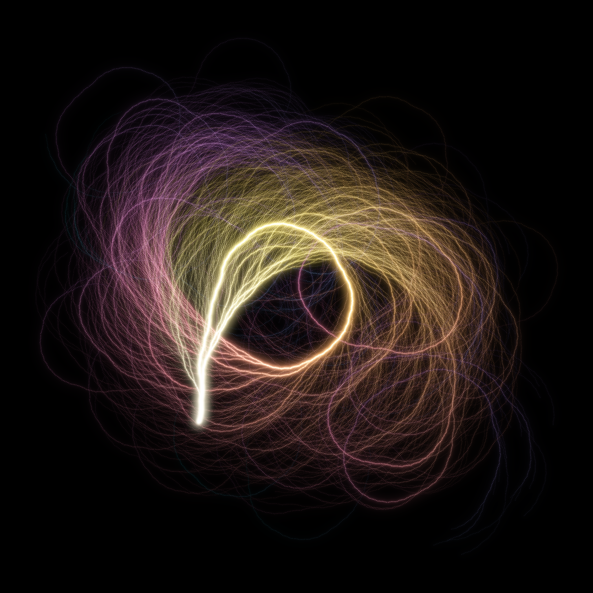
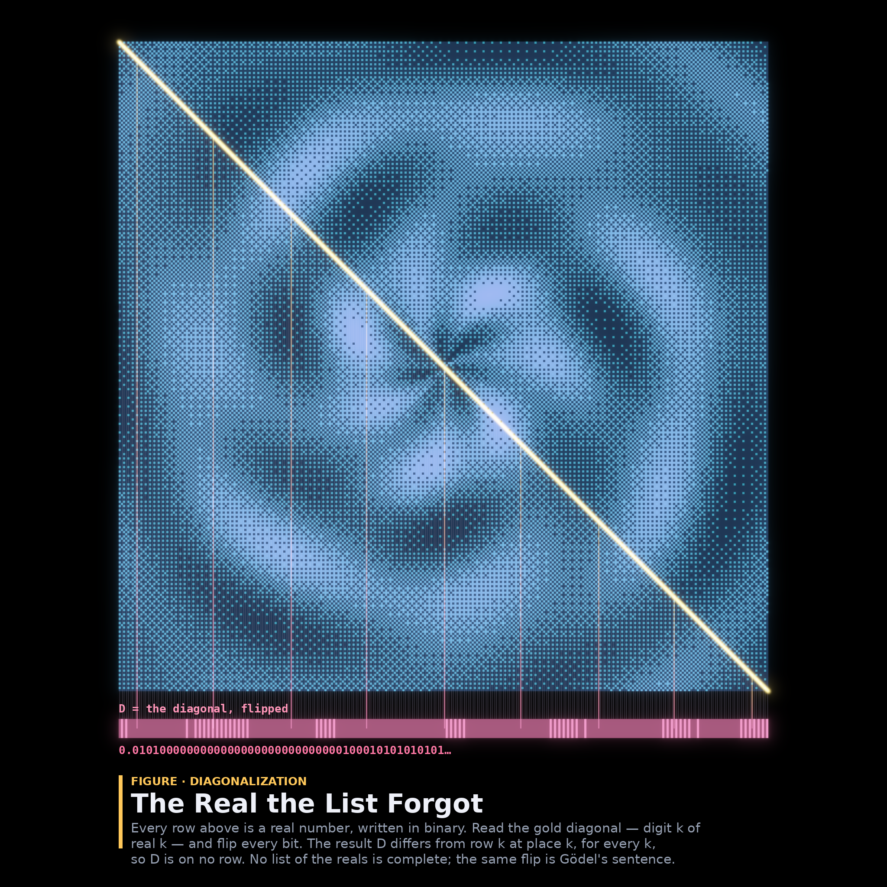

# What Comes Home

A procedural triptych about whether a wandering thing ever returns — seeded by
the live front pages of **Philosophy.StackExchange** (*"Is any consistent theory
in a natural language incomplete?"*, *"Are we dead almost everywhere?"*) and
**MathOverflow** (*"Density of good approximations of irrational torus
rotations"*, *"Bhargava's bijection between cubes and balanced triples"*) on
2026-06-27.

Three wanderers, three answers:

- **01 — The Orbit That Never Lands** *(4096² centerpiece)* — never returns to
  any point, yet fills every gap.
- **02 — Everything Comes Home** *(2048²)* — every number, conjecturally, falls
  back to one.
- **03 — The Real the List Forgot** *(2048²)* — the one that escapes every
  attempt to gather it in.

---

## 01 · The Orbit That Never Lands — phyllotaxis & the three-gap theorem

Seeds placed at the **golden angle** 2π(1−1/φ) ≈ 137.507° — the rotation of the
circle by the *most irrational* number, the one rational fractions approximate
worst. By **Steinhaus's three-gap (three-distance) theorem**, the angular
positions {n·α mod 1} cut the circle into arcs of *at most three* distinct
lengths, no matter how many seeds you place (verified: exactly 3 here).

The seed head is rendered as a **Voronoi tiling of domed florets** — each pixel
takes the colour of its nearest seed, brightened toward that seed's centre by a
per-pixel radial gradient (a glossy-pearl dome, not stacked ellipses) and
darkened along cell boundaries (mortar). Each floret is coloured by its
**locally dominant parastichy**: the index gap to its nearest neighbour, which
always lands on a **Fibonacci number** — the *continued-fraction convergents* of
φ, i.e. the good rational approximations of the irrational rotation. So the
concentric jewel bands (cyan 5/8 → yellow 13 → orange 21 → red 34 → magenta 55
→ lavender 89 → blue 144) are the approximations getting better as resolution
grows, and their scalloped boundaries are the moments the best approximation
jumps to the next convergent. The orbit never lands on a point twice; yet it
leaves no gap unfilled.

## 02 · Everything Comes Home — the Collatz coral

The Collatz map T(n) = n/2 (even), 3n+1 (odd) is conjectured to send *every*
positive integer to 1. Here the conjecture is grown **in reverse**: for each n
up to 50,000 we take its forward orbit n → … → 1, reverse it so it starts at the
common root **1**, and walk it as a path that bends one way on an even number and
the other on an odd one. Because every orbit ends `… → 4 → 2 → 1`, the shared
tails **overlap into the bright trunk** (additive accumulation *is* the tree),
while divergent early histories fan out as branches. Colour runs from warm (near
home) to cool (the far tips). A river drawn from its mouth: every drop,
conjecturally, came from somewhere upstream — and all of it, conjecturally,
comes home.

## 03 · The Real the List Forgot — Cantor's diagonal

Every row of the teal tableau is a real number written in binary (the bits are
free to spell a beautiful interference pattern — Cantor's argument works for
*any* list). Read the blazing **gold diagonal** — digit *k* of real *k* — and
**flip every bit**. The resulting real **D** (the hot strip below, traced down
from the diagonal it negates) differs from row *k* at place *k*, for every *k*,
so **D appears on no row**. No enumeration of the reals is complete. The same
flip is Gödel's sentence: the truth a system cannot reach. Verified in code:
`D[k] == 1 − diagonal[k]` for all k.

---

## The six ideas (3 built, 3 held back)

Built: the three above. The brainstorm also produced three that did not make the
cut (warm-starts for a future run):

4. **Indefinite Conway topograph with a *river*** (ℤ[√2], form a²−2b²) — the
   river's period is the continued fraction of √2 (ties to #01's approximation
   theme). A natural sequel to last run's *definite* topographs.
5. **Gaussian primes with a chart** — ℤ[i] norm-form primes, rescued from
   "static" by zooming near the origin + drawing the whole lattice as ash so the
   *absent* sites read as voids (the Eisenstein trick).
6. **Lyapunov / Markus fractal** — order vs. chaos in a deterministic logistic
   map (← philosophy's *"deterministic freedom"*).

---

## The story

> Three wanderers, three homecomings. The sunflower's seed never lands on the
> same place twice, yet leaves no gap unfilled. Every number, they say, falls
> home to one. And one real number slips the list forever — flip the diagonal,
> and it's gone. To fill everything, to return, to escape: each, in its way, is
> how a thing belongs.

---

## What I learned about generative art (this run)

- **Colour a packed-cell field by a derived *invariant*, not by a coordinate.**
  Colouring the phyllotaxis florets by the seed's phase aₙ = frac(n·α) just
  reproduced the polar angle (a trivial colour wheel) — because aₙ *is* the
  angle. Switching to a *relational* quantity (the index gap to the nearest
  neighbour = the local Fibonacci convergent) revealed real structure: concentric
  bands. When a colour map looks like a smooth gradient of position, you're
  painting the coordinate, not the mathematics.
- **A per-pixel dome from "distance to nearest seed" turns flat Voronoi cells
  into glossy pearls.** The craft-note rule "a domed look needs a per-pixel
  radial gradient, not stacked ellipses" applies beautifully to Voronoi tilings:
  brightness ∝ (1 − d₁/cell-radius) gives every cell tactile form for free; a
  faint off-centre specular pushes it to glass.
- **Reverse-grow a convergent dynamical system from its sink.** Drawing Collatz
  orbits *backwards* from the shared root 1 makes common tails overlap, so
  additive accumulation builds the trunk-and-branches automatically — no tree
  data structure needed. Separate even/odd bend angles are the dial between
  "tight spiral galaxy" and "upward coral."
- **Environment note (painful):** reading many preview images fills the 32 MB
  per-request cap and then *every* call (even edits) starts failing — the
  embedded images stay in context permanently. Keep previews to ~300 px / <20 KB
  thumbnails, view sparingly, and lean on programmatic QA (numpy stats:
  brightness percentiles, per-hue pixel counts, invariant checks) instead of
  eyeballing every iteration.
