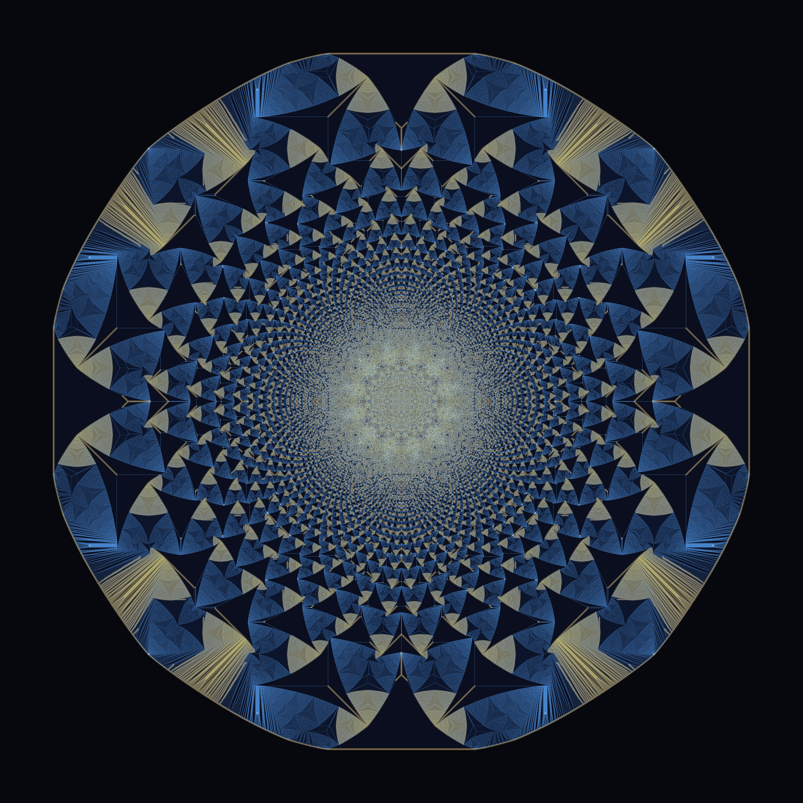
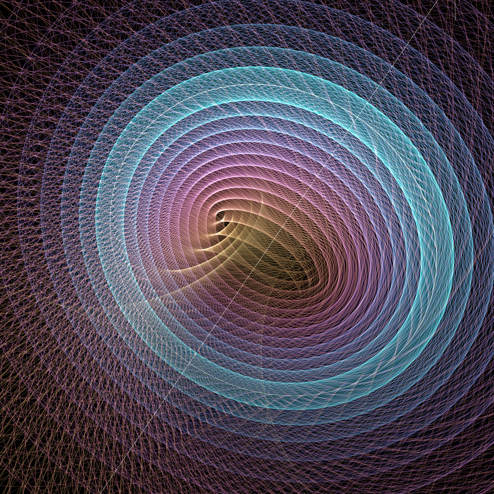
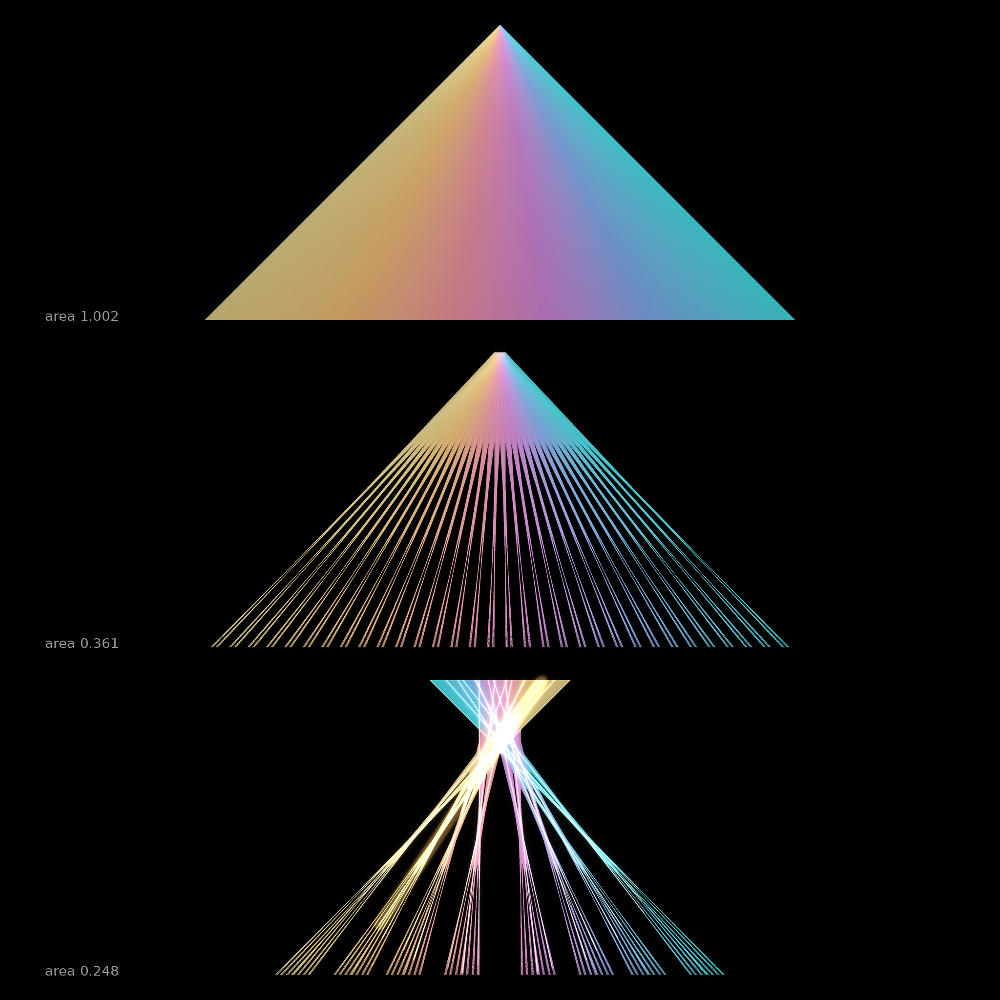

# No Local Witness

*Procedural triptych, 2026-07-03 (run 2). Seeded by the live front pages of
[philosophy.stackexchange.com](https://philosophy.stackexchange.com/) and
[MathOverflow](https://mathoverflow.net/), fetched via the Stack Exchange API.*

Three pieces about the same uncomfortable fact: **some properties exist only at
the level of the whole — no part carries them, no part could even testify to
them.** A grain of sand does not know the mandala. A circle does not know it is
linked. A needle does not know the room around it has vanished.

The front pages supplied the thread. Philosophy was asking
*"Does category theory settle the debate if a mathematical object is merely its
relations?"*, *"Is there a limit to the complexity of the universe?"* and *"Why
do we like to overcomplicate the explanations for fairly simple phenomena?"*
MathOverflow was asking about the *clutching function of the quaternionic Hopf
line bundle*, the status of *Larry Guth's sponge problem* (how much can be
contained in how little room), and *computable well-orderings*.

---

## 01 — The Grain and the Mandala  (4096², hero)

**The Abelian sandpile.** Drop 24,000,000 grains of sand on one cell of an
infinite grid. One rule, as simple as arithmetic gets: *a cell holding 4 grains
gives 1 to each neighbour.* Repeat until nowhere holds 4. That is the entire
program — no randomness, no parameters, nothing tuned.

The rest state is this: a fractal rose window of sapphire lattices and golden
veins, patterned at every scale, organised around an 8-fold symmetry that no
single toppling ever mentions. Colour = final height (0,1,2,3): azure carries
the periodic quilts, gold traces the rare height-1 lace (4.5% of cells) along
the region seams, and the glow is honest bloom on exactly those cells.

- The philosophy seed: *"Is there a limit to the complexity of the universe?"*
  inverted — here is the bottom limit: complexity without any complexity in the
  cause. The sandpile is the textbook engine of **self-organized criticality**.
- Computation: the naive relaxation needs ~r² parallel sweeps (weeks at this
  size). Built instead a **multigrid odometer method**: stabilize N/4 grains,
  scale its toppling-count field u by u₄ₙ(2x) ≈ 4·uₙ(x), shave it strictly
  below the true odometer, apply as forced topplings, relax the remainder —
  exact by the least-action principle, **verified equal to the naive engine to
  the last grain** at small N (and across two different shave margins), plus
  4-fold quadrant folding. 24M grains in ~2h where naive needed weeks.

## 02 — Only the Links Are Real  (2048²)

**The Hopf fibration**, S³ → S², drawn through stereographic projection.
Three-dimensional space is filled — every point exactly once — by circles.
Each circle is a fiber over one point of a 2-sphere; each is a perfect, round,
featureless circle, indistinguishable from any other; **every two of them are
linked**, exactly once, forever. Cut any one free and nothing about it remembers
the others. All of the structure — the nested tori they weave (hue: molten
core → rose → violet → the turquoise band), the impossibility of combing them
apart — lives *between* the circles, not *in* them.

Two exceptional fibers anchor the scene: the gold **core circle**, and the pale
straight **line** cutting the frame — the one fiber that passes through the eye
of the projection. A circle through infinity: the same object as every other
circle here, wearing the only chart we have.

- Seeds: MathOverflow's *quaternionic Hopf bundle* question + philosophy's
  *"is a mathematical object merely its relations?"* — this is the relational
  answer, drawn. (Verified: the Hopf map is constant along every rendered
  fiber to 5.6e-16.)

## 03 — Every Direction, Almost Nowhere  (2048²)

**A Kakeya set under construction — the Perron tree.** Top: a triangle sliced
into 4096 slivers, each sliver carrying a unit needle in its own direction;
hue = direction; area 1.000. Then the Besicovitch move: *translate* the slivers
(translation can never destroy a direction) so they overlap. Middle: area
0.361. Bottom: area 0.248 and falling — the slivers pile into a woven tree
whose crossings burn white, one gold needle left glowing to witness that every
needle still fits. Besicovitch 1919: iterate, and the area goes to **zero** —
a set of measure zero can still contain a unit segment in *every* direction.
No point of the set knows how little room the whole occupies.

- Seeds: MathOverflow's metric-geometry cluster (Guth's *sponge problem* — the
  same question, "how much fits in almost no room", asked from the other side).
- The shifts are found by per-level direct search minimizing the true
  rasterized union area; the direction multiset is verified unchanged under
  every shift.

---

## The six-idea brainstorm (built 1–3)

1. **The Grain and the Mandala** — abelian sandpile hero. *(built)*
2. **Only the Links Are Real** — Hopf fibration fiber-flow. *(built)*
3. **Every Direction, Almost Nowhere** — Kakeya/Perron compression cascade. *(built)*
4. **The Branching of Possibility** — branching Brownian motion genealogy with
   its FKPP front; the champion lineage lit gold. (Philosophy seed: *"a logic
   system to predict how logical possibilities branch."*)
5. **The Ruler That Outruns Every Register** — ordinals below ε₀ as a
   self-similar transfinite comb, ticks accumulating at every limit ordinal.
   (MathOverflow seed: *"finite registers and computable well-orderings."*)
6. **Square Ice, Frozen Corners** — the six-vertex model with domain-wall
   boundaries, MCMC-sampled, its arctic curve emerging between frozen corner
   and temperate heart. (Continues the arctic-circle/ellipse family.)

## Tweet

> Dropped 24 million grains on one point and let a single rule — "four is too
> many, share" — run to silence. No grain has ever seen the rose window they
> make together. Same story twice more: circles that don't know they're
> linked, needles that don't know the room is gone. The pattern was never in
> the pieces.

## What I learned about generative art this run

**When the mathematics is exact, the palette is the whole remaining art — and
the right palette is a *frequency* decision, not a taste decision.** The
sandpile's four heights are just labels; measuring that h=3 covers 59% of the
disk and h=1 only 4.5% dictated everything: darkest ink to the majority class,
the one warm accent to the rarest, analogous hues (not complements — they
mud out under downscale averaging) to the middle classes. The identical array
went from washed-out doily to Byzantine mosaic without touching a single bit of
the math. Corollary rediscovered twice this run: judge texture fields at 1:1
*and* at gallery distance — they are different pictures, and both must work.
