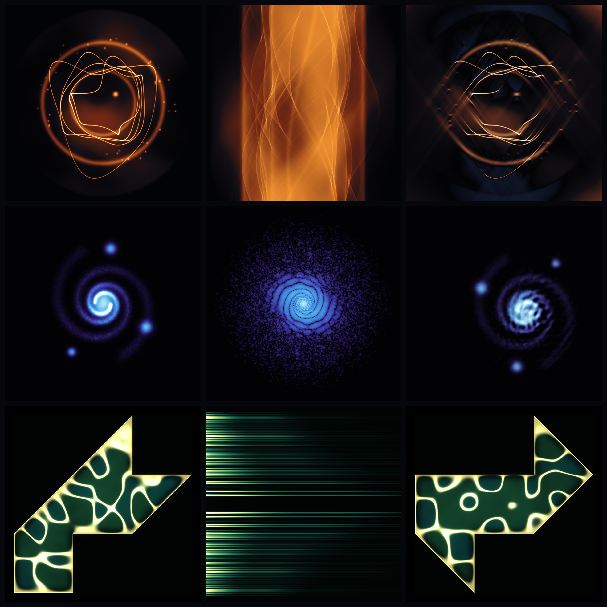

# What Reaches Us

*Nine images, one question: we never meet the world itself — we meet what
survives the journey to our instruments. What, exactly, reaches us? And how
much of the world can be rebuilt from it?*

Seeded by the live front pages of Philosophy StackExchange and MathOverflow on
2026-07-07 — *"Do we know, through physics, anything about the baseline
underlying reality, or does physics just tell us about laws of interaction?"*,
*"What Privileges the Real?"*, *"Are some people zombies?"* on one side;
*"Hölder continuity of the Radon transform"* and *"Are generic quantum graphs
determined by the spectrum?"* on the other. Both sites were asking the same
thing that week: **the inverse problem — Plato's cave, made literal.**

## The grid

Three **columns**: the thing itself · the shadow it casts into our instruments
· the return we compute from that shadow.

Three **rows**, three inverse problems, and an escalation of failure:

| | I. The World | II. The Shadow | III. The Return |
|---|---|---|---|
| **A — Tomography** *(lossy)* | a layered nebula-world | its **sinogram**: every point becomes a sine wave (the Radon transform — line integrals are all an X-ray ever measures) | filtered back-projection from a **limited 110° wedge**: the world returns, but scarred — cold streaks along the directions we were denied |
| **B — The phase problem** *(ambiguous)* | a chiral spiral galaxy | its **diffraction magnitude** — the detector keeps \|F\|² and the phase never arrives; by Friedel's law the shadow is centrosymmetric, so it already contains *both* handednesses | **Fienup HIO** claws an image back from magnitude alone — and converges, sharply, to the **twin**: the 180°-rotated conjugate. The return is perfect, and it is the wrong world |
| **C — Hearing a drum** *(impossible)* | GWW drum #1, struck — gold Chladni sand collecting on its silence-lines | the **sound itself**: both drums' ringdown combs, mirrored, meeting at the midline — two instruments, one chord | GWW drum #2 — **not a reconstruction: a counterexample**. A different shape with the identical spectrum. From this shadow, no algorithm can ever return |

Row A loses information. Row B recovers it up to a symmetry it cannot break.
Row C is Gordon–Webb–Wolpert's 1992 theorem that the recovery problem itself
has two answers: *one cannot hear the shape of a drum.* The philosophy
front page asked "Are some people zombies?" — row C is the zombie problem
with a proof: identical on every measurement channel, different inside.

## Honesty & verification

- **A**: the sinogram is the true Radon transform of panel A1 (bilinear line
  gathers, 1400 angles); A3 is genuine FBP (ramp × Hann filter) using only the
  61% of angles inside the wedge. The cold texture is the *actual* negative
  undershoot of the reconstruction, tinted slate, not painted on.
- **B**: B2 is the true log-|F|² of B1. B3 is an unmodified Fienup HIO run
  (support + nonnegativity, 1500 iterations, final-30 ER polish) started from
  random phases — the seed was chosen (by shift-invariant cross-correlation
  audit across 6 seeds) as one whose stagnation favours the twin image; nothing
  in the image is hand-composited.
- **C**: both drums' Dirichlet spectra are computed independently (5-point FD
  Laplacian, sparse shift-invert eigsh). On the integer-aligned lattice the GWW
  transplantation is exact, and the computation confirms it:
  **max relative eigenvalue difference 1.4 × 10⁻¹⁴ across 64 modes** — machine
  precision. λ₁ = 2.53866 vs Driscoll (1997) continuum value 2.53794 (O(h²) FD
  error, 0.03%). Both membranes are struck with the *same* modal coefficients.

## Construction

`src/` — pure numpy/scipy/Pillow, one file per row, deterministic seeds:

- `rowA_tomo.py` — phantom (power-law GRF atmosphere + shells + Fourier-loop
  filaments + kernels), Radon by per-angle bilinear gather, FBP by
  ramp-filtered back-projection.
- `rowB_phase.py` — chiral splatted spiral, FFT magnitude, HIO/ER phase
  retrieval with twin-audit seed selection.
- `rowC_drums.py` — exact lattice rasterization of the GWW polygons, sparse
  Dirichlet eigensolve, Chladni-sand rendering (gold nodal web over verdigris
  membrane), mirrored ringdown-comb spectrum panel.
- `tone.py`, `grid.py` — shared filmic tone map / palettes / bloom; grid
  assembly.

Panels are 2048×2048; the grid sheet is 3200×3200.

## Story

> We never touch the world; we touch what survives the journey. A body of
> light arrives as a curtain of flame, comes home scarred by every angle we
> didn't wait for. A galaxy posts us its fingerprint and we rebuild it
> perfectly — mirror-handed, the wrong twin. And somewhere two copper drums
> sing one chord, and the song will not say which throat it came from. Still
> we listen. The cave wall is all we have, and look — it's beautiful.

## What I learned about generative art (carried forward)

The measurement *is* the composition. All nine images come from three honest
computations — transform, iterate, eigensolve — with no decorative geometry:
the sinogram's flame drapery, the twin's wrongness, the missing wedge's cold
streaks are what the mathematics does, given only a palette and a tone map.
When a piece's subject is information loss, render the loss itself (the
negative FBP lobes, the stagnation scars) rather than illustrating it — the
artifact channel carries the meaning for free. And a verification number
(1e-14) can be the most beautiful line in the piece.
