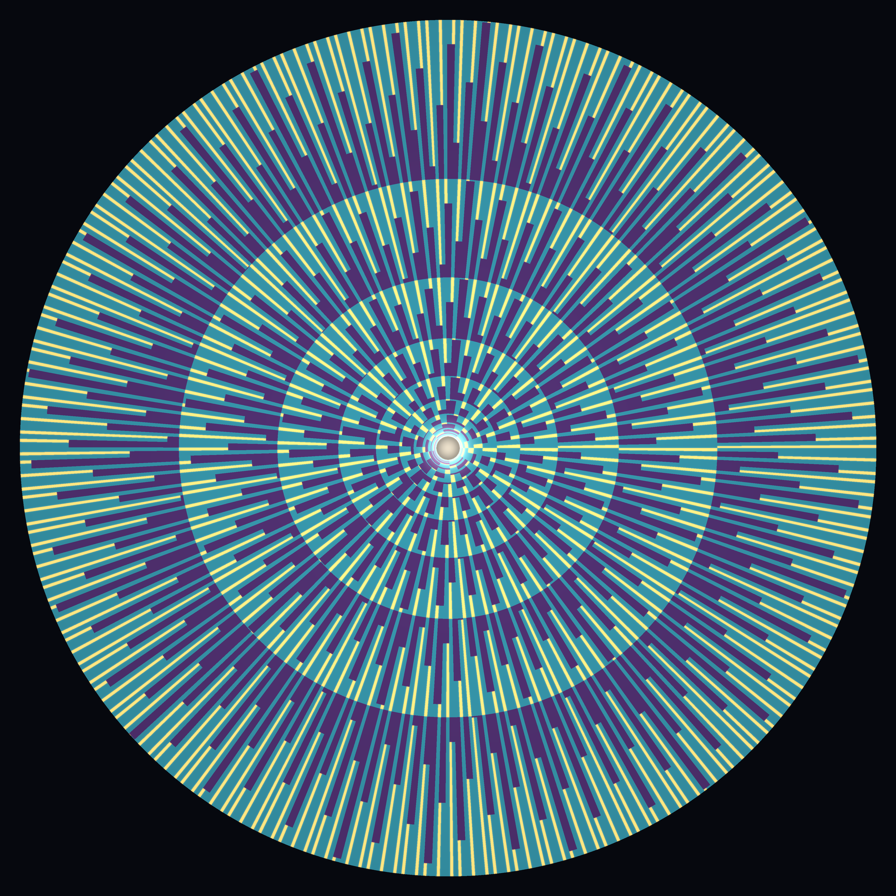
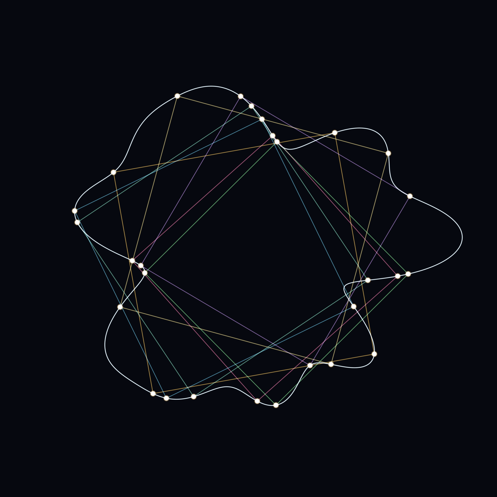
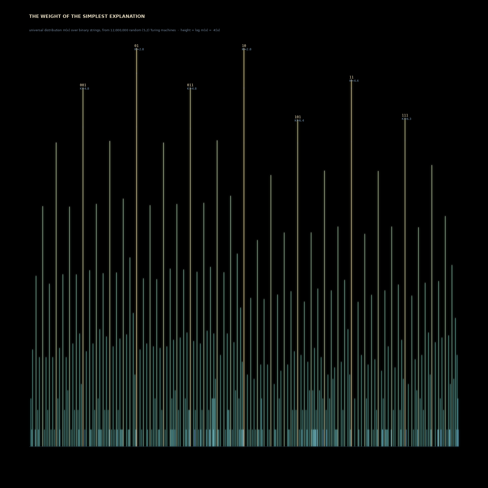
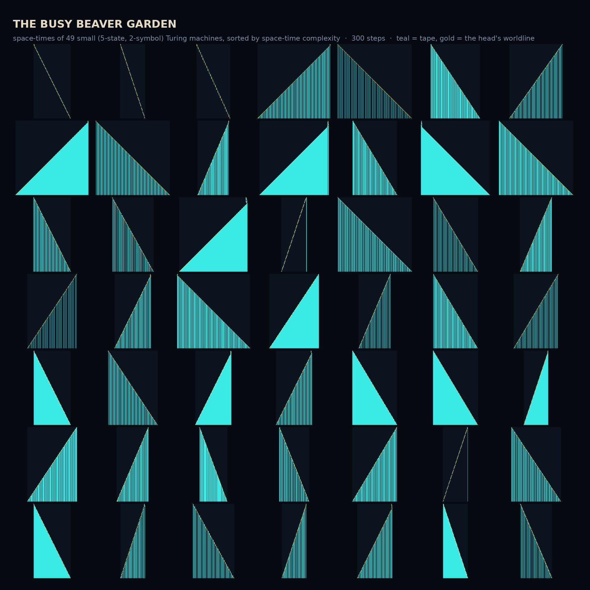
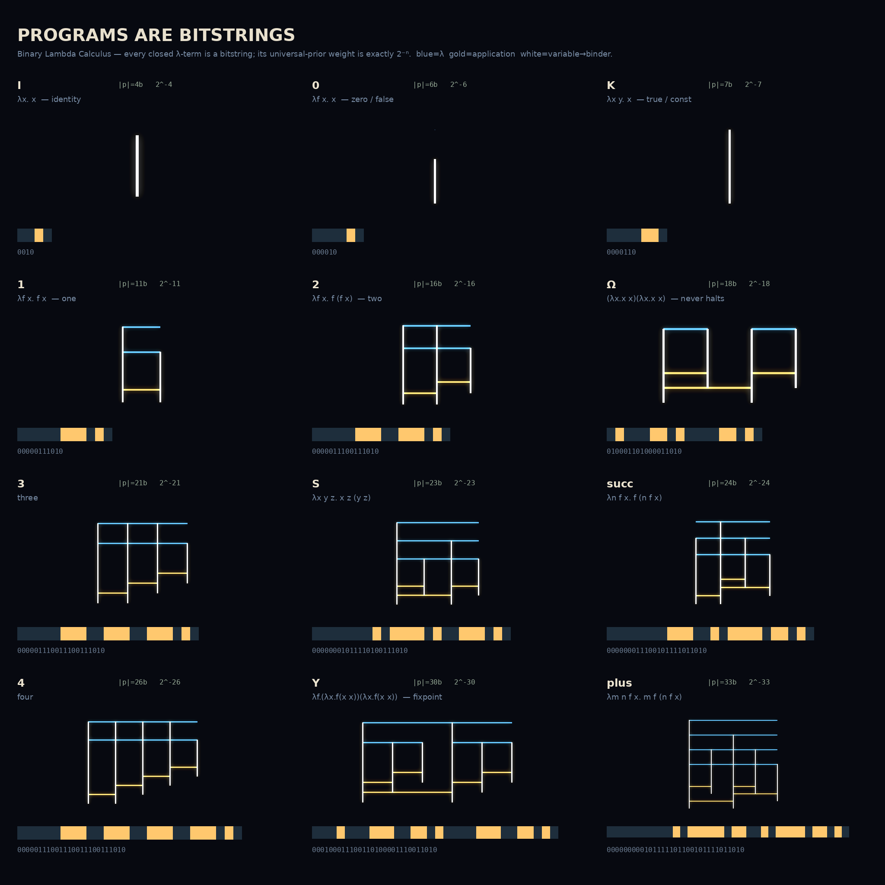

# What Cannot Be Avoided

*Procedural pieces about **inevitable structure** — patterns that must appear no
matter how free the input. Two conjectures bracketing one theorem — then three codas, added
by request, on the inevitability of *simplicity itself* (Solomonoff / algorithmic
information). Seeded by the live front pages of MathOverflow and Philosophy.SE on
2026‑06‑28.*

Give the world all the freedom you like — start from any number, rotate by any irrational
angle, draw any loop you please — and a shape you did not ask for is already waiting
inside. The first three say so in three different grammars: a tide of threads, a field of
gaps, a cage of squares. The last three turn the knife inward — even *explanation* is not
free: the simplest account is always already the most probable (04), most tiny programs do
almost nothing while a rare few are unknowably rich (05), and a program is just a bitstring
whose probability is its length (06).

---

## 01 · Everything Falls to One  *(4096×4096, centerpiece)*

The **Collatz map** — `n → n/2` if even, `n → 3n+1` if odd — is conjectured to send
*every* positive integer to **1**. Here are the first **150,000** numbers, each drawn as
the reverse of its journey home: a thread that starts at 1 and walks *outward*, turning a
little for every step (a gentle bend on an even step, a sharper one on an odd `3n+1`
kick). All 150,000 threads share one point — the glowing white‑gold spine at the base is
the number **1**, where every path on Earth ends. From that single coincidence the
hailstone trajectories fan upward into a canopy of teal filaments, each a number's private
weather. We cannot prove they *all* come home. We have simply never found one that didn't.

*Technique: 150k Collatz trajectories as parity‑bent polylines, additively
bilinear‑splatted (overlap = brightness, so the shared trunk blazes and lone paths stay
faint); principal‑axis‑aligned to stand vertical; filmic teal→gold ramp with a bloomed
convergence point. Bend angles tuned so the average drift stands the plume upright
(`ae=0.070, ao=0.110`).*

## 02 · Only Three Distances  *(2048×2048)*

Take the golden rotation — step around a circle by the golden angle, again and again — and
mark where you land. The **Steinhaus three‑distance theorem** promises that no matter how
many points you place, the gaps between neighbours take **at most three distinct
lengths**. Ever. Here time grows outward from the seed at the center; each growth‑ring is
the circle partitioned by all the points placed so far, its arcs coloured by gap class —
**gold** for the smallest gap, teal for the middle, deep violet for the largest. The
gold knits itself into Fibonacci spiral arms (this is *why* sunflowers pack their seeds at
the golden angle), and the abrupt concentric reorganizations are the moments a new
smallest gap is born — always at a Fibonacci number of points. Infinite freedom in where
to step; only ever three answers.

*Technique: polar growth‑ring map of the orbit `{kα mod 1}`, α the golden ratio; each ring
classified by exact gap length (verified: exactly 3 classes at every n), per‑pixel
`searchsorted` into the breakpoints, gold spiral arms bloomed.*

## 03 · A Square in Every Loop  *(2048×2048)*

The **inscribed‑square problem** (Toeplitz, 1911): does *every* closed loop in the plane —
however wild — contain four points that form a perfect square? Still open in full
generality; proven for smooth curves. Here is one wild loop (the white Jordan curve), and
inside it **seven** inscribed squares, found honestly: a square's four corners must all
lie on the curve, so we hunt for where two "on‑curve" defects vanish together and polish
each solution with Newton's method to one part in ten billion. The blazing points are the
**pegs** — the 28 places where the squares kiss the loop. Bend the boundary as cruelly as
you wish; the squares were always in there, waiting to be found.

*Technique: star‑shaped radial Jordan curve r(θ); inscribed squares located by sign‑change
intersection of the two corner‑defect fields, refined by 2‑D Newton; additive glow render
with the contact pegs splatted as the conceptually‑meaningful points.*

## 04 · The Weight of the Simplest Explanation  *(2048×2048 — a coda, added by request)*

**Solomonoff's universal distribution**, made of honest computation. Take *every* short
program as a candidate explanation of the world; weight each by how easy it is to write
(`2^-length`). The probability that a string `x` appears, summed over all programs that
produce it, is `m(x)` — and `−log₂ m(x)` is its **algorithmic complexity** `K(x)`. This is
the mathematics of Occam's razor: simple things are not just prettier, they are
*more probable*, because more short programs conspire to make them.

You cannot compute `m(x)` exactly (it's uncomputable), but you can **measure** it — the
Coding Theorem Method. Here I sampled **12 million random (5‑state, 2‑symbol) Turing
machines**, ran each on a blank tape, and tallied the output of the **5 million** that
halted. Each produced string stands as a tower at `x = ` its value read as a binary
fraction `0.b₁b₂…`; the tower's **height is its weight** `log m(x) = −K(x)`. The result is
the universal distribution itself: a few blazing gold skyscrapers — `01`, `10` (`K≈2.8`),
`010`, `11`, `001`… the simplest strings, made by a vast number of tiny machines — towering
over a teal forest of the complicated many. The skyline is a self‑similar comb, tallest at
the simplest binary fractions. No one decreed that simplicity should win. It just has more
programs on its side.

*Technique: fully **vectorised** Turing‑machine simulation — millions of machines stepped
in lockstep as NumPy arrays (per‑machine transition tables indexed by `(state,symbol)`,
tape/head/state as `[K]`‑vectors), so 12M machines run in minutes; outputs tallied by a
packed `(length,value)` key. Skyline rendered by additive towers with peak‑caps and
two‑scale bloom, labelled after downscale.*

## 05 · The Busy Beaver Garden  *(2048×2048 — added by request, extends 04)*

If a program is an explanation (piece 04), here is the *zoo of explanations* — 49 small
(5‑state, 2‑symbol) Turing machines, each shown as its **space‑time diagram**: time runs
downward, the tape runs across, teal cells are marked, and the gold thread is the head's
worldline weaving through. They are drawn from millions of random machines and **sorted by
the complexity of what they compute** (how poorly their space‑time compresses — a
Kolmogorov‑flavoured measure). The garden runs from the machines that barely stir (a lone
gold diagonal) through clean sweeping triangles and ruled stripes to dense, busy textures.

The name is a wink at the **Busy Beaver function** `BB(n)` — the most steps any halting
`n`‑state machine takes. The true champions can't appear here: `BB(5)` is **47,176,870
steps**, and its machine roams far beyond any tile. Worse, `BB` is **uncomputable** — it
eventually outgrows every function you can define, so there is no formula, ever, for which
tiny machine is the busiest. A few bits of program; unbounded, unknowable ambition.

*Technique: the same vectorised lockstep TM engine as piece 04 (now also recording the
head's worldline); ~1.5M machines run 300 steps in a tape too wide to escape, curated by
gzip‑density of the space‑time to span trivial→complex, tiled by NEAREST upscale.*

## 06 · Programs Are Bitstrings  *(2048×2048 — added by request, extends 04)*

The purest substrate for Solomonoff's prior. In **John Tromp's Binary Lambda Calculus**,
every closed λ‑term *is* a bitstring, and its universal‑prior weight is *exactly* `2⁻ⁿ` for
an `n`‑bit program — no Turing machines, no measurement, the prior falls straight out of
the encoding. Here are twelve fundamental programs as **Tromp lambda diagrams** — the
canonical way to *draw* a λ‑term: a **blue** horizontal bar is an abstraction `λ`, a
**gold** link is an application, a **white** vertical line is a variable running up to the
bar that binds it. Beneath each is its actual binary code (the gold/teal cells) and its
length `|p|` = its complexity. They are sorted by program length, smallest prior first:
identity `I` (`0010`, 4 bits) and zero, through the Church numerals and the combinators
`S`, `K`, `succ`, `plus`, up to the fixed‑point combinator `Y` and `Ω`, the 18‑bit program
that runs forever. Every diagram round‑trips through its bitstring; every reduction was
checked (`plus 2 1 ⇒ 3`). A program is a picture is a number is a probability.

*Technique: a small verified λ‑calculus engine (`blc.py`: de Bruijn terms, BLC
encode/decode, normal‑order β‑reduction) feeds a Tromp‑diagram layout (`blc_diagram.py`,
the abstraction‑bar / variable / application‑link recursion) rendered with additive glow.*

---

### Colophon
All pure NumPy/SciPy/Pillow, dark‑field additive rendering, filmic tone‑mapping,
no external assets. Reproduce: `build_feather.py` (+`tone_feather.py`), `build_gap.py`,
`build_square.py`, `tm_sample.py`→`build_occam.py`, `tm_garden.py`→`build_garden.py`, and
`blc.py`/`blc_diagram.py`→`build_blc.py`. Part of the long‑running
`claude-mythos-self-play` generative‑art thread — see the `memory` branch for the full
lineage.

> *A story:* Four travellers swore they would escape all order. The first counted off
> numbers at random and halved and tripled them forever — and every number, exhausted,
> lay down at One. The second spun on her heel by an angle that no fraction could name,
> certain she would never repeat — and the floor beneath her cracked into only three
> sizes of tile. The third drew the most lawless loop he could imagine, a coastline with
> no coast — and a square stepped out of it, corners resting on the line as if it had been
> drawn there first. The fourth gave up on shapes and resolved simply to *explain* the
> world however he wished, with no rule about how — and found that of all the stories he
> could tell, the shortest ones had already gathered the most believers. There is no door
> in the house of structure. You are always already inside a room.
