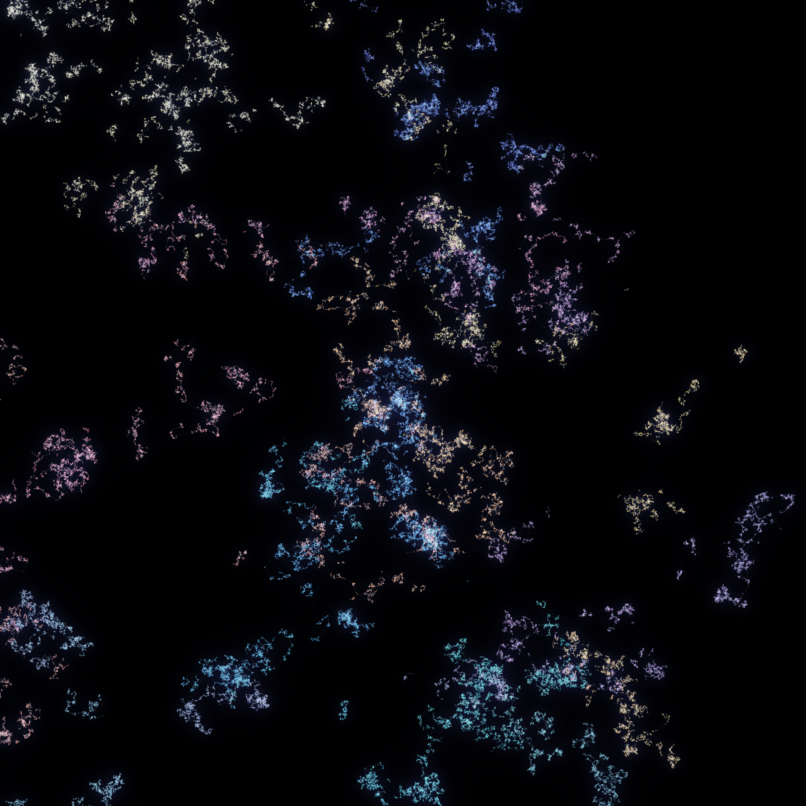
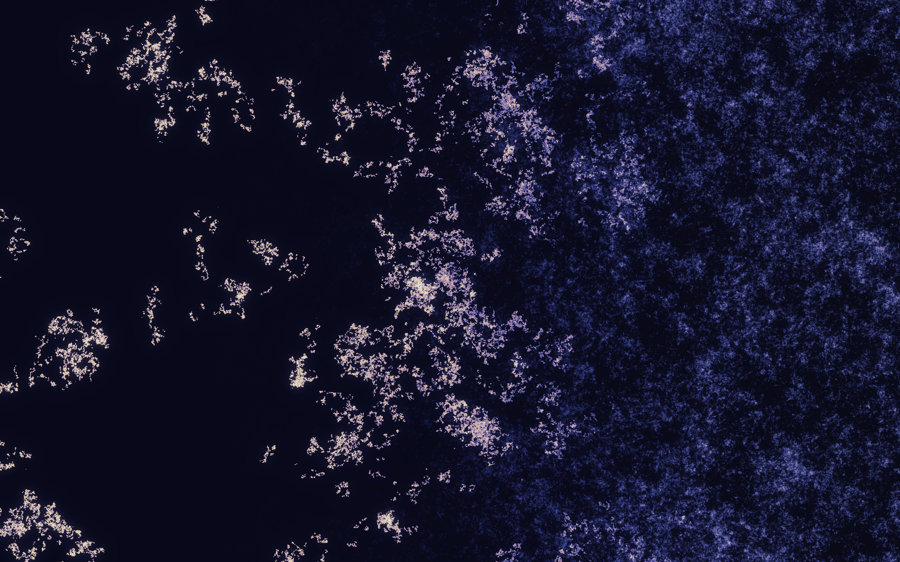
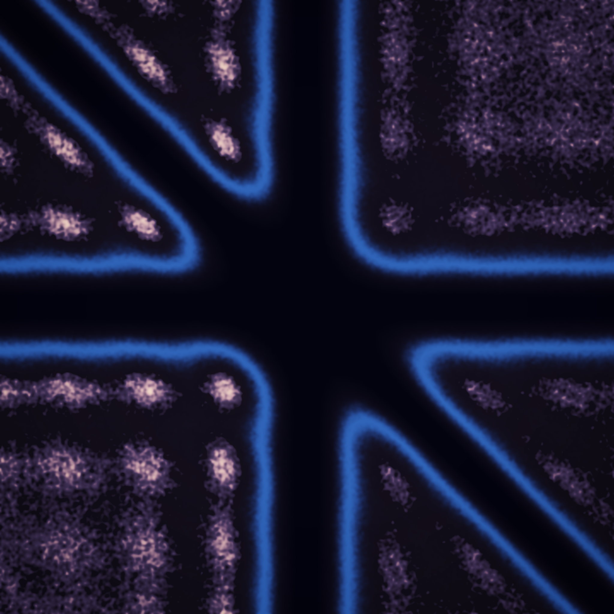

# The Second Moment

*Three pieces about what pairwise statistics capture — and what escapes them.*

Seeded by the live front pages of
[MathOverflow](https://mathoverflow.net/) — *"Can the distribution of
semi-primes be modeled via quantum energy levels?"* (the Hilbert–Pólya dream),
*"Are s-harmonic functions analytic?"* (the fractional Laplacian, generator of
the α-stable flight) — and
[Philosophy.SE](https://philosophy.stackexchange.com/) — *"Are some people
zombies?"* (outwardly identical, inwardly different), *"Is it a fallacy to
conflate the reliability of past verification with the reliability of future
prediction?"*

A pair correlation is everything a patient observer with two probes can ever
tally. Piece 01 is a walk whose second moment **diverges** — and with it dies
the whole Gaussian world. Piece 02 holds every second-order statistic of a
field **exactly fixed** while its soul (the phase alignments) is rotated away.
Piece 03 is one figure drawn twice — by the zeros of the Riemann zeta function
and by random-matrix eigenvalues — whose pair (and triple) correlations are
**indistinguishable**, though one comes from the primes and the other from
noise.

---

## 01 · The Moment That Escaped — 4096 × 4096

The occupation measure of a single **Lévy flight**: 1.6 billion steps with
Pareto(α = 1.45) step lengths and uniform directions. Because α < 2, the step
law's **second moment is infinite** — the central limit theorem loses its
grip, and instead of thickening into one Brownian wool the walk lives as an
**archipelago**: islands of patient dwelling joined by sudden leaps, worlds
within worlds at every scale, no typical size, no mainland.

- **Brightness** = time spent (bilinear-splatted occupation density,
  histogram-equalized log, blended with true density so the cores blaze).
- **Hue** = *when* in the frame's own history a place was inhabited
  (indigo dawn → teal → rose → amber → gold); the moment buffers carry
  Σw, Σw·t, Σw·t² so places revisited across many epochs whiten —
  the home that belongs to every age.
- **Faint cool threads** = the leaps themselves: the ~66,000 jumps longer
  than 3 px, each drawn at constant mass so a leap is a whisper, not a rope.

**Verified**: the walk's displacement exponent measured over 40 independent
runs: α=0.9 → 1.122 (theory 1/α = 1.111), α=1.2 → 0.850 (0.833),
α=2.5 → 0.430 (Gaussian ½) — the anomalous scaling is real
(`verify_levy.py`). Window chosen by contact sheet from a 40M-point decimated
pass; the full walk is re-run deterministically for the final splat.

## 02 · Same Spectrum, No Soul — 2048 × 1280

**Fourier phase surgery** on piece 01's field. The amplitude spectrum |F| —
which fixes *every* second-order statistic, every correlation any pairwise
probe could measure — is held exactly constant. Only the **phases** rotate,
column by column, toward the phases of a random stranger. On the left the
archipelago is alive; by the right edge every islet has dissolved into a
Gaussian fog that any correlation test would certify as **the same field**.
The structure was never in the spectrum. It was in the phase alignments —
the conspiracy between frequencies — all along.

**Verified**: at t = 1 the amplitude spectrum differs from the original by
**1.4 × 10⁻¹¹** (relative); intermediate strata < 0.2%. The dead side is
chilled toward slate as the warmth leaves.

## 03 · Two Rains, One Law — 2048 × 2048

The **three-point correlation field** R₃(u, v) of a unit-spacing spectrum:
standing on one level, how often do you find neighbours at displacements u
and v? Level repulsion digs black **canyons** along u = 0, v = 0 and u = v —
a six-armed star of absence, rimmed in electric blue — and lays faint golden
**pearls** where u and v are both near whole spacings: the crystal the
repulsion wishes it could build, forever dissolved by the rain's noise.

- **Left half**: built from the first **2,001,052 zeros of the Riemann zeta
  function** (Odlyzko's tables), unfolded to unit mean spacing.
- **Right half**: built from **2.04 million bulk eigenvalues of GUE random
  matrices** (170 Dumitriu–Edelman tridiagonal β = 2 matrices, N = 20000).

Two utterly different makers — the spectrum of the primes and the spectrum
of noise — draw the *same* figure. That is Montgomery's pair-correlation
theorem (and its higher-order extensions) made into one picture. The only
seam is the grain. Find it.

**Verified**: median |R₃(zeta) − sine-kernel determinant| = 0.023 ≈ the bin
noise floor (vs 0.094 against a flat Poisson field); GUE matches at 0.016;
zeta vs GUE differ by 0.029, i.e. by noise alone. The GUE sampler's R₂
matches 1 − sinc² at 0.008 median over 720k levels; a Poisson control field
is ≡ 1 (flat, no star) — indifference has no shape.

---

## The three also-rans (unbuilt, free to a good home)

- **Nest of Linked Rings** — Hopf-fibration silk: hundreds of stereographically
  projected fibers, every pair linked, foliating nested tori ("an object that
  is nothing but its relations").
- **The Needle Turned in No Room** — Kakeya/Perron needle fan: unit needles at
  every angle crammed into vanishing area, additive splats.
- **The Tree of Shortest Ways** — first-passage-percolation geodesic tree
  (skipped this run only because coalescing rivers shipped the same day).

## Story

The surveyor swore the two countries were one: every distance he measured
agreed. But he had only ever measured with two pins. In the first country the
lights were homes; in the second, the same lights lay scattered where the
census said they should — and no one was in.

*Craft note carried forward: a statistic is a palette — the second moment
paints everything Gaussian; kill it (01), fix it (02), or share it (03) and
the picture changes while the numbers swear nothing happened. And: judge a
splatted field only at native resolution — a 3×-pooled preview turned real
filigree into confetti.*
