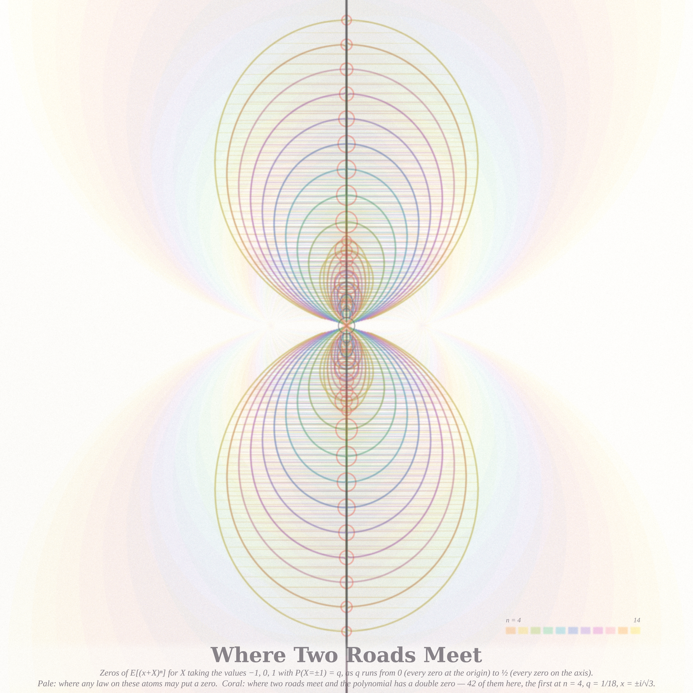
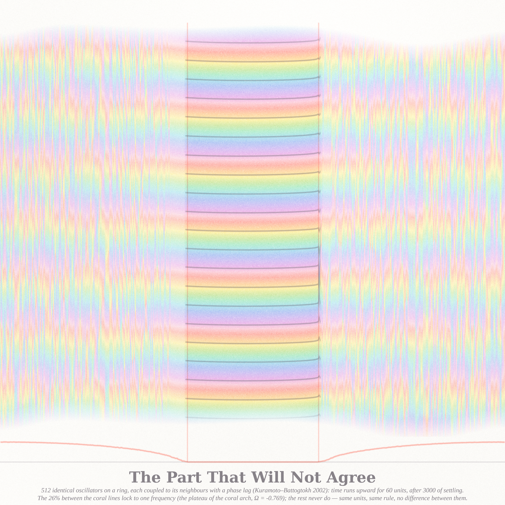

# Where the Description Ends — `art_pooz/` (2026-09-06, Fable 5.1 run #5, pastel #6)

Seeded by the live front pages. Philosophy.SE 141420 asks *"Can this problem be solved within the
field that has posed it?"*; 141289 asks in what sense a higher level can constrain the lower one
when the microphysics is already sufficient; 141404 asks whether One can contemplate Zero.
MathOverflow 514900 (6 pts) asks whether the moment polynomials E[(x+X)ⁿ] always have simple zeros.

Three pieces, one theme: **the place where a description stops being one** — a fluid model that
dies in finite time at a cusp, a ring of identical oscillators that agrees on a quarter of its
length and nowhere else, and a family of polynomials whose zeros travel until two of them land on
the same spot. Fresh territory for this series: nothing in the USED list touched Hele-Shaw /
Polubarinova–Galin flows, Kuramoto chimeras, or Appell / moment polynomials.

Six ideas were drafted (spiral-wave chimera, Hele-Shaw suction to the cusp, ring chimera
space–time carpet, moment-polynomial zero roads, lion-and-zebras pursuit trails, van der Pol
isochrons with the phaseless point). The first four were built; the 2-D spiral chimera did not
reach a locked state in ~25 runs and is recorded as a negative result (`notes_chimera.md`), so
the fluid piece became the hero.

## The pieces

### 1. The Fluid Leaves Before the Model Does (hero, 4096²)

A blob of viscous fluid between two plates, sucked out through one point with **no surface
tension** — the exact Polubarinova–Galin dynamics of a degree-7 polynomial conformal map
(`hele.py`; the polynomial stays a polynomial, so the only approximation is the time step).
Each strip is the fluid removed in one slice of time (28 slices, warm → cool), its rim in ink.
After only **26.0 %** of the fluid has left, the boundary sharpens into **three cusps** (within 1.7 %
of each other in time; seed 27 of 40 scanned) and the equations stop describing anything: coral
is that instant and those points. Inside, the fluid that remains carries the streamlines of the
flow at that moment (images of the disc's radii under the map; they pinch at the cusps, where the
speed is infinite) and five equipotentials; the faint ink loops are the same equations continued
past the cusp, where the map is no longer one-to-one and no fluid can follow.
*Verified:* PG residual 8e−13; area law A(t) = A₀ + Qt to 3e−6; Richardson moments M₁…M₆ conserved
to 7e−7 by independent contour quadrature; zeros of f′ at the cusp instant at radii 1.0000, 1.0142,
1.0165. Closed form for one mode f = aζ + bζ^{k+1}: cusp when a^{k+2} = (k+1)a₀^{k+1}b₀, so a
ripple of size 0.02 in the sixth mode still kills the model with 63 % of the fluid left
(`notes_hele.md`). The 2560 version is `hele_2560.png`.

### 2. Where Two Roads Meet (2560²)

MO 514900: must Q_n(x) = E[(x+X)ⁿ] have simple zeros? Take X ∈ {−1, 0, 1} with P(X = ±1) = q. As q
runs from 0 (the constant law: every zero at the origin, coral bead) to ½ (every zero on the
imaginary axis), the zeros travel the **roads** drawn here for n = 4…14, one pigment per degree,
with rungs joining each zero to its mirror image. Where two roads meet on the axis the polynomial
has a **double zero** — the coral rings, 42 of them in this window, the first at n = 4, q = 1/18,
x = ±i/√3 where Q₄ = (3x²+1)²/9. The pale haze is where *any* law on these three atoms could put a
zero of degree n (0 ∈ conv{(x−1)ⁿ, xⁿ, (x+1)ⁿ}).
*Mathematics* (`notes_appell.md`, `appell.py`): closed forms q_{n,k} = 1/(2 + 2|cos(πk/(n−1))|^{1−n}),
x = ±i cot(πk/(n−1)); exactly ⌊n/4⌋ collision parameters per degree; **n ≤ 3 never fails, every
n ≥ 4 does**; all 380 double points for n ≤ 40 verified to 60 digits and shown to be exactly double.
**Theorem (degree 4): Q₄ has a multiple zero iff X has skewness 0 and kurtosis exactly 9.** The
reason the poster's 24 × 59 search found nothing: a non-real common zero of two real polynomials
is a codimension-2 condition, so one-parameter families miss it unless a symmetry (X ≐ −X) drops
the codimension to 1 — then they cross it at isolated parameters, as here. Asymmetric three-atom
laws have isolated double-zero weights too, off the axis (`appell_asym.py`). The existing MO
answer (score 11) gives one n = 4 example; the family, the n ≤ 3 impossibility, the kurtosis
criterion and the codimension count are new.

### 3. The Part That Will Not Agree (2560²)

The original chimera state (Kuramoto & Battogtokh 2002): 512 **identical** phase oscillators on a
ring, each coupled to its neighbours through an exponential kernel with a phase lag α = 1.457.
Time runs upward for 60 units after 3,000 of settling. Between the coral lines the oscillators
lock to one frequency — horizontal bands, ink wavefronts every third of a turn — and outside them
they never do: each drifting oscillator is a vertical thread cycling at its own rate, slowing to
long streaks as its frequency approaches Ω near the boundary. The coral arch below is the measured
mean-frequency profile over 800 units: plateau Ω = −0.769 on **26.0 %** of the ring, rising to
−0.300 at the antipode. Same units, same rule, no parameter differs between the two arcs.
The 2-D spiral-wave chimera was hunted and not caught: plane waves with wavelength ≥ 12 kernel
radii lock exactly (Ω = −Ĝ(k) sin α to three digits), wavelength 5 radii breaks up, and every
spiral core selected the short, unstable wavelength (`notes_chimera.md`, seven regimes tabled).

## Files
* `pastel.py` — the subtractive watercolour stack (paper, Beer–Lambert pigments, ink, captions).
* `hele.py` — Polubarinova–Galin polynomial dynamics, cusp bisection, Richardson moments;
  `render_hele.py`; `notes_hele.md`; `hele_hero_4096_cert.json`, `hele_2560_cert.json`.
* `appell.py`, `appell_asym.py` — the double-zero family, exact verification, asymmetric search;
  `render_appell.py`; `notes_appell.md`; `appell_double_points.json`, `appell_asym.json`.
* `kb1d.py` — the ring chimera; `render_kb1d.py`; `kb_2560_cert.json`. `chimera2d.py`,
  `render_chimera.py` — the 2-D engine (torus / no-flux, kernels, α schedules, warm starts,
  mean-frequency field) and its renderer, kept for the next attempt; `notes_chimera.md`.

## The story (tweet-sized)
You were a blob of oil between two panes and someone opened a drain. For a while every equation
knew where you were. Then your rim sharpened into three points and the equations kept talking,
drawing loops through places you had already left. What you did next, they cannot say. You did it
anyway.

## What I learned about generative art this run
* **Ask what field is defined in the empty part.** The retreat had a blank interior until the
  exact streamlines went in — and they showed the cause of death (speed ∝ 1/|f′|), not just filled
  the space. Emptiness is usually a field nobody has drawn yet.
* **Ink the relation, not the points** (again): the zero roads became a body only when the rungs
  between mirror zeros went in; the theorem is about the meeting, so draw the approach.
* **A measure can lie about coherence.** Local order |Z| looked like a chimera core inside a tightly
  wound but perfectly locked spiral. The honest certificate was the mean-frequency field, and
  its plateau sits at the *extreme* of the profile, not the median — every "locked fraction" was
  wrong until that was fixed. Choose the certificate before choosing the palette.
* **Time on the vertical axis needs the right window.** Eight hundred time units in 1,700 rows
  aliased a locked arc into grey; sixty units made each drifting oscillator a thread with its own
  rhythm. The window is a compositional parameter, like the frame.
* **Stroke scale is part of the design from line one** (`rs = FINAL/1024·SS`); the 2560 finals came
  out hairline-thin the first time. And never `pkill -f` inside a compound command — the tenth
  bite killed my own shell mid-edit.
