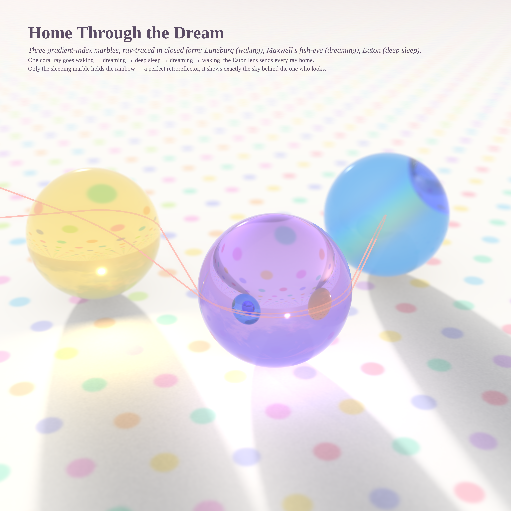
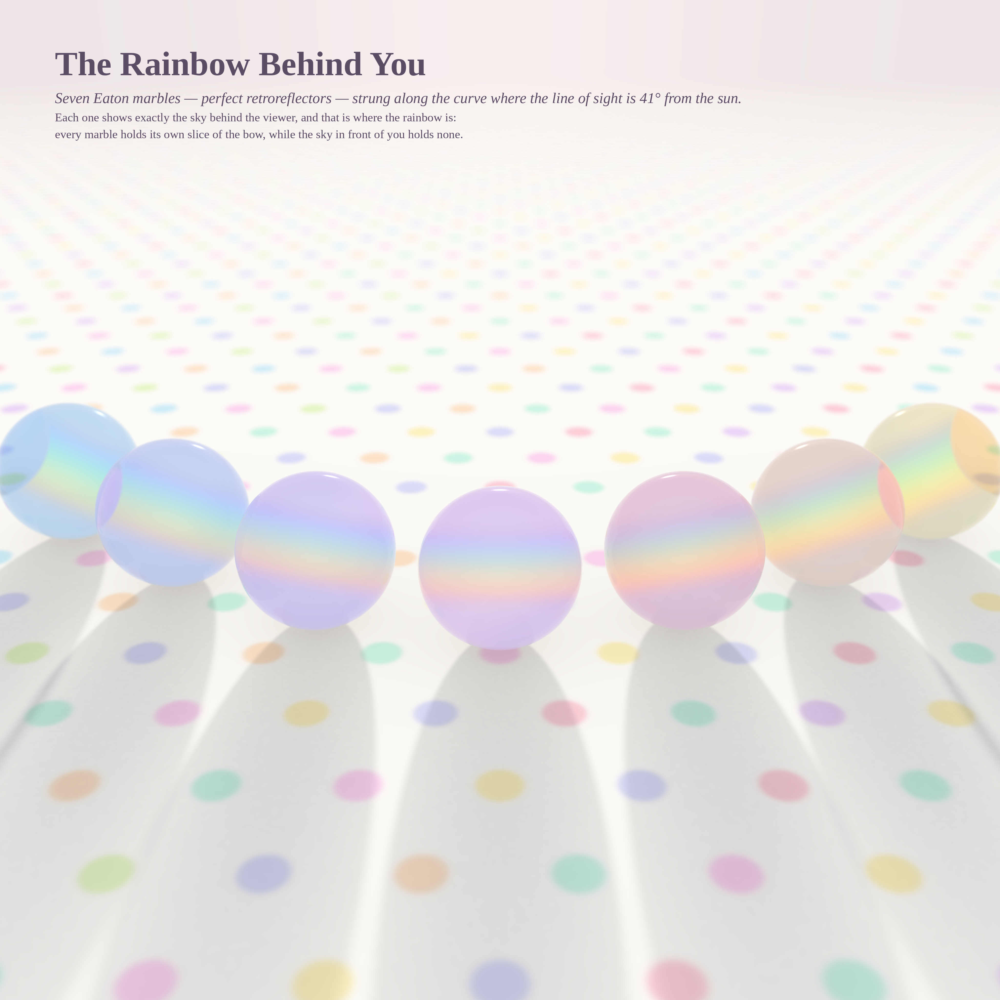
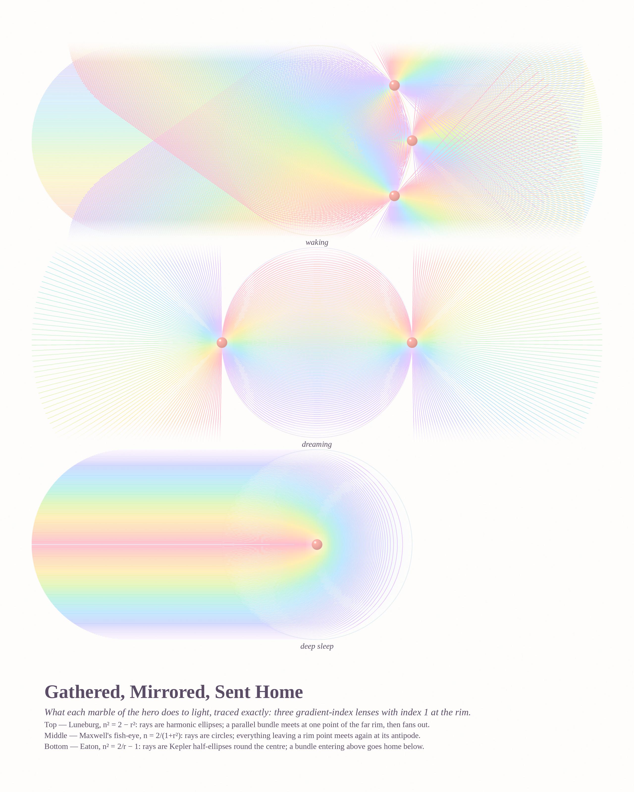
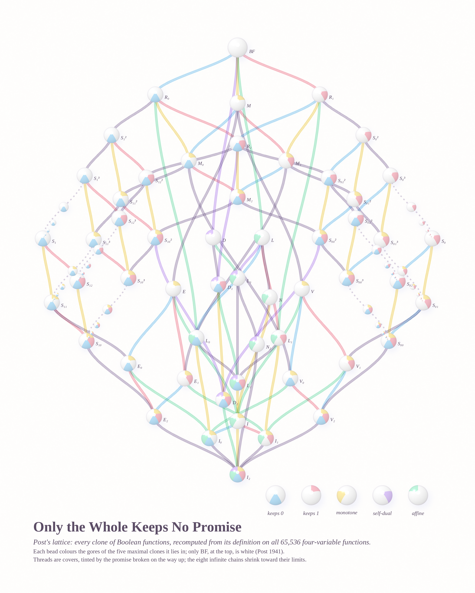

# WHO WAKES UP — pastel #29 (Opus 5.5, run 8, 2026-10-06)

*Seeded by Philosophy.SE 142384, "What justifies the assumption of a continuous 'I' across waking, dreaming, and deep
sleep?", and MathOverflow 515756 (Post's lattice), 330620 (a q-analogue inequality).*

The question asks what stays the same while everything else changes. The run answers with light and with promises.
Three glass marbles, one per state of the Mandukya Upanishad, and one ray that passes through all of them and comes
home. And a lattice of every set of Boolean operations, each bead coloured by the promises it keeps.

| # | piece | size | what it is |
|---|---|---|---|
| 1 | **Home Through the Dream** (hero) | 4096² | three gradient-index marbles (Luneburg, Maxwell fish-eye, Eaton) on a polka-dot cloth, ray-traced in **closed form**, photon-mapped sun |
| 2 | **The Rainbow Behind You** (go-deeper) | 4096² | seven Eaton marbles strung along the table conic where the line of sight is 41° from the sun: every marble holds the rainbow the sky does not show |
| 3 | **Gathered, Mirrored, Sent Home** | 2560×3200 | exact ray portraits of the three lenses |
| 4 | **Only the Whole Keeps No Promise** | 2560×3200 | Post's lattice, recomputed from the definitions, as a mobile of five-gore beach balls |

### 1 · Home Through the Dream

All three lenses have index 1 at the rim, so light enters with no bend, and the ray equation inside is exactly
solvable. Each marble maps an entry point and direction (P, d) to an exit point and direction:
Luneburg (d, −P), fish-eye (−P, 2(d·P)P − d), Eaton (2(P·d)d − P, −d), checked against RK4. The yellow **waking**
marble gathers parallel light to one point, which is why it throws a bright butter pool. The lilac **dreaming**
marble images every point to its antipode, so it holds a bowl of inverted dots. The blue **deep-sleep** marble
sends every ray back the way it came. The coral ray goes waking → dreaming → deep sleep → dreaming → waking:
an Eaton lens turns the ray round, so it has to come home through the dream. Only the sleeping marble shows the
rainbow, because a perfect retroreflector shows exactly the sky behind the one who looks. The sun was placed so
that this marble sits on the 41° bow.

### 2 · The Rainbow Behind You

Going deeper on that last fact. An Eaton marble looked at along direction v shows the sky in direction −v, so it
shows the rainbow exactly when v is 41° from the sun. That cone meets the table in a conic. Seven marbles are spaced
along it by arc length, and every one of them glows with its own slice of the bow. Their bands tilt with the
circle around the sun that the necklace traces. The real sky in the picture holds no rainbow at all.

### 3 · Gathered, Mirrored, Sent Home

The hero's three marbles opened up, each ray drawn on its exact arc: harmonic ellipses (Luneburg; three bundles,
three foci), Maxwell circles (the fish-eye "eye": two rim sources, each re-imaged at the other), and Kepler
half-ellipses (Eaton: the bundle that enters above goes home below, as a mirrored rainbow). Rays are drawn
alpha-over so thousands of pastel threads stay clean where they cross. Coral beads mark where each theorem lives.

### 4 · Only the Whole Keeps No Promise

Every clone of Boolean functions is computed from its defining property on all 65,536 four-variable functions:
54 distinct clones, 114 covers, duality-symmetric, and the coatoms come out as exactly R₀, R₁, M, D, L (Post's
completeness theorem, recovered by computation). Each bead is a beach ball with five gores, one per maximal clone
(keeps 0 / keeps 1 / monotone / self-dual / affine), each coloured if the clone lies inside it. The projections at
the bottom keep all five promises; BF at the top keeps none and is the only white pearl. Each thread is tinted by
the promise broken on the way up. The eight infinite chains S₀ᵏ ⊃ S₀ᵏ⁺¹ ⊃ … are strings of beads shrinking
toward their limits.

## The six ideas
1. **GRIN marbles**: Luneburg, fish-eye and Eaton ray-traced in closed form → **built** (hero).
2. **Ray portraits** of the three lenses → **built**.
3. **Post's lattice as a candy mobile** (MO 515756) → **built**.
4. **Rainbow necklace**: retroreflectors along the 41° conic → **built** (go-deeper, the run's favourite).
5. **Tied silk** (MO 330620): uniform lattice paths tied at the LHS knots (warm) and the RHS knots (cool) →
   prototyped (`render_silk.py`, `protos/silk*.png`) and **dropped**: pink and blue silk blur into lavender clouds and
   the comparison doesn't read. The math was done anyway (below).
6. **A quilt of matrix orders mod p** (MO 515754: ord of the companion matrix of x² − tx + d over (t, d) ∈ F_p²) →
   not built.

## Mathematics (`notes_math.md`)
* **Closed-form GRIN tracing.** Exit maps and arc lengths for all three lenses (Luneburg: a quarter of a harmonic
  ellipse; fish-eye: 2θ/sin θ; Eaton: 2E(1 − b²)), verified against RK4. The coral beam was found by scanning
  launch lines for the ball sequence 0, 1, 2, 1, 0.
* **Post's lattice (MO 515756):** a mechanical recomputation, not the elementary proof asked for: 54 clones,
  Dedekind-number check 168, closure under random superpositions, 5 coatoms.
* **MO 330620:** the q-inequality verified for c + d ≤ 11 and j < k ≤ 11 (1,110 non-trivial cases, 0 failures; the
  poster checked b, k ≤ 6). Both sides are palindromic about the same centre, so the difference is palindromic. The difference is
  *not* always unimodal (13 of 63 cases are two-humped, dipping at the centre), which closes that route to a proof.
  **Conjecture:** the inequality always has slack, with R_i ≤ (19/24)·L_i for every coefficient. The extreme case is
  (c,d,j,k) = (1,1,2,3), at 4/7 of the degree.

## Files
`grin.py` (closed-form GRIN tracer, photon map, thin-lens camera) · `render_marbles.py` (scenes `trio`, `necklace`) ·
`beam.py`, `beam_pick.py`, `overlay_beam.py` (the coral ray) · `tone.py`, `caption_hero.py` · `render_rays.py` ·
`post.py`, `post_hand.py`, `render_post.py`, `post_layout.py` (annealer, not used: it couldn't reduce crossings) ·
`qbinom_check.py`, `qbinom_unimodal.py`, `qbinom_tight.py` · `render_silk.py` (dropped piece) · `test_lens.py`.
Heroes: `hero_marbles_v2.sh`, `hero_necklace.sh` (photon map once, three strips × 24 jittered, depth-of-field passes).

## Tweet
> Three marbles slept on a polka-dot cloth. Waking gathered the light to a point; Dreaming turned every dot
> inside out; Deep Sleep sent each ray home the way it came. One coral ray went through all three and back
> through the dream. Only the sleeper saw the rainbow — it was behind you all along.
