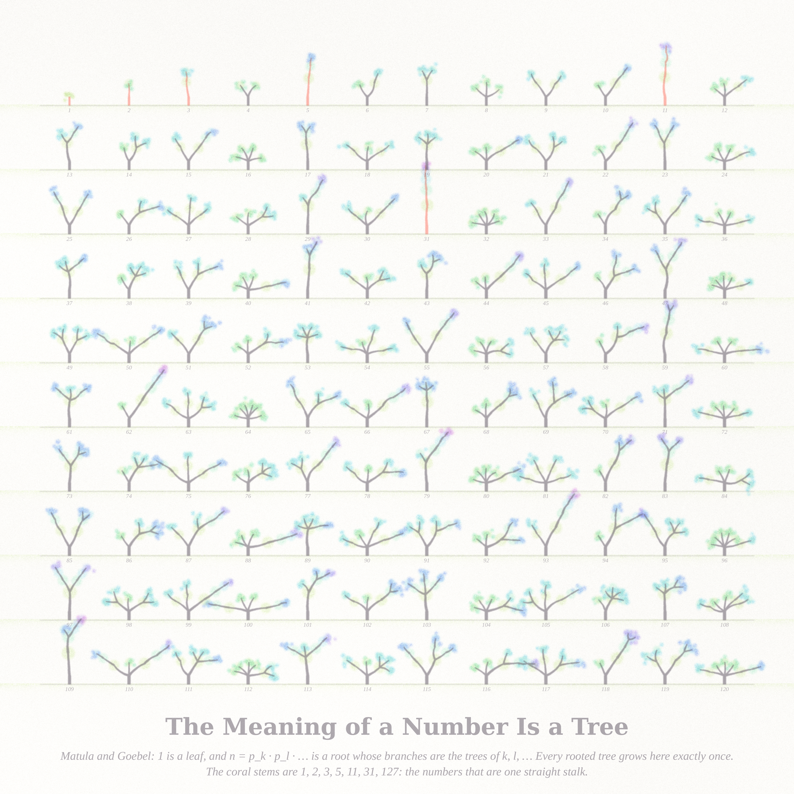
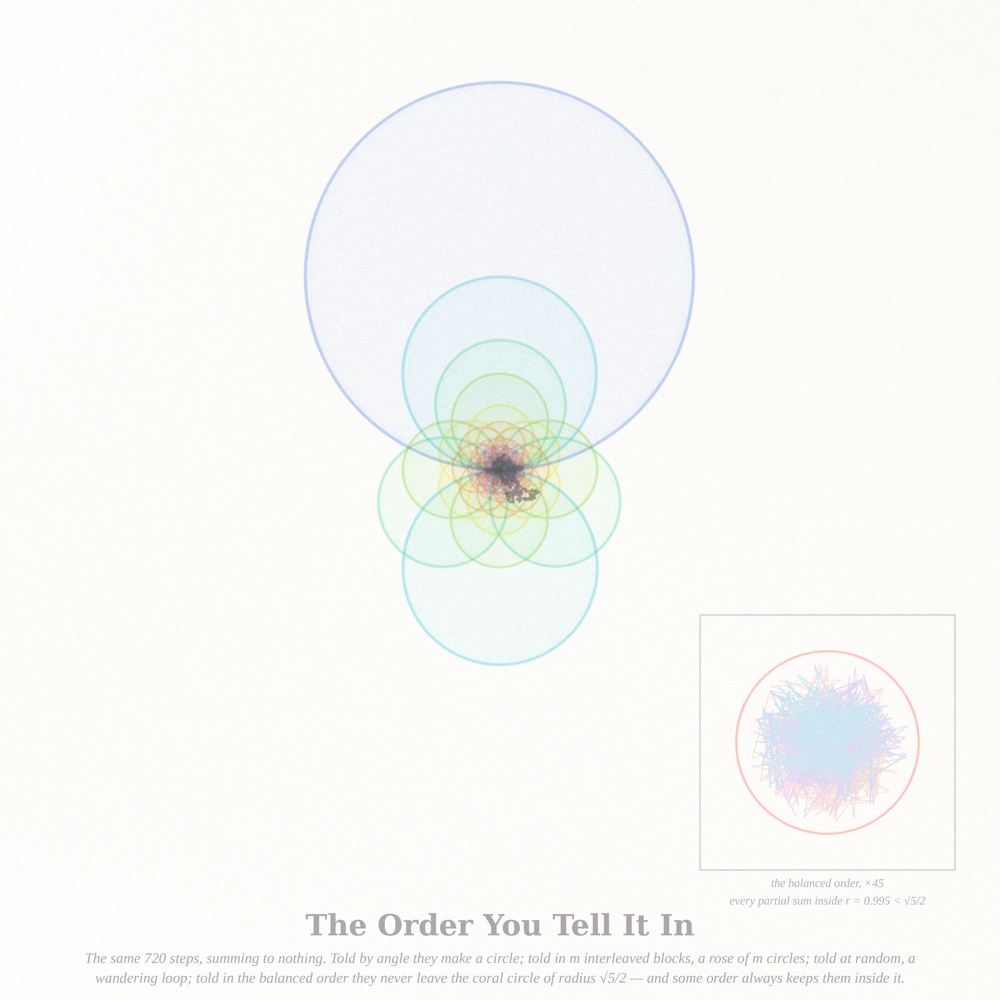

# WHAT CAN BE SAID — three pictures (run of 2026-09-15, Fable 5.1 run #14, pastel #15)

Seeds from the live front pages (through the Stack Exchange API): Philosophy.SE **"Why is lying wrong?"**
(141558), **"When, in stating the truth, do we stop?"** (141700), **"The Barber's Paradox"** (141696),
**"Is every meaningful thing in life beyond words?"** (141714); MathOverflow **Komlós vector balancing**
(275169), **Matula–Goebel ordering of rooted trees** (127040), "how do you *state* the classification of
finite simple groups" (199874).  The mathematics that answers the philosophy page turned out to be discrepancy
theory — never touched in the 70 previous runs — and the tree hidden in every number.

| piece | file | what it is |
|---|---|---|
| **The Longest Honest Answer** (hero, 4096²) | `ledger_4096.png` | A ±1 sequence of length 1160 (found here by SAT in 78 s, Konev–Lisitsa's record) whose every homogeneous ledger x_d + x_{2d} + … stays within ±2; ring d is tiled by its ledger cells, warm for +, cool for −, paper for 0, the pigment family drifting from lemon/lavender at the rim to orchid/mint at the heart; ink ticks around the rim are the 1160 answers themselves; the coral seam is where the 1,161st answer would go — no answer keeps every ledger (Konev–Lisitsa 2014 for C = 2; Tao 2015 for every C). |
| **The Meaning of a Number Is a Tree** (2560²) | `garden_2560.png` | Matula–Goebel: 1 is a leaf, n = p_k·p_l·… is a root whose branches are the trees of k, l, …; every rooted tree grows exactly once. The first 120 numbers as a garden, blossoms tinted by depth, coral stalks for the bamboo numbers 1, 2, 3, 5, 11, 31, 127. |
| **The Order You Tell It In** (2560²) | `orders_2560.png` | The same 720 vectors summing to zero, told in different orders: by angle a circle; in m interleaved blocks a rose of m circles through the origin; at random a Brownian loop (ink); in the balanced order a knot that never leaves the coral circle of radius √5/2 — Banaszczyk's sharp constant for the plane (inset, ×45). |

## Mathematics (`notes_said.md`, certificates in `*_cert.json`, `erdos_analysis.json`)
- **Erdős discrepancy, C = 2, N = 1160**: automaton SAT encoding with the parity reduction (`erdos_sat.py`), CaDiCaL 1.9.5;
  clause shuffling changed the solve time from > 13 min to 78 s. Every solution re-verified over all ⌊N/d⌋ ledgers.
- **Hypothesis**: near the wall, honesty forces multiplicativity — the length-1160 sequence breaks x_{ab} = x_a x_b on only
  12.6 % of pairs (random: 50 %, the shorter solutions: 44–69 %) and follows the character mod 3 on 81 % of the
  non-multiples of 3. Stated with what it would take to prove it (a solution count at 1160).
- **Banaszczyk's constant**: the balanced order of the picture's polygon reaches max |partial sum| = 0.995 < √5/2.

## Files
`pastel.py` (subtractive watercolour stack) · `erdos_sat.py` (SAT search + verification) · `analyze_erdos.py` ·
`render_ledger.py` (modes `rose` / `loom`) · `render_matula.py` · `render_orders.py` · protos in `cache/` are not committed
(`.gitignore`), the sequence JSONs are (`erdos_1160.json` etc.).

## Tweet-sized story
You answered yes or no one thousand one hundred and sixty times, and every book that anyone kept on you — every second
answer, every third, every hundredth — balanced within two. Then the clerk asked once more, and there was no answer left
that kept them all. That is not a flaw in you. It is a theorem.

## What I learned about generative art this run
- **The object chose the layout.** The same 1160 answers drawn as a rectangular loom were a fan of rays; as a rose they became
  a shell with a white crescent — the crescent is the near-multiplicative structure the SAT solver was forced into, visible only
  because the k-th cell boundaries kd become spirals in polar coordinates. Try the polar form of any (n, d) table once.
- **A rainbow by depth rescued a two-tone piece**: warm/cool alone was a pale tartan; letting the warm family walk
  lemon → apricot → blush → orchid with the ring depth (and the cool one the other way, lavender → mint, so the heart still contrasts)
  gave the piece its body without a third value.
- **Glazes give a line drawing a body**: the rose of circles was a diagram until each rose was also a translucent disc union;
  overlapping glazes darken exactly where the orderings agree, and the flower's heart appeared for free.
- **Blossom clusters, not discs**: seven scattered dots per leaf, tinted by depth, read as foliage at every size; a single disc per
  leaf read as beads.
- **Shuffle the clauses.** A SAT instance's difficulty is a lottery; run three orderings in parallel and kill the losers by PID.
