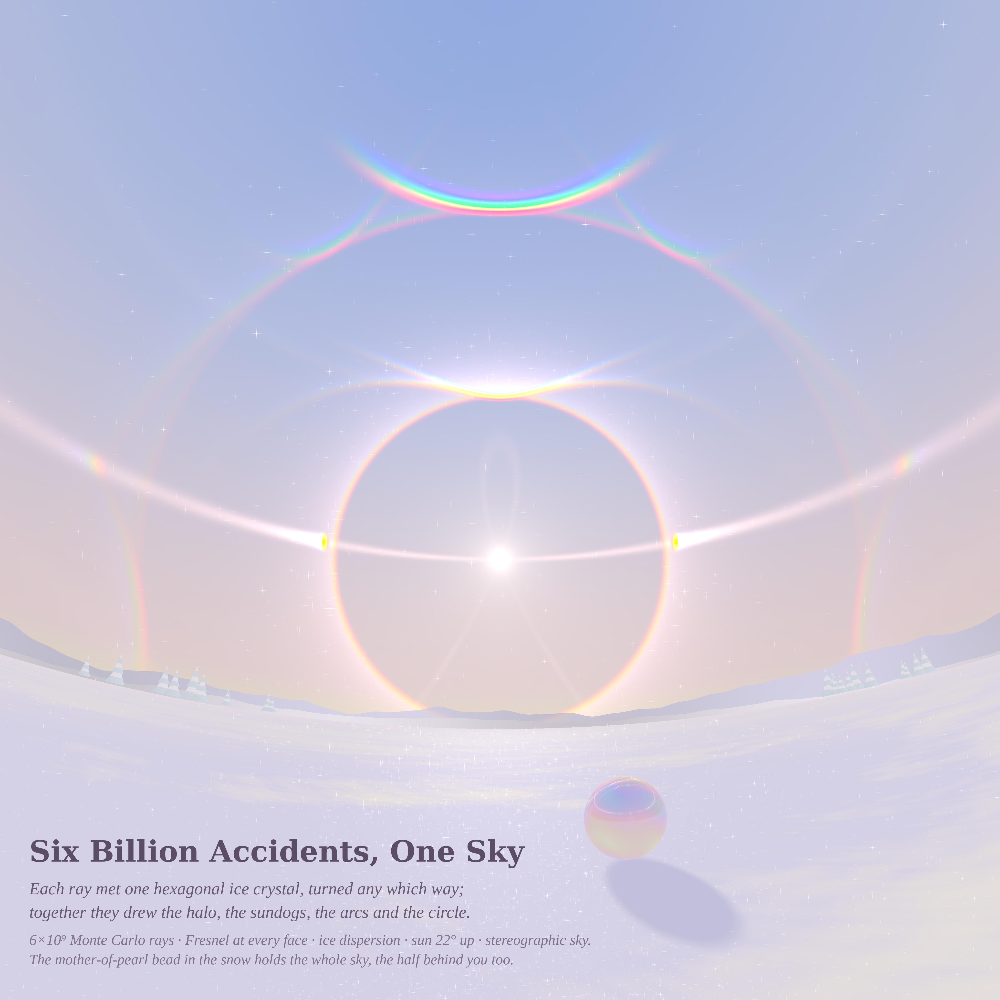
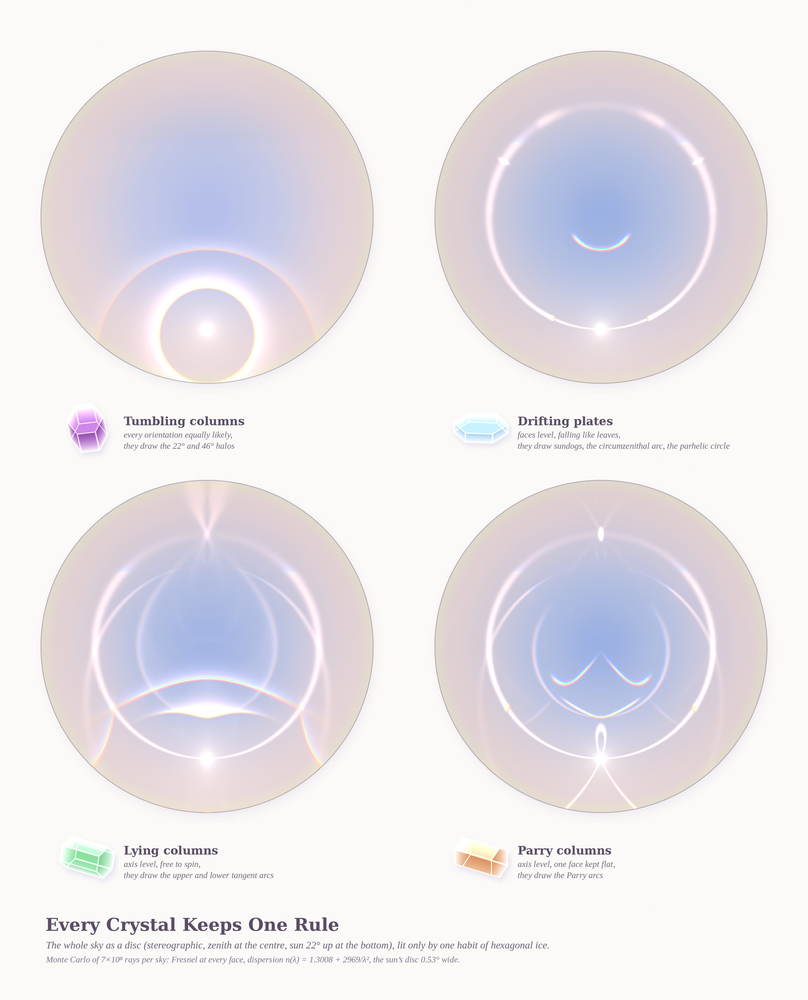
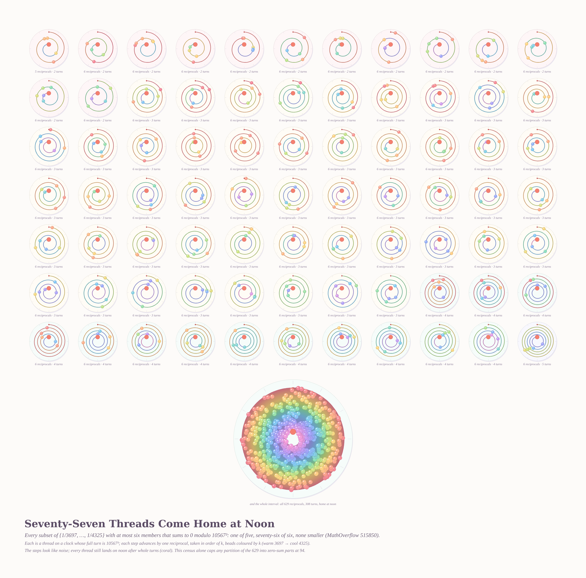
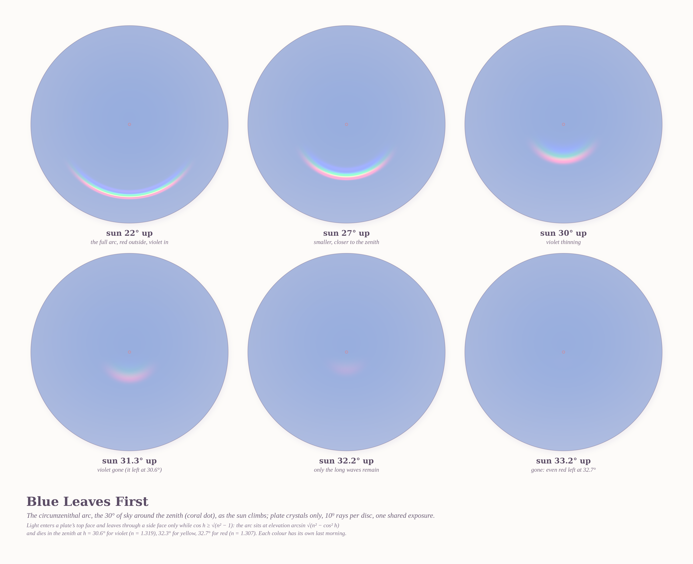

# SYMMETRY IN RANDOM NOISE — pastel #33 (Opus 5.5, run 12)

Seeds (live front pages, 2026-10-10): Philosophy.SE 142473 *"How do we perceive symmetry in random noise"*
(the asker's example: frost crystals lit by headlights), Philosophy.SE 142475 *"The infinite in a small mother-of-pearl bead"*,
MathOverflow 515850 *"Maximum number of disjoint zero-sum subsets of modular reciprocals"*.

The six ideas: (1) an ice-crystal halo display, Monte Carlo through hexagonal prisms; (2) the sky lit by one crystal habit at a time;
(3) zero-sum reciprocal threads as clocks that strike noon; (4) Glass patterns, random dots paired by a transformation (dropped: moiré register used 09-14);
(5) scratched lacquer under a headlight, where random scratches glint in circles (kept as a seed); (6) lattice hulls under random translations, MO 515877 (dropped: too close to the Bárány parliament).

## 1. Six Billion Accidents, One Sky (4096², hero)

A new Monte Carlo halo engine (`halo.c`): 6×10⁹ sun rays, each through one hexagonal ice prism in a random pose drawn from four habits
(tumbling columns, drifting plates, lying columns, Parry columns), with Fresnel reflection or refraction at every face, ice dispersion
n(λ) = 1.3008 + 2969/λ², and a 0.53° sun. Rays are binned as CIE XYZ into a stereographic sky, so every halo that is a circle on the sky
is also a circle in the picture. What appears: the 22° and 46° halos, sundogs, the parhelic circle, the upper tangent arc, the vivid
circumzenithal arc, supralateral arcs, and the 120° parhelia at the edges. The sparks in the air are ~3,500 individual rays drawn as glints,
and they gather on the arcs (the noise that the symmetry is made from). A mother-of-pearl bead on the snow (`scene.py`, thin-film nacre) reflects the whole sky,
including the half behind the viewer.

## 2. Every Crystal Keeps One Rule (3200×3960)

The whole sky as a disc (stereographic, zenith at the centre, sun at the bottom), lit by one habit at a time, 7×10⁸ rays each,
with each crystal drawn beside its sky in sorbet glass (`glass_icon.py`: convex half-spaces, chord tint, edge light).

## 3. Seventy-Seven Threads Come Home at Noon (4080×4030)

Every zero-sum subset of size ≤ 6 of {1/3697,…,1/4325} mod 10567³. That is the complete census: none of size ≤ 4, one of size 5, and 76 of size 6, which matches the OP's count.
Each subset is a spiral thread on a clock whose full turn is 10567³, with one reciprocal per step, taken in order of k. The steps look random, but every thread
ends on noon after a whole number of turns. Below them is the whole interval: 629 steps and 308 turns, which is the asker's congruence.

**Math (zerosum/NOTES.md):** a complete census of sizes ≤ 7 (0, 0, 0, 0, 1, 76, 6 304) by meet-in-the-middle in C; then
**proved: any partition of U into zero-sum parts has at most 94 parts** (7N ≤ 629 + 2a + b, with max 2a + b = 33 certified by CP-SAT).
I could not beat the OP's 86: CP-SAT plus local search on harvested 8-sets reached 76. So 86 ≤ N_max ≤ 94.
**Conjecture:** the true maximum is 86–88. Average part size would have to be ≤ 7.23, but only about 75 parts of size ≤ 7 pack disjointly.

## 4. Blue Leaves First (3960×3220, go-deeper on the hero's favourite arc)

The circumzenithal arc (plates only, 10⁹ rays per disc, one shared exposure) as the sun climbs from 22° to 33.2°. Light enters a plate's top face
and leaves a side face only while cos h ≥ √(n² − 1). The arc sits at elevation arcsin √(n² − cos² h) and shrinks into the zenith, where it dies at
h = 30.6° for violet, 32.3° for yellow and 32.7° for red. The colours leave one at a time, shortest wavelengths first.

## Tweet
> Six billion ice crystals fell, each one tumbling as it liked, and none of them knew about circles. Each bent one ray of sun.
> Together they drew a ring at 22°, two sundogs and a rainbow smile above. In the snow a small pearl held all of it, even the half of the sky behind you.

## Files
`halo.c` (engine) · `scene.py` (sky, snow, thin film) · `render_hero.py` · `render_sheet.py` + `glass_icon.py` · `render_clocks.py` · `render_cza.py` + `run_cza.sh` ·
`zerosum/` (`zs.c` census, `zs8.c` 8-set harvest, `pack.py`/`ls_pack.py`/`bound.py`, `NOTES.md`).
Re-run: `./halo tmp/H 6000000000 22 "$(cat pop_hero.txt)" 0 30 4096 4096 0.85 4096 7` then `python3 render_hero.py tmp/H 4096 4096 out.png 0.30`.
