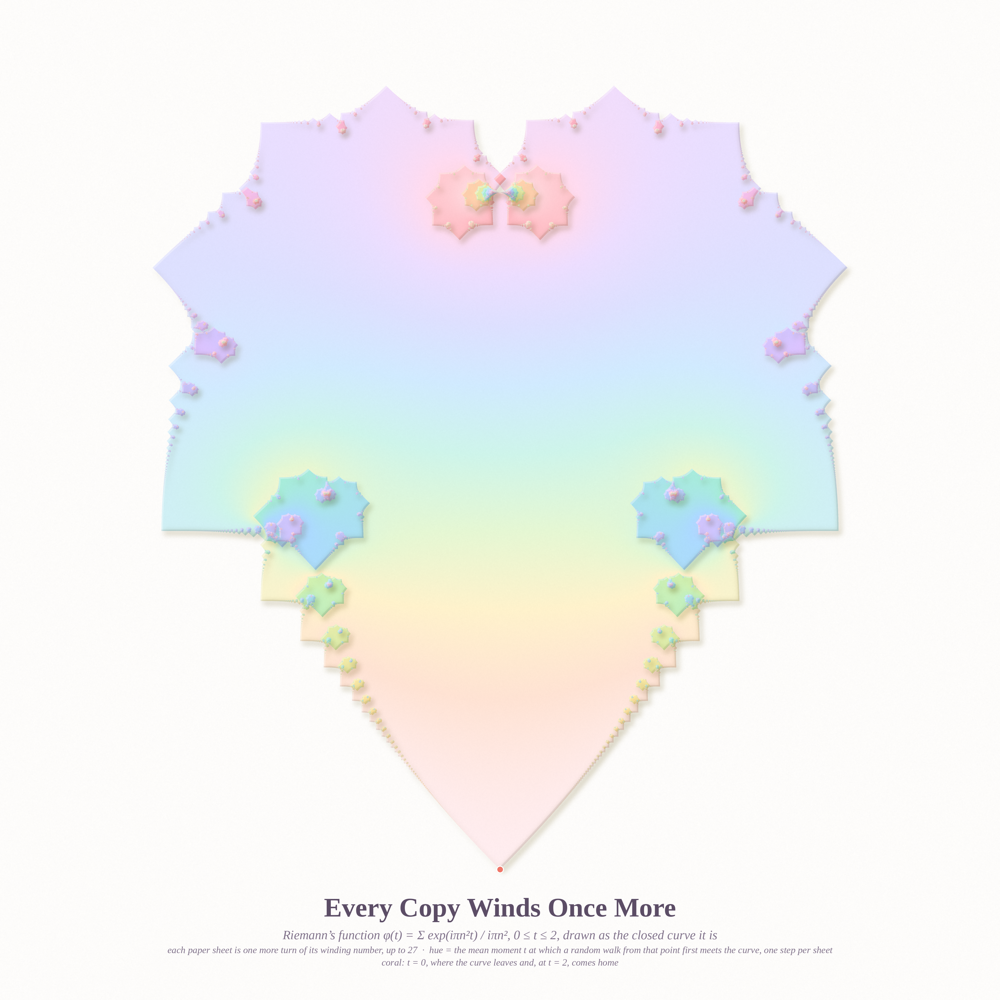
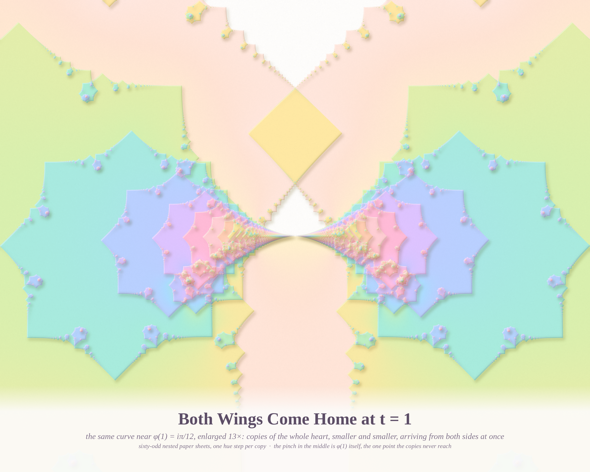
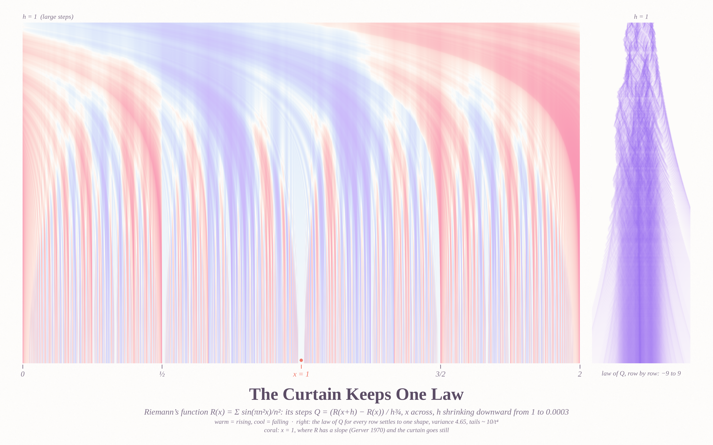

# IT HAPPENS AGAIN — pastel #30 (Opus 5.5, run 9, 2026-10-07)

*Seeds:* Phil.SE 142413 ("Is the argument 'if it happened before it will happen again' valid?") and 142304
("One particle universe"). MathOverflow 515776 (the law of the small-scale increments of Riemann's function),
515784 (pinwheel squares), and 300255 (rectangles with equal perimeters, already answered).

Riemann's function is a one-particle universe: one sum, one rule (n² in the exponent), and nothing else.
Drawn as a curve it keeps happening again: every rational moment p/q brings a smaller copy of the whole.
Popper is right that past repetition proves nothing about a world, but this world can be checked.

## The pieces

### Every Copy Winds Once More — 4096 × 4096 (hero)

φ(t) = Σ e^{iπn²t}/(iπn²) for 0 ≤ t ≤ 2 is a closed curve shaped like a heart. Each smaller copy of the heart
winds around its points once more than its parent. The picture is a paper-cut stack: sheet k = {winding ≥ k},
up to 27 sheets deep, on an 8192² grid from 2²⁴ exact FFT samples of the curve. The colour is the
**harmonic extension** of the curve's own time (mirror-folded, s = min(t, 2−t)): the mean moment at which a
random walk from each point first meets the curve, plus one hue step per sheet. The coral bead is t = 0 = 2,
where the curve leaves and comes home.

### Both Wings Come Home at t = 1 — 3200 × 2560

The top centre of the heart, enlarged 13×. Copies of the whole heart arrive from both sides, smaller and
smaller, tunnelling into φ(1) = iπ/12: sixty-odd nested sheets, one hue step each. The window |t − 1| < 0.12 is
summed directly (8·10⁶ points, 3000 terms, numba) and spliced into the FFT curve so the winding numbers stay exact.

### The Curtain Keeps One Law — 4096 × 2560

MO 515776. Q = (R(x+h) − R(x))/h^{3/4}, with x across [0, 2] and h shrinking from 1 to 3·10⁻⁴ down the page.
Warm means rising and cool means falling. The broad folds at large h split into silk threads as h shrinks.
The right panel shows the law of Q for each row; it narrows to one fixed shape (variance 4.65, tails ≈ 10/t⁴).
The coral mark is x = 1, where R is differentiable (Gerver 1970). There Q ~ h^{1/4} → 0, and the curtain
has a still column.

## Six ideas (three made)
1. **Riemann's curve as winding-number paper-cut** — made (hero).
2. **The vortex at t = 1** — made. *Go deeper:* 13× further in, the copies only hug a tangent line (φ has a
   tangent at 1), so it is a wedge, not a repeat. Dropped; this is mathematically telling.
3. **Increment curtain + law panel** — made.
4. **Riemann's curve as floating glass terraces** (ray cast, coloured shadows on polka dots) — prototyped; murky
   and grey, and the glass hid the fractal. Dropped.
5. **Pinwheel primes as a sunflower of clay tiles** around an empty coral socket — prototyped and dropped.
   Quarter-turn-symmetric bit grids inevitably include swastika-like tiles. The search stays as math.
6. **Equal-perimeter rectangle quilts** (MO 300255): already solved on MO (five 9-rectangle dissections), not made.

## Math (details in `notes_math.md`)
- **MO 515776.** Var Q → 4.65, and P(|Q|>t)·t⁴ ≈ 10 at every scale from h = 10⁻⁶ to 4·10⁻³. E Q⁴ grows like
  10.8·log(1/h). A short heuristic (big Q only within q^{−1}h^{1/2}t^{−2} of a rational with denominator
  q < h^{−1/2}t^{−2}) gives the t^{−4} tail exactly. The same tail, cut off at t ≍ h^{−1/4}, *is* the
  logarithmic divergence of the fourth moment, so the two constants must agree (10 vs 10.8).
  **Conjecture:** the law converges, with an explicit Gauss-sum tail constant.
- **MO 515784.** *Lemma:* for even n every pinwheel number is divisible by 3 (each 4-cell orbit cancels mod 3),
  so pinwheel primes only exist for odd n. Counts of pinwheel primes: 1 (n=5), 161 (n=7), 31 595 (n=9).
  **No pinwheel squares for n ≤ 12** (8.6·10⁹ candidates at n = 12; exact check of all filter survivors);
  n = 13 (1.1·10¹² candidates): see `notes_math.md`. Heuristic expected count ≈ Σ 2^{−n²/4} < 1.
  **Conjecture: none exist.**

## Tweet
> A sum with one rule drew a heart, and the heart kept meeting itself: at every simple fraction of its time, a
> smaller heart. Each copy wound once more around its middle, and at t = 1 the copies came home from both
> sides at once. Did it happen again because it happened before? No. It was the same rule.

## What I learned about generative art
**Colour by a harmonic extension, not a nearest-neighbour map.** Painting a region by "the value of the nearest
boundary point" gives Voronoi panels with hard seams. Solving Laplace's equation with the boundary values
(a random-walk average) gives seamless washes and soft halos around every small feature. It also *means*
something. On fractal boundaries it is the difference between stained glass and watercolour.
A second lesson: shade a deep stack by **one** height-field shadow map rather than per-layer shadows, or sixty
nested edges multiply to mud.

## Files
`riemann.py` (exact FFT sampling), `local.py` (direct numba sums), `wind.py` (scanline winding numbers),
`heartfield.py`, `zoomfield.py`, `harmonic.py` (pyramid Jacobi Laplace solve), `render_paper.py` /
`render_paper2.py` (paper-cut stack; the height-field version is final), `render_curtain.py` +
`compose_curtain.py`, `compose.py`, `caption.py`; `render_heart.py` (dropped glass), `render_pin.py` (dropped);
`pinwheel.c`, `pin_check.py`, `pin_verify.py`; `notes_math.md`.
