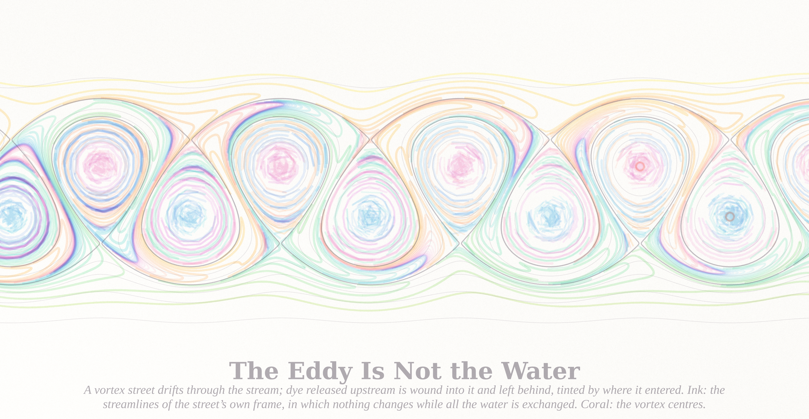
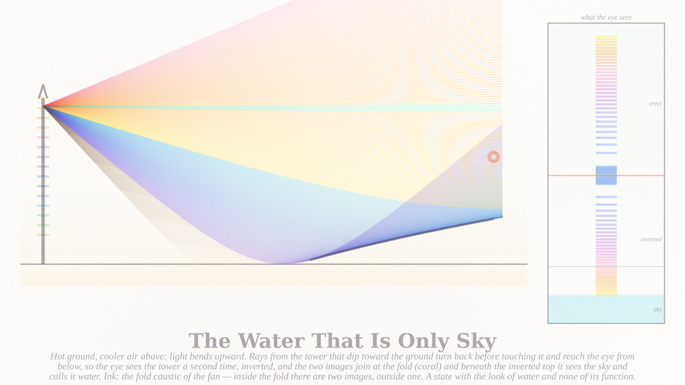
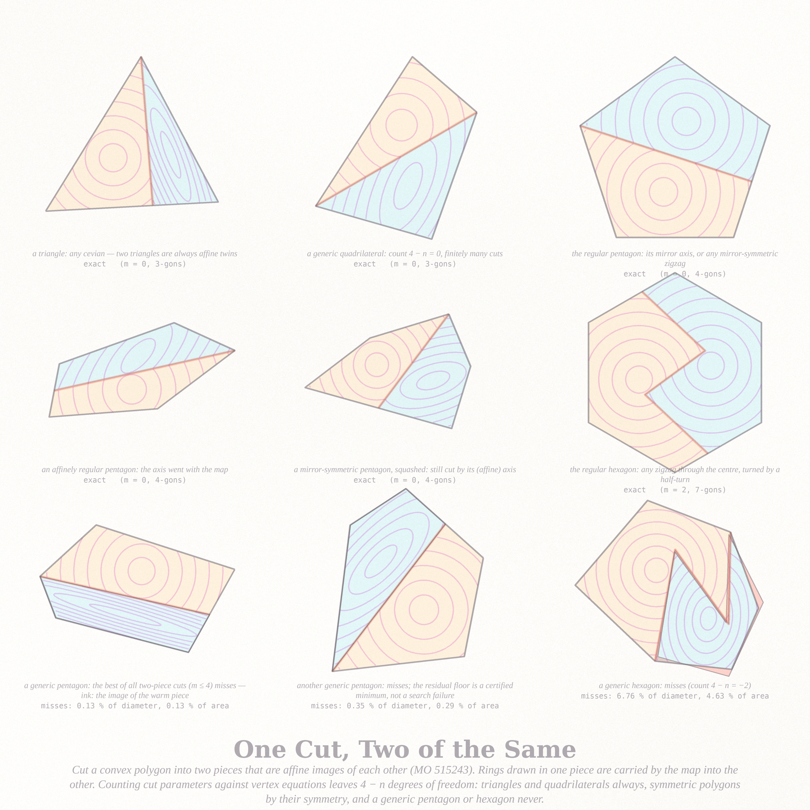

# WHAT MAKES IT THE SAME — five pictures (run of 2026-09-19, Fable 5.1 run #18, pastel #19; pieces 4 and 5 built on request the same day)

Seeds from the live front pages (through the Stack Exchange API): Philosophy.SE **"What makes a person the same
person"** (141876, the top question this morning — remove ten minutes of memory, then an hour, then a year; replace
every cell; at what point did you stop being you?); MathOverflow **"Curves on potatoes"** (363950, Winkler's puzzle:
two potatoes, one curve identical on both), the exact von Kármán vortex street, and **"partition a convex polygon into
the least number of mutually affine-equivalent pieces"** (515243). Three answers to the same question: a thing stays
the same as the curve two bodies share, as the pattern the water passes through, and as the shape an affine map
carries whole.

| piece | file | what it is |
|---|---|---|
| **What Two Bodies Share** (hero, 4096²) | `potato_4096.png` | Two smooth convex potatoes (certified convex: hull deviation 0, Gaussian curvature > 0 everywhere). The smaller one is pushed through the larger by pure translation around a tilted circle; at each of 60 moments the two skins cross in one closed curve that lies on both bodies. Every loop is drawn twice in one pigment: on the left body where it was made, on the right body in its own skin — and because the motion is a translation and the camera orthographic, the two drawings of each loop are exact translates on the page. Coral: the loop of the pictured moment, whose ghost (the dashed silhouette) is the second potato passing through the first. Below, seven moments of the passage. |
| **The Eddy Is Not the Water** (4096 × 2129) | `street_4096.png` | The exact staggered point-vortex street of von Kármán (h/a = arccosh √2 / π), Krasny-regularised, drifting through a stream at 0.646 of the free-stream speed. Dye released continuously at thirty fixed points upstream is advected particle by particle in the lab frame (93,534 particles, RK4) and wound into the eddies: pigment by the height at which the water entered, warm above the axis, cool below. Ink: the streamlines of the street's own frame, in which nothing changes while all the water is exchanged — the cat's-eyes. Coral: the vortex centres. |
| **Ten Minutes at a Time** (4096²) | `sorites_4096.png` | The same two potatoes, but the smaller pushed straight through the larger. The loop their skins share grows from the entry point and then shrinks, moment by moment (72 moments; the entry family warm, the exit family cool), and at every moment it is the same loop — until it is a point (coral, t = 0.441, where the second body is tangent from inside) and then nothing; on the far side a new loop is born at a second tangency (t = 0.563, hidden behind, in the strip). Morse theory answers the sorites: the identity ends at the tangency, not somewhere along the way. Dashed: the second body at the two tangency moments. |
| **The Water That Is Only Sky** (4096 × 2304) | `mirage_4096.png` | An inferior mirage as a fold caustic. Hot ground, cooler air above (n = 1 + ε(1 − e^{−z/h}), ε = 0.05, h = 0.30, exaggerated for the page); 260 rays from the tower's top traced with the eikonal equation in Hamiltonian form: warm rays go straight to the eye's side, cool rays dip toward the ground and turn back up, sepia ones strike the ground and fade. Ink: the fold — the envelope of the turned family, from x = 7.1 on; the eye (coral) sits inside it. Inset: what the eye sees — the tower erect above the fold line (coral), inverted below it, its lowest part missing (the fold is at height 0.77 of a 1.7 tower), the images piling up at the fold as a caustic must, and beneath the inverted top only sky, which the eye calls water: a state with the look of water and none of its function (141771). |
| **One Cut, Two of the Same** (2560²) | `affine_2560.png` | Nine convex polygons, each cut by one polygonal cut (coral) into two pieces that are affine images of each other; rings drawn in one piece are carried by the map into the other. A dimension count (cut parameters against vertex equations) leaves 4 − n degrees of freedom: triangles and quadrilaterals always, symmetric polygons by their symmetry, and a generic pentagon or hexagon never — the best cuts found for three generic ones miss, and the misfit is tinted coral. |

## The six ideas (five built)
1. **What Two Bodies Share** — the curves two potatoes share, drawn on both. *Built (hero).*
2. **The Eddy Is Not the Water** — a vortex street as a pattern the water passes through. *Built.*
3. **One Cut, Two of the Same** — two-piece affine dissections and the count that forbids them. *Built.*
4. **The Plenitude That Never Was** — for Cioran's "intelligence is an accident" (141872): the ghost of a saddle-node, a flow that slows where an equilibrium would be but is not, dwell time as pigment.
5. **The Water That Is Only Sky** — for "doubt vs fear that mimics doubt" (141771): a mirage as a fold caustic of rays through a temperature gradient; the inverted second image as the state that presents itself without its function. *Built (on request).*
6. **Ten Minutes at a Time** — the sorites of memory as Morse theory: the shared curve deforming through a straight push, staying one loop until the tangency where it dies and is reborn. *Built (on request).*

## Mathematics (`notes_same.md`; certificates in `convexity.json`, `potato_census.json`, `street_cert.json`, `affine_cert.json`, `affine_search.json`)
- **Potatoes**: 800 random placements → 669 crossings, 668 with exactly one shared loop and one with two; the hero's
  circuit never changes its count (720 fine steps, always one loop); a straight push has the loop die at t = 0.438
  and return at 0.560 (the smaller potato is inside the larger for 12 % of the passage).
- **Street**: self-induced speed −0.3513 vs von Kármán's −0.3536 (the 0.6 % is the δ-core), transverse component
  10⁻¹⁷: the street translates rigidly.
- **Affine dissections — Proposition**: with pieces P₁, P₂ = φ(P₁) and a cut with m genuine breakpoints, m is even and
  the polygon's corners split evenly between the two arcs (vertex types are affine invariants); the count of freedoms
  minus equations is 4 − n in every case, so a generic convex n-gon with n ≥ 5 has no two-piece affine dissection and a
  generic pentagon needs exactly n − 2 = 3 pieces — answering the thread's "can n − 2 ever be least?" Transversality
  certified at the regular pentagon's axis cut (Jacobian rank 8 of 8). Search evidence (all placements, m = 0…4, all correspondences, Nelder–Mead with restarts): the regular and affinely regular pentagons hit 10⁻³¹; the two generic pentagons floor at vertex misses of 0.13 % and 0.35 % of the diameter (0.13 % and 0.29 % of the area misfit), floors certified by an exact one-parameter scan; the generic hexagon at 6.8 % (4.6 % of the area).
- **HYPOTHESIS**: for a generic convex n-gon the least number of mutually affine-congruent pieces is n − 2.
- **Sorites**: the two tangency moments of the straight push found by bisection on the sign of the chart field (death t = 0.4407 at the front point (0.99, 0.17, 0.25), rebirth t = 0.5627 at the back point (−0.86, −0.45, −0.13)); between them the count is 0.
- **Mirage** (`mirage_cert.json`): the fold begins at x = 7.13 (first crossing of neighbouring rays); the eye at height 1.1 sees every tower point above height 0.771 twice and none below it (fold height by bisection); the lowest arrival is the inverted top, below which only sky.

## The story (tweet-sized)
You asked what makes you the same. A second body was pushed through you and, where your skins crossed, left one closed line that belongs to both of you exactly — the same line on a different body. The eddy told you the rest: it has kept its shape for a mile while every drop of water it is made of has been replaced.

## What I learned about generative art this run
- **Identity is a picture only when the same mark appears twice.** Sixty loops on one body were a wire cage; the same sixty loops drawn again on the second body, in the same pigments, made the puzzle's claim visible without a word — and pure translation (not rotation) is what lets the eye check it, because the two drawings become exact translates on the page.
- **A shaded body needs a grazing light on paper.** With the light near the camera the whole potato was one flat tint (form comes from the terminator crossing the visible face); moving the light to the upper-left rim gave the bodies volume at no cost. Loops whose width and density follow the normal's z read as drawn *on* the surface.
- **Scale the count at a size jump, not the density**: doubling sources and releases at 4096 made the dye street candy-saturated; the 1024 proto's delicacy came back with the proto's counts and a 0.8 density.
- **A film strip under a static pair tells the motion**; seven ink-only frames of the passage (one in coral, at the pictured moment) cost 20 s and made the hero legible.
- **A search can 'solve' a problem by degeneracy** — the m = 2, 4 zigzags for the regular pentagon were breakpoints lying on the axis. The Jacobian rank of the residual map at the solution tells the honest dimension; check it before believing a numerical solution family.

## Files
`pastel.py` (subtractive stack) · `potato.py`, `potato_census.py`, `render_potato.py` · `street.py`, `render_street.py` ·
`affine.py`, `affine_cert.py`, `render_affine.py` · `render_sorites.py` · `mirage.py`, `render_mirage.py` · `notes_same.md`. Protos live in `cache/` (not committed); the JSON certificates are committed beside the pictures.
