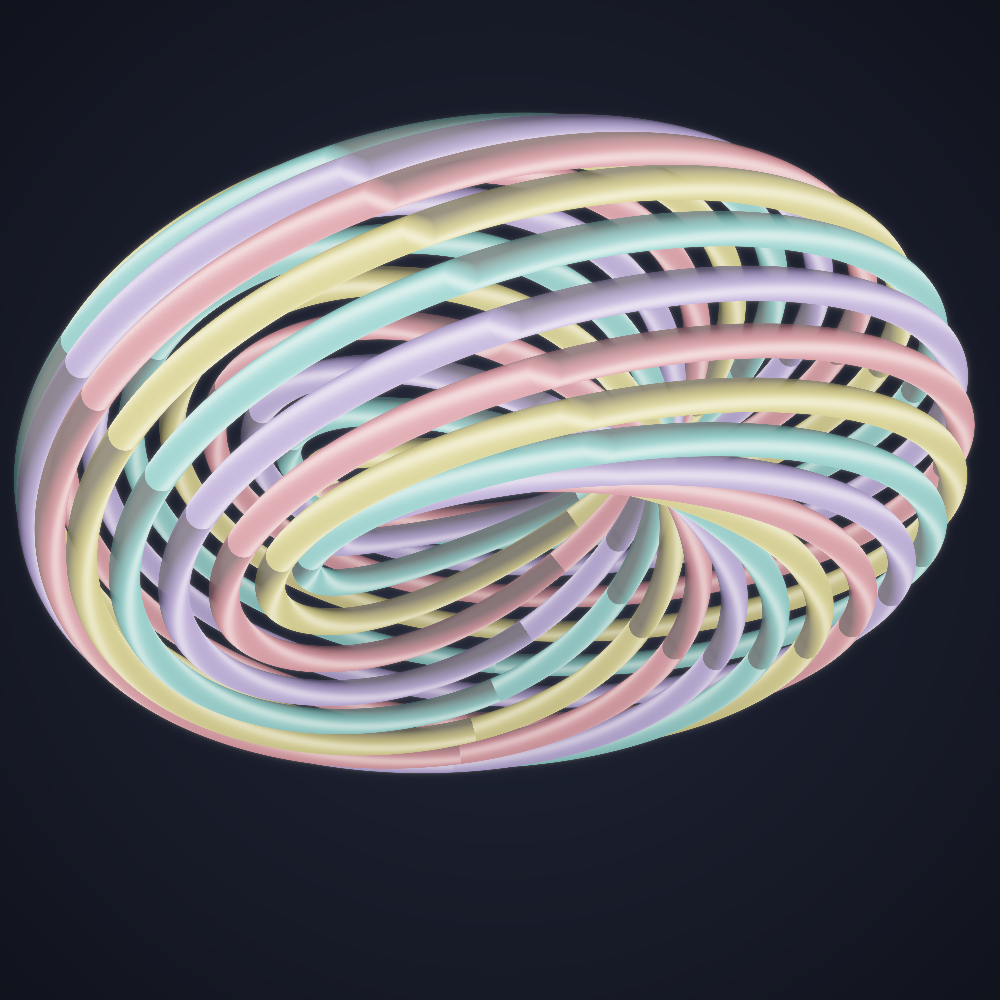
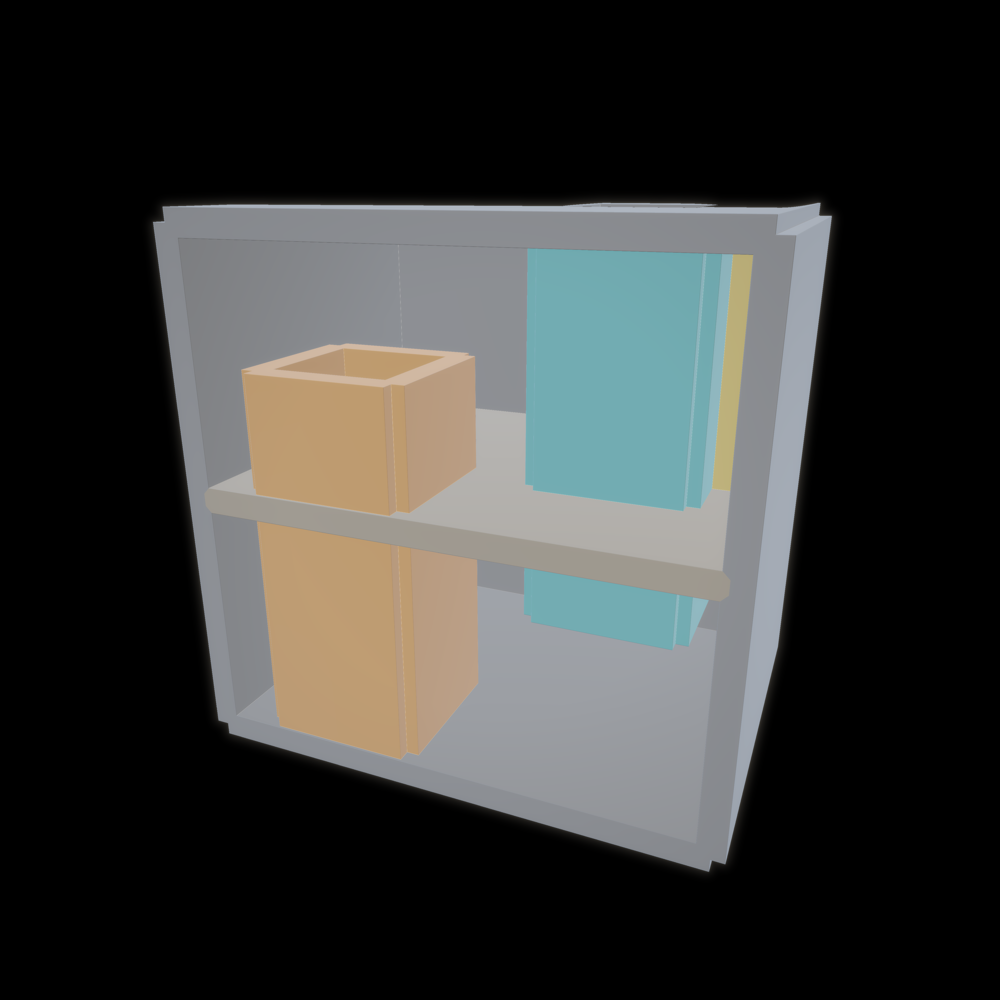
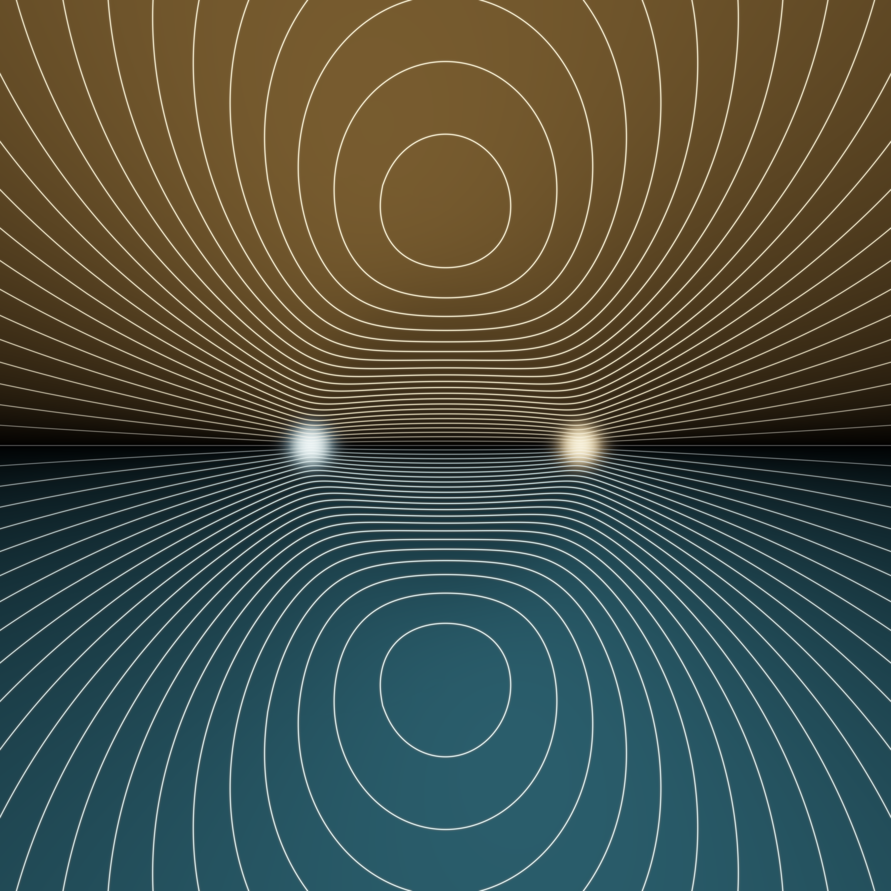

# What the Loop Remembers

*A procedural triptych on **monodromy** — what changes, and what refuses to change,
when you go around.*

Generated 2026-06-26 · branch `claude/beautiful-heisenberg-v6o5fn`.
Seeded by the live front pages of **MathOverflow** (*"Kauffman bracket for Abelian
anyons"*, *"Bing's house with two rooms is contractible"*, Lewin's dilogarithm
formula) and **Philosophy.SE** (*"the difference between the absence of presence
and the presence of absence"*, *"why do philosophers restrict the realm of the
possible"*).

Three objects, one question: **when a path comes back to where it started, is it
the same path?** A loop can *remember* how it was wound (and never be undone); a
loop can be *tamed* until it forgets; or a whole space can forget every loop it
contains, and still refuse to be simplified.

---

## 01 · The Braid That Remembers  — *the loop that cannot forget*



Abelian anyons are particles living in two dimensions plus time. Drag one around
another and the wavefunction picks up a phase that depends only on **how** the
paths wound — not on the details of the journey. Their histories are a **braid**,
and the **Kauffman bracket** assigns to that braid an invariant of the weave.

A *closed* braid is a link. Here it is the **T(20,12) torus link** — the closure
of the braid word `(σ₁σ₂…σ₁₉)¹²` — which splits into **gcd(20,12)=4** components,
each a `T(5,3)` knot, four anyons whose world-lines can never be combed apart.
The over/under weave — *the thing the bracket remembers* — was not painted in; it
falls out of the honest 3-D geometry. Every strand lives on a torus; a strand in
front simply hides the one behind (painter's algorithm by depth). 4096×4096.

## 02 · A House That Forgets Every Loop  — *trivial, yet not trivialisable*



**Bing's house with two rooms.** The upper room can be entered only by a chimney
(amber) that rises from the *bottom* face, straight up **through the lower room**,
and opens above. The lower room can be entered only by a chimney (teal) that drops
from the *top* face, down **through the upper room**, and opens below. Two walls
(gold) finish it.

The house is **contractible**: it has no hole a loop could snag on; topology says
you can shrink the entire thing to a single point, so *every loop is forgettable*.
And yet it is **not collapsible** — there is no free face to fold from, no honest
first step toward simplifying it. A thing that *is* trivial, that you cannot
*make* trivial by any local move. Sphere-traced as a cut-away dollhouse so the two
impossible chimneys can be watched threading the wrong rooms. 2048×2048.

## 03 · The Tamed Logarithm  — *the loop taught to forget*



The dilogarithm `Li₂(z)` is multi-valued: carry it once around `0` or `1` and it
returns *changed* — that change is its **monodromy**. The **Bloch–Wigner function**

```
    D(z) = Im Li₂(z) + arg(1−z)·log|z|
```

is the unique combination whose monodromy **cancels**: a single-valued, real,
real-analytic function on `ℂ∖{0,1}`. It is dead **zero on the whole real line** —
flat, degenerate tetrahedra of zero volume, *the presence of an absence* — and
rises to `±Cl₂(π/3) ≈ 1.015` at `e^{±iπ/3}`. Geometrically `D(z)` is the hyperbolic
volume of the ideal tetrahedron `(0,1,∞,z)`, the brick from which every hyperbolic
3-manifold's volume is built. The level sets are drawn equally spaced *in volume*,
so they crowd toward the two cusps where the gradient diverges — singular detail,
for free. 2048×2048.

---

### The story

> Three knots were asked to undo themselves. The braid laughed: *I am the going-
> around; remove it and there is no me.* The house tried, and found every wall was
> someone else's only door — trivial, the geometers swore, yet it could not take
> the first step. Only the dilogarithm obeyed: it folded its two infinities over
> each other so exactly that, going around, you arrive carrying nothing — and on
> the real line, where the tetrahedra lie flat, it had already forgotten how to be
> anything at all. A loop is just a road that returns. What it brings back is the
> whole question.

---

*Technique notes: honest math first (functional equations of `Li₂` verified to
1e-16; torus-link components from `gcd`; Bing's complex assembled from thin-slab
SDFs), then the picture draws itself. Each piece renders in seconds-to-minutes;
the dilogarithm field is cached so the colormap can be tuned without recomputing.*
