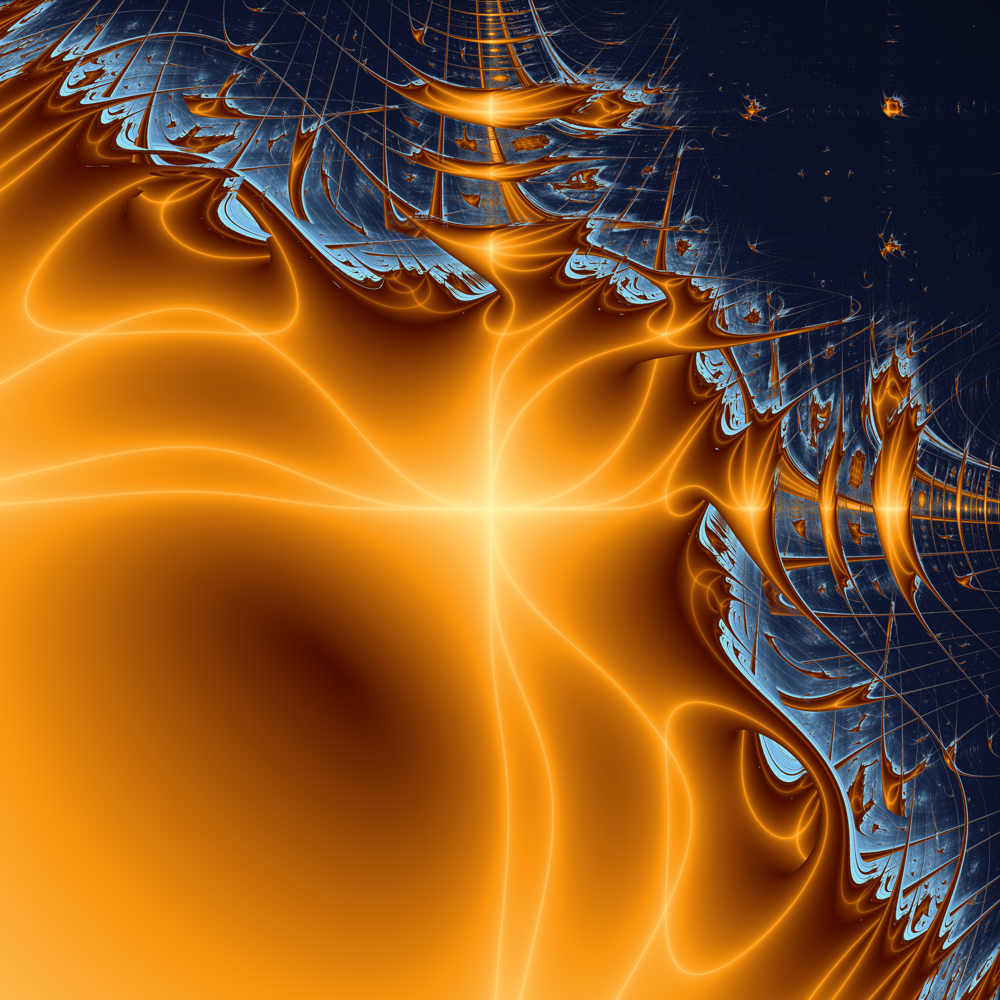
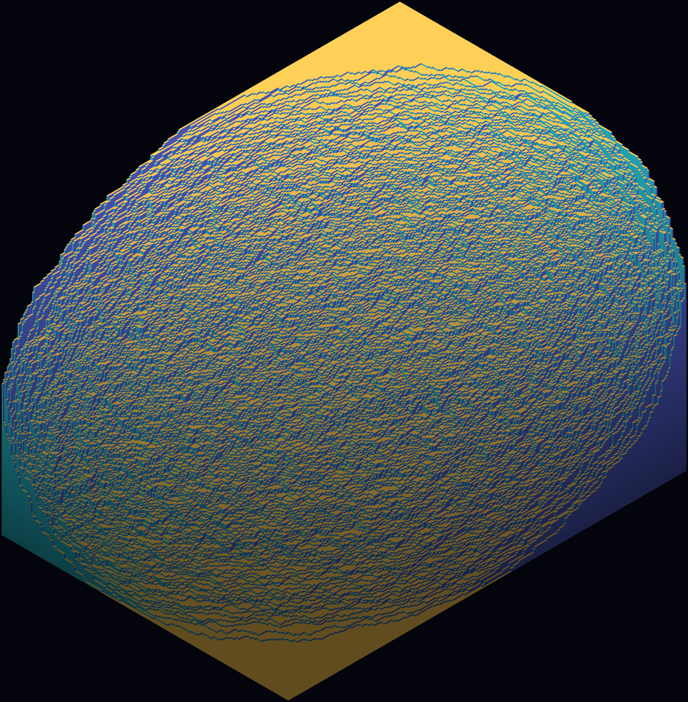
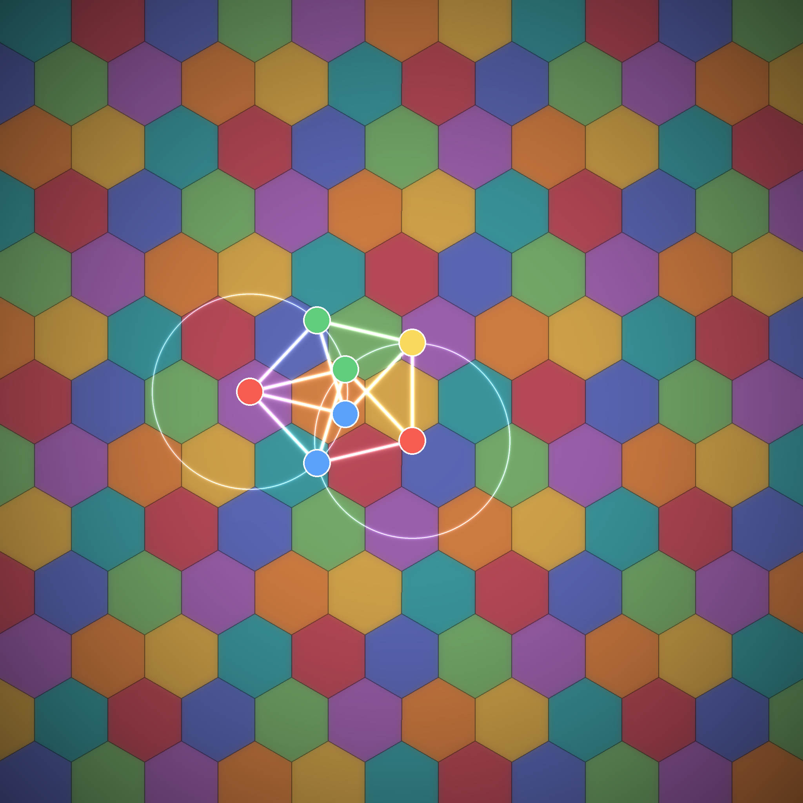
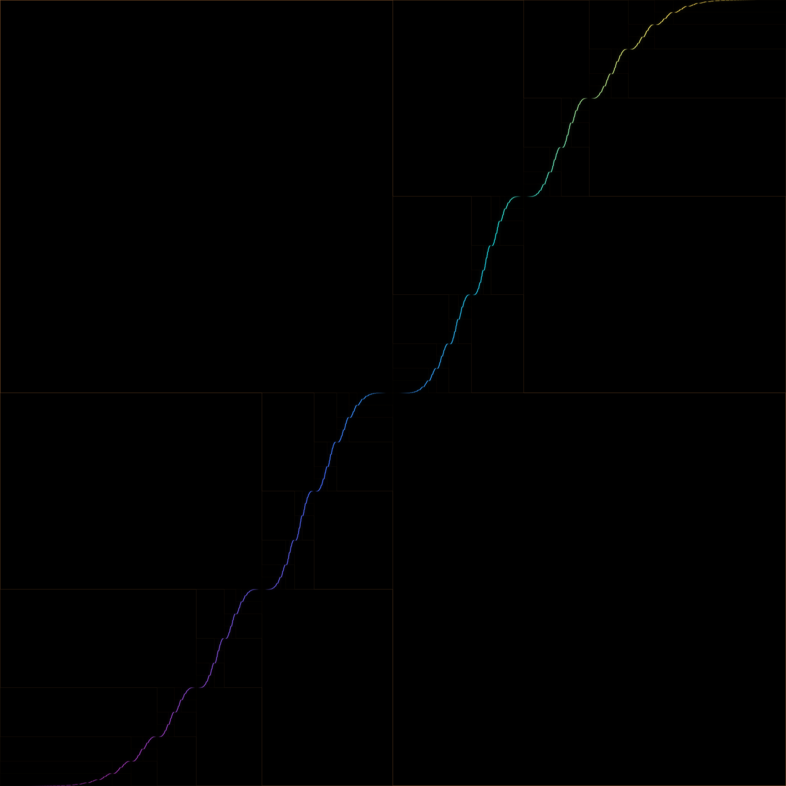
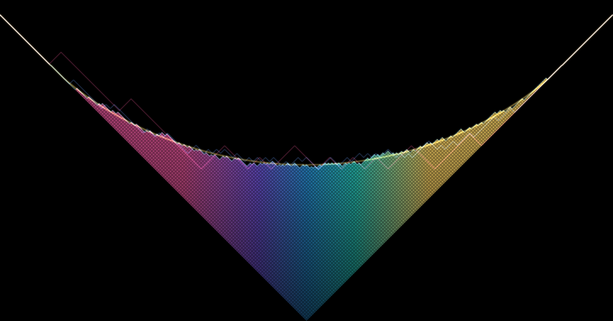

# The Edge of the Possible

A procedural triptych — with two companion pieces (04, 05) added by request.
Each of the first three is a **boundary that no one drew** — a hard edge that
geometry or dynamics produces on its own, the moment a system is pushed to its
limit. Order frays into chaos along a coastline of gold foam; a
million random cubes freeze the instant they cross an unpainted ellipse; and
when you try to color the plane so that no two points one unit apart share a
hue, you run out of room somewhere between five colors and seven.

Seeded by the live front pages (29 June 2026): **MathOverflow** —
*"Proving there is no entire f with Re/Im of opposite sign whenever |z−w|=1"*
(→ the chromatic number of the plane / unit-distance graphs),
*"Density of good approximations of irrational torus rotations"*,
*"Minimum area of a triangle whose corners are centres of disjoint unit
squares"*; **Philosophy.SE** — *"Is there a limit to the complexity of the
universe?"*, *"Why do philosophers restrict the realm of the possible?"*,
*"Is Infinity a Continuum of (distinct) Boundaries?"*

All three techniques are new to this series; none repeats a previous run.

---

## 01 · The Edge of Chaos  — *centerpiece, 4096²*

The **Markus–Lyapunov fractal**. Take the logistic map `xₙ₊₁ = rₙ·xₙ(1−xₙ)`
but let the growth rate `rₙ` switch between two values `a` and `b` following a
fixed periodic word — here **`BBBBBBAAAAAA`**. At every point `(a,b)` of the
plane we iterate the forced map and measure its **Lyapunov exponent**
`λ = ⟨ln|rₙ(1−2xₙ)|⟩`: where `λ<0` the orbit is **stable / periodic** (order);
where `λ>0` it is **chaotic**.

The whole image is the border between those two worlds. Stable regions are
rendered as a silken **gold drapery** (brightness = depth of stability, `−λ`);
the chaotic sea recedes into a near-black navy void — *except* for a thin band
of **near-zero positive `λ`** just inside the chaos, which is lit as a frothy
cyan-white **coastline** (the filigree where order is barely losing). The
result is the famous "Zircon City" structure: period-doubling **pagoda
skylines**, self-similar ship-rigging filigree, and a central radiant star
where four stability lobes meet.

The boundary is genuinely fractal — a 1:1 crop of the 4096² render shows crisp
detail at every scale (rendered at 2× supersampling, 900 iterations per pixel
after a 600-step transient, ~6½ min). *"Should we prefer a coincidence with a
known mechanism over an explanation with none?"* — here the mechanism (a tuned
recurrence) and the apparent coincidence (chaos) are one and the same object.

## 02 · The Arctic Ellipse  — *2048²*

A **uniform random lozenge tiling of a hexagon** (`a×b×c = 300×216×198`),
equivalently a uniformly random **boxed plane partition** — a pile of unit
cubes stacked in the corner of a box, seen isometrically. Each of the three
rhombus orientations is one cube-face direction (top/left/right), so the tiling
reads as a glowing 3-D heap.

This is the three-dimensional cousin of last run's **arctic circle** (the Aztec
diamond): push the box off-square and the frozen/temperate boundary becomes a
tilted **arctic ellipse** (Cohn–Larsen–Propp). The three **frozen corners** —
solid single-orientation regions (gold tops, teal and blue walls) — meet a
disordered **temperate sea** of jittering cubes, and the smooth/rough boundary
between them is the inscribed ellipse of the hexagon. (The frozen fraction is
affine-invariant at `1 − π/(2√3) ≈ 9.3%`, so the corner caps are always small;
the ellipse is the whole story.)

The tiling is sampled **exactly-uniform in the limit** by *vectorised
checkerboard Glauber dynamics* on the height function: all cells of one parity
are independent given the other parity, so an entire colour class updates in a
single NumPy step (60,000 sweeps, verified well-mixed by the plateau of the
flippable-site density). 1 lozenge = a few pixels — the grain *is* the disorder,
and the arctic boundary is an honest fluctuating front, not a smoothed curve.
*"Is Infinity a Continuum of distinct Boundaries?"*

## 03 · Why Restrict the Realm of the Possible  — *2048²*

The **Hadwiger–Nelson problem**: how many colours does it take to paint the
whole plane so that no two points exactly **one unit apart** share a colour?
The answer is known only to lie between **5 and 7** — one of the oldest open
gaps in combinatorial geometry.

The stained-glass field is a witness to the **upper bound, χ ≤ 7**: a hexagonal
7-colouring (hexagon spacing `s = 0.75`, colour `= (q − 2r) mod 7`). The
formula matters — `(q−2r)` places the seven colour classes on the **Eisenstein
norm-7 sub-lattice** (minimum same-colour distance `√7·s`), so no two
same-coloured points ever land a unit apart. (`(q+2r)`, the textbook map
colouring that merely separates neighbours, *fails* — verified by Monte-Carlo:
`(q−2r)` gives **0 violations** over 200,000 random unit-distance pairs.)

The luminous graph at the centre is a witness to the **lower bound, χ ≥ 4**:
the **Moser spindle**, a unit-distance graph of 7 vertices and 11 edges (every
edge exactly the unit length of the colouring — the faint circles show that
unit radius) whose chromatic number is exactly **4** (verified by exhaustive
search: a 4-colouring exists, no 3-colouring does — its four node colours are
shown). In 2018 Aubrey de Grey closed the gap a little from below with a
1,581-vertex unit-distance graph that needs **5**; the true χ of the plane is
still unknown. *Why restrict the realm of the possible? Because the constraint
itself builds the structure.*

---

## Coda — two limit shapes  *(added by request)*

Two companions extend the set from *hard boundaries* toward their gentler
cousins: **limit shapes** and **singular measures** — the smooth, deterministic
laws that emerge from the arithmetic of *all* the cases. (Both were on the
"next-run" list this routine carries in its memory.)

## 04 · The Singular Staircase — *2048²*

The **Minkowski question-mark function `?(x)`** — Conway's "slippery devil's
staircase." It maps each continued fraction `[0;a₁,a₂,…]` to the binary number
`0.0…01…10…` (runs of `aᵢ` bits), sending the **Stern–Brocot** mediant tree to
the **dyadic** tree. It is continuous and strictly increasing, yet its
derivative is **zero almost everywhere**: all of its rise is hoarded on a
measure-zero set (the quadratic irrationals). A function *alive only where the
rationals are not.*

The graph is the attractor of a two-map **iterated function system**
(`L(x,y)=(x/(1+x), y/2)`, `R(x,y)=(1/(2−x),(1+y)/2)` — verified to land on `?`
to 1e-13), rendered by a **vectorised chaos game** of ~250M points
(ensemble-as-numpy-axis) splatted with additive bilinear weights so brightness
*is* the singular **Stern–Brocot measure**; hue sweeps with height. Behind it,
the nested **Stern–Brocot boxes** (Farey-width × dyadic-height) make the
self-similarity literal: the curve inside every box is an affine copy of the
whole. *Strictly increasing, yet standing still almost everywhere.*

## 05 · The Limit Shape — *2048×1073*

A **Plancherel-random Young diagram** and the smooth curve it cannot help
becoming. Sample a uniform random permutation, run **RSK insertion** to get its
shape (the probability of a partition is `(dim λ)²/n!`); drawn in the Russian
convention. The **Logan–Shepp / Vershik–Kerov** theorem (1977) says that as
`n→∞` the rescaled boundary converges to a single deterministic curve,
`Ω(u) = (2/π)(u·arcsin(u/2) + √(4−u²))` for `|u|≤2` — verified here:
`max|φ−Ω| ≈ 0.01` over the bulk at `n=10⁵`.

The glowing tiled mountain is one random diagram (`n ≈ 5,200`), its cells
coloured by **content** `j−i` (the Russian diagonals); the jagged staircases are
the boundaries of *smaller* random diagrams (`n = 110, 900, …`) — visibly
rougher, fluctuating around the same shape — and the bold gold arc is `Ω`, the
law they are all converging to. The random object is jagged and different every
time; the shape it wants to be is fixed. (A direct cousin of **02**'s arctic
ellipse — another limit shape of a random combinatorial object.)

---

### Colophon
Pure `numpy` / `scipy` / `Pillow`. Dark fields, additive Gaussian bloom, filmic
tone-mapping, ×2 supersample → LANCZOS downscale. Everything is honest math:
the Lyapunov field is the literal exponent, the tiling is a verified-uniform
sample, the colouring and the spindle's chromatic number are both checked in
code before they are drawn.

---

### The story
> Three borders nobody drew. Tune one law a hair: order frays to chaos along a
> coast of gold foam. Stack a million random cubes: they freeze the instant they
> cross an ellipse no hand has painted. Colour the plane so no twins ever touch:
> you run out of room before seven. We don't draw the edges — we only run the
> arithmetic far enough to find where they were already waiting.

> *Coda.* And two shapes randomness keeps drawing by accident: a staircase that
> climbs the whole way up while standing still almost everywhere, and a mountain
> that any random heap of boxes becomes, if you only pile enough of them.
