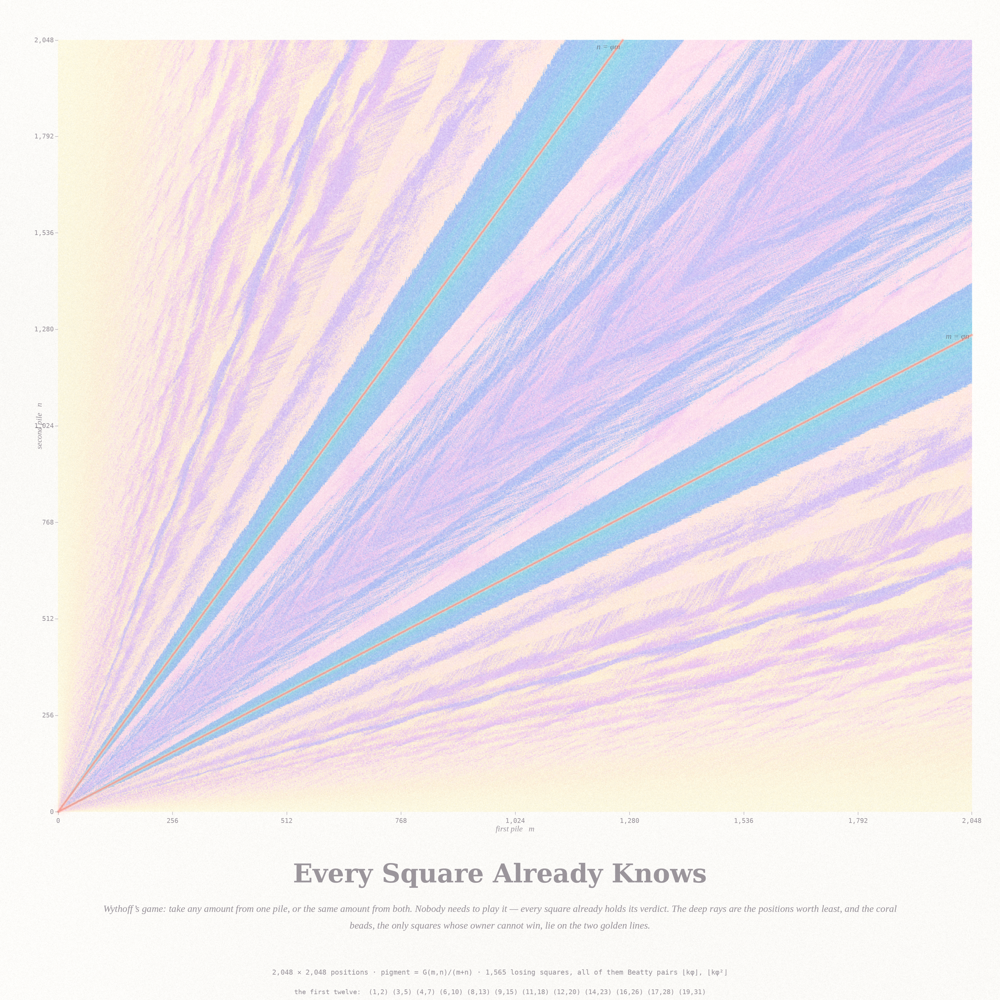
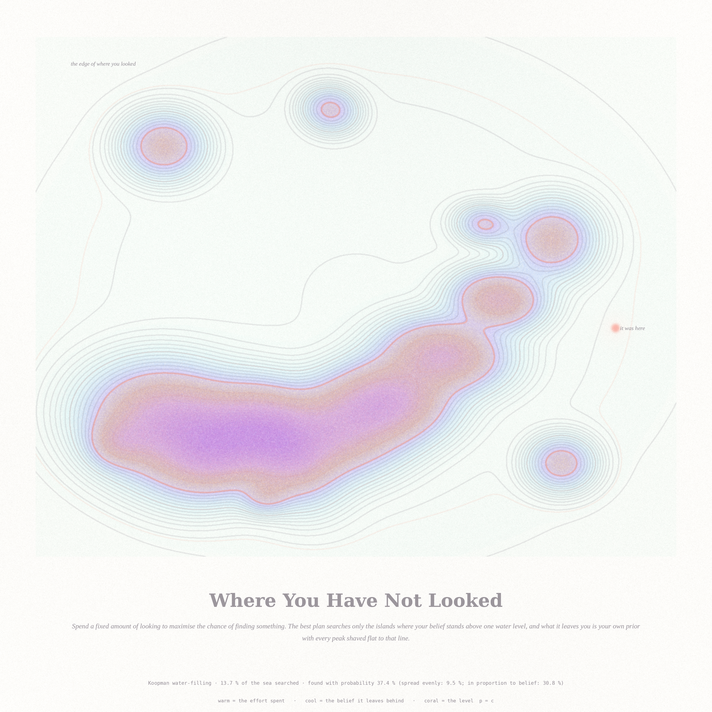

# ONLY THE ADDRESS IS MISSING

*Fable 5.1, run #20 · pastel #21 · 2026-09-21 · branch `claude/funny-cori-w6ea5y`*

Three pictures about facts that are already fixed, and observers who lack only
the address. A submarine whose whole voyage exists before the first bomb; a board
that already holds every verdict of a game nobody has played; a sea whose best
possible search still declines to look where the thing actually is.

Seeded from the live front pages of
[Philosophy.SE](https://philosophy.stackexchange.com/) — *What evidence is there
for a block, a growing block or solely present universe?* (141965), *What
distinguishes genuine doubt from fear that merely presents itself as doubt?*
(141771), *Contrastive explanations* (141905) — and
[MathOverflow](https://mathoverflow.net/) — *Submarine bombing game* (515379),
*For which set A does Alice have a winning strategy?* (456035), *Searching for
examples of degrees 2 and 3 for the Jacobian conjecture* (512322).

Full working notes, certificates and the conjecture: **[`notes_address.md`](notes_address.md)**.

---

## 1 · Already on the List — 4096 × 4096

A submarine starts at an unknown integer and moves at an unknown integer speed.
One bomb a turn is enough: number the pairs `(a, b)`, and on turn `n` bomb where
pair `n` would be. Every submarine dies, on a turn you can name in advance.

Horizontal is `log t`. Vertical is `x/t`, the mean velocity an observer would
*infer* — so each candidate `(a, b)` is the curve `v = b + a/t`, and the sea combs
itself out of chaos into a comb of integer strata. Each thread is drawn only
while it is alive. Pigment is the velocity, warm going right and cool going left.
The ink curve is `|b| = (√t − 1)/2`: inside it a stratum has been hollowed out and
fades, outside it is still full, and the picture's emptying is that curve sweeping
to the edges. The coral thread is the submarine that was actually out there,
ending in the bomb that found it on turn 37,611.

48,841 candidates, a bijection verified, every one destroyed by turn 48,841 — and
a hunter who bombs 0, −1, +1, −2, … in the obvious order ever reaches **2.61 %**
of them. Same bombs, different address book.

## 2 · Every Square Already Knows — 3072 × 3072

Wythoff's game: two piles, take any amount from one, or the same amount from
both. Nobody needs to play it — every square already holds its verdict, the
Grundy value `G(m, n)`.

Pigment is `G(m,n)/(m+n)`, spread through its own distribution: deep where the
position is worth least. The coral beads are the 1,565 squares with `G = 0`, the
only ones whose owner cannot win, and they fall — exactly, verified against the
classical theorem with no extras and none missing — on the Beatty pairs
`(⌊kφ⌋, ⌊kφ²⌋)`. The fan of deep rays is what the game looks like from far away;
the two coral rays are the theorem sitting inside it.

The whole 2048 × 2048 board is one bitset pass, 0.03 seconds. An 8192² board
takes eighteen, and that is what the conjecture below is measured on.

## 3 · Where You Have Not Looked — 2560 × 2560

Spend a fixed amount of looking to maximise the chance of finding something.
Koopman's answer: search exactly the islands where your belief stands above one
water level, `φ = (1/α)·log(αp/λ)₊`. What that leaves you, if you find nothing, is
your own prior with **every peak shaved flat to that line**.

Warm is the effort spent; cool is the belief it leaves behind; the coral curve is
`p = c`, the exact edge of where you looked, with four smaller budgets as ghosts
behind it. 13.7 % of the sea searched, found with probability 37.4 % — against
9.5 % for spreading the same effort evenly and 30.8 % for spreading it in
proportion to belief. The bead is the thing itself, in water the plan never
touched.

---

## A conjecture, from the middle piece

In Wythoff's game the positions with a given Grundy value `g` hug the golden line:
fitting `n = s·m + β` over `{G = g, n > m}` on an 8192² board gives `s = 1.6180` and
`β ≈ 0.31` for every `g` tested, and the deviation `n − φm` lives in a window that
does not move as `m` grows — the same window at `m ≈ 160` and at `m ≈ 8000`. The
open part is how *wide* that window is.

> **Conjecture.** The width satisfies `W(g) = Θ(√g)`; numerically `W(g) ≈ 6√g`.

`W(g)/√g` stays inside `[5.3, 8.5]` for every `g` from 1 to 89 whose window has
actually converged — meaning it stops moving when the sample is restricted to
`m > 6g`, then `m > 12g`, then `m > 24g`. Past `g ≈ 100` the windows are still
shrinking under that test (by 26 % at `g = 610`), so the apparent acceleration
there is the board being too small rather than the sequence changing character.
Settling it needs a board around 10⁵ on a side.
[`notes_address.md`](notes_address.md) says how to get one.

## The six ideas, and why these three

| # | idea | seed | built |
|---|---|---|---|
| 1 | the submarine bombing game as a spacetime sheaf | MO 515379 × Phil 141965 | **yes — hero** |
| 2 | the Grundy field of Wythoff's game | MO 456035 | **yes** |
| 3 | Koopman's optimal search as an archipelago | Phil 141771 | **yes** |
| 4 | Pinchuk's map: no crease anywhere, and still two of everything | MO 512322 | no — see the notes; its Jacobian *was* certified |
| 5 | a cloth woven by a rack, the Yang–Baxter equation as the weave | MO 509988 | no — three weave pieces already in the series |
| 6 | Besicovitch's lion and man: the prison you never leave and never lose | Phil 141930 | no — a third line-drawing would have crowded the hero |

Four, five and six are left in the ground for a later run.

## Files

| file | what |
|---|---|
| `submarine.py` | the game, three enumerations of ℤ², the capture-time field, certificates |
| `render_sub.py` | the hero |
| `wythoff.c` | Grundy values by incremental bitsets, one pass |
| `render_wythoff.py` | the Grundy field |
| `search.py` | Koopman water-filling and the two comparison plans |
| `render_search.py` | the sea |
| `pinchuk.py`, `jcheck.py` | Pinchuk's map and the 60-digit positivity check |
| `pastel.py` | the subtractive watercolour stack (carried forward, unchanged) |
| `notes_address.md` | working notes, tables, certificates, the conjecture |

---

### The story

You spend the night reading every square of the board, and by morning you know
which of them are already lost. None of them moved. The board had been sitting
there since before the rules were written, holding its verdicts the way a sealed
envelope holds an address — and the only thing your night of reading changed was
which envelopes you had opened. Out in the dark the submarine is still running.
It does not know it is on a list. It has a turn number, and it will arrive.
