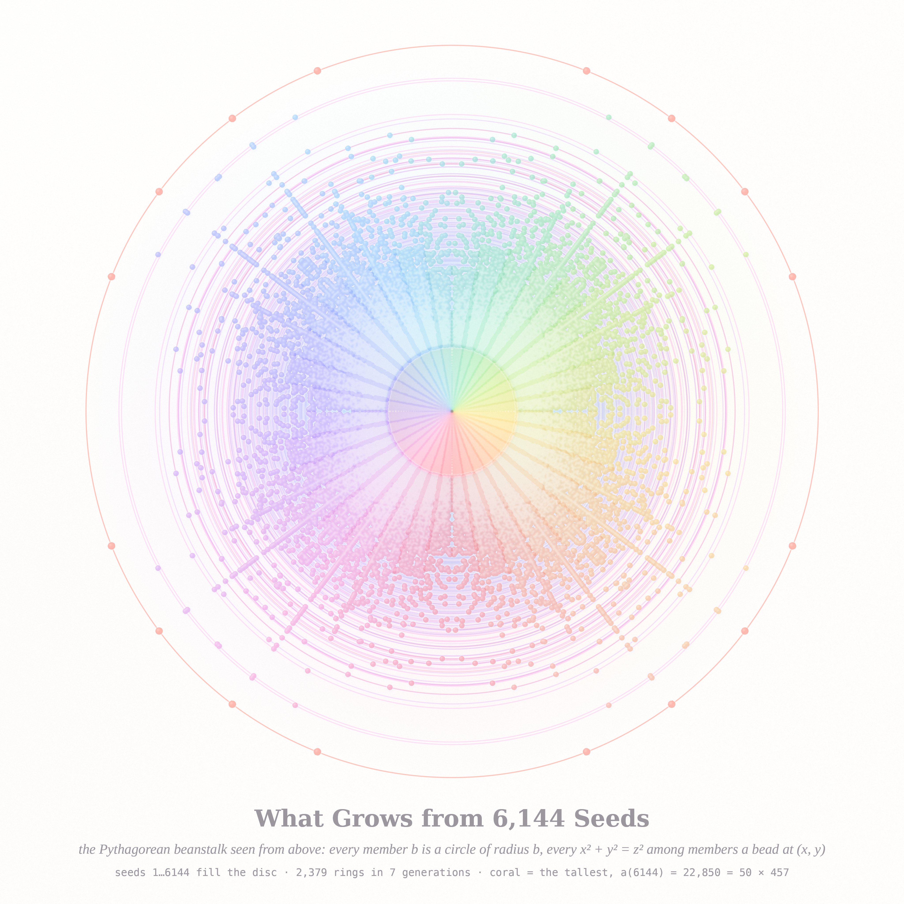
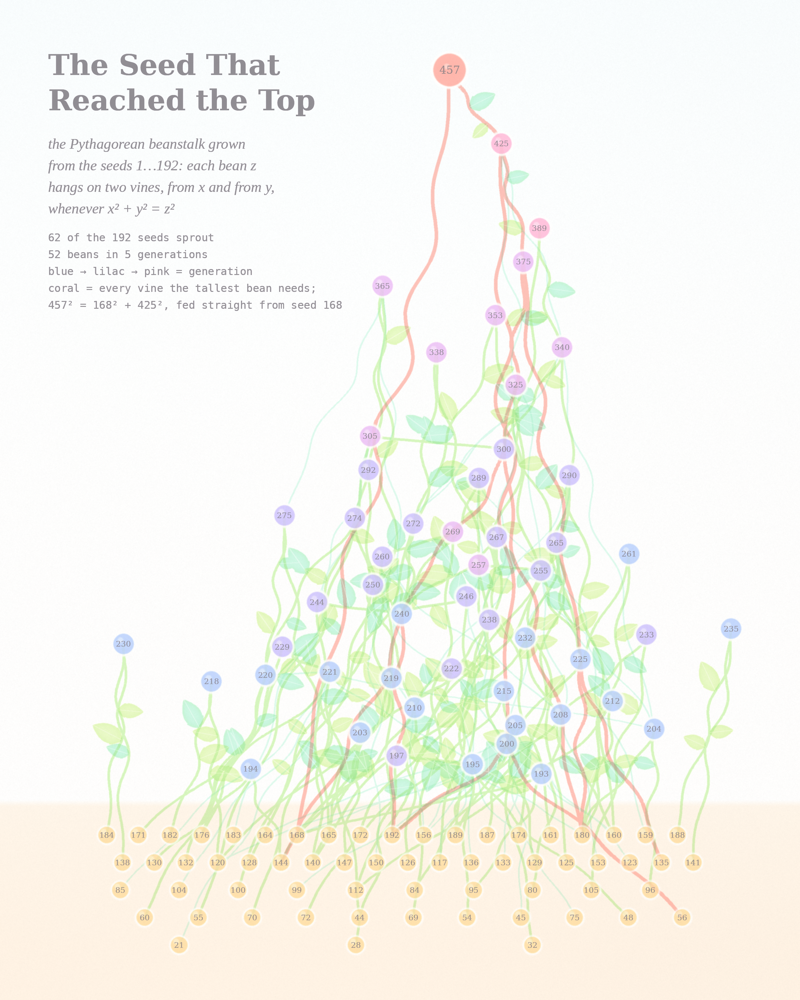
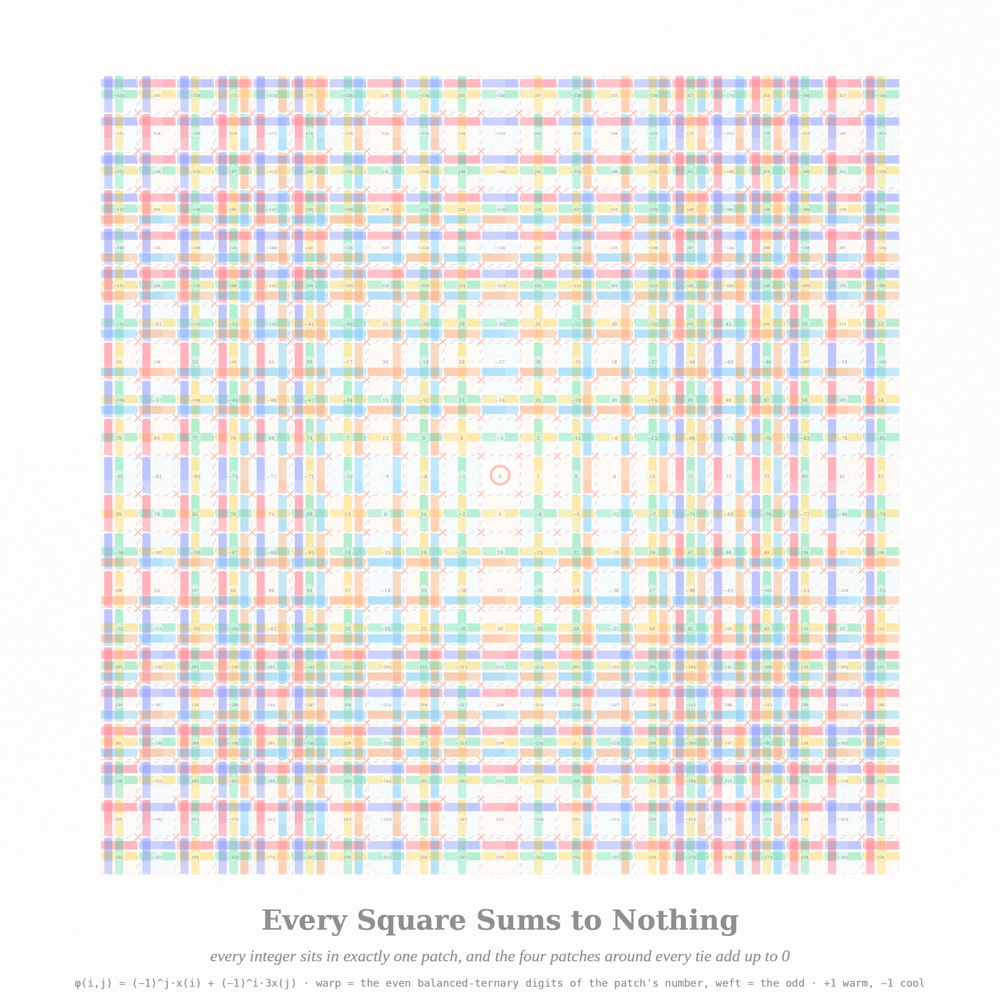

# WHAT THE SEEDS ALREADY HELD — pastel #26 (Opus 5.5, run 5, 2026-10-03)

Triptych from today's front pages: MathOverflow **515674** (*Is the Pythagorean closure of {1,…,n}
polynomially bounded?* — the "Pythagorean beanstalk") and **515677** (*a bijection ℤ² → ℤ with every
square summing to 0*), and Philosophy.SE **142312** (*Can a structure uniquely select an element
without labels or an external selector?*). A beanstalk picks out its own tallest bean with no
one pointing; a quilt gives every integer exactly one seat with nobody assigning them.

## What Grows from 6,144 Seeds — 4096² (hero)

The beanstalk B₆₁₄₄ seen from above. Each member b is a circle of radius b (radius warped as
b^1.3 so the grown zone gets room); the seeds 1…6144 fill the creamy disc. Each of the 2,379
grown members is a ring, and each way it grows, x² + y² = z² with x, y already members, is a
glossy pearl at (±x, ±y), (±y, ±x) on that ring. Pearl hue = angle, so the window is one
rainbow; the rays are the multiples k·(3,4,5), k·(5,12,13)… The coral ring is the tallest,
a(6144) = 22,850 = 50 × 457, reached two ways (8400, 21250) and (13710, 18280).

## The Seed That Reached the Top — 2560×3200

The same plant from the side, as a botanical plate: B₁₉₂ (the OP's own example). Height = the
number. 62 of the 192 seeds sprout (five rows in the soil), 52 beans grow in 5 generations
(blue → lilac → pink), each hanging on two twining vines from its legs. Coral = every vine the
tallest bean needs; 457² = 168² + 425², so the crown is fed directly from seed 168 in the soil.

## Every Square Sums to Nothing — 2560²

The explicit balanced-ternary answer to MO 515677, φ(i, j) = (−1)^j x_i + (−1)^i·3x_j, woven
as a tartan. Each patch is labelled with its integer; its **warp** threads are the even
balanced-ternary digits of that integer and its **weft** threads the odd ones (+1 warm, −1 cool,
digit rank = distance from the patch centre). Because the even digits only depend on the column
and the odd digits only on the row, the threads really do run straight through the cloth, and
the sign flips make every coral tie a 2×2 window that cancels. 0 sits in the coral ring.

## Six ideas considered
1. **Beanstalk from above** — circles + Pythagorean pearls (made, hero).
2. **Beanstalk from the side** — botanical plate of the derivation DAG (made).
3. **Zero-sum tartan** — ternary digits as warp/weft (made).
4. Beanstalk growth spiral — a(n)/n^{log₄5} wound once per factor 4 (prototyped, dropped: a
   census on concentric turns reads as vinyl, as the memory warned, and the ribbon barely varies).
5. The coin-hiding game (MO 515688) — fog over coin-toss walks; needs an exact game solver.
6. Smallest enclosing p-gon in a p-gon (MO 458571) as glass — too close to last run's "½" ring field.

## Mathematics (details in `notes_math.md`)
- Exact incremental engine `beanstalk.c`: new member w only scans the divisors of w².
  Reproduces the OP's table, a(192) = 457 with its 52 extras, a(9 624 384) = 136 979 809 and
  a(95 703 552) = 2 231 317 337.
- **Lemma.** For a primitive triple p² + q² = r²: a(qm) ≥ r·a(m). With (3,4,5): a(4m) ≥ 5a(m),
  so the exponent along ×4 chains is ≥ log 5/log 4 = 1.16096. For m < 2·10⁶ equality holds 56 %
  of the time; a(192·4ᵏ) = 457·5ᵏ exactly for k ≤ 4.
- **Conjecture (weakened by the data).** a(n) = n^{log₄5 + o(1)}? The running max of a(n)/n^{log₄5}
  goes 1.02 → 1.04 → 1.07 → 1.21 → 1.32 over 10⁴…2·10⁸; the last jump hints the exponent may be larger.
  The corrected census confirms the OP's a(201 719 808) = 5 764 576 925 (exponent 1.1753).

## Files
`beanstalk.c` (census), `bs.py` (exact B_n with all derivations), `render_rose.py`,
`render_stalk.py`, `quilt.py` + `render_quilt.py`, `sorbet.py` (render stack), `rec_*.txt`
(every record of a(n)).

## Tweet
> Jack planted the numbers 1 to 192. A number may climb only if two already standing are the legs of its right triangle. Most seeds never wake. One, 168, sends a vine past everything to hold up the highest bean: 457. Plant four times as many; it grows five times as tall.
