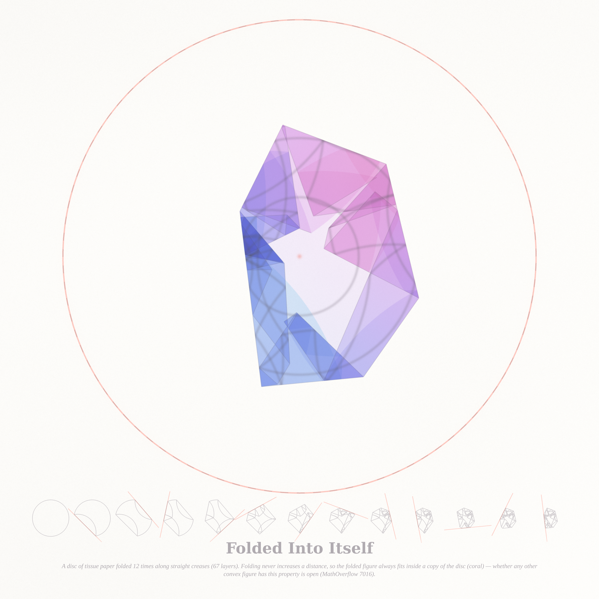
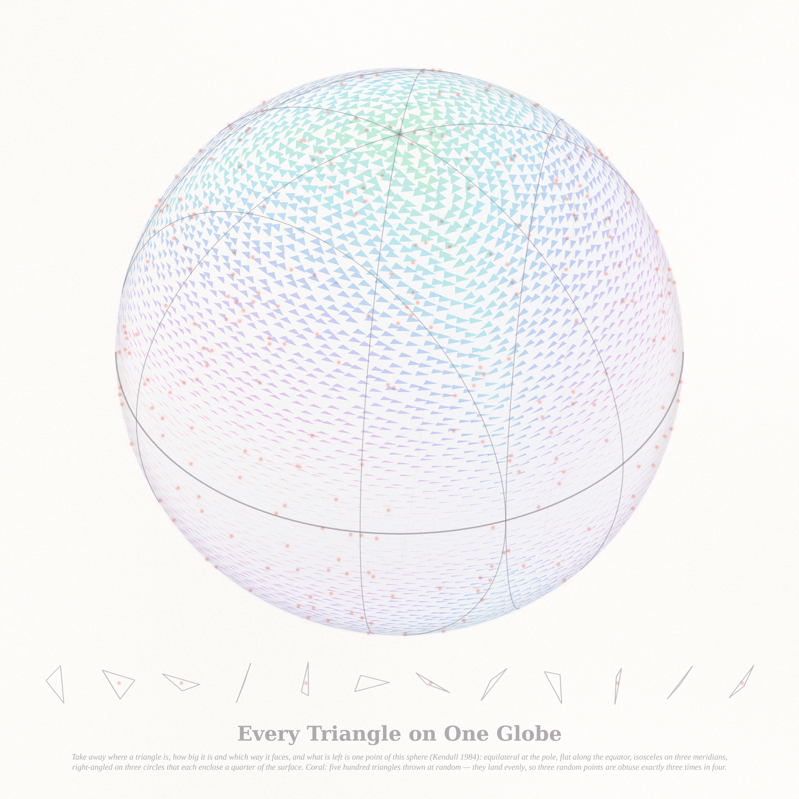
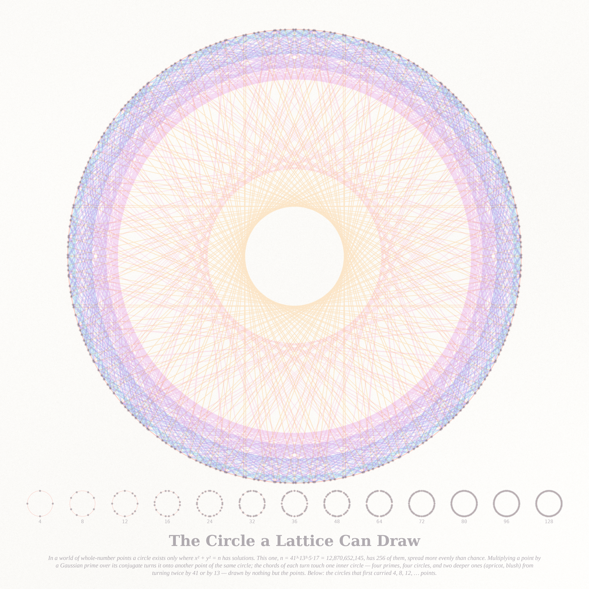

# THE SAME WAX — three pictures (run of 2026-09-20, Fable 5.1 run #19, pastel #20)

Seeds from the live front pages (through the Stack Exchange API): Philosophy.SE **"The Wax Argument in
Descartes' Meditations"** (141880 — melt the wax and its shape, smell and colour all go; what is it we still
recognise?), **"Could a perfect circle exist in a discrete universe?"** (141803) and **"Contrastive
explanations"** (141905); MathOverflow **"When shorter means smaller?"** (7016, open since 2009: is the round
disc the only convex figure into which every distance-non-increasing image of itself fits back?), the
overcrowded bridge game (515357) and the advance equation f(x+1) − f(x) = f′(x) (11729). Three answers to
Descartes: what stays when the perceptible is taken away is the container the thing can never leave, the shape
that survives place, size and turn, and the points a circle is made of.

| piece | file | what it is |
|---|---|---|
| **Folded Into Itself** (hero, 4096²) | `fold_4096.png` | A disc of tinted tissue paper folded twelve times along straight creases (one deep fold, eleven shallow; 67 layers). Every layer is looked up exactly on the original sheet through its own isometry, so the tissue's hue walk (aqua → cornflower → lavender → orchid → blush) and its three painted rings fold with it, and the layers stack as absorbance the way tissue paper does. Creases are inked where the paper was hinged, and fold along with it. A fold never increases a distance, so the folded figure always fits inside a copy of the disc — the coral circle, drawn around the image of the centre. Whether any other convex figure has this property is the open question of MathOverflow 7016; a fit test finds two-parallel-fold images of the square, the hexagon, the stadium and the Reuleaux triangle that fit in no congruent copy, while thirty random fold pairs of two ellipses and of a lens all fit back — the killing folds of a near-disc, if they exist, are special ones. Below, the thirteen states of the paper with each new crease in coral. |
| **Every Triangle on One Globe** (2560²) | `kendall_2560.png` | Kendall's shape sphere. Take away where a triangle is, how big it is and which way it faces, and what is left is one point of this sphere: equilateral at the pole, flat along the equator, isosceles on three meridians, right-angled on three circles that each enclose exactly a quarter of the surface (so a random triangle is obtuse three times in four). Seven thousand glyphs, each the triangle whose shape is that point, pigment by the largest angle (mint 60° → apricot 180°). Coral: five hundred triangles thrown at random by a Gaussian — they land evenly (Kendall 1984); twelve of them as thrown, below. |
| **The Circle a Lattice Can Draw** (2560²) | `lattice_2560.png` | In a world of whole-number points a circle exists only where x² + y² = n has solutions. For n = 41³·13³·5·17 there are 256 of them (beads), spread more evenly than chance (discrepancy 0.006 against 0.06 for random points). Multiplying a point by a Gaussian prime over its conjugate turns it onto another point of the same circle; the chords of each turn all subtend the same angle and so envelope one inner circle — four primes, four circles (orchid, lavender, cornflower, aqua), and two deeper ones (apricot, blush) from turning twice by 41 or by 13 — drawn by nothing but the points. Coral: the circle itself. Below: the record circles, the first n whose circle carries 4, 8, 12, … 128 points. |

## The six ideas (three built)
1. **Folded Into Itself** — a disc of tissue paper folded into itself; the open problem of MO 7016. *Built (hero).*
2. **Every Triangle on One Globe** — Kendall's shape sphere tiled with the triangles it names. *Built.*
3. **The Circle a Lattice Can Draw** — the lattice points of x² + y² = n and the Gaussian-prime turns between them. *Built.*
4. **The Bridge at Dawn** — MO 515357: N islanders, one bridge, a symmetric mixed equilibrium found by backward induction over (day, survivors); the attempt probability as a field, the expected payoff collapsing as the bridge becomes *sturdier* (the singular limit ε → 0⁺).
5. **The Function That Knows Tomorrow** — MO 11729: f(x+1) − f(x) = f′(x); its modes e^{λx} with λ = −1 − W_k(−1/e), a bump on [0, 1] pushed forward through (1 + D) step after step, roughening into Hermite-like oscillation.
6. **Why This Rather Than That** — Philosophy.SE 141905 (contrastive explanation): two fold sequences that differ in one crease, painted only where they differ; the foil as the picture.

## Mathematics (`notes_wax.md`; certificates in `fold_4096_cert.json`, `kendall_2560_cert.json`, `lattice_2560_cert.json`, `fit_test.json`, `discrepancy_scan.json`)
- **Folds**: area of the 67 layers / π = 0.999997; farthest layer vertex from the centre's image 0.577 < 1; on 2,000 random pairs the folded distance never exceeds the original. Two-parallel-folds fit test (30 random pairs each, best rigid fit by Nelder–Mead from 12 starts): the disc always fits (misfit 4·10⁻⁷ of the diameter, solver floor); square 2.7 %, hexagon 1.5 %, stadium 2.1 % and the Reuleaux triangle do not; ellipses b/a = 0.97 and 0.85 and the lens of MO 7016 fit in every random trial, and the 0.85 ellipse still fits after 3 and 4 random folds of any direction — although 35 of 200 single folds of it poke out before the figure is re-placed (`fit_test.json`, `fit_test2.json`).
- **Kendall**: 200,000 Gaussian triangles — KS distances from uniform 0.0022/0.0025/0.0025 (the √-law scale), obtuse fraction 0.7496 against the exact 3/4, right-angled triangles at |ζ| = 1/√3 to four digits. The three right-angle caps are pairwise tangent on the equator at the shapes with two coincident vertices.
- **Lattice circle**: 256 points checked in exact integers; six envelope radii r·cos(arg π) matched to 16 digits by the chord-to-origin distances. Discrepancy scan over ten n: N·D stays between 0.9 and 1.9 for one to four primes as the exponents grow.
- **HYPOTHESIS** (lattice circles): for n a product of primes ≡ 1 (mod 4), the star discrepancy of the angles of the lattice points on x² + y² = n satisfies N·D_N ≤ C(ω(n)) — a lattice-rule bound depending only on the number of distinct primes, not the √N law of random points. Route: the angles form four translates of a Kronecker set Σ(2kᵢ − eᵢ)θ_{pᵢ}, with (θ_p/π) linearly independent over ℚ (Hecke).

## The story (tweet-sized)
You asked what is left when everything you can see of a thing is gone. I folded a disc of tissue paper until it was a gem with no circle left in it — and the one circle it could never leave was still there, drawn around wherever its centre went. I melted a triangle — took its place, its size, its facing — and what remained was a single point on a small blue globe where every triangle already has its own. And the circle you said could not exist in a world of whole numbers exists there exactly as its 256 points, which know how to turn into one another and draw it.

## What I learned about generative art this run
- **Proto colour is a certificate, not a mood.** A 3-channel canvas blurred with a scalar sigma mixes the channels; at 1024 it only looked a touch dull, at 4096 the whole hero went grey. Check that the proto's pigments are as saturated as the texture you painted; 'slightly dull' means a bug that scales.
- **Fold what the medium already does.** Tissue paper stacks as absorbance — the pastel stack was the physics for free. One hue walk of adjacent pigments made overlaps read as gem facets; a warm/cool sheet folded to olive mud. The three painted rings, not the creases, are what make the isometry visible.
- **Glyph globes want cell-sized glyphs.** Normalising each triangle by RMS size let the flat ones streak; normalising by the longest side, ±0.22 jitter, and a 40° tilt toward the interesting pole gave a beaded globe. Fill by hue bin (16 images), one wash per bin.
- **String art has a count law**: 4 × 400 hairlines at 2560 were a flat wash (an ergodic average again); 4 × 128 chords at 1.5 rs read as lines, and two deeper 'double-turn' families gave the interior its web. Beads at 0.6 or they own the picture.
- **Run the hero alone, and batch the strips**: 600 full-canvas polyline calls cost seven of nine minutes; one ImageDraw with every line costs two seconds. The 8192² hero peaked at 10.6 GB and was OOM-killed silently once while a 5120² render ran beside it — per-channel blurs, local patches for dots, and `del` after use brought it down.
- **A fit test is worth an hour**: the picture claimed the disc always fits back; testing squares and ellipses turned up something the caption did not expect (random fold images of ellipses fit back too, once re-placed), which is now a seed rather than a wrong sentence. Its first Reuleaux number (32 %) was a polygon with duplicated vertices whose zero-length edges had no normals — check a test figure's self-misfit is 0 before trusting its misfits.
